# Cybersecurity 101 
---
# 🔍 Search Skills

##  Advanced Google Search Techniques

Most of us use search engines like Google, Bing, or DuckDuckGo daily — but few take full advantage of their advanced features. Google, in particular, supports powerful search operators that can help refine your results.

Below are some useful Google search operators:


- **`"exact phrase"`**  Wrap a phrase in double quotes to search for those exact words in the same order. Example:  ``` passive reconnaissance ```
- **`site:`**   Limits results to a specific domain. Great for searching within a single website.  Example:  ``` site:tryhackme.com success stories ```

- **`-`**  The minus sign allows you to omit search results that contain a particular word or phrase. For example, you might be interested in learning about the pyramids, but you don’t want to view tourism websites; one approach is to search for ```pyramids -tourism``` or ```-tourism pyramids```
- **`"filetype:"`** This search operator is indispensable for finding files instead of web pages. Some of the file types you can search for using Google are Portable Document Format (PDF), Microsoft Word Document (DOC), Microsoft Excel Spreadsheet (XLS), and Microsoft PowerPoint Presentation (PPT). For example, to find cyber security presentations, try searching for ```filetype:ppt cyber security```

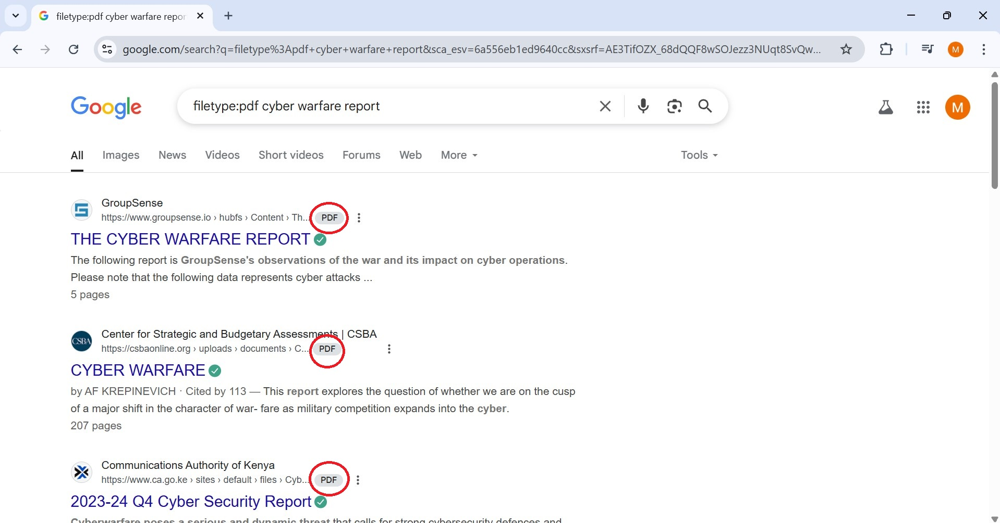 <br>

For a more detailed reference, check out this [Advanced search operators list](https://github.com/cipher387/Advanced-search-operators-list) on GitHub.

## Specialized Search Engines

You're probably used to regular Internet search engines, but how well do you know specialized search engines? These are designed to help you find specific kinds of information or results.

### Shodan
Let’s begin with [Shodan](https://www.shodan.io/), a search engine that focuses on devices connected to the Internet. It helps you find specific types and versions of servers, network hardware, industrial control systems, and IoT devices. For example, if you want to know how many servers are still using Apache version 2.4.1 and where they are located globally, you can simply search for `apache 2.4.1`. This will show you a list of servers that include “apache 2.4.1” in their response headers.

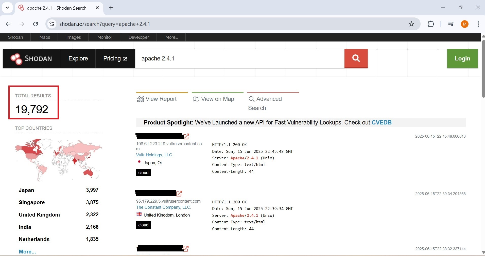 <br>

### Censys
At first, [Censys](https://search.censys.io/) seems similar to Shodan, but there are differences. While Shodan focuses on Internet-connected devices like servers, routers, webcams, and IoT gadgets, Censys concentrates on Internet hosts, websites, certificates, and other online assets. It’s useful for tasks like listing active domains, auditing open ports and services, and finding unauthorized assets on a network. If you want to learn more, [check out Censys Introductory Use Cases](https://docs.censys.com/docs/ls-introductory-use-cases#/).

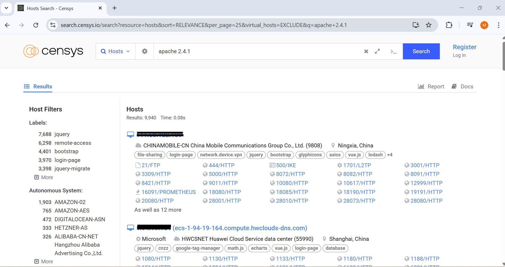 <br>

### VirusTotal
[VirusTotal](https://www.virustotal.com/gui/home/upload) is a web service that scans files using many antivirus engines at once. Users can upload files, submit URLs, or enter file hashes to see if they have been detected by antivirus tools before.

The image below shows a scan result checked against 67 antivirus engines. You can also read community comments for additional insights. Sometimes, a file may be flagged as malware or a Trojan, but this isn’t always correct. That’s where the community’s feedback helps clarify the situation.

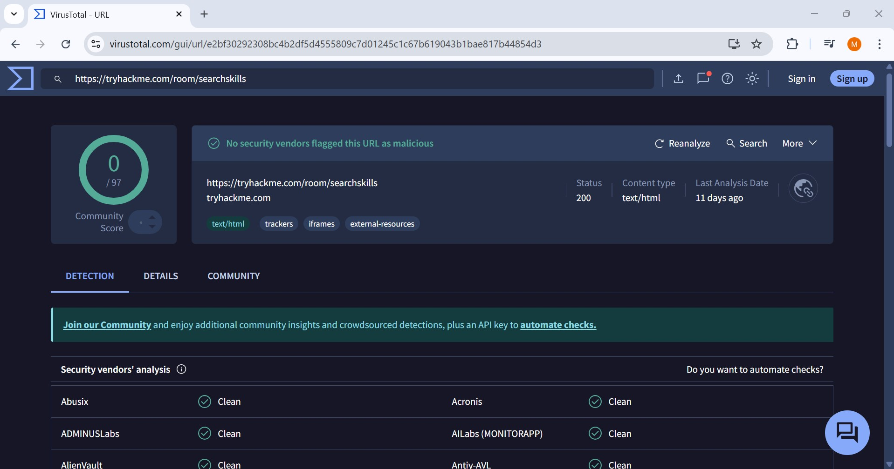 <br>

### Have I Been Pwned
[Have I Been Pwned (HIBP)](https://haveibeenpwned.com/)  serves one main purpose: it lets you check if an email address has been involved in a data breach. If your email shows up in a leak, it means private info—including passwords—might be exposed. Since many people reuse passwords across different sites, a breach on one platform can put other accounts at risk. Although passwords are usually encrypted, weak passwords can still be cracked through various attack methods.

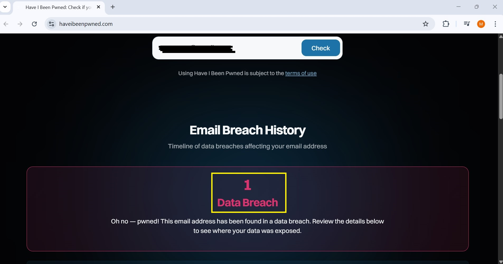 
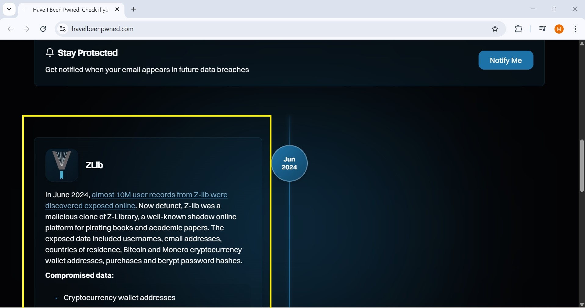 <br>

---

# Vulnerabilities and Exploits

## Understanding CVE (Common Vulnerabilities and Exposures)

The **CVE** system, short for *Common Vulnerabilities and Exposures*, works like a public dictionary for known security flaws. It gives each identified vulnerability a unique ID, such as `CVE-2024-29988`, allowing cybersecurity professionals, software vendors, and researchers to refer to the same issue consistently.

### Why CVEs Matter

Every vulnerability listed in the CVE database is assigned a standardized identifier (CVE ID), making communication about threats clear and universal across the cybersecurity community.

For example:
> `CVE-2014-0160` – better known as **Heartbleed** – is a well-known security bug that affected OpenSSL.

### Who Manages CVEs?

The CVE system is maintained by **MITRE Corporation**, a nonprofit organization that works with government and industry partners. CVEs are cataloged and made publicly accessible to help improve overall cybersecurity.

### Where to Search for CVEs

You can explore and search for known vulnerabilities through the following official resources:
- [CVE Program Website](https://www.cve.org/)
- [National Vulnerability Database (NVD)](https://nvd.nist.gov/)

These platforms offer details about individual CVEs, including severity ratings, affected software, and recommended mitigations.

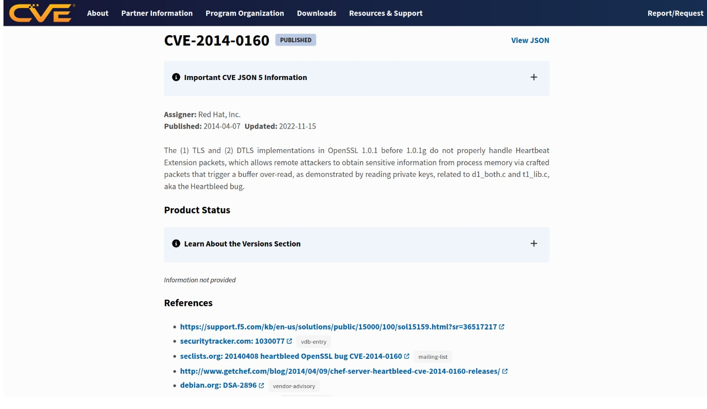 <br>

## Exploit Database (Exploit-DB)

### What Is It?

The **Exploit Database** (often called *Exploit-DB*) is a public archive of exploit code and security research. It's a valuable resource when assessing system vulnerabilities—**as long as you have legal authorization** to perform such testing (e.g., during a red team engagement or a penetration test under contract).

> ⚠️ **Warning:** Only perform exploitation on systems you have explicit permission to test. Doing otherwise can be illegal and unethical.

### When and Why to Use Exploit-DB

Once you’ve identified a vulnerable system and have permission to test it, you may need actual exploit code to demonstrate or verify the impact of the vulnerability. That’s where Exploit-DB comes in.

### Key Features:
- Contains a wide variety of exploit scripts and proof-of-concept (PoC) code.
- Includes submissions from independent security researchers around the world.
- Some entries are marked as **"verified"**, meaning the exploit has been tested and confirmed to work.

### Accessing Exploit-DB

You can search for exploits directly on their official site:

🔗 [https://www.exploit-db.com](https://www.exploit-db.com)

You can search by CVE ID, software name, or specific keywords to find relevant exploits.

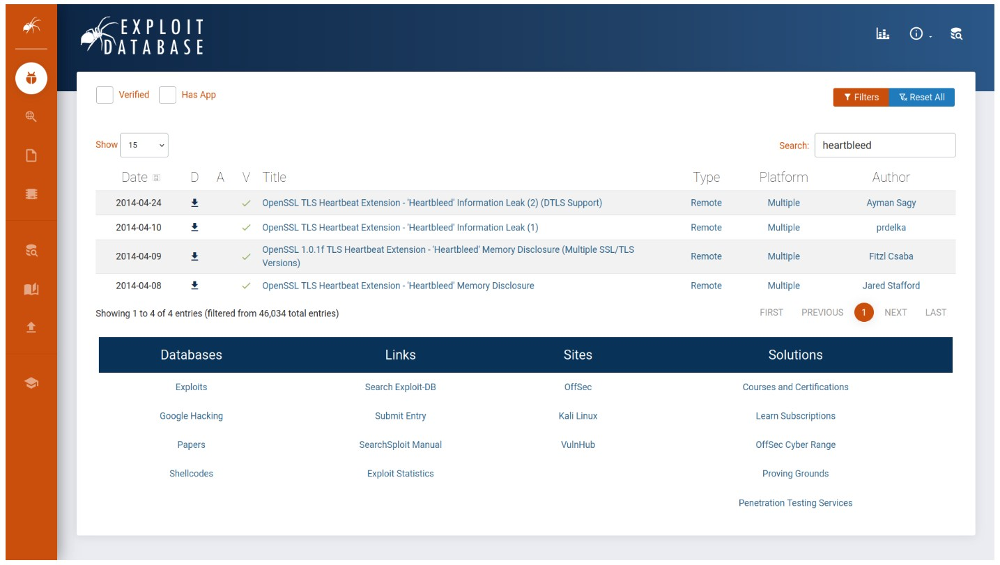 <br>

## Using GitHub to Find CVE Tools and Exploits

### Why GitHub?

**GitHub** is more than just a platform for hosting code—it's also a valuable resource for security researchers and ethical hackers. You can often find **tools, scripts, proof-of-concept (PoC) code**, and even **exploits** related to known vulnerabilities (CVEs).

Many developers and security professionals share their research and tools openly on GitHub, making it a useful place to search when working on vulnerability assessments or penetration tests.

### Example: Heartbleed (CVE-2014-0160)

To see this in action, try searching GitHub for a specific CVE like. You'll likely come across repositories containing:
- PoC scripts
- Detection tools
- Exploit code
- Patches or workarounds

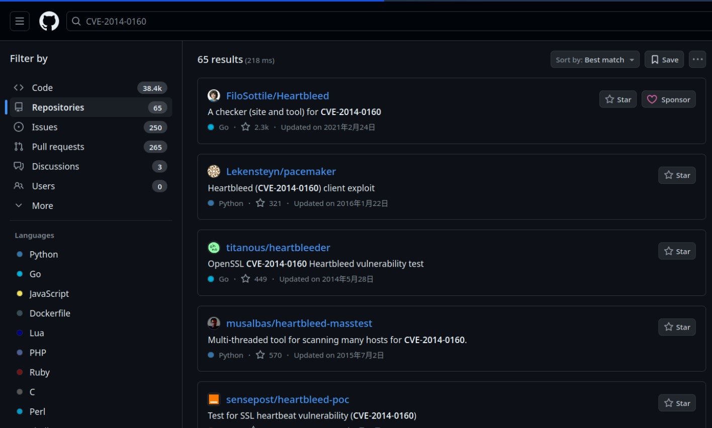 <br>

> GitHub complements other well-known platforms such as:
> - [Packet Storm Security](https://packetstormsecurity.com/)
> - [Zero Day Initiative (ZDI)](https://www.zerodayinitiative.com/)
### Reminder

> 🔒 Always use such resources responsibly and **only on systems you have permission to test**.

---
# Manual Pages
### Using Manual Pages (man Pages) in Linux/Unix

Before the Internet became widely available, the primary way to get help on commands in Linux or Unix-like systems was through **manual pages**, commonly known as **man pages**. Every command typically has its own man page, which serves as an in-depth guide explaining how to use that command.

Man pages aren’t limited to just commands — they also cover system calls, library functions, and configuration files.

#### How to Use man Pages

For example, if you want to read the manual for the `ip` command, you simply type:

```bash
man ip
```
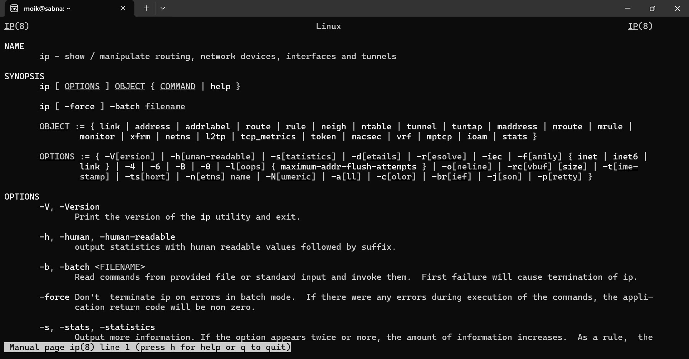 <br>

### Microsoft Windows Documentation

Microsoft offers an official **[Technical Documentation](https://learn.microsoft.com/en-us/)** website for all its products, including detailed references for Windows commands and tools.

For example, if you search for the `ipconfig` command on their documentation site, you'll find comprehensive information about its usage, options, and examples.

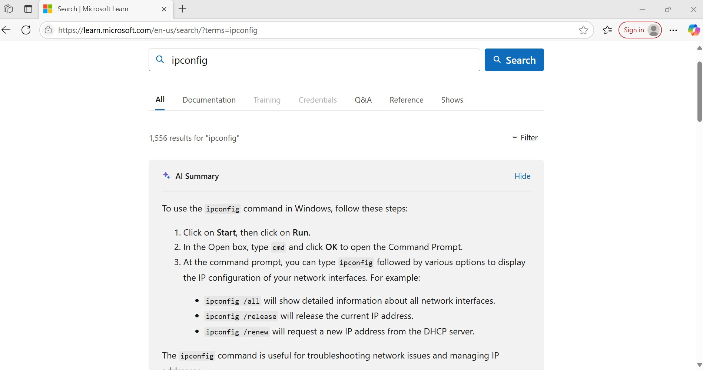 <br>

### Product Documentation

Most popular software products come with well-structured and official **product documentation**. This documentation serves as a trustworthy source of detailed information about the product’s features, functionality, and configuration.

Some examples of widely used official documentation include:

- [Snort Official Documentation](https://snort.org/documents)
- [Apache HTTP Server Documentation](https://httpd.apache.org/docs/)
- [PHP Documentation](https://www.php.net/docs.php)
- [Node.js Documentation](https://nodejs.org/en/docs/)

Checking the official documentation is always a good practice because it is typically the most accurate, comprehensive, and up-to-date source of information.

---

## The Role of Social Media in Cybersecurity

Social media platforms like Facebook, Twitter, and LinkedIn have billions of users worldwide. While you’re likely familiar with the major platforms, it’s a good idea to explore any lesser-known ones you come across to expand your knowledge.

### Exploring Social Media Safely

Ideally, you’d explore these platforms without creating an account, but this can limit what you can access. A practical approach is to use a **temporary email address** to sign up, which keeps your real email private. After you finish exploring, you can delete the temporary account and the email address.

This method also helps avoid unwanted connections from your real contacts, since you’re only temporarily browsing.

### Why Social Media Matters for Cybersecurity Professionals

Social media is powerful for connecting with companies and people relevant to your interests. For cybersecurity professionals, it’s a rich source of both technical information and personal data that could pose security risks.

#### Protecting People

When securing a company, it’s important to watch out for employees oversharing personal details on social media. Sometimes, seemingly innocent posts reveal answers to common security questions like “What was your childhood school?” which attackers can use to hijack accounts.

#### Staying Updated

Following the right social media channels and groups helps you keep up with the latest cybersecurity trends, tools, and news, supporting your ongoing professional growth.

### Additional Sources: News Outlets

Besides social media, many news websites specialize in cybersecurity. Explore different sources and stick to the ones that consistently provide valuable and reliable information.

--- 

> **Note:** These notes document hands-on learning from the TryHackMe *Cybersecurity 101* path. The exercises cover fundamental cybersecurity topics, including Linux basics, networking concepts, and web technologies. This document is intended for personal learning, revision, and ethical skill development. All screenshots, commands, and actions are for educational purposes only.  
> — Compiled by moh4med404 | Curious Mind | Cybersecurity Enthusiast

