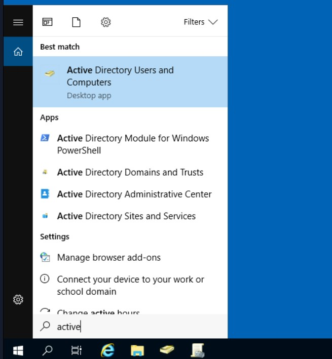
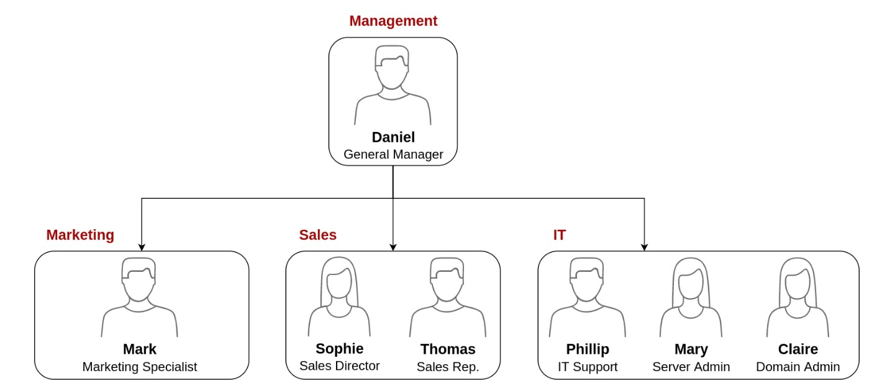
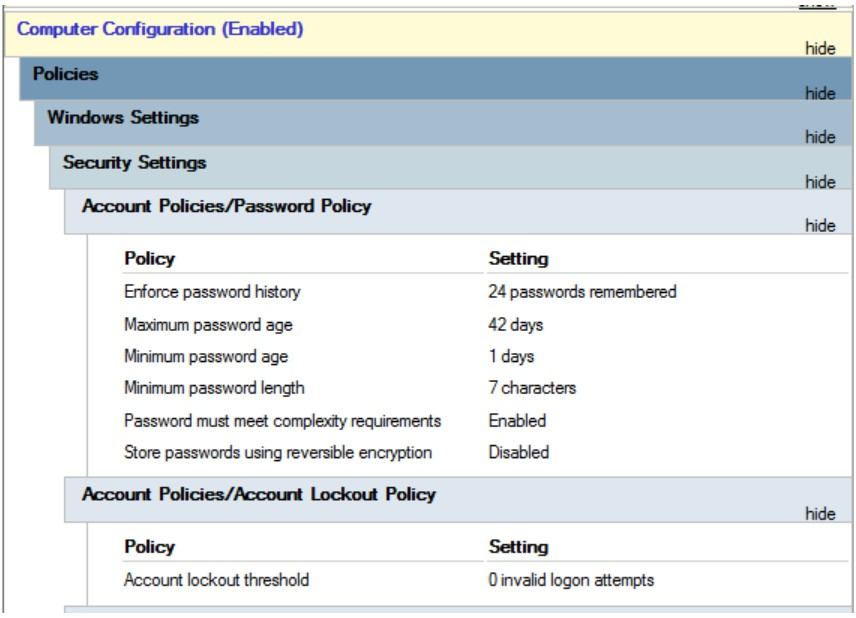

# Cybersecurity 101 
---
# 🏢🔗 Active Directory Basics 

## Windows Domains

Imagine you’re managing a small business network with just **five computers and five employees**. In this case, manually setting up each computer isn’t too difficult—you can log in, create user accounts, apply settings, and even walk over to fix any issues in person.

However, what happens when your company grows?

### 📈 Scaling the Network

Now imagine your business has:
- **157 computers**
- **320 users**
- Spread across **four office locations**

Managing each machine individually, configuring users manually, and physically handling issues becomes **completely impractical**.

### 🧩 Enter Windows Domains and Active Directory

To manage larger networks more efficiently, Windows provides a solution: the **Windows Domain**.

A **Windows domain** is a centralized structure where users, computers, and resources are all managed under a unified system.

### 🔐 What Is Active Directory (AD)?

At the heart of this system is **Active Directory (AD)**, a service that acts as a centralized database for:
- Users
- Computers
- Groups
- Policies

The **Domain Controller (DC)** is the server that runs Active Directory. It’s responsible for authenticating users and enforcing security policies across the network.

### 🧠 Why This Matters

By using AD and a domain:
- You manage users and devices **centrally**
- You apply group policies and access control **consistently**
- You reduce the time and effort needed for support and maintenance

In short, when your network scales, **Active Directory** becomes essential for maintaining control, security, and efficiency across your organization.

 <br>

## 🌐 Benefits of a Windows Domain with Active Directory

When managing a growing network, **Active Directory (AD)** offers major advantages that make administration, security, and user management far more efficient.

### 1. Centralized Identity Management
All user accounts across the network can be managed from a single point—Active Directory. This means:
- No need to configure users individually on each machine
- Easy creation, deletion, or modification of user access
- Faster onboarding/offboarding processes

### 2. Centralized Security Policy Management
Security policies can be defined in AD and applied across users and devices. This allows you to:
- Enforce password policies
- Restrict access to certain features or applications
- Apply consistent settings organization-wide

## 🧪 Real-World Example
### Here's How It Works:
- You’re given a **username and password** by your institution.
- You can log into **any computer on the network** using those credentials.
- The computer **forwards your login request to Active Directory**, where your credentials are verified.

Since the authentication happens at the domain level, your user account doesn’t need to be stored locally on every computer.

### Policy Enforcement Example:
Active Directory doesn’t just handle logins. It also allows administrators to:
- **Restrict access to features** like the Control Panel or Task Manager
- **Prevent software installations**
- **Enforce standard desktop settings** across all machines

These restrictions are usually in place so that users don’t accidentally (or intentionally) misconfigure or damage shared systems.

---

# 🔐 Active Directory

## Core Components of Active Directory Domain Services (AD DS)

At the heart of every Windows Domain is the **Active Directory Domain Services (AD DS)**. This service acts as a central **directory of objects** on the network, providing information and access control for users, computers, and more.

## 🔍 What Are AD Objects?

AD DS stores and manages many object types, including:
- Users 👤
- Machines 🖥️
- Groups 👥
- Printers 🖨️
- Shared resources 📁

Let’s take a closer look at some of the most important object types.

## 👤 Users

**Users** are one of the most common object types in Active Directory. They are also considered **security principals**, meaning:
- They can be authenticated by the domain.
- They can be assigned permissions over network resources (files, printers, etc.).

### Types of User Objects:
1. **Human Users:** Represent employees or individuals needing access to the network.
2. **Service Users:** Represent background services (e.g., IIS, MSSQL). These are configured with only the privileges required to run the specific service.

## 🖥️ Machines

Every computer that joins the domain is represented by a **machine object** in AD. These are also considered **security principals** and are given accounts just like users.

### Key Points:
- Machine accounts are automatically created when a system joins the domain.
- These accounts are **local administrators** on their respective machines.
- Machine account passwords:
  - Are **automatically rotated**.
  - Typically consist of **120 random characters**.
- **Naming convention:** Machine accounts end with a dollar sign (`$`).
  - Example: A computer named `DC01` would have a machine account called `DC01$`.

## 👥 Security Groups

**Security groups** allow administrators to assign permissions to collections of users or computers, simplifying access management.

### Features:
- Groups are **security principals**, so they can have privileges assigned just like users.
- Groups can contain:
  - Users
  - Machines
  - Other groups (nested groups)

### 📂 Built-in Security Groups (Examples)

| **Group Name**       | **Description**                                                                 |
|----------------------|---------------------------------------------------------------------------------|
| Domain Admins        | Full administrative control over the entire domain                              |
| Server Operators     | Can manage Domain Controllers, but can't modify admin group memberships         |
| Backup Operators     | Can access any file regardless of its permissions, typically used for backups   |
| Account Operators    | Can create and modify user accounts                                             |
| Domain Users         | Includes all user accounts in the domain                                        |
| Domain Computers     | Includes all computer accounts joined to the domain                             |
| Domain Controllers   | Includes all Domain Controllers in the domain                                   |

➡️ You can find the full list of built-in groups in the [Microsoft Documentation](https://learn.microsoft.com/en-us/windows-server/identity/ad-ds/manage/understand-security-groups).

 <br>

## 🧩 Security Groups vs Organizational Units (OUs)

Both **Security Groups** and **Organizational Units (OUs)** are used to organize users and computers in Active Directory—but they serve **very different purposes**.

### 🗂️ Organizational Units (OUs)

- Used to **apply policies** (like Group Policy Objects - GPOs).
- Useful for grouping users/computers by **department**, **location**, or **role**.
- **One user/computer can only belong to one OU** at a time.
- Ideal for managing configuration and security settings.

📌 *Example:* Apply a desktop wallpaper policy to all users in the "Marketing" OU.

### 🔐 Security Groups

- Used to **assign permissions** to network resources (e.g., files, printers, shares).
- A user can be a member of **multiple groups**.
- Great for controlling **who can access what**.

📌 *Example:* Grant the "Finance" group access to a secure folder on a shared drive.

### Summary Table

| Feature            | OUs 🗂️                        | Security Groups 🔐             |
|--------------------|-------------------------------|---------------------------------|
| Purpose            | Apply policies                | Grant access to resources       |
| Membership         | One per object                | Multiple allowed                |
| Admin Use Case     | Group-based policy management | Resource permission management  |

---

# Managing Users in AD
Your first task as the new domain administrator is to check the existing AD OUs and users, as some recent changes have happened to the business. You have been given the following organisational chart and are expected to make changes to the AD to match it:

 <br>

## Deleting extra OUs and users

The first thing you should notice is that there is an additional department OU in your current AD configuration that doesn't appear in the chart. We've been told it was closed due to budget cuts and should be removed from the domain. If you try to right-click and delete the OU, you will get the following error:

 <br>

By default, OUs are protected against accidental deletion. To delete the OU, we need to enable the **Advanced Features** in the View menu:

 <br>

This will show you some additional containers and enable you to disable the accidental deletion protection. To do so, right-click the OU and go to Properties. You will find a checkbox in the Object tab to disable the protection:

 <br>

Be sure to uncheck the box and try deleting the OU again. You will be prompted to confirm that you want to delete the OU, and as a result, any users, groups or OUs under it will also be deleted.

After deleting the extra OU, you should notice that for some of the departments, the users in the AD don't match the ones in our organisational chart. Create and delete users as needed to match them.

## Delegation
One of the nice things you can do in AD is to give specific users some control over some OUs. This process is known as delegation and allows you to grant users specific privileges to perform advanced tasks on OUs without needing a Domain Administrator to step in.

One of the most common use cases for this is granting IT support the privileges to reset other low-privilege users' passwords. According to our organisational chart, Phillip is in charge of **IT support**, so we'd probably want to delegate the control of resetting passwords over the Sales, Marketing and Management OUs to him.

For this example, we will delegate control over the Sales OU to Phillip. To delegate control over an OU, you can right-click it and select **Delegate Control**:

 <br>

This should open a new window where you will first be asked for the users to whom you want to delegate control:
**Note:** To avoid mistyping the user's name, write "phillip" and click the **Check Names** button. Windows will autocomplete the user for you.

 <br>

Click OK, and on the next step, select the following option:

 <br>

## 💻 How Connect to User PC with RDP

Example: Connect to Bob’s PC (`BOB-PC` or IP `192.168.1.10`).

### Steps

1. Press `Win + R`, type `mstsc`, press Enter.  
2. Enter **computer name** (`BOB-PC`) or **IP address** (`192.168.1.10`).  
3. Click **Connect**.  
4. Enter your admin **username** and **password**.  
5. Control Bob’s PC remotely.

 <br>

---
# Managing Computers in AD
By default, all the machines that join a domain (except for the DCs) will be put in the container called "Computers". If we check our DC, we will see that some devices are already there:

 <br>

To apply different policies and improve manageability, it's best to **separate devices** in Active Directory based on their role.

### 💡 Why Organize Devices?

- Different devices need different security and configuration policies.
- Avoid mixing servers with user machines.
- Keep Domain Controllers isolated for security.

### 📂 Recommended OU Structure

Organize devices into these key Organizational Units (OUs):

#### 1. 🧑‍💻 Workstations
- Used by regular users for daily tasks.
- Should **never** have privileged accounts logged in.

#### 2. 🖥️ Servers
- Provide services like file storage, email, databases, etc.
- Need stricter policies than workstations.

#### 3. 🛡️ Domain Controllers
- Manage the AD domain.
- Store all user password hashes.
- Most sensitive systems in the network.
- Already stored in a default OU by Windows (`Domain Controllers`).


### ✅ Action: Create OUs

Create the following OUs under the domain `thm.local`:

 <br>

Now, move the personal computers and laptops to the Workstations OU and the servers to the Servers OU from the Computers container. Doing so will allow us to configure policies for each OU later.

---
# 🛡️ Group Policy Objects (GPO) in Active Directory

Organizing users and computers into OUs isn’t just for structure — it allows us to apply **specific policies** to each OU.

## 📘 What is a GPO?

A **Group Policy Object (GPO)** is a collection of settings used to:

- Configure **user** or **computer** behavior.
- Enforce **security baselines**, restrictions, or configurations.
- Apply different settings to each **OU** as needed.

## 🧩 Why Use GPOs?

- Push different policies based on **department** or **device type**.
- For example:
  - Stronger restrictions for users in Finance.
  - Custom desktop settings for Marketing.
  - Security hardening for servers.


## 🛠️ How to Configure GPOs

1. Open **Group Policy Management** from the Start Menu.
2. Expand your domain and find the target OU.
3. Right-click the OU → **Create a GPO in this domain, and Link it here...**
4. Edit the GPO to apply your desired settings.


✅ You can create GPOs for:
- **Users** (e.g., disable Control Panel)
- **Computers** (e.g., enforce password length)

 <br>

The first thing you will see when opening it is your complete OU hierarchy, as defined before. To configure Group Policies, you first create a GPO under **Group Policy Objects** and then link it to the OU where you want the policies to apply. As an example, you can see there are some already existing GPOs in your machine:

 <br>

### 🧩 GPO Linking and Scope in Active Directory

We can see that 3 GPOs have been created:

- ✅ **Default Domain Policy** (linked to `thm.local`)
- 🔐 **RDP Policy** (also linked to `thm.local`)
- 🛡️ **Default Domain Controllers Policy** (linked only to the **Domain Controllers** OU)

#### 📌 Important Notes

- A GPO affects the **OU it's linked to** and **all sub-OUs** beneath it.
- Example:  
  - `Default Domain Policy` is linked to `thm.local`  
  - It applies to all sub-OUs, like `Sales`, `Marketing`, etc.

#### 🔍 Checking GPO Scope

To view where a GPO applies:

1. Open **Group Policy Management**.
2. Select a GPO (e.g., *Default Domain Policy*).
3. The **Scope tab** shows:
   - Where it’s linked in the domain.
   - Which users or computers are affected.

 <br>

As you can see, you can also apply **Security Filtering** to GPOs so that they are only applied to specific users/computers under an OU. By default, they will apply to the **Authenticated Users** group, which includes all users/PCs.

The **Settings** tab includes the actual contents of the GPO and lets us know what specific configurations it applies. As stated before, each GPO has configurations that apply to computers only and configurations that apply to users only. In this case, the **Default Domain Policy** only contains Computer Configurations:

 <br>

Feel free to explore the GPO and expand on the available items using the "show" links on the right side of each configuration. In this case, the **Default Domain Policy** indicates really basic configurations that should apply to most domains, including password and account lockout policies:

 <br>

Since this GPO applies to the whole domain, any change to it would affect all computers. Let's change the minimum password length policy to require users to have at least 10 characters in their passwords. To do this, right-click the GPO and select **Edit**:

 <br>

This will open a new window where we can navigate and edit all the available configurations. To change the minimum password length, go to ```Computer Configurations -> Policies -> Windows Setting -> Security Settings -> Account Policies -> Password Policy``` and change the required policy value:

 <br>

As you can see, plenty of policies can be established in a GPO. While explaining every single of them would be impossible in a single room, do feel free to explore a bit, as some of the policies are straightforward. If more information on any of the policies is needed, you can double-click them and read the **Explain** tab on each of them:

 <br>

## 📤 GPO Distribution in Active Directory

### 🗂️ How GPOs Are Distributed

- GPOs are stored and shared via the **SYSVOL** network share on Domain Controllers (DCs).
- SYSVOL path on DCs:  
  `C:\Windows\SYSVOL\sysvol\`
- All domain users and computers access SYSVOL to **sync GPOs regularly**.

### ⏳ GPO Sync Delay

- After a GPO change, it can take **up to 2 hours** for computers to update their policies.
- To force an immediate sync on a computer, run this command in Command Prompt (as admin):

```bash
gpupdate /force
```
 <br>

## 🛠️ Creating GPOs for THM Inc.

### Goals

1. **Block non-IT users from accessing the Control Panel.**  
2. **Auto-lock workstations and servers after 5 minutes of inactivity.**

### 1️⃣ Restrict Control Panel Access

- Objective: Only **IT department users** can access the Control Panel.
- Other users **should be blocked** from changing system settings.

#### Steps:

1. Create a new GPO named **Restrict Control Panel Access**.
2. Edit the GPO.
3. Navigate to:
- User Configuration → Policies → Administrative Templates → Control Panel```
4. Find and enable the policy:

 <br>

Notice we have enabled the **Prohibit Access to Control Panel and PC settings** policy.

Once the GPO is configured, we will need to link it to all of the OUs corresponding to users who shouldn't have access to the Control Panel of their PCs. In this case, we will link the **Marketing**, **Management** and **Sales** OUs by dragging the GPO to each of them:

 <br>

## 🔒 Auto Lock Screen GPO

Automatically lock screens on all workstations, servers, and domain controllers after 5 minutes of inactivity. Let's create a new GPO, call it Auto Lock Screen, and edit it. The policy to achieve what we want is located in the following route:

 <br>

We will set the inactivity limit to 5 minutes so that computers get locked automatically if any user leaves their session open. After closing the GPO editor, we will link the GPO to the root domain by dragging the GPO to it:

 <br>

Once the GPOs have been applied to the correct OUs, we can log in as any users in either Marketing, Sales or Management for verification. 

---
# 🔐 NetNTLM Authentication

**NetNTLM** is a challenge-response authentication protocol used by Windows for **network-based authentication**, especially when **Kerberos is unavailable**.

It is an older protocol based on NTLM (NT LAN Manager), primarily used in:

- SMB (file sharing)
- RDP fallback
- HTTP-based authentication (in intranets)
- Legacy systems or cross-domain situations

 <br>

## ⚙️ How It Works (Simplified)

1. Client sends **username** and a **challenge request** to the server.
2. Server responds with a **random challenge**.
3. Client encrypts the challenge using the **user’s password hash** and sends it back.
4. Server verifies this using the stored hash in the domain controller.

This is a **challenge-response** system — the password itself is never sent.

## ❗ Security Notes

- **NetNTLM is vulnerable** to relay attacks and hash capture (e.g., with tools like Responder).
- It can be exploited in scenarios like **SMB relays** or **pass-the-hash** attacks.
- Recommended to **disable or restrict** NetNTLM when possible in secure environments.

## ✅ Safer Alternatives

- **Kerberos** — Modern and more secure.
- **NTLMv2** — Improved version of NTLM; used in NetNTLMv2.
- Use **firewall rules** and **SMB signing** to help mitigate NetNTLM abuse.

> 🔍 Tools like `Responder`, `Impacket`, and `NTLMRelayX` are often used in pentesting to exploit NetNTLM weaknesses.

# 🔐 Kerberos Authentication

## 🧾 What is Kerberos?

**Kerberos** is a secure, ticket-based authentication protocol used in Windows domains (and many other systems). It’s the **default authentication method** in Active Directory.

## ⚙️ How It Works (Simplified)

1. **User logs in** → Sends a request to the **Key Distribution Center (KDC)**.
2. KDC returns a **Ticket Granting Ticket (TGT)**.
3. When accessing a service (e.g., file server), the user requests a **Service Ticket** using the TGT.
4. The user sends this Service Ticket to the target service to gain access.

All communication is **encrypted** and uses **timestamps** to prevent replay attacks.

## 🏛️ Key Components

- **KDC**: Key Distribution Center (runs on Domain Controllers)
- **TGT**: Ticket used to request access to services
- **SPN**: Service Principal Name (identifies the service)

## ✅ Why Kerberos is Better

- Strong encryption
- Mutual authentication (client ↔ service)
- Resistant to password sniffing
- No password sent over the network

## 🔐 Security Notes

- Still vulnerable to:
  - **Pass-the-Ticket (PtT)** attacks
  - **Kerberoasting** (if SPNs use weak passwords)
- Tools like **Rubeus**, **Impacket**, and **Mimikatz** are commonly used for attacks in assessments.

> 💡 Tip: To reduce risk, ensure strong SPN account passwords and monitor unusual ticket activity.

 <br>

---

# Trees, Forests and Trusts

So far, we have discussed how to manage a single domain, the role of a Domain Controller and how it joins computers, servers and users.

 <br>

As companies grow, so do their networks. Having a single domain for a company is good enough to start, but in time some additional needs might push you into having more than one.

## 🌲 Active Directory - Trees

### What is a Tree?

- A **Tree** is a group of **domains** that:
  - Share a **contiguous DNS namespace** (e.g., `thm.local`, `dev.thm.local`)
  - Are connected in a **parent-child** hierarchy

### Key Points:

- The first domain is called the **root domain**.
- Additional domains are **child domains**.
- Domains within a tree **automatically trust** each other via **two-way transitive trust**.

### Example:

- `thm.local` (root domain)
  - `dev.thm.local` (child domain)
  - `sales.thm.local` (child domain)

All are part of the same **tree** since they share the DNS name `thm.local`.

 <br>

## 🌳 Active Directory - Forests

### What is a Forest?

- A **Forest** is a collection of one or more **Trees**.
- Trees in a forest:
  - **Do not** need to share the same DNS namespace.
  - Share a common **schema** and **Global Catalog**.
  - Are connected by **trust relationships**.

### Key Points:

- A forest is the **top-level security boundary** in Active Directory.
- It enables different trees (with different DNS namespaces) to work together.
- All domains and trees in a forest share:
  - The same **schema** (rules/definitions for objects).
  - The same **Global Catalog** (a directory for searching objects).
  - Trusts to allow access between domains.

### Example:

- `thm.local` (one tree)
- `offense.red` (another tree)

Both can be part of the same **forest**.

 <br>

## 🔗 Active Directory - Trust Relationships

### What is a Trust?

- A **Trust** is a link between two domains that allows users in one domain to access resources in another.
- Trusts control **authentication** and **authorization** between domains.

### Types of Trusts:

- **Two-way Trust**: Both domains trust each other.
- **One-way Trust**: One domain trusts another, but not vice versa.

### Trust Scopes:

- **Transitive Trust**: Trust extends beyond two domains to others (common in Active Directory).
- **Non-transitive Trust**: Trust is only between two domains.

### Common Trusts in AD:

- Trusts between domains within the same **forest** are automatically created and **transitive**.
- Trusts between different forests must be created manually.

### Why Trusts Matter:

- They allow **resource sharing** across domains.
- Enable **single sign-on** experiences.
- Control access across business units or organizations.

 <br>

**Two-way trust relationships** can also be made to allow both domains to mutually authorise users from the other. By default, joining several domains under a tree or a forest will form a two-way trust relationship.

It is important to note that having a trust relationship between domains doesn't automatically grant access to all resources on other domains. Once a trust relationship is established, you have the chance to authorise users across different domains, but it's up to you what is actually authorised or not.

----


> **Note:** These notes document hands-on learning from the TryHackMe *Cybersecurity 101* path. The exercises cover fundamental cybersecurity topics, including Linux basics, networking concepts, and web technologies. This document is intended for personal learning, revision, and ethical skill development. All screenshots, commands, and actions are for educational purposes only.  
> — Compiled by moh4med404 | Curious Mind | Cybersecurity Enthusiast