# Cybersecurity 101 
---
# 🖥️ Windows Command Line

## Why Command Line Interface (CLI)?

- **Faster & More Efficient**: Once mastered, a CLI can be much faster for tasks. No more clicking through menus – commands can be typed directly to achieve results instantly. 
  - Example: Checking your IP address. In GUI, you click through a few options, but in CLI, you can type `ipconfig` (or `ifconfig` for Linux).
  
- **Lower Resource Usage**: CLIs require far fewer system resources compared to graphical environments, making them ideal for:
  - Older hardware or low-resource systems.
  - Cloud environments (saving you on cloud bills).

- **Automation**: Tasks that need to be repeated can easily be automated with scripts or batch files in the CLI, saving time in the long run.

- **Remote Management**: Managing remote systems (like servers or routers) is a breeze using CLI tools like **SSH**, especially over slow network connections or on limited-resource devices.

CLI may seem difficult at first, but once you get the hang of it, you will quickly realize its power and efficiency.

## Basic System Information
### 1. `set`
- **Purpose:** Displays environment variables, including the current system path.
- **Why:** Helps determine where Windows looks for executable commands.

```bash
C:\>set
```

### 2. `ver`
- **Purpose:** Displays the current version of the operating system.
- **Why:** Useful for identifying the OS version (e.g., Windows 10, Server 2019).

```bash
C:\>ver
```
### 3. `systeminfo`
- **Purpose:** Provides detailed system information, including OS version, memory, processor, and network settings.
- **Why:** Gives a comprehensive snapshot of the system's configuration.

```bash
C:\>systeminfo
```

### 4. `driverquery`
- **Purpose:** Lists all installed drivers on the system.
- **Why:** Useful for troubleshooting hardware or driver-related issues.

```bash
C:\>driverquery
```

### 5. `driverquery | more`
- **Purpose:** Displays the `driverquery` output page by page.
- **Why:** If the output is too long, this allows for easy navigation one page at a time. Use the space bar to move to the next page, and **CTRL + C** to exit.

```bash
C:\>driverquery | more
```

### 6. `help`
- **Purpose:** Provides help information for a specific command.
- **Why:** Helpful for understanding the usage of commands and their options.

```bash
C:\>help <command>
```

### 7. `cls`
- **Purpose:** Clears the Command Prompt screen.
- **Why:** Helps keep the screen clean and organized when you're working in the terminal.

```bash
C:\>cls
```
### 8. `ipconfig`
- **Purpose:** Displays the current IP configuration of the system.
- **Why:** Useful for troubleshooting network issues and verifying IP settings such as IP address, subnet mask, and default gateway.

```bash
C:\>ipconfig
```
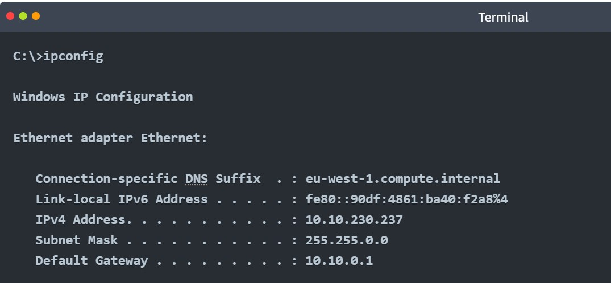 <br>

To displays detailed IP configuration information for all network adapters use:
```bash
C:\>ipconfig /all
```
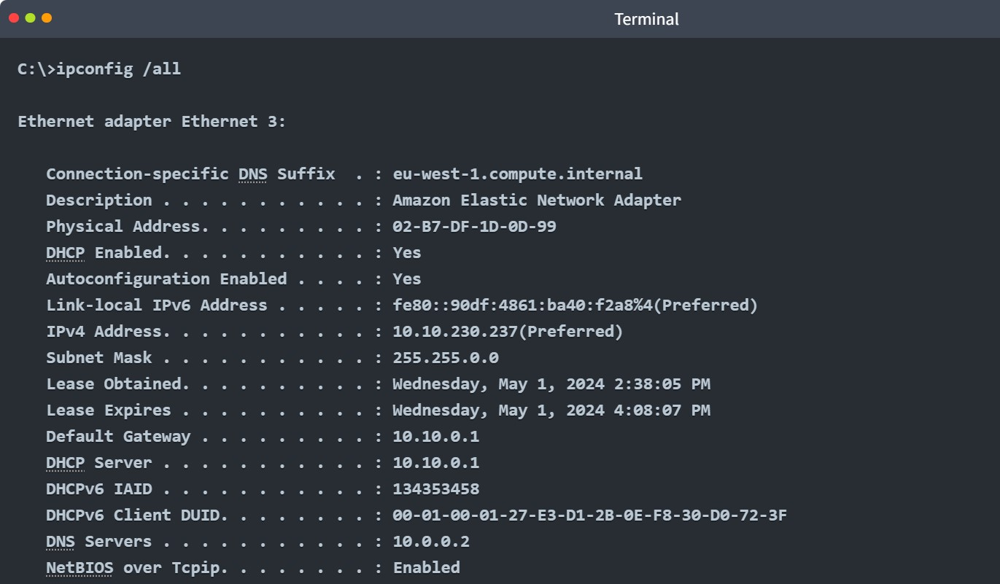 <br>

---

## Network Troubleshooting

### `ping target_name`
- **Purpose:** Checks if the server can access a particular server on the Internet by sending ICMP packets and waiting for a reply.
- **Why:** A simple way to verify network connectivity and measure round-trip time to a target server.

#### Example: Testing Connectivity to `example.com`

```bash
C:\>ping example.com
```
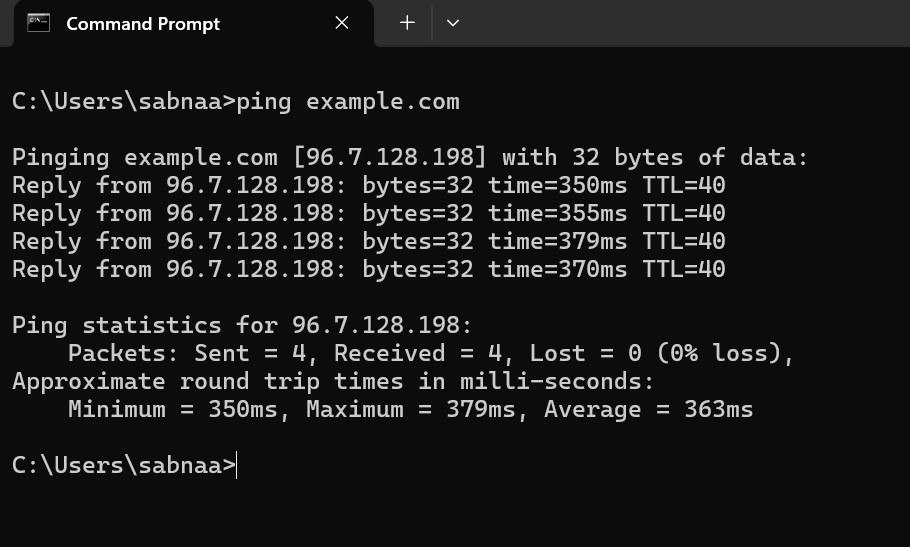 <br>

### `tracert target_name`
- **Purpose:** Traces the network route (hops) that packets take to reach a target, providing detailed information about the routers and their response times along the way.
- **Why:** Useful for diagnosing where delays or disruptions occur in the path to a destination server.

#### Example: Tracing the Route to `example.com`

```bash
C:\>tracert example.com
```
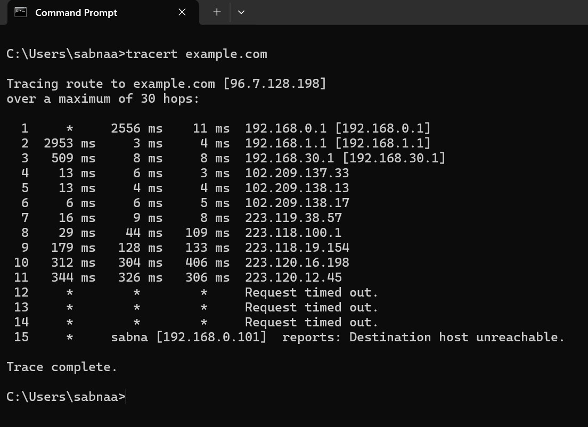 <br>

###  `nslookup`
- **Purpose:** Queries the DNS to find the IP address associated with a domain name or vice versa.
- **Why:** Useful for troubleshooting DNS issues or checking how a domain resolves to an IP address. You can also specify a different name server for the lookup.

#### Example 1: Using the Default DNS Server

```bash
C:\>nslookup example.com
```

- Using a Specific DNS Server (e.g., 1.1.1.1) 
```C:\>nslookup example.com 1.1.1.1 ```  

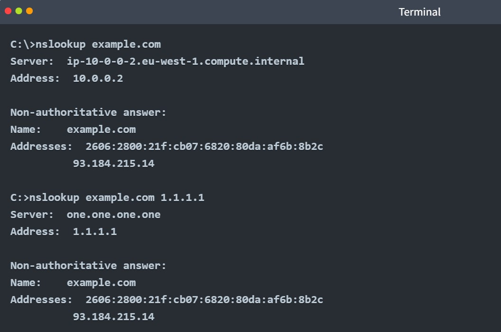 <br>

**Explanation**: the ```C:\>nslookup example.com 1.1.1.1 ```   query was resolved using the Cloudflare DNS server 1.1.1.1, and the result is the same, but the server used for the query is different. Both show that example.com resolves to 93.184.216.34.

### `netstat`
- **Purpose:** Displays active network connections and listening ports, including protocol, local and remote addresses, and their status.
- **Why:** Useful for monitoring network activity, identifying open ports, and troubleshooting network-related issues.

#### Example: Viewing Active Connections

```bash
C:\>netstat
```
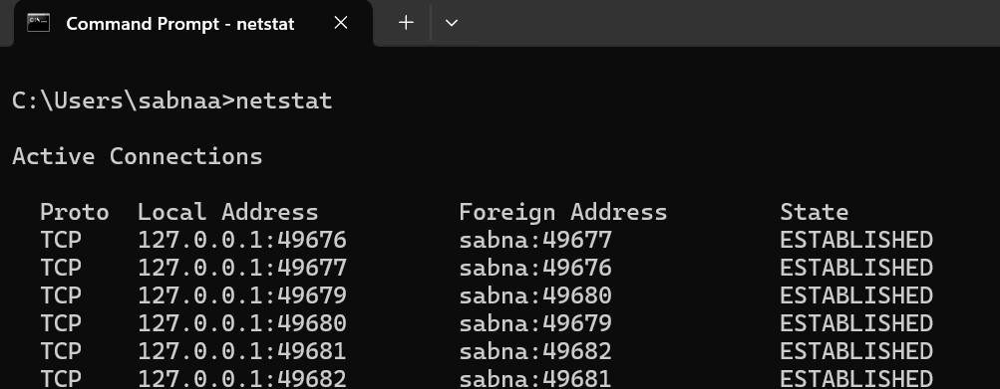 <br>

If you are curious about the other options, you can run **netstat -h**, where **-h** displays the help page. We opted for the following options: 
- **-a** displays all established connections and listening ports
- **-b** shows the program associated with each listening port and established connection
- **-o** reveals the process ID (PID) associated with the connectio
- **-n** uses a numerical form for addresses and port numbers

We combine these four options and execute the ```netstat -abon``` command. The result is quite long, but we display the first few lines in the terminal below. It is clear now that the executable **sshd.exe** is responsible for listening for incoming connections on port 22, as shown in the first line. We can also see the process ID (PID) associated with each connection.

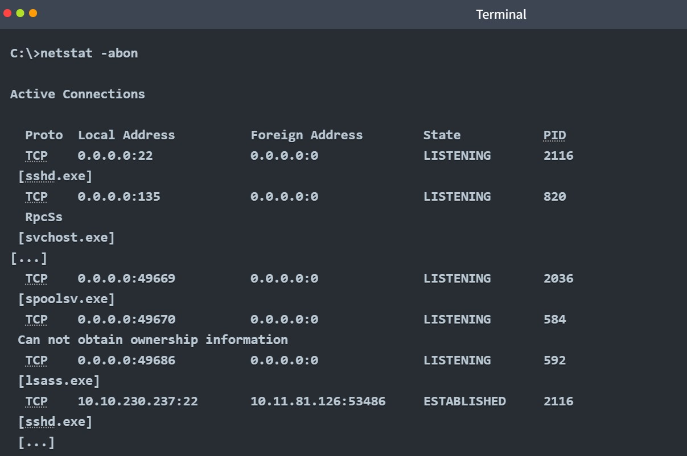 <br>

---
## File and Disk Management

### Working With Directories

### `dir`
- **Purpose:** Lists the contents of a directory.
- **Why:** Useful for viewing files and subdirectories within the current directory.

##### Example: Viewing the Contents of the Current Directory
```bash
C:\>dir
```

#### `cd`
- **Purpose:** Changes the current directory in the command line.
- **Why:** Useful for navigating between directories.

##### Example: Displaying the Current Directory
```bash
C:\>cd
```

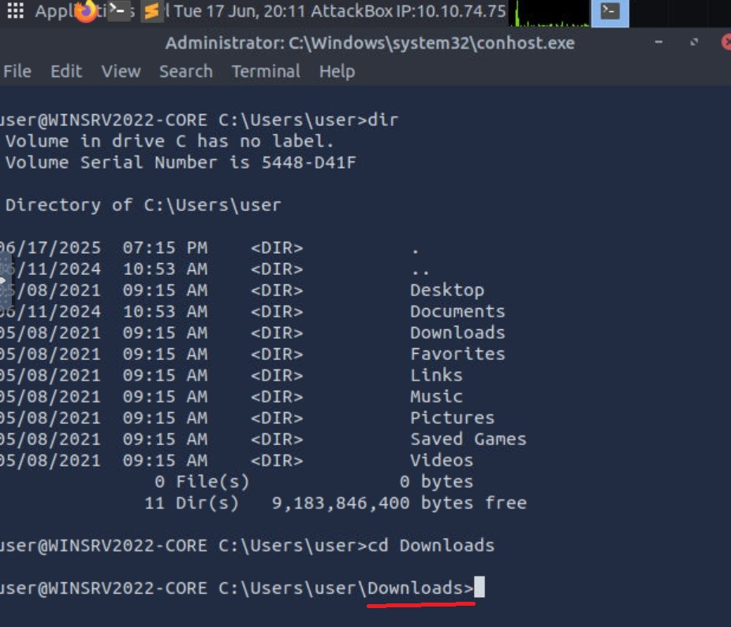 <br>

Note that you can use the following options with dir:

- ```dir /a``` - Displays hidden and system files as well. <br>
- ```dir /s``` - Displays files in the current directory and all subdirectories.

### `tree`
- **Purpose:** Displays a graphical representation of the directory structure.
- **Why:** Useful for visualizing the hierarchy of directories and subdirectories.

##### Example: Viewing the Directory Tree
```bash
C:\>tree
```
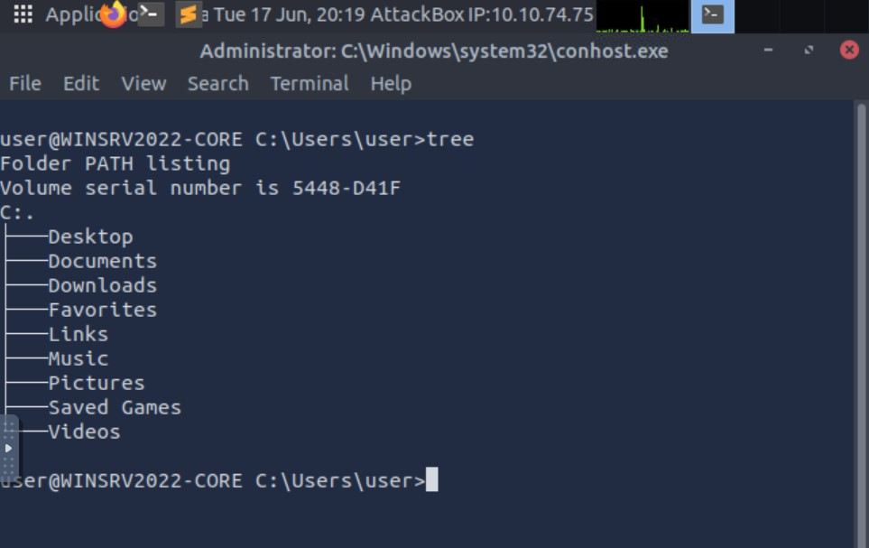 <br>

### `mkdir`
- **Purpose:** Creates a new directory.
- **Why:** Useful for organizing files and creating new folders in the file system.

##### Example: Creating a Directory
```bash
C:\>mkdir directory_name
```
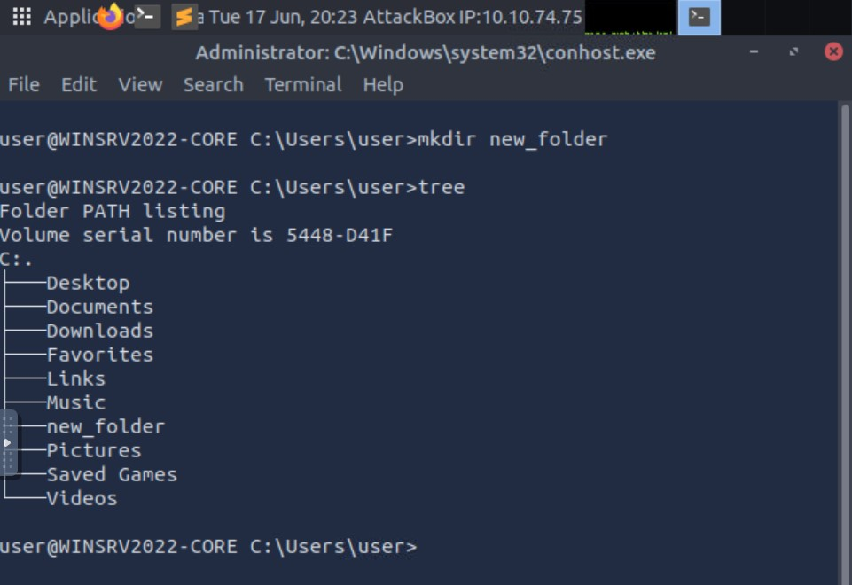 <br>

### `rmdir`
- **Purpose:** Removes a directory.
- **Why:** Useful for deleting empty directories.

##### Example: Removing a Directory
```bash
C:\>rmdir directory_name
```
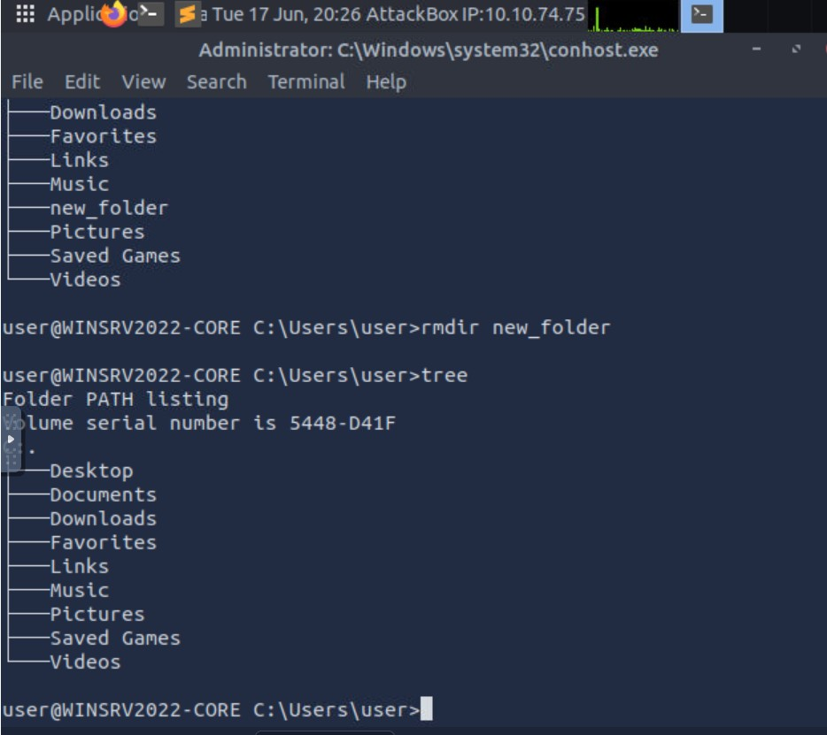 <br>

---

## Working With Files

#### `type`
- **Purpose:** Displays the contents of a text file.
- **Why:** Useful for quickly viewing the contents of small text files directly in the terminal.

##### Example: Viewing the Contents of a Text File
```bash
C:\>type filename.txt
```
**Explanation:** This command will dump the contents of filename.txt to the screen. It’s convenient for small text files that fit within the terminal window.

### `more`
- **Purpose:** Displays the contents of a text file, one page at a time.
- **Why:** Useful for viewing longer text files, especially when the file exceeds the terminal window size.

##### Example: Viewing a Large Text File
```bash
C:\>more filename.txt
```
**Explanation:** The more command displays the file contents one page at a time. After filling one page, it pauses, allowing you to press:
- **Spacebar** to move one page forward.
- **Enter** to move one line forward.

### `some_command | more`
- **Purpose:** Pipes the output of a command into the `more` command to display it one page at a time.
- **Why:** Useful when the output of a command is too long to fit in the terminal window, allowing you to read it page by page.

##### Example: Viewing the Output of `dir` Command with `more`
```bash
C:\>dir | more
```

### `copy`
- **Purpose:** Copies a file from one location to another.
- **Why:** Useful for creating backups or duplicating files between directories.

##### Example: Copying a File to a New Location
```bash
C:\>copy source.txt destination.txt
```
**Explanation:** This command copies the file ```source.txt``` to ```destination.txt```. If ```destination.txt``` does not exist, it will be created. If it already exists, it will be overwritten.

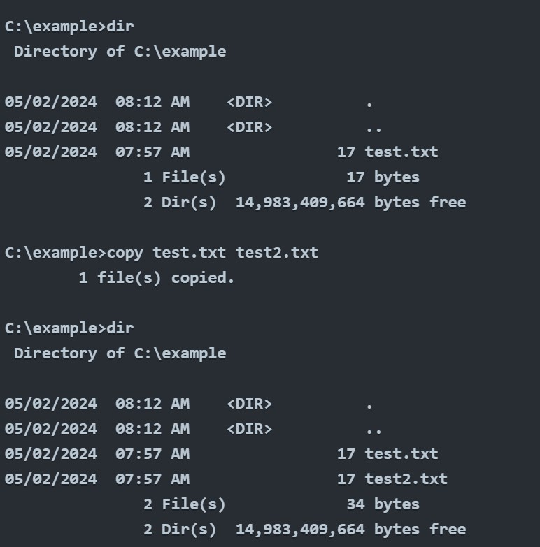 <br>

Copying a File to Another Directory: ```C:\>copy source.txt C:\NewFolder\destination.txt``` 
- **Explanation:** This command copies ```source.txt``` to the ```C:\NewFolder\``` directory and renames it as destination.txt.

Copying Multiple Files: ```C:\>copy *.txt C:\Backup\```
- **Explanation:** This command copies all ```.txt``` files in the current directory to the ```C:\Backup\``` directory.

### `move`
- **Purpose:** Moves a file or directory from one location to another.
- **Why:** Useful for relocating files or directories, or renaming them.

##### Example: Moving a File to a New Location
```bash
C:\>move source.txt C:\NewFolder\
```
- **Explanation:** This command renames ```oldname.txt``` to ```newname.txt``` in the same directory.  

Moving Multiple Files: ```C:\>move *.txt C:\Documents\TextFiles\```
- **Explanation:** This command moves all ```.txt``` files from the current directory to the ```C:\Documents\TextFiles\``` directory.

### `del` or `erase`
- **Purpose:** Deletes one or more files.
- **Why:** Useful for removing unwanted files from your system.

##### Example: Deleting a Single File
```bash
C:\>del filename.txt
```
Deleting Multiple Files: ```C:\>del *.txt```
- **Explanation:** This command deletes all ```.txt``` files in the current directory.

Deleting a File with Confirmation: ```C:\>del /p filename.txt```
- **Explanation:** The ```/p``` option prompts you for confirmation before deleting the file.

Deleting All Files in a Directory: ```C:\>del /s *.txt```
- **Explanation:** The ```/s``` option deletes ```.txt``` files in the current directory and all of its subdirectories.

---

## Task and Process Management

### `tasklist`
- **Purpose:** Displays a list of currently running processes on your system.
- **Why:** Useful for monitoring system activity, identifying running applications, and troubleshooting performance issues.

##### Example: Viewing the List of Running Processes
```bash
C:\>tasklist
```
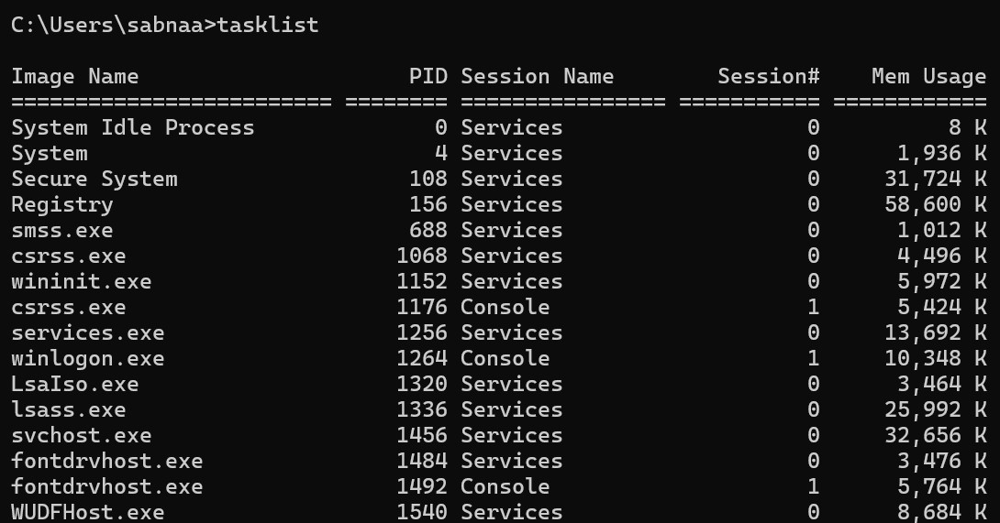 <br>

**Explanation:** This command displays a list of all running processes, including the process name, process ID (PID), and memory usage.

- Filtering Processes by Name: ```C:\>tasklist /fi "imagename eq chrome.exe"``` This command filters the list to show only processes that match the name ```chrome.exe.``` It helps if you're looking for a specific application.

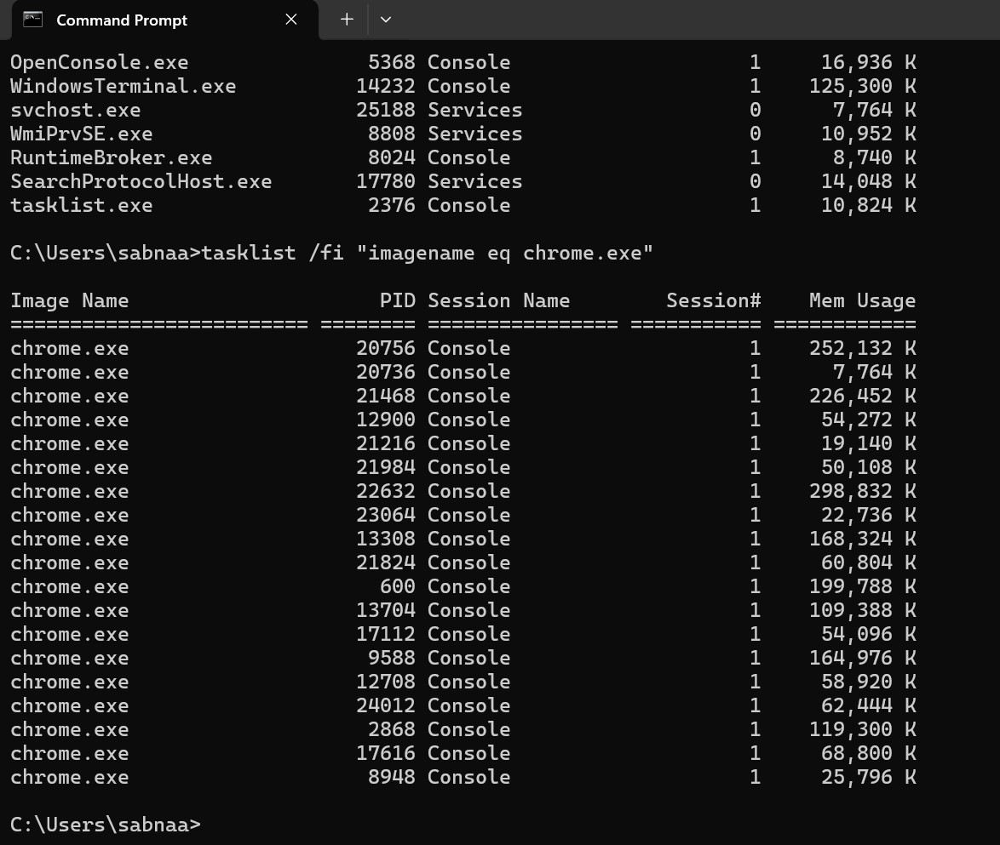 <br>

- Displaying Processes with Detailed Information: ``` C:\>tasklist /v ```  The **/v** option shows detailed information about each process, including the session name, session number, and window title (if applicable).

- Viewing Processes with Memory Usage: ```C:\>tasklist /fo csv``` The **/fo csv** option formats the output as a CSV (comma-separated values) file, which is useful for exporting the process list to another application like Excel.

### `taskkill`
- **Purpose:** Terminates a running process by its process ID (PID) or image name.
- **Why:** Useful for stopping unresponsive or unnecessary processes.

##### Example: Killing a Process by PID
```bash
C:\>taskkill /PID 4567
```
**Explanation:** This command terminates the process with ```PID 4567```. It's useful when you know the specific process ID of the application you want to stop.

- Killing a Process by Image Name: ```C:\>taskkill /IM chrome.exe``` This command terminates all processes with the image name **chrome.exe** (e.g., all instances of Chrome running on the system).
- Forcefully Killing a Process: ```C:\>taskkill /F /PID 4567```  The **/F** option forces the termination of the process, even if it's not responding. This can be helpful for stubborn processes that won’t terminate normally.
- Killing All Processes by Image Name: ```C:\>taskkill /IM chrome.exe /F``` This command forcefully terminates all **chrome.exe** processes running on the system. <br>

| Command                              | Description                                                       |
|--------------------------------------|-------------------------------------------------------------------|
| `taskkill /IM chrome.exe /F`         | Forcefully terminates all Chrome processes, even if unresponsive. |
| `taskkill /IM chrome.exe`            | Gracefully terminates all Chrome processes, if they can be closed.|
<br>
> Tip: Be cautious when using taskkill, especially with the /F option, as killing certain system processes can lead to instability or loss of unsaved data.

---

### `chkdsk`
- **Purpose:** Checks the integrity of the file system and disk, fixing any errors it finds.
- **Why:** Useful for diagnosing and repairing disk errors, file system corruption, or bad sectors.

##### Example: Running `chkdsk` on the C: Drive
```bash
C:\>chkdsk C:
```
**Explanation:** This command checks the integrity of the file system on drive ```C:``` and reports any issues.

### `driverquery`
- **Purpose:** Displays a list of all installed device drivers and their properties.
- **Why:** Useful for troubleshooting hardware issues and viewing information about drivers on the system.

##### Example: Viewing All Installed Drivers
```bash
C:\>driverquery
```
### `sfc /scannow`
- **Purpose:** Scans and repairs corrupted system files using the System File Checker tool.
- **Why:** Useful for fixing corrupted or missing system files that may cause issues with Windows performance or stability.

##### Example: Running System File Checker
```bash
C:\>sfc /scannow
```
**Explanation:** This command will scan all protected system files and automatically fix any issues it detects.

### `/?`
- **Purpose:** Displays help information for a command.
- **Why:** Useful for getting a list of options and syntax for any command.

##### Example: Displaying Help for `sfc`
```bash
C:\>sfc /?
```
**Explanation:** This command shows the help information for the ```sfc``` command, including all available options and their descriptions.

### `shutdown /r`
- **Purpose:** Restarts the computer.
- **Why:** Useful for rebooting the system from the command line.

##### Example: Restarting the Computer
```bash
C:\>shutdown /r
```

### `shutdown /s`
- **Purpose:** Shuts down the computer.
- **Why:** Useful for turning off the computer from the command line.

##### Example: Shutting Down the Computer
```bash
C:\>shutdown /s 
```
### `shutdown /a`
- **Purpose:** Aborts a shutdown or restart operation that has been scheduled.
- **Why:** Useful when you change your mind about shutting down or restarting the computer and want to cancel the operation before it completes.

##### Example: Aborting a Scheduled Shutdown or Restart
```bash
C:\>shutdown /a
```

---

> **Note:** These notes document hands-on learning from the TryHackMe *Cybersecurity 101* path. The exercises cover fundamental cybersecurity topics, including Linux basics, networking concepts, and web technologies. This document is intended for personal learning, revision, and ethical skill development. All screenshots, commands, and actions are for educational purposes only.  
> — Compiled by moh4med404 | Curious Mind | Cybersecurity Enthusiast