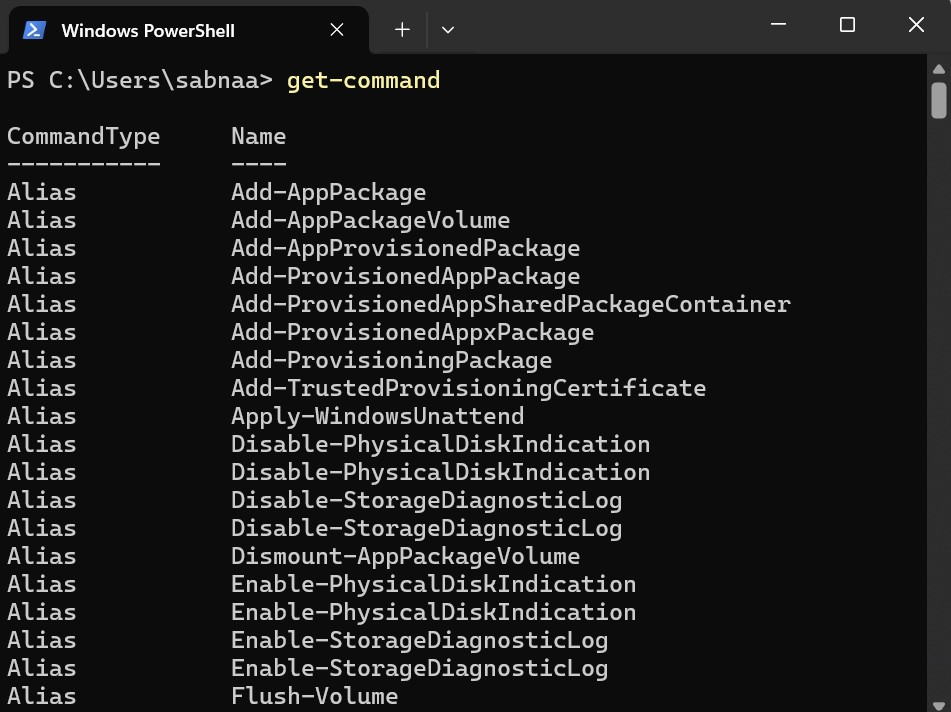
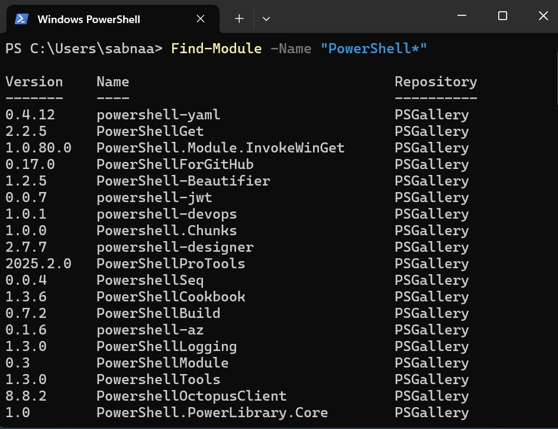

# Cybersecurity 101 
---
# Windows PowerShell

### PowerShell
- **Purpose:** A cross-platform task automation solution that combines a command-line shell, scripting language, and configuration management framework.
- **Why:** PowerShell is designed for automating tasks, managing system configurations, and handling complex data types through its object-oriented approach.

#### Key Features:
- **Object-Oriented:** Unlike older text-based tools, PowerShell handles complex data types (objects) and system components more efficiently.
- **Cross-Platform:** Initially exclusive to Windows, PowerShell now supports macOS and Linux, making it versatile for IT professionals on various operating systems.
- **Built on .NET:** PowerShell leverages the power of the .NET framework, providing access to a wide range of libraries and APIs.

#### Use Cases:
- Automating repetitive administrative tasks
- Managing system configurations and settings
- Scripting complex system interactions across different platforms
- Creating cross-platform automation scripts

*Tip:* PowerShell is a powerful tool for IT professionals, combining flexibility with the power of object-oriented programming and system management capabilities.

---

### The Power in PowerShell
To truly understand the strength of PowerShell, we need to grasp the concept of **objects** within this context.

#### What is an Object in PowerShell?
In programming, an **object** represents an item that contains:
- **Properties** (characteristics or data), like color, model, or size.
- **Methods** (actions or functions), like driving, honking, or refueling.

##### Example: Car Object
For instance, a **Car** object might have:
- **Properties:** 
  - `Color`: Red
  - `Model`: Sedan
  - `FuelLevel`: 75%
- **Methods:** 
  - `Drive()`: Starts the car and moves it.
  - `HonkHorn()`: Activates the car's horn.
  - `Refuel()`: Adds fuel to the car.

#### Objects in PowerShell
In PowerShell, **objects** are fundamental units that store both data (properties) and functionality (methods). For example:
- **Properties:** A file name, username, file size, or process ID.
- **Methods:** Copying a file, stopping a process, or listing directory contents.

When you run a **cmdlet** in PowerShell, it doesn't just output plain text (as traditional command-line tools do). Instead, cmdlets return **objects** that retain their properties and methods. This allows PowerShell to:
- Handle complex data efficiently.
- Manipulate and filter data easily without additional parsing.
- Perform actions on data directly through methods, like copying a file or managing system processes.

#### Advantages Over Traditional Command Shell
Traditional command shells are **text-based**, which means data is processed as raw text. In contrast, PowerShell works with objects, making it more powerful and flexible. For example:
- **Text-based (Traditional Shell):** You'd need to parse the text output manually.
- **Object-based (PowerShell):** Objects retain data and can perform actions without needing to parse or convert the data.

*Tip:* The object-oriented approach of PowerShell makes it a much more robust and scalable tool, especially for handling complex tasks like system administration, automation, and data manipulation.

--- 

### Opening PowerShell

There are various ways to open PowerShell, depending on your setup and environment. If you're using a Windows system with a graphical interface (GUI), here are some common methods:

1. **Start Menu**: Open the Start Menu, search for *PowerShell*, and select either *Windows PowerShell* or *PowerShell* from the search results.
2. **Run Dialog**: Press `Win + R` to open the Run dialog, type `powershell`, and hit Enter.
3. **File Explorer**: Navigate to any folder in File Explorer, type `powershell` in the address bar, and press Enter to open PowerShell in that directory.
4. **Task Manager**: Open Task Manager, go to *File* > *Run new task*, type `powershell`, and press Enter.

You can also launch PowerShell from Command Prompt (`cmd.exe`) by typing `powershell` and pressing Enter.

For our specific situation, where we only have access to the target VM's Command Prompt, we'll be using this method.

----

### `Get-Content`
`Get-Content` is used to retrieve the contents of a file and display it in the PowerShell console or save it to a variable.

### Syntax:
```powershell
Get-Content "C:\path\to\your\file.txt"
```
**Example:** To display the contents of a text file ```Get-Content "C:\Users\YourName\Documents\example.txt"```  <br> <br>

 <br>


### `Set-Location`

The `Set-Location` cmdlet in PowerShell is used to change the current working directory. It's similar to the `cd` (change directory) command found in other shell environments like Bash or Command Prompt.

### Syntax:
```powershell
Set-Location -Path "C:\path\to\directory" same as "C:\path\to\directory"
```

### Get-Command
The `Get-Command` cmdlet in PowerShell is used to get all cmdlets, functions, workflows, aliases, and other commands that are available in the current session. It is a versatile tool to explore the available commands and their functionalities in PowerShell.

### Syntax:
```powershell
Get-Command
```
 <br>

- You can filter the list of commands by their **CommandType**. For instance, to display only commands of type use: ```Get-Command -CommandType "Function"```

 <br>

### Get-Help
The `Get-Help` cmdlet in PowerShell is used to retrieve detailed information about cmdlets, functions, workflows, aliases, and scripts. It provides documentation on how a command works, including its syntax, parameters, and examples. It’s an essential tool for discovering how to use PowerShell commands, especially when you're unsure about the parameters or functionality.

### Syntax:
```powershell
Get-Help <CommandName>
```
- To get detailed information about a specific command (e.g., Get-Command) use: ```Get-Help Get-Command```

 <br>

### Get-Alias

## Overview
PowerShell includes **aliases** to make the transition easier for IT professionals who are familiar with traditional command-line tools. An alias is a shortcut or alternative name for a cmdlet. These aliases allow users to execute commands using familiar names that are often more concise and easier to remember. For example, `dir` is an alias for the `Get-ChildItem` cmdlet, and `cd` is an alias for `Set-Location`.

The `Get-Alias` cmdlet is used to list all available aliases in the current PowerShell session. It allows you to quickly view which aliases are mapped to cmdlets, helping you work more efficiently with common commands.

### Syntax:
```powershell
Get-Alias
```
- Search for a Specific Alias: ```Get-Alias -Name dir``` If you want to search for a specific alias, you can use the ```-Name``` parameter. For example, to find the alias for ```Get-ChildItem:``` ```Get-Alias -Name dir```
  
 <br>


### Where to Find and Download Cmdlets

Another powerful feature of PowerShell is the possibility of extending its functionality by downloading additional cmdlets from online repositories.

To search for modules (collections of cmdlets) in online repositories like the PowerShell Gallery, we can use ```Find-Module```. Sometimes, if we don’t know the exact name of the module, it can be useful to search for modules with a similar name. We can achieve this by filtering the ```Name``` property and appending a wildcard (```*```) to the module’s partial name, using the following standard PowerShell syntax: ```Cmdlet -Property "pattern*```

 <br>

- To install use:  ```Install-Module -Name "PowerShellGet"```

---
## Navigating the File System and Working with Files

### New-Item Cmdlet

## Overview
The `New-Item` cmdlet in PowerShell is used to create new items, such as files, directories, symbolic links, or registry keys, in a specified path. It allows you to create various types of items quickly and easily.

### Syntax:
```powershell
New-Item -Path <Path> -ItemType <ItemType> -Name <ItemName>
```
- ```-Path```: The location where the new item will be created (either a relative or absolute path).
- ```-ItemType```: Specifies the type of item to create, such as ```File```, ```Directory```, SymbolicLink, etc.
- ```-Name```: The name of the new item being created.

Create a New Directory: ```New-Item -Path "C:\Users\sabnaa\Desktop" -ItemType Directory -Name "NewFolder"```

 <br>

Create a New File: ```New-Item -Path "C:\Users\sabnaa\Desktop\NewFolder" -ItemType File -Name "newfile.txt"```

 <br>

### Note

- ```Remove-Item``` cmdlet removes both directories and files, whereas in Windows CLI we have separate commands ```rmdir``` and ```del```. 
  - ```Remove-Item -Path "C:\Users\sabnaa\Desktop\NewFolder"```
  - ```Remove-Item -Path "C:\Users\sabnaa\Desktop\NewFolder\newfile.txt"```
- We can copy or move files and directories alike, using respectively ```Copy-Item``` (equivalent to ```copy```) and ```Move-Item``` (equivalent to ```move```). 
  - ```Copy-Item -Path <SourcePath> -Destination <DestinationPath>```
  - ```Move-Item -Path <SourcePath> -Destination <DestinationPath>```

---

## Piping, Filtering, and Sorting Data

### Piping in PowerShell

Piping is a method in PowerShell that allows you to send the output of one command as input to another command using the pipe symbol (`|`).

### Example 1 

```powershell
Get-Process | Select-Object Name
```

**Explanation:**
- ```Get-Process```: Retrieves all running processes.
- ```|```: Sends the output of ```Get-Process``` to the next command.
- ```Select-Object Name```: Selects only the "Name" property of each process, showing just the process names.<br><br>

 <br>
 <br>

### Example 2

```powershell
Get-ChildItem | Sort-Object Length
```
**Explanation:**
- `Get-ChildItem:` Lists all files and directories in the current directory.
- `|`: Sends the output of `Get-ChildItem` to the next command.
- `Sort-Object Length`: Sorts the files and directories by their length (size).
<br><br>

 <br>


### Using `Where-Object` in PowerShell
`Where-Object` is a cmdlet used to filter objects based on a condition. It allows you to select items that match a specific criterion from the output of another command.

```powershell
Get-ChildItem | Where-Object -Property "Extension" -eq ".txt"
```
**Explanation:**
- `Get-ChildItem:` Lists all files and directories in the current directory.
- `|`: Sends the output of `Get-ChildItem` to the next command.
- `Where-Object -Property "Extension" -eq ".txt"`: Filters and shows only the files where the "Extension" property is `.txt`.
<br><br>

 <br>

### Using `Select-Object` 
`Select-Object` is a cmdlet used to select specific properties of an object or to limit the number of objects passed through the pipeline. It is useful for customizing the output of commands.

```powershell
Get-ChildItem | Select-Object Name, Length
```

**Explanation:**
- `Get-ChildItem`: Lists all files and directories in the current directory.
- `|`: Sends the output of `Get-ChildItem` to the next command.
- `Select-Object Name, Length`: Selects and displays only the `Name` and `Length` properties for each item. `Name` is the file or directory name, and `Length` is the file size in bytes (only shown for files).
<br><br>

 <br>

### Using `Select-String`  
`Select-String` is a cmdlet used to search for text patterns in input strings or files, similar to the `grep` command in Unix/Linux. It returns the lines that match the specified pattern.

```powershell
Select-String -Path "log.txt" -Pattern "error"
```

**Explanation:**
- `Select-String`: Searches through the content of specified files or input for text that matches a pattern
- `-Path "log.txt"`: Specifies the file (`log.txt`) to search.
- `-Pattern "error"`: Searches for lines that contain the word `"error"`.

---

## System and Network Information

### Using `Get-ComputerInfo` in PowerShell  
`Get-ComputerInfo` is a cmdlet that retrieves detailed information about the computer system, including hardware, operating system, and installed software details.

```powershell
Get-ComputerInfo
```
 <br>

### Using `Get-LocalUser`
`Get-LocalUser` is a cmdlet used to retrieve local user accounts on a Windows computer.

```powershell
Get-LocalUser
```
 <br>

### Using `ipconfig` in Windows Command Prompt / PowerShell  
`ipconfig` is a command-line utility that displays the current network configuration details of your computer, such as IP address, subnet mask, and default gateway.

```powershell
ipconfig
```

 <br>

### Using `Get-NetIPConfiguration` 
`Get-NetIPConfiguration` is a cmdlet that retrieves detailed IP configuration information for network adapters on a Windows computer.

```powershell
Get-NetIPConfiguration
```
 <br>

### Using `Get-NetIPAddress` 
`Get-NetIPAddress` is a cmdlet that retrieves IP address configuration information for network interfaces on a Windows computer.

```powershell
Get-NetIPAddress
```
 <br>

--- 

## Real-Time System Analysis

### Using `Get-Process` 
`Get-Process` is a cmdlet that retrieves information about the processes running on the local computer.

```powershell
Get-Process
```

 <br>

### Using `Get-Service` 
`Get-Service` is a cmdlet that retrieves the status of services on a local or remote computer.

```powershell
Get-Service
```
 <br>

### Using `Get-NetTCPConnection` 
`Get-NetTCPConnection` is a cmdlet that retrieves current TCP connections on a local computer, showing details about network connections.

```powershell
Get-NetTCPConnection
```
 <br>

### Using `Get-FileHash` 
`Get-FileHash` isuseful cmdlet for generating file hashes, which is particularly valuable in incident response, threat hunting, and malware analysis, as it helps verify file integrity and detect potential tampering.

```powershell
Get-FileHash -Path .\ship-flag.txt
```
**Explanation:**
- `Get-FileHash`: Calculates the hash of a file to verify its integrity or authenticity.
- `-Path .\ship-flag.txt`: Specifies the file (`ship-flag.txt` in the current directory) to compute the hash for.
<br>

 <br>

---

## Scripting

`Scripting` is the process of writing and executing a series of commands contained in a text file, known as a script, to automate tasks that one would generally perform manually in a shell, like PowerShell.

Simply speaking, scripting is like giving a computer a to-do list, where each line in the script is a task that the computer will carry out automatically. This approach saves time, reduces the chance of errors, and allows you to perform tasks that are too complex or tedious to do manually. As you learn more about shells and scripting, you’ll discover that scripts are powerful tools for managing systems, processing data, and much more.

Learning scripting with PowerShell goes beyond the scope of this room. Nonetheless, it is important to understand that its power makes it a crucial skill across all cybersecurity roles.

- For **blue team** professionals such as incident responders, malware analysts, and threat hunters, PowerShell scripts can automate numerous tasks, including log analysis, detecting anomalies, and extracting indicators of compromise (IOCs). These scripts can also be used to reverse-engineer malicious code (malware) or automate system scans to detect signs of intrusion.

- For the **red team**, including penetration testers and ethical hackers, PowerShell scripts automate tasks like system enumeration, executing remote commands, and crafting obfuscated scripts to bypass defenses. Its deep integration with various systems makes it a powerful tool for simulating attacks and testing systems’ resilience against real-world threats.

Within the broader context of cybersecurity, system administrators benefit from PowerShell scripting by automating integrity checks, managing system configurations, and securing networks, especially in remote or large-scale environments. PowerShell scripts can be designed to enforce security policies, monitor system health, and respond automatically to security incidents — thereby enhancing the overall security posture. <br>

### Using `Invoke-Command` 
`Invoke-Command` is a cmdlet used to run commands or scripts on local or remote computers.

```powershell
Get-Help Invoke-Command -Examples
```
**Explanation:**
- `Get-Help Invoke-Command -Examples`: Displays example usage of the `Invoke-Command` cmdlet.
- This helps users understand different ways to run commands locally or remotely with `Invoke-Command`.

 <br>

`Invoke-Command` is a cmdlet used to run commands or scripts on local or remote computers.

```powershell
Invoke-Command -ComputerName Server01 -ScriptBlock { Get-Process }
```
**Explanation:**
- `Invoke-Command`: Executes commands on one or more remote computers.
- `-ComputerName Server01`: Specifies the target computer to run the command on.
- `-ScriptBlock { Get-Process }`: The block of code to execute remotely—in this case, retrieving the list of running processes.

---

> **Note:** These notes document hands-on learning from the TryHackMe *Cybersecurity 101* path. The exercises cover fundamental cybersecurity topics, including Linux basics, networking concepts, and web technologies. This document is intended for personal learning, revision, and ethical skill development. All screenshots, commands, and actions are for educational purposes only.  
> — Compiled by moh4med404 | Curious Mind | Cybersecurity Enthusiast