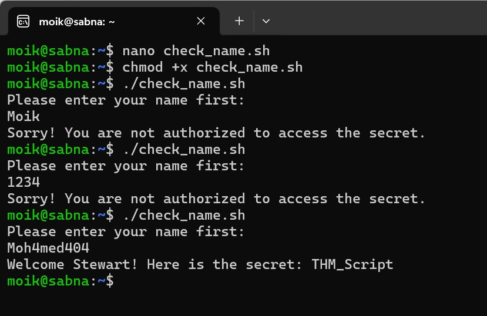
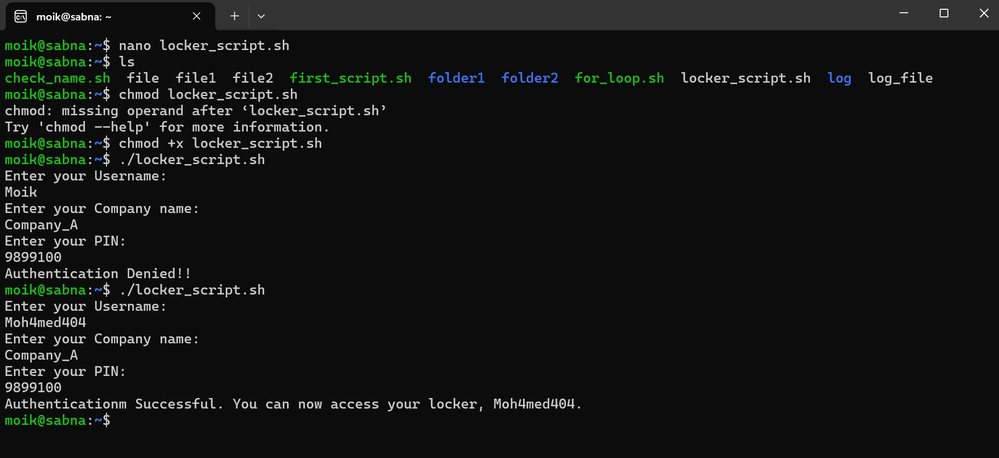

# Cybersecurity 101 
---
# Linux Shells


Most of us use the Graphical User Interface (GUI) to get things done on our computers — just point and click. But you can actually do almost everything using the Command Line Interface (CLI) by typing commands. The **shell** is what makes this possible, giving you helpful tools and features when using the CLI. It’s more efficient and uses fewer system resources.

Think of it like being in a restaurant. Using the GUI is like picking from a menu and having a waiter serve your food — easy and convenient. Using the CLI is like going into the kitchen and cooking the food yourself. In this case, the **shell** is like a helpful assistant that guides you with recipes. It gives you more control over what you're doing.

That’s why you often see hackers in movies typing away in terminals — many Linux users prefer the CLI for its power and flexibility. In this room, you’ll learn how to work with a Linux shell, try out different types, and even write your own shell scripts.


### Using `pwd` in Linux  
`pwd` stands for "print working directory" and displays the full path of the current directory.

```bash
pwd
```

 <br>


### Using `ls` 
`ls` is a command used to list the contents of a directory.

```bash
ls
```

- `ls -l`: Lists contents in long format with details like permissions, owner, size, and date
- `ls -a`: Includes hidden files (those starting with a dot)
- `ls -lh`: Long format with human-readable file sizes (e.g., KB, MB)
- `ls /etc`: Lists the contents of the /etc directory

 <br>

### Using `cd` 
`cd` (change directory) is a command used to navigate between directories in the Linux file system.

```bash
cd /home/user/Documents
```
 <br>

### Using `cat`  
`cat` (short for "concatenate") is a command used to display the contents of files or combine multiple files.

```bash
cat file1.txt
```
 <br>

### Using `grep` 
`grep` is a command-line tool used to search for specific patterns or text within files.

```bash
grep "Hello" file1
```
 <br>

---

## Types of Linux Shells

### Types of Linux Shells

A **shell** is a command-line interface that allows users to interact with the operating system. Linux supports several types of shells, each with its own features and syntax.

#### 1. **Bash (Bourne Again Shell)**
- The most common default shell in many Linux distributions.
- Compatible with the original Bourne shell (`sh`), but includes enhancements like command history, improved scripting, and tab completion.
- Usage: `/bin/bash`

#### 2. **sh (Bourne Shell)**
- The original UNIX shell created by Stephen Bourne.
- Simple and widely supported, but lacks many modern features.
- Usage: `/bin/sh`

#### 3. **csh (C Shell)**
- Designed to look and behave like the C programming language.
- Introduces features like history and aliasing.
- Usage: `/bin/csh`

#### 4. **tcsh**
- An enhanced version of `csh` with additional features such as command-line editing and programmable completion.
- Usage: `/bin/tcsh`

#### 5. **ksh (Korn Shell)**
- Combines features of `sh` and `csh`.
- Supports scripting with advanced programming constructs.
- Usage: `/bin/ksh`

#### 6. **zsh (Z Shell)**
- Highly customizable shell with many features like improved tab completion, spell correction, and theming.
- Increasingly popular among developers and power users.
- Usage: `/bin/zsh`

Each shell has its strengths and typical use cases. `bash` is the default on many Linux systems, but others like `zsh` offer enhanced interactivity and customization.

- To see which shell you are using, type the following command: `echo $SHELL`
  
 <br>

- You can list down the available shells in your Linux OS by typing `cat /etc/shells` in the terminal:

 <br>

- ou can type the shell name that is present on your OS, and it will open for you, as can be seen below: `zsh`

---

## Shell Scripting and Components
A shell script is nothing but a set of commands. Suppose a repetitive task requires you to enter multiple commands using a shell. Instead of entering them one by one every time you perform that task—which can be time-consuming—you can combine those commands into a script. 

By executing the script, all the commands within it will run automatically. This helps save time and reduces manual errors.

All the shells mentioned earlier have scripting capabilities, enabling task automation. However, it’s important to know that while Linux shells support scripting, scripting is not limited to shells alone. You can write scripts using various programming languages as well.

In this room, we will focus on scripting using a shell.

Unlike other commands we type directly into the shell, a shell script must first be created as a file using any text editor. 

The file should have a `.sh` extension, which is the default for bash scripts.

Here’s an example of creating a script file using the terminal:

```bash
nano myscript.sh
```
Every script should start with a **shebang**. 

A shebang is a combination of characters added at the very beginning of a script, starting with `#!` followed by the path to the interpreter that will execute the script.

Since we are writing our script in **bash**, the shebang line will specify bash as the interpreter.

Example of a bash shebang line:

```bash
#!/bin/bash
```
### Variables 

Variables are used to store data that can be referenced and manipulated throughout a script.

**Defining a variable:**

```bash
name="Alice"
```
- No spaces around the `=`.
- Variable names are case-sensitive and usually use letters, numbers, and underscores.

**Using a variable:** `echo "Hello, $name"`

 <br>

### Example Shell Script: Greeting User with Input

- Step 01:`nano first_script.sh`
- Step 02: Enter the following code in the editor
```bash
#!/bin/bash
echo "Hey, what’s your name?"
read name
echo "Welcome, $name"
```
- Step 03: Now, save the script by pressing `CTRL+X`. Confirm by pressing `Y` and then `ENTER`.
- Step 04: To give these permissions to the script, we can type the following command in our terminal:`chmod +x first_script.sh`
- Step 05:* Now that the script has execution permissions use `./` before the script name to execute it.

 <br>

### Loops in Shell Scripting

- Step 1: `nano for_loop.sh`
- Step 2: Enter the following code in the editor
```bash
#!/bin/bash
for i in {1..10};
do
  echo $i
done
```
- Step 3: Save the script by pressing `CTRL+X`, then `Y`, and then `ENTER`.
- Step 4: Make the script executable: `chmod +x for_loop.sh`
- Step 5: Run the script: `./for_loop.sh`

 <br>

### Example Shell Script: Conditional Statements with `if-else`

- Step 1: `nano check_name.sh`
- Step 2: Enter the following code in the editor
```bash
#!/bin/bash
echo "Please enter your name first:"
read name
if [ "$name" = "Moh4med404" ]; then
    echo "Welcome Stewart! Here is the secret: THM_Script"
else
    echo "Sorry! You are not authorized to access the secret."
fi
```
- Step 3: Save the script by pressing `CTRL+X`, then `Y`, and then `ENTER`.
- Step 4: Make the script executable: `chmod +x check_name.sh`
- Step 5: Run the script: `./check_name.sh`

 <br>

### Commands 
#### Example Shell Script: Conditional Statement with Comments

```bash
# Defining the Interpreter
#!/bin/bash

# Asking the user to enter a value
echo "Please enter your name first:"

# Storing the user input value in a variable
read name

# Checking if the name the user entered is equal to our required name
if [ "$name" = "Stewart" ]; then

    # If it equals the required name, the following line will be displayed
    echo "Welcome Stewart! Here is the secret: THM_Script"

# Defining the sentence to be displayed if the condition fails
else
    echo "So
```
---

## The Locker Script - Requirement
 
A user has a locker in a bank. To secure the locker, we have to have a script in place that verifies the user before opening it. When executed, the script should ask the user for their name, company name, and PIN. If the user enters the following details, they should be allowed to enter, or else they should be denied access.

- Username: Moha4med404
- Company name: Company_A
- PIN: 9899100

### Example Shell Script: The Locker Script

```bash
# Defining the Interpreter
#!/bin/bash 

# Defining the variables
username=""
companyname=""
pin=""

# Defining the loop
for i in {1..3}; do
    # Defining the conditional statements
    if [ "$i" -eq 1 ]; then
        echo "Enter your Username:"
        read username
    elif [ "$i" -eq 2 ]; then
        echo "Enter your Company name:"
        read companyname
    else
        echo "Enter your PIN:"
        read pin
    fi
done

# Checking if the user entered the correct details
if [ "$username" = "Moh4med404" ] && [ "$companyname" = "Company_A" ] && [ "$pin" = "9899100" ]; then
    echo "Authenticationm Successful. You can now access your locker, Moh4med404."
else
    echo "Authentication Denied!!"
fi
```
### Output

 <br>

### Using `sudo su` in Linux

The `sudo su` command is used to switch to the **root user** (superuser) with administrative privileges.

```bash
sudo su
```
 - `sudo su`: to switch to the root shell with root's environment, assuming the user has sudo privileges.
- After running this, you’ll be prompted for your `password`. Once entered correctly, your shell prompt will change to indicate you are now operating as the root user.
- **⚠️ Warning**: While using sudo su, be cautious—you're operating with full system privileges and can easily break or delete critical system components.

---
> **Note:** These notes document hands-on learning from the TryHackMe *Cybersecurity 101* path. The exercises cover fundamental cybersecurity topics, including Linux basics, networking concepts, and web technologies. This document is intended for personal learning, revision, and ethical skill development. All screenshots, commands, and actions are for educational purposes only.  
> — Compiled by moh4med404 | Curious Mind | Cybersecurity Enthusiast


