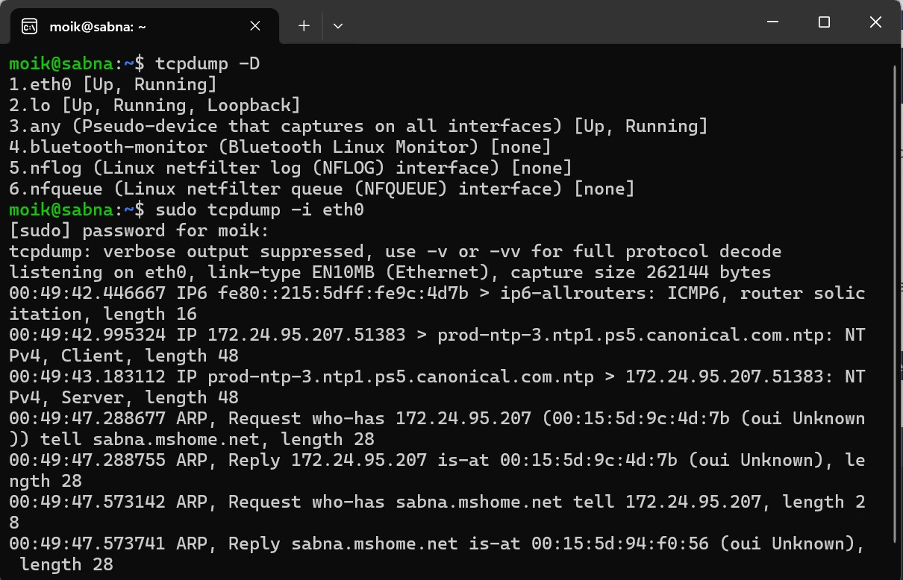
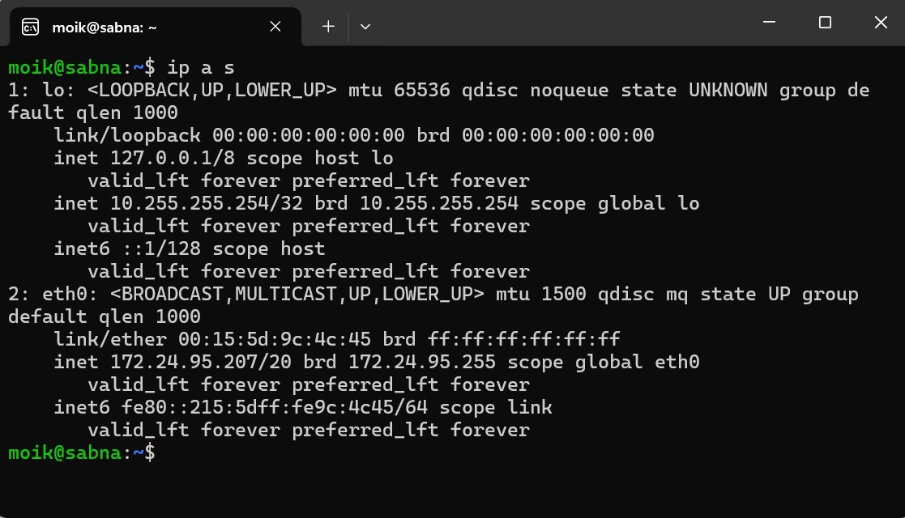
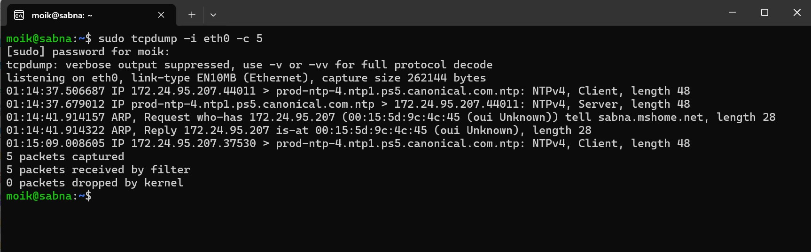
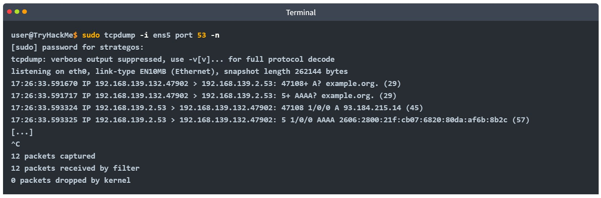

# Cybersecurity 101 
---
# Tcpdump Basics

Tcpdump is a **powerful command-line packet analyzer** that captures network traffic and displays it in a human-readable format. It's widely used for troubleshooting, analyzing, and debugging network issues.

### 🖥️ Tcpdump Command: `-i INTERFACE`

The `-i` argument in **Tcpdump** specifies the **network interface** from which to capture packets. This option is fundamental for defining the source of network traffic you want to analyze.

#### 🔧 Syntax:
```bash
tcpdump -i <interface>
```
- **interface**: The name of the network interface (e.g., `eth0`, `wlan0`, `lo`, etc.) to capture traffic from.
- To list the network interfaces available on your system, run: `tcpdump -D`
-  Capture packets on the eth0 interface (Ethernet): `sudo tcpdump -i eth0`
  
 <br>

### 🖧 Viewing IP Addresses: `ip address show` (or `ip a s`)

The `ip address show` (or its shorthand `ip a s`) command is used to **display** the **IP addresses** assigned to all network interfaces on a Linux system. This is helpful for **network configuration**, **troubleshooting**, and **identifying available interfaces**.

#### 🔧 Syntax:
```bash
ip a s
```
 <br>

### 💾 Saving Packets to a File: `-w FILE`

In many network troubleshooting or analysis scenarios, you may want to **save** the captured packets to a file for later inspection. This can be achieved by using the `-w` option in **Tcpdump**, which writes the captured packets to a specified file, usually with a `.pcap` extension.

### 🔧 Syntax:
```bash
tcpdump -i <interface> -w <file_name.pcap>
```

- **interface**: The network interface you wish to capture packets from (e.g., **eth0**, **wlan0**).
- **file_name.pcap**: The name of the file where the packets will be saved.

Save packets from the eth0 interface to a `.pcap` file use: `sudo tcpdump -i eth0 -w capture.pcap`

### 📂 Reading Captured Packets from a File: `-r FILE`

After capturing network packets and saving them to a file with the `-w` option, you can later use **Tcpdump** to **read** and analyze the contents of the file. The `-r` option allows you to load a **.pcap** file and display the packet details, just like it would for a live capture.

#### 🔧 Syntax:
```bash
tcpdump -r <file_name.pcap>
```
- **file_name.pcap**: The name of the capture file (usually **.pcap**) that contains the saved network traffic.

Read and display all packets from a saved capture file use: `tcpdump -r capture.pcap`

### Limiting the Number of Captured Packets: `-c COUNT`

The `-c` option in **Tcpdump** allows you to specify the exact **number of packets** you want to capture. This can be very useful when you want to capture a **small subset** of traffic for analysis or testing, rather than letting the capture run indefinitely.

#### 🔧 Syntax:
```bash
tcpdump -i <interface> -c <count> <filter>
```
- **interface**: The network interface to capture packets from (e.g., `eth0`, `wlan0`).
- **count**: The number of packets you want to capture before stopping the capture session.
- **filter** (optional): You can apply any BPF (Berkeley Packet Filter) expression to capture specific types of traffic.

Capture 5 packets from the `eth0` interface: `sudo tcpdump -i eth0 -c 5`
- This command will capture exactly **5 packets** from the **eth0** interface and then stop the capture session.

 <br>

## 🚫 Don’t Resolve IP Addresses and Port Numbers: `-n` and `-nn`

By default, **Tcpdump** tries to make packet output more human-readable by resolving:

- **IP addresses** to **hostnames** (via DNS)
- **Port numbers** to **well-known service names** (e.g., 80 → `http`, 443 → `https`)

This can cause delays and cluttered output during analysis. You can prevent these resolutions using:

#### 🔧 Options:
- `-n`  → Disable **DNS resolution** (IP addresses stay numeric)
- `-nn` → Disable both **DNS** and **port number** resolution

**Example 1:** Disable IP address resolution only:
```bash
sudo tcpdump -i eth0 -c 5 -n
```
- IP addresses are shown as-is (e.g., `192.168.1.1`), but port numbers may still be resolved (e.g., `80 → http`).

**Example 2:** Disable both IP and port resolution: `sudo tcpdump -i eth0 -c 5 -nn` 

### 🔍 Increase Output Detail with Verbose Mode: `-v`, `-vv`, and `-vvv`

The `-v` option in **Tcpdump** increases the **verbosity** of the packet output. It provides **more detailed information** about each packet, which can help during deeper inspection.

- You can further increase verbosity using:
  - `-vv`  → Even more detail
  - `-vvv` → Maximum detail

#### 🔧 Syntax:
```bash
tcpdump -i <interface> -c <count> -v       # basic verbose
eg: sudo tcpdump -i eth0 -c 3 -v
tcpdump -i <interface> -c <count> -vv      # more verbose
sudo tcpdump -i eth0 -c 3 -vv
tcpdump -i <interface> -c <count> -vvv     # maximum verbosity
sudo tcpdump -i eth0 -c 3 -vvv
```

--- 

# Filtering Expressions

Although you can run **tcpdump** without providing any filtering expressions, this won’t be useful. Just like in a social gathering, you don’t try to listen to everyone at the same time; you would rather give your attention to a specific person or conversation. Considering the number of packets seen by our network card, it is impossible to see everything at once; we need to be specific and capture what we are interested in inspecting.

### 🎯 Filtering by Host: `host <IP/HOSTNAME>`

If you're only interested in **traffic to or from a specific host** (like a network printer, game server, or website), Tcpdump allows you to filter packets using the `host` keyword.

You can filter using:
- A **hostname** (e.g., `example.com`)
- An **IP address** (e.g., `192.168.1.10`)

This filter will capture all packets where the specified host is either the **source or destination**.

#### 🔧 Syntax:
```bash
tcpdump host <hostname_or_ip>
```
**Example:** Capture Traffic from a Specific Host: `sudo tcpdump host example.com -w http.pcap`

- `host example.com`: Filters traffic to/from `example.com`.
- `-w http.pcap`: Writes the captured packets to a file named http.pcap.
- `sudo`: Required to allow low-level access for packet capture.

### 🎯 Filtering by Source or Destination Host in Tcpdump

Sometimes you're only interested in packets **coming from** or **going to** a specific host. Tcpdump lets you fine-tune your packet capture using:

- `src host` → Capture packets where the **source** is the specified IP or hostname
- `dst host` → Capture packets where the **destination** is the specified IP or hostname

#### 🔧 Syntax

```bash
tcpdump src host <IP_or_HOSTNAME>
tcpdump dst host <IP_or_HOSTNAME>
```
- Capture packets from a specific IP (source): `sudo tcpdump src host 192.168.1.100 -w src_packets.pcap` Captures only packets where **192.168.1.100** is the sender.
-  Capture packets to a specific hostname (destination): `sudo tcpdump dst host example.com -w dst_packets.pcap` Captures only packets sent to **example.com**.
-  sudo tcpdump host 192.168.1.100 -w both_directions.pcap: `sudo tcpdump host 192.168.1.100 -w both_directions.pcap` Equivalent to: `sudo tcpdump src host 192.168.1.100 or dst host 192.168.1.100`

### 🔌 Filtering by Port in Tcpdump

Tcpdump allows you to capture packets sent **to or from specific port numbers**, which is especially useful when monitoring traffic for known services like **DNS**, **HTTP**, or **SSH**.

You can filter using:
- `port <PORT>` → All traffic involving this port (source or destination)
- `src port <PORT>` → Only traffic **from** this port
- `dst port <PORT>` → Only traffic **to** this port

### 🔧 Syntax

```bash
tcpdump port <port_number>
tcpdump src port <port_number>
tcpdump dst port <port_number>
```

- Captures all DNS queries and responses (IPv4 and IPv6, TCP and UDP): `sudo tcpdump port 53 -nn -vv`
-  Capture packets sent from port 53 (DNS responses) or Shows DNS replies from the DNS serve: `sudo tcpdump src port 53 -nn -vv`
-  Capture packets sent to port 53 (DNS queries) or Shows DNS requests sent by your device: `sudo tcpdump dst port 53 -nn -vv`

 <br>

### 📡 Filtering by Protocol in Tcpdump

Tcpdump allows you to filter traffic by **network protocol**, helping you isolate the type of traffic you're analyzing. This is especially useful when debugging or monitoring specific types of communication (e.g., ICMP for ping or traceroute).

You can filter for protocols such as:

- `ip`   → IPv4 traffic: General IPv4 traffic monitoring  
- `ip6`  → IPv6 traffic: General Focused IPv6 network analysis 
- `tcp`  → TCP packets: Analyze web, SSH, FTP traffic  
- `udp`  → UDP packets: Capture DNS, DHCP, SNMP traffic
- `icmp` → ICMP messages (e.g., ping): Detect ping scans, traceroutes
- `icmp6` → ICMPv6 messages

#### 🔧 Syntax

```bash
tcpdump <protocol>
```

**Example 1:** Capture only `ICMP` packets (e.g., ping): `sudo tcpdump icmp -nn -v` 
- Captures ICMP echo requests/replies and time exceeded messages.
- Useful for detecting **ping** and **traceroute**.

**Example 2:** Capture only `IPv6` traffic: `sudo tcpdump ip6 -nn -v`

**Example 3:** Capture `TCP` traffic (e.g., HTTP, SSH): `sudo tcpdump tcp -nn -v`

**Example 4:** Capture `UDP` traffic (e.g., DNS, DHCP): `sudo tcpdump udp -nn -v`

**Example 5:** Capture ICMP from a specific host: `sudo tcpdump icmp and host 192.168.1.1`

**Example 6:** Capture TCP port 443 only: `sudo tcpdump tcp and port 443`

### 🧠 Logical Operators in Tcpdump Filters

Tcpdump allows the use of **logical operators** to combine or negate conditions, helping you build more precise and powerful capture filters.

The three main logical operators are:

| Operator | Description                                          |
|----------|------------------------------------------------------|
| `and`    | Match **both** conditions                            |
| `or`     | Match **either** of the conditions                   |
| `not`    | Match packets that **do not** meet the condition     |

#### 🔧 Syntax Overview

```bash
tcpdump [condition1] and/or/not [condition2]
```

**Example 1:** and — Match packets that meet **both** conditions: `sudo tcpdump host 1.1.1.1 and tcp`
- Captures **TCP traffic only** that involves host `1.1.1.1`.
  
**Example 2**: or — Match packets that meet **either** condition: `sudo tcpdump udp or icmp`
- Captures all **UDP** or **ICMP** packets (e.g., DNS, ping).

**Example 3**: `not` — Exclude packets matching a condition: `sudo tcpdump not tcp`
- Captures everything **except TCP** (includes UDP, ICMP, ARP, etc.).

Combine multiple conditions using parentheses:`sudo tcpdump '(src host 10.0.0.1 or src host 10.0.0.2) and not port 80'`
- Captures all packets from `10.0.0.1` or `10.0.0.2`, excluding **HTTP traffic**.

#### 📊 Real-World Use Cases
| Scenario                                           | Tcpdump Command Example                                |
| -------------------------------------------------- | ------------------------------------------------------ |
| Capture SSH or HTTPS traffic                       | `tcpdump port 22 or port 443`                          |
| Capture ICMP traffic **excluding** a specific host | `tcpdump icmp and not host 192.168.1.1`                |
| Capture non-TCP traffic from a specific network    | `tcpdump src net 10.0.0.0/24 and not tcp`              |
| Capture HTTP/HTTPS traffic to/from a web server    | `tcpdump host webserver.com and (port 80 or port 443)` |

---

# Advanced Filtering

In real-world packet captures, you're often dealing with **thousands or millions** of packets. Tcpdump provides advanced filters to help you **zero in on only the most relevant packets**.

### 📏 Filtering by Packet Length

You can filter packets based on their **size (in bytes)** using:

- `greater <LENGTH>` → Captures packets **greater than or equal to** the given length
- `less <LENGTH>` → Captures packets **less than or equal to** the given length

#### 🚀 Examples:
```bash
sudo tcpdump greater 1000
```
- Captures packets **larger than 1000 bytes**.

### 🚩 Filtering by TCP Flags — Tcpdump Reference Table

You can filter packets based on specific TCP control flags using byte-level expressions. These flags control connection states and can be used to identify scanning behavior, session starts, or abnormal connections.

| Flag      | Description               | Bit Value (Hex) | Tcpdump Filter Expression      | Example Command                       | What the Example Does                         |
|-----------|---------------------------|-----------------|-------------------------------|-------------------------------------|----------------------------------------------|
| SYN       | Connection initiation     | `0x02`          | `'tcp[13] & 0x02 != 0'`        | `sudo tcpdump 'tcp[13] & 0x02 != 0'` | Captures all packets with SYN flag set       |
| ACK       | Acknowledgement           | `0x10`          | `'tcp[13] & 0x10 != 0'`        | `sudo tcpdump 'tcp[13] & 0x10 != 0'` | Captures all packets with ACK flag set       |
| FIN       | Connection termination    | `0x01`          | `'tcp[13] & 0x01 != 0'`        | `sudo tcpdump 'tcp[13] & 0x01 != 0'` | Captures all packets with FIN flag set       |
| RST       | Reset connection          | `0x04`          | `'tcp[13] & 0x04 != 0'`        | `sudo tcpdump 'tcp[13] & 0x04 != 0'` | Captures all packets with RST flag set       |
| SYN only  | SYN without ACK (handshake start) | `0x02` (exact match) | `'tcp[13] = 0x02'`           | `sudo tcpdump 'tcp[13] = 0x02'`        | Captures only SYN packets without ACK (new TCP connections) |

---

#### 📚 Notes:
- `tcp[13]` points to the **13th byte** in the TCP header (where flags are stored).
- Using `&` (bitwise AND), you can check if a specific flag is **set**.
- Use `=` when you want to **match the flag exactly** (e.g., only SYN without ACK).

> ✅ Combine with filters like `host`, `port`, or `length` for highly targeted captures.

### Bitwise AND (`&`)

Performs a comparison of **two bits** and returns `1` only if **both bits are 1**.

| A | B | A & B |
|---|---|--------|
| 0 | 0 |   0    |
| 0 | 1 |   0    |
| 1 | 0 |   0    |
| 1 | 1 |   1    |

🛠️ **Usage in Tcpdump**:
- Used to **check if a specific flag is set** in a byte.
- Example:  
  ```bash
  tcpdump 'tcp[13] & 0x02 != 0'
  ```

### Bitwise OR (`|`)

The **OR** operation compares **two bits** and returns `1` if **either or both** of the bits are `1`. It only returns `0` when **both bits are 0**.

### 🔢 Truth Table

| A | B | A \| B |
|---|---|--------|
| 0 | 0 |   0    |
| 0 | 1 |   1    |
| 1 | 0 |   1    |
| 1 | 1 |   1    |

### 🛠️ Usage in Tcpdump

In `tcpdump`, the `|` operator is often used with bitwise filters to **match multiple TCP flags** or **combine multiple conditions**.

#### 📌 Example: Match packets with **SYN or ACK** flags set
```bash
tcpdump 'tcp[13] & (0x02 | 0x10) != 0'
```

### Bitwise NOT (`!`)

The **NOT** operation is a **unary operator**, meaning it only takes one input. It **inverts** the bit:
- `0` becomes `1`
- `1` becomes `0`

### 🔢 Truth Table

| A | !A |
|---|----|
| 0 |  1 |
| 1 |  0 |

### 🛠️ Usage in Tcpdump

In `tcpdump`, `!` is used to **exclude** packets that match a specific condition. The same can be written using the keyword `not`.

#### 📌 Example 1: Exclude TCP traffic
```bash
tcpdump 'not tcp'
```
#### TCP Flag Constants for Tcpdump

| Constant    | Meaning            |
|-------------|--------------------|
| `tcp-syn`   | SYN (Synchronize)  |
| `tcp-ack`   | ACK (Acknowledge)  |
| `tcp-fin`   | FIN (Finish)       |
| `tcp-rst`   | RST (Reset)        |
| `tcp-push`  | PSH (Push)         |

---

# 📄 Tcpdump Display Options — With Examples

These options control how `tcpdump` displays captured packet information, making it easier to inspect headers and payloads in various formats.

| Option | Description                               | Example Command                           | What It Does                                                      |
|--------|-------------------------------------------|-------------------------------------------|-------------------------------------------------------------------|
| `-q`   | Quick output; brief packet summary        | `tcpdump -q -i eth0`                      | Shows minimal info like source/destination and port/protocol      |
| `-e`   | Print link-layer header (e.g., Ethernet)  | `tcpdump -e -i eth0`                      | Includes MAC addresses and Ethernet type fields                   |
| `-A`   | Show packet payload as ASCII              | `tcpdump -A -i eth0 port 80`              | Displays HTTP or readable text in packets                         |
| `-xx`  | Show packet data in raw hex               | `tcpdump -xx -i eth0`                     | Displays raw hex values of packets (header + data)                |
| `-X`   | Show hex and ASCII side by side           | `tcpdump -X -i eth0 port 443`             | Combines hex view and ASCII for easier packet content inspection  |

- **Tip**: You can **combine these** for more detailed output.  
- Example: `tcpdump -X -e -i eth0` will show **Ethernet headers**, **hex**, and **ASCII**.

---
> **Note:** These notes document hands-on learning from the TryHackMe *Cybersecurity 101* path. The exercises cover fundamental cybersecurity topics, including Linux basics, networking concepts, and web technologies. This document is intended for personal learning, revision, and ethical skill development. All screenshots, commands, and actions are for educational purposes only.  
> — Compiled by moh4med404 | Curious Mind | Cybersecurity Enthusiast
