# Cybersecurity 101 
---
# Nmap Basics


**Nmap (Network Mapper)** is a powerful open-source tool used for **network discovery**, **security auditing**, and **vulnerability assessment**. It was developed by **Gordon Lyon** (also known as *Fyodor*), and it's widely used by network administrators, ethical hackers, and cybersecurity professionals.

### 🔑 Key Features

- **Host Discovery**: Identifies live devices on a network.
- **Port Scanning**: Finds open ports on target systems.
- **Service Version Detection**: Determines service versions running on open ports.
- **Operating System Detection**: Attempts to determine the OS of the target system.
- **Nmap Scripting Engine (NSE)**: Runs scripts for advanced detection and exploitation tasks.
- **Multiple Output Formats**: Outputs results in plain text, XML, and grepable formats.

### 🧰 Common Use Cases

- Creating network inventories
- Auditing network security
- Detecting unauthorized (rogue) devices
- Testing firewall configurations
- Scanning for vulnerabilities (using NSE scripts)

### 📌 Example Command

```bash
nmap -sS 192.168.1.1
```
## Who Is Online? — Discovering Live Hosts with Nmap

The first step in network exploration is figuring out which devices are currently active. Nmap provides powerful methods to detect live hosts effectively.

#### 🎯 Target Specification in Nmap

Nmap supports multiple ways to define your scan targets:

- **IP Range**  
  Scan a specific range of IP addresses using a hyphen:

  ```bash
  nmap 192.168.0.1-10
  ```

---

## Scanning a Local Network

When we talk about scanning a “local” network, we’re referring to the network we're directly connected to—typically over Ethernet or WiFi.

In this example, we'll perform a basic scan of the WiFi network we’re currently connected to.

#### 🌐 Scenario

- **Our local IP address:** `192.168.66.89`
- **Target network:** `192.168.66.0/24`

We want to discover which devices are active on this subnet.

#### 🔧 Command

To perform a host discovery scan (ping scan) on the local network, use:

```bash
sudo nmap -sn 192.168.66.0/24
```
- This command checks all IPs from `192.168.66.1` to `192.168.66.254` and returns a list of hosts that respond.

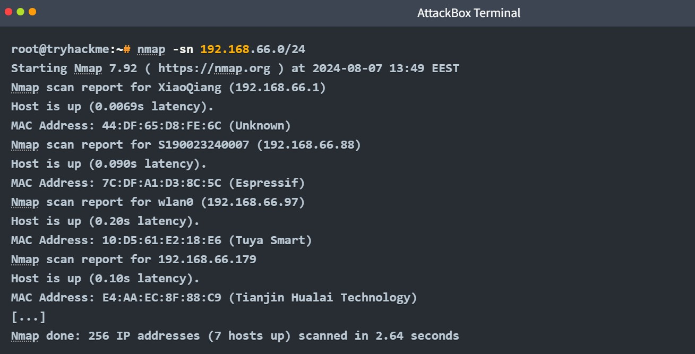 <br>

## Common Nmap Scan Options

| Option  | Explanation                                   |
|---------|-----------------------------------------------|
| `-sT`   | TCP Connect scan — completes the full three-way handshake |
| `-sS`   | TCP SYN scan — sends only the initial SYN packet (half-open scan) |
| `-sU`   | UDP scan — probes UDP ports                     |
| `-F`    | Fast mode — scans the 100 most common ports    |
| `-p[range]` | Specifies port range to scan (e.g., `-p-` scans all 65,535 ports) |

### Notes:

- **`-sS`** is often preferred for stealthier scans as it doesn’t complete the full TCP handshake.
- Using `-p` you can scan specific ports or entire ranges, for example:  
  ```bash
  nmap -p 22,80,443 target
  ```
or
- `nmap -p- target  # scans all ports from 1 to 65535`


#### Connect Scan

- The connect scan can be triggered using `-sT`. It tries to complete the TCP three-way handshake with every target TCP port. If the TCP port turns out to be open and Nmap connects successfully, Nmap will tear down the established connection.
- In the screenshot below, our scanning machine has the IP address `192.168.124.148` and the target system has TCP port 22 open and port 23 closed. In the part marked with 1, you can see how the TCP three-way handshake was completed and later torn down with a TCP RST-ACK packet by Nmap. The part marked with 2 shows a connection attempt to a closed port, and the target system responded with a TCP RST-ACK packet.

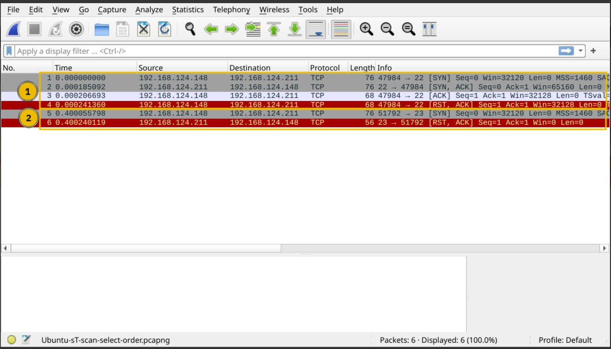 <br>

#### SYN Scan (Stealth)

- Unlike the connect scan, which tries to **connect** to the target TCP port, i.e., complete a three-way handshake, the SYN scan only executes the first step: it sends a TCP SYN packet. Consequently, the TCP three-way handshake is never completed. The advantage is that this is expected to lead to fewer logs as the connection is never established, and hence, it is considered a relatively stealthy scan. You can select the SYN scan using the **-sS** flag.
- In the screenshot below, we scan the same system with port 22 open. The part marked with 1 shows the listening service replying with a TCP SYN-ACK packet. However, Nmap responded with a TCP RST packet instead of completing the TCP three-way handshake. The part marked with 2 shows a TCP connection attempt to a closed port. In this case, the packet exchange is the same as in the connect scan.

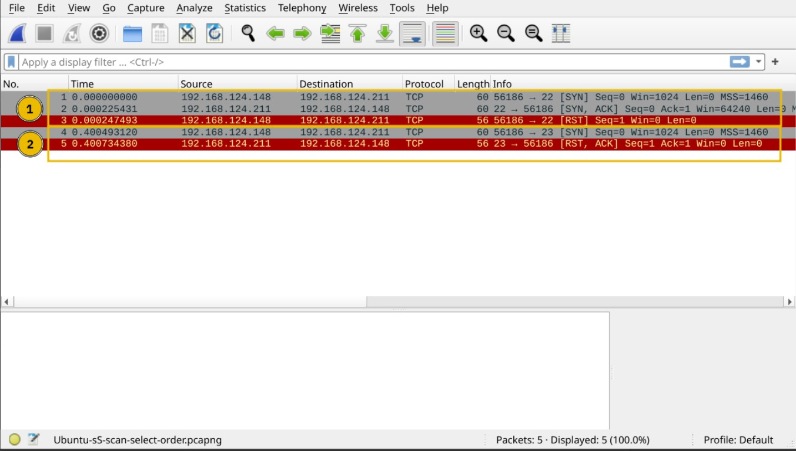 <br>

#### Scanning UDP Ports

- Although most services use TCP for communication, many use UDP. Examples include DNS, DHCP, NTP (Network Time Protocol), SNMP (Simple Network Management Protocol), and VoIP (Voice over IP). UDP does not require establishing a connection and tearing it down afterwards. Furthermore, it is very suitable for real-time communication, such as live broadcasts. All these are reasons to consider scanning for and discovering services listening on UDP ports.
- Nmap offers the option **-sU** to scan for UDP services. Because UDP is simpler than TCP, we expect the traffic to differ. The screenshot below shows several ICMP destination unreachable (port unreachable) responses as Nmap sends UDP packets to closed UDP ports.

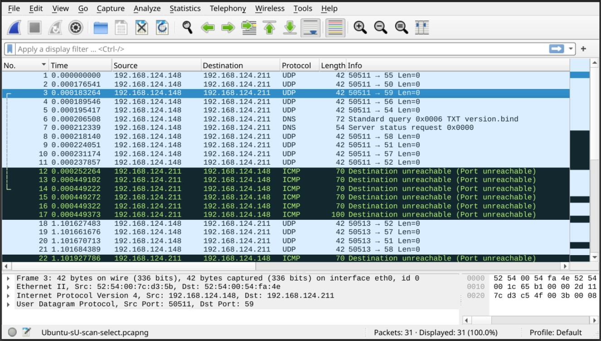 <br>

#### Limiting the Target Ports
Nmap scans the most common 1,000 ports by default. However, this might not be what you are looking for. Therefore, Nmap offers you a few more options.
- `-F` is for Fast mode, which scans the 100 most common ports (instead of the default 1000).
- `-p[range] `allows you to specify a range of ports to scan. For example, `-p10-1024` scans from port 10 to port 1024, while `-p-25` will scan all the ports between 1 and 25. Note that `-p-` scans all the ports and is equivalent to `-p1-65535` and is the best option if you want to be as thorough as possible.

---

## Version Detection: Extract More Information

| Option | Explanation                                                                 |
|--------|-----------------------------------------------------------------------------|
| `-O`   | Detect the operating system of the target                                   |
| `-sV`  | Service and version detection (identify software and versions on open ports)|
| `-A`   | Aggressive scan: enables OS detection, version detection, script scanning, and traceroute |
| `-Pn`  | Treat all hosts as online — useful if ping requests are blocked             |


#### `-O` — OS Detection

Attempts to identify the operating system running on the target:

```bash
sudo nmap -O 192.168.124.211
```

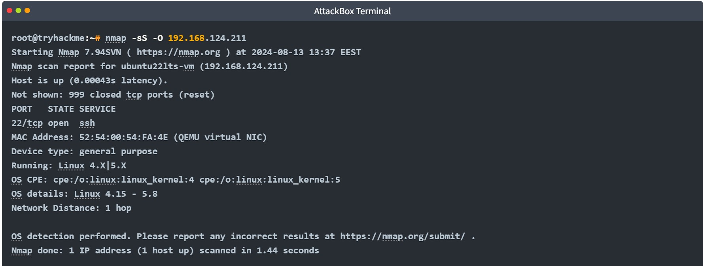 <br>

####  `-sV` — Service and Version Detection: 
- `sudo nmap -sV 192.168.1.10`
####  Service and Version Detection

You discovered several open ports and want to know what services are listening on them. `-sV` enables version detection. This is very convenient for gathering more information about your target with fewer keystrokes. The terminal output below shows an additional column called “VERSION”, indicating the detected SSH server version.

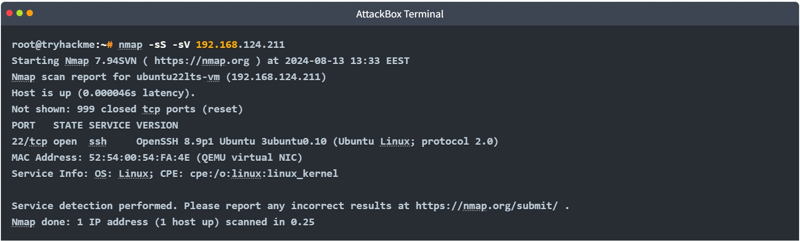 <br>

What if you can have both -O, -sV and some more in one option? That would be -A. This option enables OS detection, version scanning, and traceroute, among other things.

#### Forcing the Scan

When we run our port scan, such as using `-sS`, there is a possibility that the target host does not reply during the host discovery phase (e.g. a host doesn’t reply to ICMP requests). Consequently, Nmap will mark this host as down and won’t launch a port scan against it. We can ask Nmap to treat all hosts as online and port scan every host, including those that didn’t respond during the host discovery phase. This choice can be triggered by adding the `-Pn` option.

---

## Timing: How Fast is Fast

Running your scan at its normal speed might trigger an IDS or other security solutions. It is reasonable to control how fast a scan should go. Nmap gives you six timing templates, and the names say it all: paranoid (0), sneaky (1), polite (2), normal (3), aggressive (4), and insane (5). You can pick the timing template by its name or number. For example, you can add `-T0` (or `-T 0`) or `-T` paranoid to opt for the slowest timing.

In the Nmap scans below, we launch a SYN scan targeting the 100 most common TCP ports, `nmap -sS 10.10.147.48 -F`. We repeated the scan with different timings: T0, T1, T2, T3, and T4. In our lab setup, Nmap took different amounts of time to scan the 100 ports. The table below should give you an idea, but you will get different results depending on the network setup and target system.

#### Timing Levels Overview

| Timing Option | Name       | Approx. Duration       | Use Case                            |
|---------------|------------|------------------------|--------------------------------------|
| `-T0`         | Paranoid   | ~9.8 hours             | IDS evasion; extremely slow          |
| `-T1`         | Sneaky     | ~27.5 minutes          | Very slow; for stealthy scans        |
| `-T2`         | Polite     | ~40.5 seconds          | Light impact on network              |
| `-T3`         | Normal     | ~0.15 seconds (default)| Balanced speed and stealth           |
| `-T4`         | Aggressive | ~0.13 seconds          | Fast scans on stable networks        |

#### 🛠️ Example 

Add a timing option to your scan like this:

```bash
sudo nmap -sS -T4 192.168.1.10
```

In the following screenshots, we can see the time when Nmap sent the different packets. In this screenshot below, with the scan timing being T0, we can see that Nmap waited 5 minutes before moving to the next port.

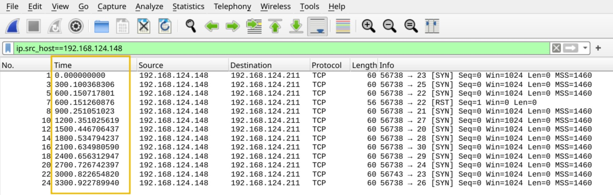 <br>

In the screenshot below, Nmap waited 15 seconds between every two ports when we set the timing to `T1`.

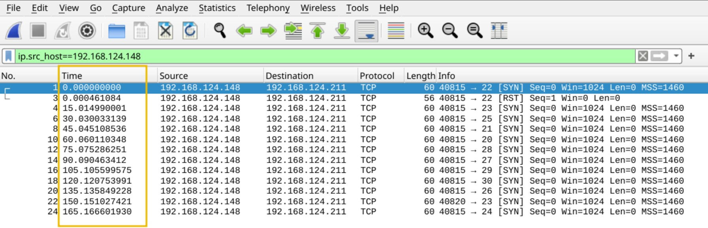 <br>

Then, the waiting dropped to 0.4 seconds for `T2` as shown below.

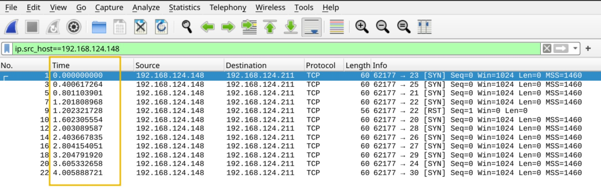 <br>

Finally, in the default case, `T3`, Nmap appeared to be running as fast as it could, as shown below. It is worth repeating that this would look different on a different lab setup. However, in this particular case, Nmap considered the connection to the target to be fast and reliable, as no packet loss was incurred.

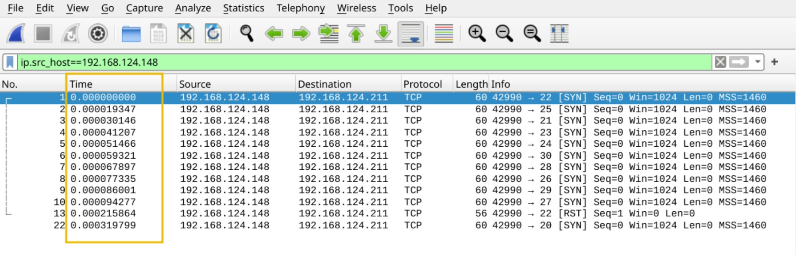 <br>

A second helpful option is the number of parallel service probes. The number of parallel probes can be controlled with `--min-parallelism <numprobes>` and `--max-parallelism <numprobes>`. These options can be used to set a minimum and maximum on the number of TCP and UDP port probes active simultaneously for a host group. By default, nmap will automatically control the number of parallel probes. If the network is performing poorly, i.e., dropping packets, the number of parallel probes might fall to one; furthermore, if the network performs flawlessly, the number of parallel probes can reach several hundred.

A similar helpful option is the `--min-rate <number>` and `--max-rate <number>`. As the names indicate, they can control the minimum and maximum rates at which nmap sends packets. The rate is provided as the number of packets per second. It is worth mentioning that the specified rate applies to the whole scan and not to a single host.

The last option we will cover in this task is `--host-timeout <time>`. This option specifies the maximum time you are willing to wait, and it is suitable for slow hosts or hosts with slow network connections.


| Option                              | Explanation                                                                 |
|-------------------------------------|-----------------------------------------------------------------------------|
| `-T<0-5>`                           | Timing template: `0 = paranoid`, `1 = sneaky`, `2 = polite`, `3 = normal`, `4 = aggressive`, `5 = insane` |
| `--min-parallelism <num>`          | Sets the minimum number of parallel probes Nmap should send                 |
| `--max-parallelism <num>`          | Sets the maximum number of parallel probes Nmap can send simultaneously     |
| `--min-rate <number>`              | Ensures Nmap sends at least this many packets per second                    |
| `--max-rate <number>`              | Limits the number of packets Nmap sends per second                          |
| `--host-timeout <time>`            | Aborts scanning a host if it takes longer than the specified time (e.g., 1m) |

---

## Verbosity and Debugging in Nmap

Understanding what Nmap is doing behind the scenes can help with troubleshooting, learning, or simply getting more insight during scans. Nmap provides both **verbosity** and **debugging** options to enhance your scan output.

#### 🔍 Verbosity Levels

| Option      | Explanation                                                            |
|-------------|------------------------------------------------------------------------|
| `-v`        | Standard verbosity (shows more info about the scan process)            |
| `-vv`, `-vvv` | Higher verbosity levels (even more detail)                            |
| `-v2`, `-v3`, `-v4` | Specify verbosity level directly (numeric form)                |

You can **increase verbosity live** during a scan by pressing the **`v` key** in the terminal.

####  Key Points
- `-v` is usually enough for most users.
- Use `-vv` or `-v2` if you want more scan progress and detail.
- Use `-d` (and increase to `-d9` if needed) for **low-level debugging** and troubleshooting.
- You can **press** `v` during an ongoing scan to increase verbosity live.

#### ✅ Example:

```bash
sudo nmap -sS -vv 192.168.1.10
```
Or using numeric level:
```bash
sudo nmap -sS -v2 192.168.1.10
```

### Debugging Levels
- `-d`: Enables debugging output
- `-dd`, `-ddd` or `-d1` to -`d9`:Higher levels of debug info
- Just like verbosity, you can control debugging levels using either repeated ds or numeric values: `sudo nmap -sS -d3 192.168.1.10` 
- ⚠️ `-d9` is the highest level and produces thousands of lines — use only if you're ready to sift through very detailed data.

### 💾 Saving Scan Reports in Nmap

When running scans, it's often important to **save the results** for later analysis, documentation, or reporting. Nmap offers several output formats to suit different needs.

#### 📁 Output Format Options

| Option           | Description                                                                 |
|------------------|-----------------------------------------------------------------------------|
| `-oN <filename>` | Save results in **normal (human-readable)** format                          |
| `-oX <filename>` | Save results in **XML** format (useful for automation or parsing)           |
| `-oG <filename>` | Save results in **grep-able** format (easy to process with `grep` or `awk`) |
| `-oA <basename>` | Save output in **all three** formats (adds `.nmap`, `.xml`, and `.gnmap`)   |

#### 🧪 Example: Save in All Formats

```bash
sudo nmap -sS 192.168.139.1 -oA gateway
```

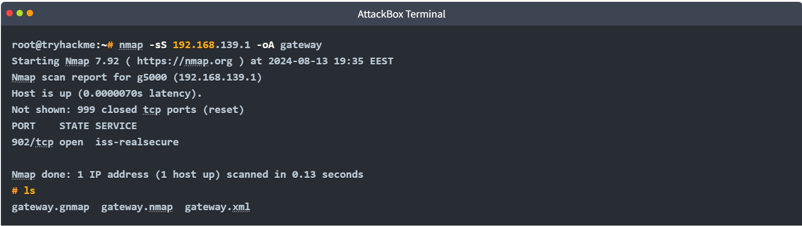 <br>

---


> **Note:** These notes document hands-on learning from the TryHackMe *Cybersecurity 101* path. The exercises cover fundamental cybersecurity topics, including Linux basics, networking concepts, and web technologies. This document is intended for personal learning, revision, and ethical skill development. All screenshots, commands, and actions are for educational purposes only.  
> — Compiled by moh4med404 | Curious Mind | Cybersecurity Enthusiast
