# Cybersecurity 101 
---
# Cryptography Basics

Cryptography's ultimate purpose is to ensure **secure communication** even when adversaries are present. Security here means protecting both the **confidentiality** and **integrity** of the communicated data.

#### What is Cryptography?

Cryptography is the practice and study of techniques designed for secure communication and data protection, assuming the presence of adversaries or third parties. These adversaries should **not** be able to:

- Disclose the contents of messages (confidentiality)  
- Alter the contents of messages (integrity)  

#### What Does Cryptography Protect?

- **Confidentiality**: Keeping information secret from unauthorized parties  
- **Integrity**: Ensuring data is not tampered with  
- **Authenticity**: Verifying the identity of communicating parties  

#### Everyday Uses of Cryptography

You likely use cryptography daily, often without realizing it. Examples include:

- **Logging in to TryHackMe**: Your credentials are encrypted before being sent, preventing interception by attackers.
- **SSH connections**: Secure shell (SSH) clients create encrypted tunnels to protect your remote sessions.
- **Online banking**: Your browser verifies the bank’s digital certificate to avoid man-in-the-middle attacks.
- **File downloads**: Hash functions confirm files are unaltered and authentic.

#### Compliance and Legal Requirements

Many industries require cryptography to protect sensitive data under legal regulations:

- **Payment Card Industry Data Security Standard (PCI DSS)**  
  Ensures credit card data is encrypted both **at rest** and **in transit** to protect cardholder information.

- **Medical Records Handling**  
  Healthcare providers must comply with various regional laws, such as:  
  - **HIPAA** (Health Insurance Portability and Accountability Act) – USA  
  - **HITECH** (Health Information Technology for Economic and Clinical Health) – USA  
  - **GDPR** (General Data Protection Regulation) – European Union  
  - **DPA** (Data Protection Act) – United Kingdom  

These laws highlight the essential role cryptography plays in securely handling sensitive information, often transparently to the end-user.


#### Summary

Cryptography is a fundamental, often invisible technology that safeguards privacy and trust across digital communications and data storage worldwide. Whether it's your daily online interactions or critical business systems, cryptography is the backbone of secure information exchange.

## Plaintext to Ciphertext

Let’s start with an illustration before introducing the key terms. We begin with the plaintext that we want to encrypt. The plaintext is the readable data; it can be anything from a simple “hello”, a cat photo, credit card information, or medical health records. From a cryptography perspective, these are all “plaintext” messages waiting to be encrypted. The plaintext is passed through the encryption function along with a proper key; the encryption function returns a ciphertext. The encryption function is part of the cipher; a cipher is an algorithm to convert a plaintext into a ciphertext and vice versa.

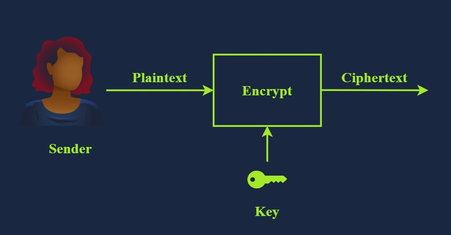 <br>

To recover the plaintext, we must pass the ciphertext along with the proper key via the decryption function, which would give us the original plaintext. This is shown in the illustration below.

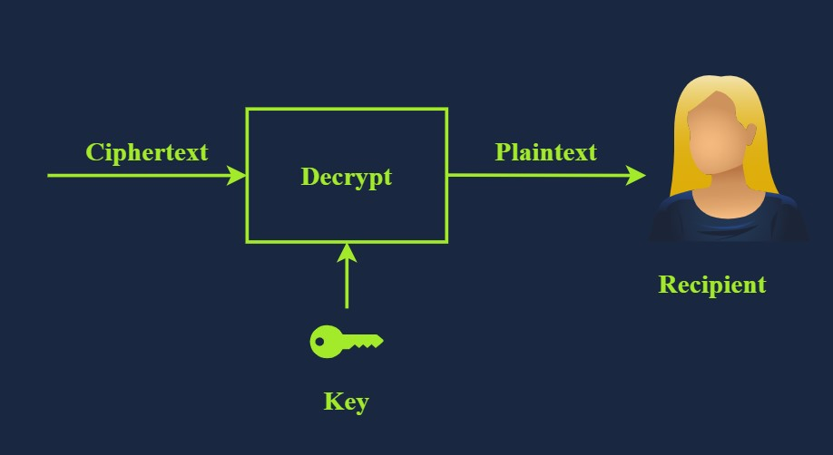 <br>

We have just introduced several new terms, and we need to learn them to understand any text about cryptography. The terms are listed below:

- **Plaintext** is the original, readable message or data before it’s encrypted. It can be a document, an image, a multimedia file, or any other binary data.
- **Ciphertext** is the scrambled, unreadable version of the message after encryption. Ideally, we cannot get any information about the original plaintext except its approximate size.
- **Cipher** is an algorithm or method to convert plaintext into ciphertext and back again. A cipher is usually developed by a mathematician.
- **Key** is a string of bits the cipher uses to encrypt or decrypt data. In general, the used cipher is public knowledge; however, the key must remain secret unless it is the public key in asymmetric encryption. We will visit asymmetric encryption in a later task.
- **Encryption** is the process of converting plaintext into ciphertext using a cipher and a key. Unlike the key, the choice of the cipher is disclosed.
- **Decryption** is the reverse process of encryption, converting ciphertext back into plaintext using a cipher and a key. Although the cipher would be public knowledge, recovering the plaintext without knowledge of the key should be impossible (infeasible).

## Historical Ciphers

Cryptography’s history is long and dates back to ancient Egypt in 1900 BCE. One of the simplest historical ciphers is the **Caesar Cipher**, which originated in the first century BCE. The concept is straightforward: **shift each letter by a fixed number** to encrypt the message.

### Example:

- **Plaintext:** TRYHACKME  
- **Key:** 3 (a right shift by 3)  
- **Cipher:** Caesar Cipher

We can easily figure out that `T` becomes `W`, `R` becomes `U`, `Y` becomes `B`, and so on. As you noticed, once we reach `Z`, we start all over, as shown in the figure below. Consequently, we get the ciphertext of `WUBKDFNPH`.

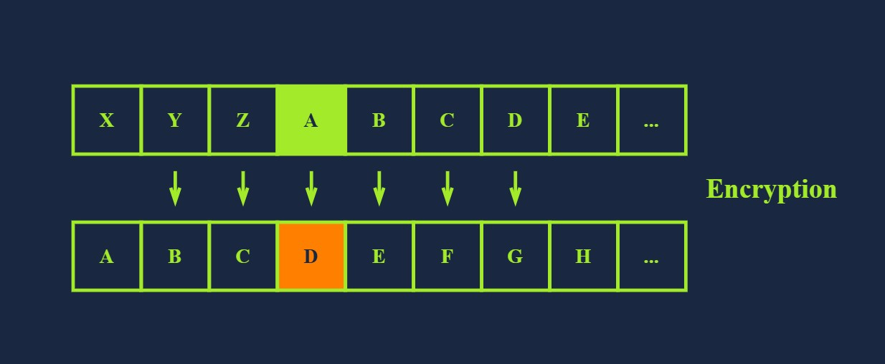 <br>

To decrypt, we need the following information:

- **Ciphertext**: WUBKDFNPH
- **Key**: 3
- **Cipher**: Caesar Cipher

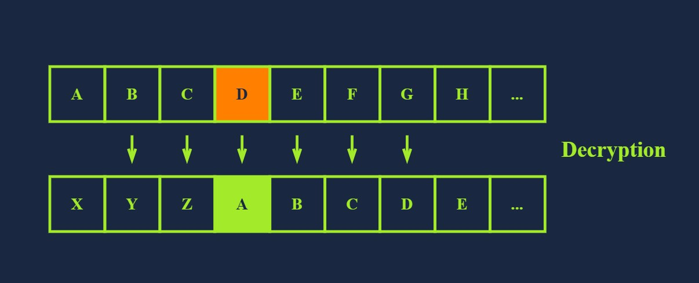 <br>

For encryption, we shift to the right by three; for decryption, we shift to the left by three and recover the original plaintext, as illustrated in the image above. However, if someone gives you a ciphertext and tells you that it was encrypted using Caesar Cipher, recovering the original text would be a trivial task as there are only 25 possible keys. The English alphabet is 26 letters, and shifting by 26 will keep the letter unchanged; hence, 25 valid keys for encryption with Caesar Cipher. The figure below shows how decryption will succeed by attempting all the possible keys; in this case, we recovered the original message with Key = 5. Consequently, by today’s standards, where the cipher is publicly known, Caesar Cipher is considered insecure.

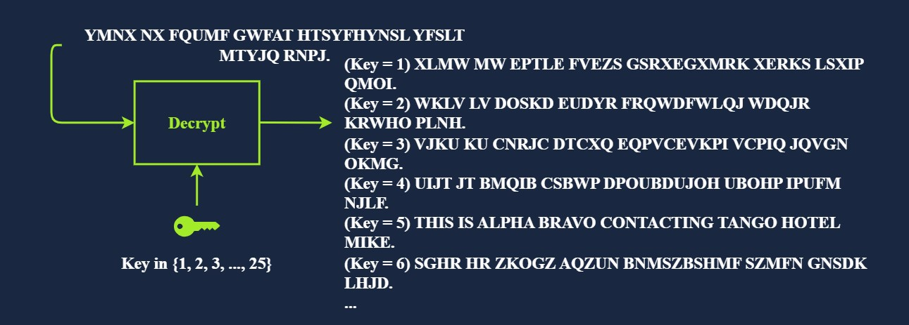 <br>

You would come across many more historical ciphers in movies and cryptography books. Examples include:

- The Vigenère cipher from the 16th century
- The Enigma machine from World War II
- The one-time pad from the Cold War

## Types of Encryption

The two main categories of encryption are **symmetric** and **asymmetric**.

#### Symmetric Encryption

**Symmetric encryption**, also known as **symmetric cryptography**, uses the same key to encrypt and decrypt the data, as shown in the figure below. Keeping the key secret is a must; it is also called **private key cryptography**. Furthermore, communicating the key to the intended parties can be challenging as it requires a secure communication channel. Maintaining the secrecy of the key can be a significant challenge, especially if there are many recipients. The problem becomes more severe in the presence of a powerful adversary; consider the threat of industrial espionage, for instance.

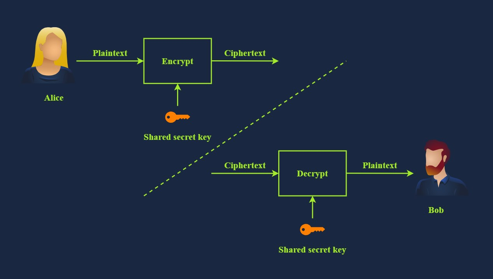 <br>

Consider the simple case where you created a password-protected document to share it with your colleague. You can easily email the encrypted document to your colleague, but most likely, you cannot email them the password. The reason is that anyone with access to their mailbox would access both the password-protected document and its password. Therefore, you need to think of a different way, i.e., channel, to share the password. Unless you think of a secure, accessible channel, one solution would be to meet in person and communicate the password to them.

Examples of symmetric encryption are DES (Data Encryption Standard), 3DES (Triple DES) and AES (Advanced Encryption Standard).

- **DES** was adopted as a standard in 1977 and uses a 56-bit key. With the advancement in computing power, in 1999, a DES key was successfully broken in less than 24 hours, motivating the shift to 3DES.
- **3DES** is DES applied three times; consequently, the key size is 168 bits, though the effective security is 112 bits. 3DES was more of an ad-hoc solution when DES was no longer considered secure. 3DES was deprecated in 2019 and should be replaced by AES; however, it may still be found in some legacy systems.
- **AES** was adopted as a standard in 2001. Its key size can be 128, 192, or 256 bits.

There are many more symmetric encryption ciphers used in various applications; however, they have not been adopted as standards.

#### Asymmetric Encryption

Unlike symmetric encryption, which uses the same key for encryption and decryption, **asymmetric encryption** uses a pair of keys, one to encrypt and the other to decrypt, as shown in the illustration below. To protect confidentiality, **asymmetric encryption** or asymmetric cryptography encrypts the data using the public key; hence, it is also called **public key cryptography**.

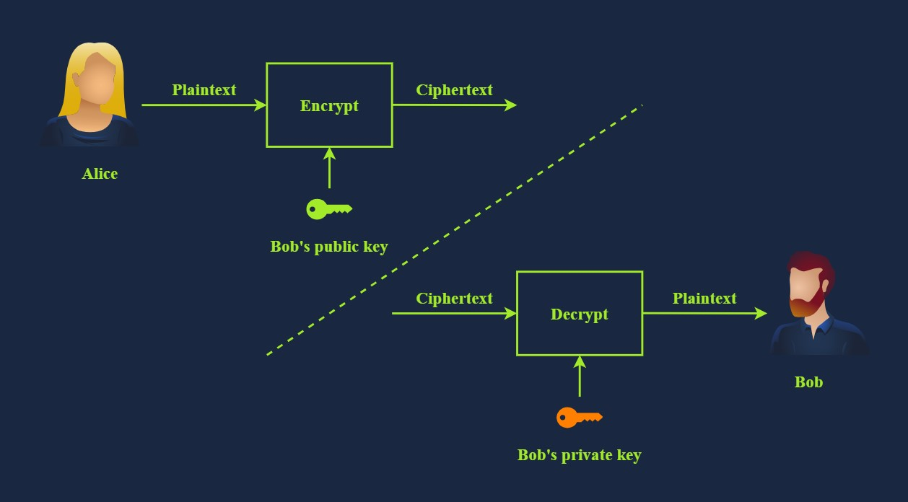 <br>

Examples are **RSA**, Diffie-Hellman, and Elliptic Curve cryptography (ECC). The two keys involved in the process are referred to as a **public key** and a **private key**. Data encrypted with the public key can be decrypted with the private key. Your private key needs to be kept private, hence the name.

Asymmetric encryption tends to be slower, and many asymmetric encryption ciphers use larger keys than symmetric encryption. For example, RSA uses 2048-bit, 3072-bit, and 4096-bit keys; 2048-bit is the recommended minimum key size. Diffie-Hellman also has a recommended minimum key size of 2048 bits but uses 3072-bit and 4096-bit keys for enhanced security. On the other hand, ECC can achieve equivalent security with shorter keys. For example, with a 256-bit key, ECC provides a level of security comparable to a 3072-bit RSA key.

Asymmetric encryption is based on a particular group of mathematical problems that are easy to compute in one direction but extremely difficult to reverse. In this context, extremely difficult means practically infeasible. For example, we can rely on a mathematical problem that would take a very long time, for example, millions of years, to solve using today’s technology.

We will visit various asymmetric encryption ciphers in the next room. For now, the important thing to note is that asymmetric encryption provides you with a public key that you share with everyone and a private key that you keep guarded and secret.

## Basic Math

The building blocks of modern cryptography lie in mathematics. To demonstrate some basic algorithms, we will cover two mathematical operations that are used in various algorithms:

- XOR Operation
- Modulo Operation

#### XOR Operation

XOR, short for “exclusive OR”, is a logical operation in binary arithmetic that plays a crucial role in various computing and cryptographic applications. In binary, XOR compares two bits and returns 1 if the bits are different and 0 if they are the same, as shown in the truth table below. This operation is often represented by the symbol ⊕ or ^.

| A | B | A ⊕ B |
|---|---|-------|
| 0 | 0 | 0     |
| 0 | 1 | 1     |
| 1 | 0 | 1     |
| 1 | 1 | 0     |

If this is the first time you work with a truth table, it is a table that shows all possible outcomes. The XOR truth table above states all four cases: 0 ⊕ 0 = 0, 0 ⊕ 1 = 1, 1 ⊕ 0 = 1, and 1 ⊕ 1 = 0.

Let’s consider an example where we want to apply XOR to the binary numbers 1010 and 1100. In this case, we perform the operation bit by bit: 1 ⊕ 1 = 0, 0 ⊕ 1 = 1, 1 ⊕ 0 = 1, and 0 ⊕ 0 = 0, resulting in 0110.

You may be wondering how XOR can play any role in cryptography. XOR has several interesting properties that make it useful in cryptography and error detection. One key property is that applying XOR to a value with itself results in 0, and applying XOR to any value with 0 leaves it unchanged. This means A ⊕ A = 0, and A ⊕ 0 = A for any binary value A. Additionally, XOR is commutative, i.e., A ⊕ B = B ⊕ A. And it is associative, i.e., (A ⊕ B) ⊕ C = A ⊕ (B ⊕ C).

Let’s see how we can make use of the above in cryptography. We will demonstrate how XOR can be used as a basic symmetric encryption algorithm. Consider the binary values P and K, where P is the plaintext, and K is the secret key. The ciphertext is C = P ⊕ K.

Now, if we know C and K, we can recover P. We start with C ⊕ K = (P ⊕ K) ⊕ K. But we know that (P ⊕ K) ⊕ K = P ⊕ (K ⊕ K) because XOR is associative. Furthermore, we know that K ⊕ K = 0; consequently, (P ⊕ K) ⊕ K = P ⊕ (K ⊕ K) = P ⊕ 0 = P. In other words, XOR served as a simple symmetric encryption algorithm. In practice, it is more complicated as we need a secret key as long as the plaintext.

#### Modulo Operation

Another mathematical operation we often encounter in cryptography is the modulo operator, commonly written as % or as mod. The modulo operator, X%Y, is the **remainder** when X is divided by Y. In our daily life calculations, we focus more on the result of division than on the remainder. The remainder plays a significant role in cryptography.

You need to work with large numbers when solving some cryptography exercises. If your calculator fails, we suggest using a programming language such as Python. Python has a built-in **int** type that can handle integers of arbitrary size and would automatically switch to larger types as needed. Many other programming languages have dedicated libraries for big integers. If you prefer to do your math online, consider [WolframAlpha](https://www.wolframalpha.com/)

Let’s consider a few examples.

- 25%5 = 0 because 25 divided by 5 is 5, with a remainder of 0, i.e., 25 = 5 × 5 + 0
- 23%6 = 5 because 23 divided by 6 is 3, with a remainder of 5, i.e., 23 = 3 × 6 + 5
- 23%7 = 2 because 23 divided by 7 is 3 with a remainder of 2, i.e., 23 = 3 × 7 + 2

An important thing to remember about modulo is that it’s not reversible. If we are given the equation x%5 = 4, infinite values of x would satisfy this equation.

The modulo operation always returns a non-negative result less than the divisor. This means that for any integer a and positive integer n, the result of a%n will always be in the range 0 to n − 1.

---

# Public Key Cryptography Basics

Consider this real-world scenario: you're meeting a business partner over coffee to discuss confidential business plans. Let’s break down the meeting from a **security** perspective:

#### ☑️ Authentication
You can see and hear the other person — confirming their identity.  
➡️ **Definition**: Verifying the identity of a party in communication.

#### 🧾 Authenticity
You know the words you're hearing are coming from your partner — not someone else.  
➡️ **Definition**: Confirming that the message originates from the claimed sender.

#### 🧱 Integrity
You hear everything as it was said — with no interference or changes.  
➡️ **Definition**: Ensuring that the data has not been tampered with.

#### 🔒 Confidentiality
You choose a quiet seat and speak softly so only your partner hears.  
➡️ **Definition**: Ensuring that only authorized parties can access the information.

Now, let’s translate this to a **cybersecurity** context.

When sending a message online (e.g., via an app or email), how do you ensure:

- 👤 **Authentication**: Are you sure you're talking to the right person?
- 🧾 **Authenticity**: Can you prove the sender is who they say they are?
- 🧱 **Integrity**: Has the message remained unchanged during transit?
- 🔒 **Confidentiality**: Can anyone else intercept or read it?

#### 🧠 How Cryptography Helps

Cryptography solves these problems using **mathematical techniques**:

- **Symmetric (Private Key) Cryptography**  
  - Primarily used for **confidentiality** (e.g., AES, DES).
  
- **Asymmetric (Public Key) Cryptography**  
  - Used for **authentication**, **authenticity**, and **integrity**  
  - Examples include RSA, ECC, and digital signatures.


### Common Use of Asymmetric Encryption

Exchanging keys for symmetric encryption is a widespread use of asymmetric cryptography. Asymmetric encryption is relatively slow compared to symmetric encryption; therefore, we rely on asymmetric encryption to negotiate and agree on symmetric encryption ciphers and keys.

But the question is, how do you agree on a key with the server without transmitting the key for people snooping to see?

**Analogy** Imagine you have a secret code for communicating and instructions for using the secret code. The question is how you can send these instructions to your friend without anyone else being able to read them. The answer is more straightforward than it seems; you could ask your friend for a lock. Only your friend has the key for this lock, and we’ll assume you have an indestructible box you can lock with it.

If you send the instructions in a locked box to your friend, they can unlock it once it reaches them and read the instructions. After that, you can communicate using the secret code without the risk of people snooping.

In this metaphor, the secret code represents a symmetric encryption cipher and key, the lock represents the server’s public key, and the key represents the server’s private key.

| Analogy       | Cryptographic System                   |
|---------------|----------------------------------------|
| Secret Code   | Symmetric Encryption Cipher and Key    |
| Lock          | Public Key                             |
| Lock’s Key    | Private Key                            |

Consequently, you would only need to use asymmetric cryptography once so that it won’t affect the speed, and then you can communicate privately using symmetric encryption.

### RSA

**RSA** is a public-key encryption algorithm that enables secure data transmission over insecure channels. With an insecure channel, we expect adversaries to eavesdrop on it.

#### The Math That Makes RSA Secure

RSA is based on the mathematically difficult problem of factoring a large number. Multiplying two large prime numbers is a straightforward operation; however, finding the factors of a huge number takes much more computing power.

It’s simple to multiply two prime numbers together even on paper, say 113 × 127 = 14351. Even for larger prime numbers, it would still be a feasible job, even by hand. Consider the following numeric example:

- Prime number 1: 982451653031
- Prime number 2: 169743212279
- Their product: 982451653031 × 169743212279 = 166764499494295486767649

On the other hand, it’s pretty tricky to determine what two prime numbers multiply together to make 14351 and even more challenging to find the factors of 166764499494295486767649.

In real-world examples, the prime numbers would be much bigger than the ones in this example. A computer can easily factorise 166764499494295486767649; however, it cannot factorise a number with more than 600 digits. And you would agree that the multiplication of the two huge prime numbers, each around 300 digits, would be easier than the factorisation of their product.


Let’s revisit encryption, decryption, and key usage in asymmetric encryption. The public key is known to all correspondents and is used for encryption, while the private key is protected and used for decryption, as shown in the figure below.

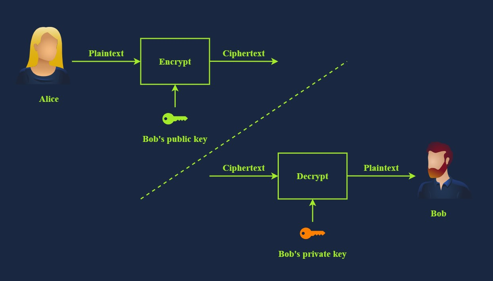 <br>

## Diffie-Hellman Key Exchange

**Key exchange** aims to establish a shared secret between two parties. It is a method that allows two parties to establish a shared secret over an insecure communication channel without requiring a pre-existing shared secret and without an observer being able to get this key. Consequently, this shared key can be used for symmetric encryption in subsequent communications.

Consider the following scenario. Alice and Bob want to talk securely. They want to establish a shared key for symmetric cryptography but don’t want to use asymmetric cryptography for the key exchange. This is where the Diffie-Hellman Key Exchange comes in.

Alice and Bob generate secrets independently; let’s call these secrets A and B. They also have some public common material; let’s call this C.

We need to make some assumptions. Firstly, whenever we combine secrets, they’re practically impossible to separate. Secondly, the order in which they’re combined doesn’t matter. Alice and Bob will combine their secrets with the common material to form AC and BC. They will then send these to each other and combine the received part with their secret to create two identical keys, both ABC. Now, they can use this key to communicate.

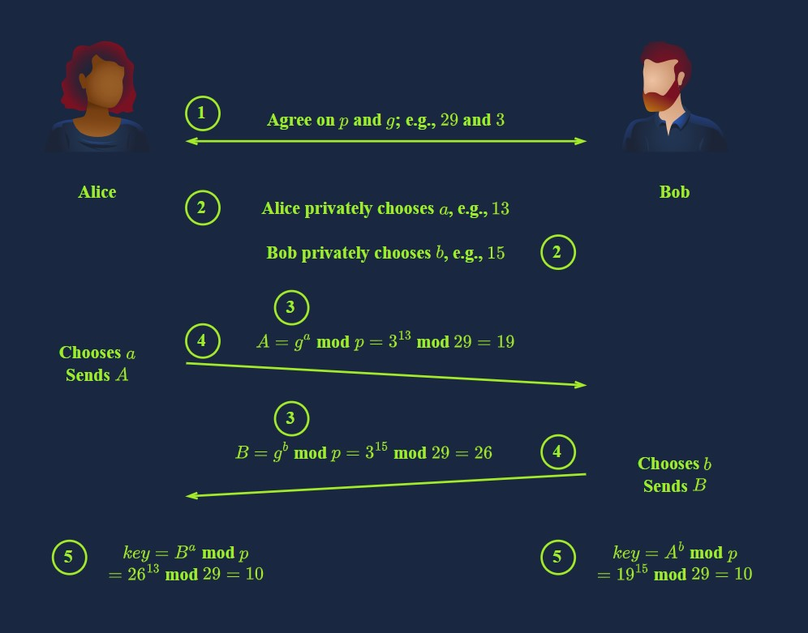 <br>

The chosen numbers are too small to provide any security, and in real-life applications, we would consider much bigger numbers.

Diffie-Hellman Key Exchange is often used alongside RSA public key cryptography. Diffie-Hellman is used for key agreement, while RSA is used for digital signatures, key transport, and authentication, among many others. For instance, RSA helps prove the identity of the person you’re talking to via digital signing, as you can confirm based on their public key. This would prevent someone from attacking the connection with a man-in-the-middle attack against Alice by pretending to be Bob. In brief, Diffie-Hellman and RSA are incorporated into many security protocols and standards to provide a comprehensive security solution.

## SSH

#### Authenticating the Server

When connecting to a server using an SSH client for the first time, you will typically see a confirmation prompt like the one below in your terminal:

```bash
ssh 10.10.244.173
```

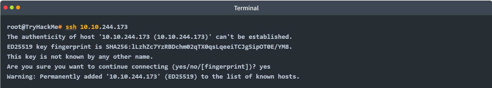 <br>

In the above interaction, the SSH client checks if it recognizes the server’s **public key fingerprint**. 

In this example, the algorithm used is **ED25519**, which is a public-key algorithm for generating and verifying digital signatures. Since the SSH client does not recognize this key, it prompts the user to confirm whether to continue connecting.

This warning exists because a **man-in-the-middle (MITM) attack** could be happening — where a malicious server intercepts the connection and impersonates the legitimate server.

To proceed safely, the user must **authenticate the server** by verifying its public key fingerprint. Once you respond with “yes,” the SSH client saves this public key signature for that host. Future connections will be silent unless the server presents a different key, which would trigger another warning.

#### Authenticating the Client

After verifying the server’s identity, the next step is for the client (you) to authenticate yourself.

##### Common Methods:
- **Username and Password**: Traditional method, similar to logging into a physical machine.  
  - However, passwords have inherent security weaknesses and are generally discouraged for SSH.

- **SSH Key Authentication**:  
  - Uses **public and private key pairs** to prove that the client is authorized.  
  - By default, SSH uses **RSA keys**, but other algorithms are also supported.  
  - Keys can be encrypted with a **passphrase** for added security.

##### Generating SSH Keys:
The tool commonly used to generate SSH key pairs is:

```bash
ssh-keygen
```

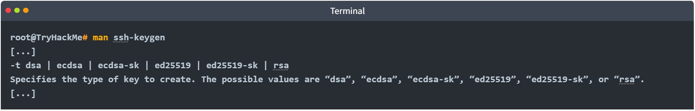 <br>

**Note:** At this stage, it's helpful to simply recognize the following key algorithm names:

| Algorithm      | Description                                                                                      |
|----------------|--------------------------------------------------------------------------------------------------|
| **DSA**        | Digital Signature Algorithm — designed specifically for digital signatures.                      |
| **ECDSA**      | Elliptic Curve DSA — a variant using elliptic curve cryptography for smaller keys with equal security. |
| **ECDSA-SK**   | ECDSA with Security Key — integrates hardware-based security keys for enhanced private key protection. |
| **Ed25519**    | A public-key signature system based on EdDSA (Edwards-curve Digital Signature Algorithm) using Curve25519. |
| **Ed25519-SK** | Ed25519 with Security Key — variant using hardware security keys similar to ECDSA-SK.           |

Let’s generate a key pair with the default options.

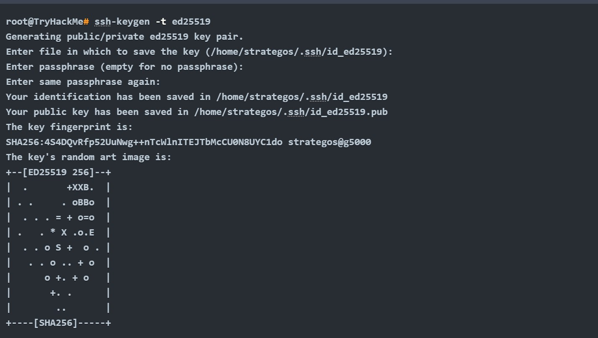 <br>

In the above example, we didn’t use a passphrase to show you the content of the private key. Let’s look at the generated public key, `id_ed25519.pub`, and the generated private key, `id_ed25519`.

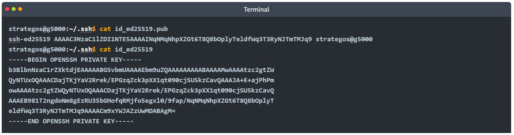 <br>

Note that the private key is shared above for demonstration purposes and was purged afterwards. Sharing a private key would be the most insecure act anyone can commit against their security. On another note, had we used `-t rsa`, the resulting keys would have been much longer.

### SSH Private Keys

- **Private keys** must be treated like passwords — **never share them**. They are called *private* for a reason.
- Anyone with your private key can access servers where the corresponding public key is authorized, **unless** the private key is protected with a **passphrase**.
- The **passphrase** decrypts the private key locally; it does **not** identify you to the server and is **never transmitted**.
- Tools like **John the Ripper** can attempt to crack encrypted SSH keys, so use a **strong passphrase** and keep your private key secure.

#### Best Practices for SSH Key Usage:
- Generate SSH key pairs **locally** on your machine.
- Copy the **public key** to the remote server using `ssh-copy-id` so the private key never leaves your local system.
- For temporary or CTF use, it’s less critical where keys are generated.

#### File Permissions:
- Private key files must have strict permissions, typically **600** (read/write for owner only).
- If permissions are too open, the SSH client will ignore the key with a warning.
- To specify a private key manually, use:
  
  ```bash
  ssh -i privateKeyFileName user@host
  ```

### Using SSH Keys to Get a “Better Shell”

- In CTFs, penetration tests, and red teaming, SSH keys provide a way to **upgrade a reverse shell** to a more stable and functional shell.
- This method assumes the target user has **SSH login enabled**.
- Typically, the `www-data` user does **not** allow SSH login, but regular users and root usually do.
- Adding your SSH public key to the target machine’s `authorized_keys` file acts as a **backdoor** for easier access.
- Benefits of using SSH keys for a shell include:
  - Avoiding common reverse shell issues like **unstable connections**.
  - Ability to use features like **Control-C** and **tab completion** that are often unavailable in basic reverse shells.


## Digital Signatures and Certificates

In the **“analogue” world**, you are asked to sign a paper now and then. When you visit the bank to open a savings account, you are most likely asked to sign several documents. When you want to create an account at the local library, you will be asked to fill out and sign the application. The purpose can vary depending on the situation. For example, it can confirm that you agree to the terms and conditions, authorise a transaction, or acknowledge receiving an item. In the **“digital” world**, you cannot use your signature, stamp or fingerprint; you need a digital signature.

#### What’s a Digital Signature?

Digital signatures provide a way to verify the authenticity and integrity of a digital message or document. Proving the authenticity of files means we know who created or modified them. Using asymmetric cryptography, you produce a signature with your private key, which can be verified using your public key. Only you should have access to your private key, which proves you signed the file. In many modern countries, digital and physical signatures have the same legal value.

The simplest form of digital signature is encrypting the document with your private key. If someone wants to verify this signature, they would decrypt it with your public key and check if the files match. This process is shown in the image below.

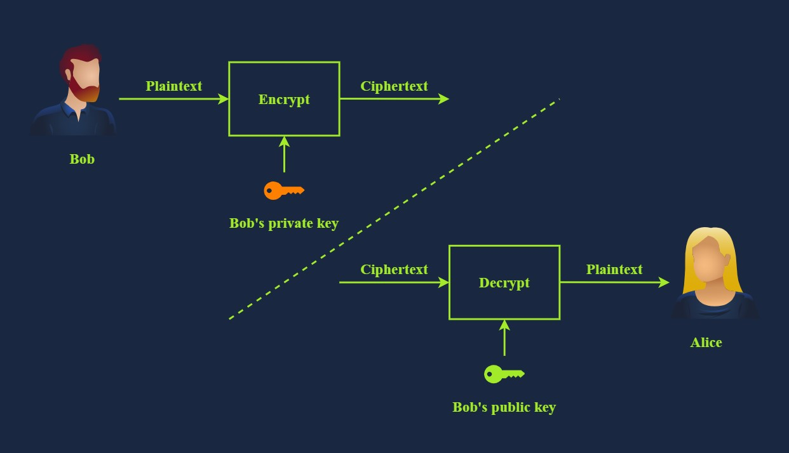 <br>

Some articles use terms such as electronic signature and digital signature interchangeably. They refer to pasting an image of a signature on top of a document. This approach does not prove the document’s integrity, as anyone can copy and paste an image.

In this task, we use the term digital signature to refer to signing a document using a private key or a certificate. This process is similar to the image shown above, where Bob encrypts a hash of his document and shares it with Alice, along with the original document. Alice can decrypt the encrypted hash and compare it with the hash of the file she received. This approach proves the document’s integrity, unlike pasting a fancy image of a signature. 

#### Certificates: Prove Who You Are!

Certificates are an essential application of public key cryptography, and they are also linked to digital signatures. A common place where they’re used is for HTTPS. How does your web browser know that the server you’re talking to is the real tryhackme.com?

The answer lies in certificates. The web server has a certificate that says it is the real tryhackme.com. The certificates have a chain of trust, starting with a root CA (Certificate Authority). From install time, your device, operating system, and web browser automatically trust various root CAs. Certificates are trusted only when the Root CAs say they trust the organisation that signed them. In a way, it is a chain; for example, the certificate is signed by an organisation, the organisation is trusted by a CA, and the CA is trusted by your browser. Therefore, your browser trusts the certificate. In general, there are long chains of trust. You can take a look at the certificate authorities trusted by Mozilla Firefox [here](https://wiki.mozilla.org/CA/Included_Certificates) and by Google Chrome [here](https://chromium.googlesource.com/chromium/src/+/main/net/data/ssl/chrome_root_store/root_store.md) Let’s say you have a website and want to use HTTPS. This step requires having a TLS certificate. You can get one from the various certificate authorities for an annual fee. Furthermore, you can get your own TLS certificates for domains you own using [Let's Encrypt](https://letsencrypt.org/)  for free. If you run a website, it’s worth setting up and switching to HTTPS, as any modern website would do.

## PGP and GPG

**PGP** stands for Pretty Good Privacy. It’s software that implements encryption for encrypting files, performing digital signing, and more. GnuPG or GPG is an open-source implementation of the OpenPGP standard.

GPG is commonly used in email to protect the confidentiality of the email messages. Furthermore, it can be used to sign an email message and confirm its integrity.

Below is an example of generating **GPG**. You are asked about the purpose of using gpg, whether signing only or signing and encrypting. Besides selecting the cryptographic algorithm, we needed to choose an expiry date for the generated key. Finally, we provided some information about us: our name, email address, and a comment usually about the purpose of this key.

```
gpg --full-gen-key
gpg (GnuPG) 2.4.4; Copyright (C) 2024 g10 Code GmbH
This is free software: you are free to change and redistribute it.
There is NO WARRANTY, to the extent permitted by law.

Please select what kind of key you want:
   (1) RSA and RSA
   (2) DSA and Elgamal
   (3) DSA (sign only)
   (4) RSA (sign only)
   (9) ECC (sign and encrypt) *default*
  (10) ECC (sign only)
  (14) Existing key from card
Your selection? 9
Please select which elliptic curve you want:
   (1) Curve 25519 *default*
   (4) NIST P-384
   (6) Brainpool P-256
Your selection? 1
Please specify how long the key should be valid.
         0 = key does not expire
      <n>  = key expires in n days
      <n>w = key expires in n weeks
      <n>m = key expires in n months
      <n>y = key expires in n years
Key is valid for? (0) 
Key does not expire at all
Is this correct? (y/N) y

GnuPG needs to construct a user ID to identify your key.

Real name: strategos
Email address: strategos@tryhackme.thm
[...]
pub   ed25519 2024-08-29 [SC]
      AB7E6AA87B6A8E0D159CA7FFE5E63DBD5F83D5ED
uid                      Strategos <strategos@tryhackme.thm>
sub   cv25519 2024-08-29 [E]

```

You may need to use GPG to decrypt files in CTFs. With PGP/GPG, private keys can be protected with passphrases in a similar way that we protect SSH private keys. If the key is passphrase protected, you can attempt to crack it using John the Ripper and **gpg2john**. The key provided in this task is not protected with a passphrase. The man page for GPG can be found online [here](https://www.gnupg.org/gph/de/manual/r1023.html)

---

# Hashing Basics

Consider the scenario where you just downloaded a 6 GB file and want to know whether the copy you downloaded is identical to the original file, bit for bit. How would you do that? Or if a good Samaritan handed you this 6 GB file on a USB memory drive, how can you be sure it is identical to the file you want to download?

The answer to both of the above questions lies in comparing the hash values of the two files; if two hash values are equal, you can say with very high certainty that the two files are identical. But what is a hash value?

A hash value is a fixed-size string or characters that is computed by a hash function. A hash function takes an input of an arbitrary size and returns an output of fixed length, i.e., a hash value. We will cover various exciting and clever uses of hash functions and values in this room.

### What is a Hash Function?

Hash functions are different from encryption. There is no key, and it’s meant to be impossible (or computationally impractical) to go from the output back to the input.

A hash function takes some input data of any size and creates a summary or digest of that data. The output has a fixed size. It’s hard to predict the output for any input and vice versa. Good hashing algorithms will be relatively fast to compute and prohibitively slow to reverse, i.e., go from the output and determine the input. Any slight change in the input data, even a single bit, should cause a significant change in the output.

Let’s check an example. In the terminal below, we can see two files; the first contains the letter T, while the second contains the letter U. If you check T and U in an ASCII table or using hexdump, you will notice that the two letters differ by a single bit.

- The letter T is 54 in hexadecimal, i.e., 01010100 in binary.  
- The letter U is 55 in hexadecimal, i.e., 01010101 in binary.

Consequently, the following two files differ by a single bit. However, if we compare their MD5 (Message-Digest Algorithm 5) hashes, their SHA1 (Secure Hash Algorithm 1) hashes, or their SHA-256 (Secure Hash Algorithm 256) hashes, we will notice that they are entirely different. We recommend that you try the commands below yourself. The files are located in `~/Hashing-Basics/Task-2/`.

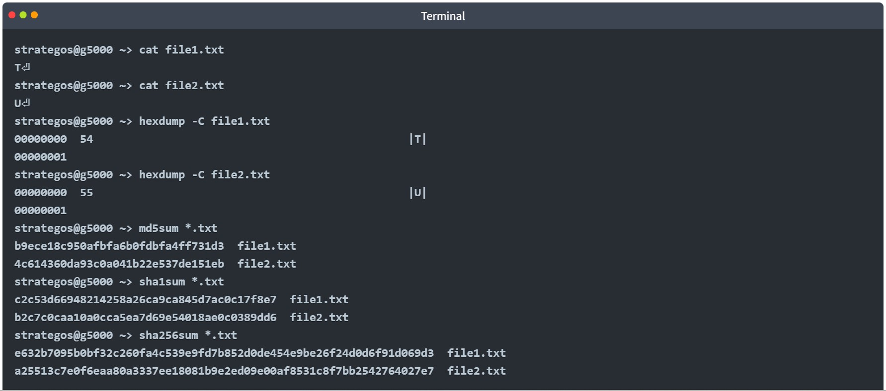 <br>

The output of a hash function is typically raw bytes, which are then encoded. Common encodings are base64 or hexadecimal. **md5sum**, **sha1sum**, **sha256sum**, and **sha512sum** produce their outputs in hexadecimal format. Remember that hexadecimal format prints each raw byte as two hexadecimal digits.

#### Why Is Hashing Important?

Hashing is a key part of online security that we use all the time, often without even realizing it. Like other cryptographic tools, it works in the background to protect data, especially when it comes to keeping passwords safe and verifying data integrity.

Take logging into TryHackMe as an example: instead of storing your actual password, the server stores a hash of it. When you log in, your password is hashed again and compared to the saved hash. If they match, you're authenticated. This same process happens when you log in to your own computer. So, although you may not directly see it, hashing is helping protect your information every day.

#### What Is a Hash Collision?

A **hash collision** happens when two different pieces of data produce the same hash result. Good hash functions are built to make this extremely unlikely and to stop attackers from being able to create such a situation on purpose.

Still, there are far more possible inputs than outputs in any hash function. Since hash outputs have a fixed size, and input sizes can vary, it's mathematically guaranteed that at some point two different inputs will share the same output — this is known as the **pigeonhole principle**.

MD5 and SHA1 have been attacked and are now considered insecure due to the ability to engineer hash collisions. However, no attack has yet given a collision in both algorithms simultaneously, so if you compare the MD5 and SHA1 hash, you will see that they’re different. You can view the MD5 collision example on the [MD5 Collision Demo](https://www.mscs.dal.ca/~selinger/md5collision/) page; furthermore, you can read the details of the SHA1 collision attack at [Shattered](https://shattered.io/) Due to these, you shouldn’t trust either algorithm for hashing passwords or data.

### Insecure Password Storage for Authentication

#### Common Uses of Hashing in Cyber Security

Hashing is widely used in cyber security, but in this context, we’ll focus on two main areas:

- **Password Storage**: Ensuring passwords are safely stored for authentication purposes.
- **Data Integrity**: Verifying that data hasn’t been altered.

> Note: This doesn’t apply to password managers. Password managers **must** retrieve your actual password, whereas authentication systems only need to confirm that you **know** it — there's no need to recover the original password.

#### Insecure Password Storage in the Real World

Almost all web applications need to verify a user's password. But how they store those passwords makes a huge difference. Storing passwords in plain text is a **severe security risk**.

You’ve likely seen news about database breaches where passwords were exposed. Since many people reuse passwords across platforms — including sensitive accounts like email or banking — a breach on one site can put all of a user’s accounts at risk.

Let’s explore **three poor password storage practices** that have led to serious security issues:

##### 1. **Plaintext Password Storage**

Some companies store passwords exactly as users enter them — no hashing or encryption. If the database is leaked, **every password is exposed immediately**.

A famous example is the **RockYou data breach**. RockYou developed social media widgets and made the critical mistake of storing user passwords in plaintext. When their database was breached, more than **14 million passwords** were leaked.

This leak became the basis for the well-known password list used in penetration testing today:  
📁 **`rockyou.txt`**, found at: `/usr/share/wordlists/rockyou.txt` (on Kali Linux and other pentesting distros)

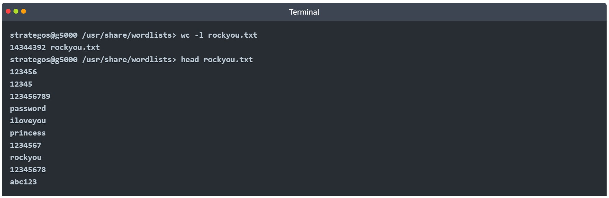 <br>

### 🔐 Using Hashing to Store Passwords

Instead of saving actual user passwords, systems can store a **hash** of each password using a **secure hashing function**. This improves security because:

- The **original password is never stored**.
- If attackers access the database, they only get **hashed values**, not the plaintext passwords.
- Each password must be **cracked individually** by the attacker.

#### ⚠️ Problem: Identical Passwords → Identical Hashes

Hash functions are deterministic:
> The same input always produces the same output.

So if two users have the same password, their stored hashes will be identical. That leads to two security issues:

1. Cracking the hash for one user exposes the password for any other user with the same hash.
2. Attackers can use **rainbow tables** to look up the original password from a known hash.

#### 🌈 What Is a Rainbow Table?

A **rainbow table** is a precomputed lookup table mapping common passwords to their hash values. It lets attackers **quickly reverse-engineer** a password by searching for its hash.

Here’s an example of what a rainbow table might look like:

| Hash                                 | Password     |
|--------------------------------------|--------------|
| 02c75fb22c75b23dc963c7eb91a062cc     | zxcvbnm      |
| b0baee9d279d34fa1dfd71aadb908c3f     | 11111        |
| c44a471bd78cc6c2fea32b9fe028d30a     | asdfghjkl    |
| d0199f51d2728db6011945145a1b607a     | basketball   |
| dcddb75469b4b4875094e14561e573d8     | 000000       |
| e10adc3949ba59abbe56e057f20f883e     | 123456       |
| e19d5cd5af0378da05f63f891c7467af     | abcd1234     |
| e99a18c428cb38d5f260853678922e03     | abc123       |
| fcea920f7412b5da7be0cf42b8c93759     | 1234567      |
| 4c5923b6a6fac7b7355f53bfe2b8f8c1     | inS3CyourP4$$|

> 💡 While powerful, rainbow tables are less effective against salted hashes — which we’ll explore next.

Websites like [CrackStation](https://crackstation.net/) and [Hashes.com](https://hashes.com/en/decrypt/hash) internally use massive rainbow tables to provide fast password cracking for hashes without salts. Doing a lookup in a sorted list of hashes is quicker than trying to crack the hash.

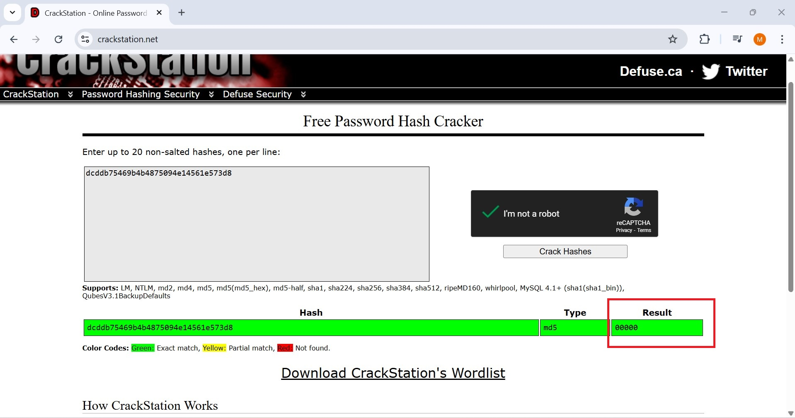 <br>


### Recognising Password Hashes

From the cyber defensive security perspective, we covered how to store passwords securely for authentication systems. Let’s tackle this from the offensive security perspective; if we start with a hash, how can we recognise its type, eventually crack it, and recover the original password?

Automated hash recognition tools such as [hashID](https://pypi.org/project/hashID/) exist but are unreliable for many formats. For hashes that have a prefix, the tools are reliable. Use a healthy combination of context and tools.  If you find the hash in a web application database, it’s more likely to be MD5 than NTLM (NT LAN Manager). Automated hash recognition tools often get these hash types mixed up, highlighting the importance of learning yourself.

#### Linux Passwords

On Linux, password hashes are stored in `/etc/shadow`, which is normally only readable by root. They used to be stored in `/etc/passwd,` which was readable by everyone.

The **shadow** file contains the password information. Each line contains nine fields, separated by colons (`:`). The first two fields are the login name and the encrypted password. More information about the other fields can be found by executing `man 5 shadow` on a Linux system.

The encrypted password field contains the hashed passphrase with four components: prefix (algorithm id), options (parameters), salt, and hash. It is saved in the format `$prefix$options$salt$hash`. The prefix makes it easy to recognise Unix and Linux-style passwords; it specifies the hashing algorithm used to generate the hash.

Here’s a quick table of some of the most common Unix-style password prefixes you might encounter. They are listed in the order of decreasing strength. You can read more about them by checking the man page with `man 5 crypt`.

| Prefix         | Algorithm                                                                                                           |
|----------------|---------------------------------------------------------------------------------------------------------------------|
| `$y$`            | yescrypt is a scalable hashing scheme and is the default and recommended choice in new systems                    |
| `$gy$`           | gost-yescrypt uses the GOST R 34.11-2012 hash function and the yescrypt hashing method                             |
| `$7$`            | scrypt is a password-based key derivation function                                                                 |
| `$2b$`, `$2y$`, `$2a$`, `$2x$` | bcrypt is a hash based on the Blowfish block cipher originally developed for OpenBSD but supported on a recent version of FreeBSD, NetBSD, Solaris 10 and newer, and several Linux distributions |
| `$6$`            | sha512crypt is a hash based on SHA-2 with 512-bit output originally developed for GNU libc and commonly used on (older) Linux systems |
| `$md5`           | SunMD5 is a hash based on the MD5 algorithm originally developed for Solaris                                       |
| `$1$`            | md5crypt is a hash based on the MD5 algorithm originally developed for FreeBSD                                     |


#### Modern Linux Example

Consider the following line from a modern Linux system’s `shadow` password file.

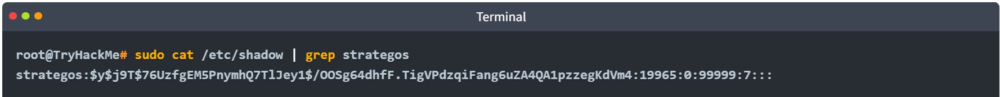 <br>

The fields are separated by colons. The important ones are the username and the hash algorithm, salt, and hash value. The second field has the format `$prefix$options$salt$hash`.

In the example above, we have four parts separated by `$`:

- `y` indicates the hash algorithm used, **yescrypt**
- `j9T` is a parameter passed to the algorithm
- `76UzfgEM5PnymhQ7TlJey1` is the salt used
- `/OOSg64dhfF.TigVPdzqiFang6uZA4QA1pzzegKdVm4` is the hash value

#### MS Windows Passwords

MS Windows passwords are hashed using NTLM, a variant of MD4. They’re visually identical to MD4 and MD5 hashes, so it’s very important to use context to determine the hash type.

On MS Windows, password hashes are stored in the SAM (Security Accounts Manager). MS Windows tries to prevent normal users from dumping them, but tools like mimikatz exist to circumvent MS Windows security. Notably, the hashes found there are split into NT hashes and LM hashes.

A great place to find more hash formats and password prefixes is the [Hashcat Example Hashes](https://hashcat.net/wiki/doku.php?id=example_hashes) page. For other hash types, you’ll typically need to check the length or encoding or even conduct some research into the application that generated them. Never underestimate the power of research.

### Password Cracking

We’ve already mentioned rainbow tables as a method to crack hashes that don’t use a salt, but what if there’s a salt involved?

You can’t “decrypt” password hashes. They’re not encrypted. You have to crack the hashes by hashing many different inputs (such as `rockyou.txt` as it covers many possible passwords), potentially adding the salt if there is one and comparing it to the target hash. Once it matches, you know what the password was. Tools like [Hashcat](https://hashcat.net/hashcat/) and [John the Ripper](https://www.openwall.com/john/) are commonly used for these purposes. 

#### Cracking Passwords with GPUs

Modern GPUs (Graphics Processing Units) have thousands of cores. They are specialised in digital image processing and accelerating computer graphics. Although they can’t do the same sort of work that a CPU can, they are very good at some mathematical calculations involved in hash functions. You can use a graphics card to crack many hash types quickly. Some hashing algorithms, such as Bcrypt, are designed so that hashing on a GPU does not provide any speed improvement over using a CPU; this helps them resist cracking.

#### Cracking on VMs?

It’s worth mentioning that VMs (Virtual Machines) normally don’t have access to the host’s graphics card(s). Depending on the virtualisation software you are using, you can set this up, but it is cumbersome. Furthermore, performance degradation occurs as you use the CPU from a virtualised OS, and when your purpose is to crack a hash, you need every extra CPU cycle.

If you want to run [Hashcat](https://hashcat.net/hashcat/),  it’s best to run it on your host to make the most of your GPU, if available. If you prefer MS Windows, you are in luck; MS Windows builds are available on the website, and you can run it from PowerShell. You can get Hashcat working with OpenCL in a VM, but the speeds will likely be worse than cracking on your host. 

[John the Ripper](https://www.openwall.com/john/) uses CPU by default and works in a VM out of the box, although you may get better speeds running it on the host OS to avoid any virtualisation overhead and make the most of your CPU cores and threads.

#### Time to Crack Some Hashes

I’ll provide the hashes. Crack them. You can choose how. You’ll need to use online tools,[Hashcat](https://hashcat.net/hashcat/), or [John the Ripper](https://www.openwall.com/john/). Although you can use [online rainbow tables](https://hashes.com/en/decrypt/hash)  to solve the following, we strongly advise against doing that as this will restrict your learning experience. For the first three questions, using `hashcat` along with `rockyou.txt` is enough to find the answers.  

`hashcat -m <hash_type> -a <attack_mode> hashfile wordlist`, where:

- `-m <hash_type>` specifies the hash-type in numeric format. For example, `-m 1000` is for NTLM. Check the official documentation (`man hashcat`) and example page to find the hash type code to use.
- `-a <attack_mode>` specifies the attack-mode. For example, `-a 0` is for straight, i.e., trying one password from the wordlist after the other.
- `hashfile` is the file containing the hash you want to crack.
- `wordlist` is the security word list you want to use in your attack.

For example,  
`hashcat -m 3200 -a 0 hash.txt /usr/share/wordlists/rockyou.txt` will treat the hash as Bcrypt and try the passwords in the rockyou.txt file.

### Hashing for Integrity Checking

Hashing can be used to check that files haven’t been changed. If you put the same data in, you always get the same data out. Even if a single bit changes, the hash will change significantly, as demonstrated in Task 2. This means you can use it to check that files haven’t been modified or to ensure that the file you downloaded is identical to the file on the web server. The text file listed below shows the SHA256 hash of two Fedora Workstation ISO files. If running `sha256sum` on the file you downloaded returned the same hash listed in this signed file, you can be confident that your file is identical to the official one.

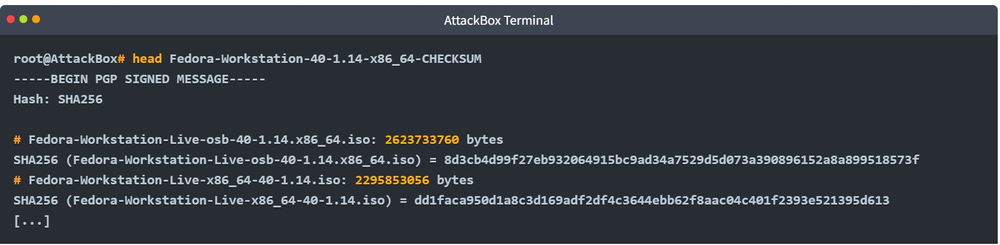 <br>

You can also use hashing to find duplicate files; if two documents have the same hash, they are the same document. This is very convenient for finding and deleting duplicate files.

#### HMACs

**HMAC (Keyed-Hash Message Authentication Code)** is a type of message authentication code (MAC) that uses a cryptographic hash function in combination with a secret key to verify the authenticity and integrity of data.

An HMAC can be used to ensure that the person who created the HMAC is who they say they are, i.e., authenticity is confirmed; moreover, it proves that the message hasn’t been modified or corrupted, i.e., integrity is maintained. This is achieved through the use of a secret key to prove authenticity and a hashing algorithm to produce a hash and prove integrity.

The following steps give you a fair idea of how HMAC works.

1. The secret key is padded to the block size of the hash function.
2. The padded key is XORed with a constant (usually a block of zeros or ones).
3. The message is hashed using the hash function with the XORed key.
4. The result from Step 3 is then hashed again with the same hash function but using the padded key XORed with another constant.
5. The final output is the HMAC value, typically a fixed-size string.

The illustration below should clarify the above steps.

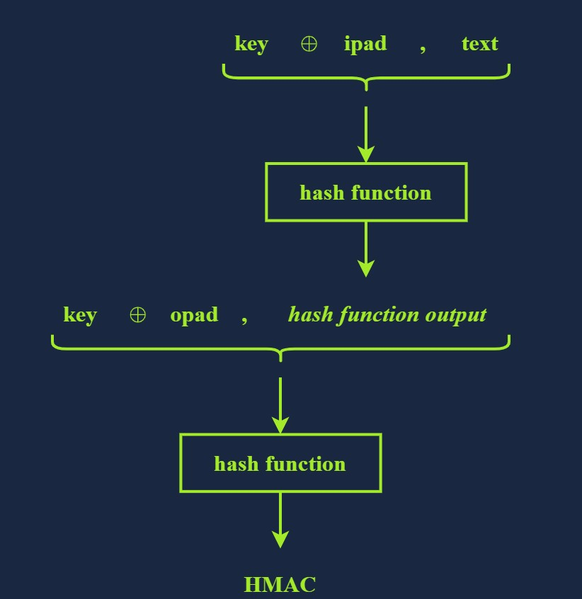 <br>

Technically speaking, the HMAC function is calculated using the following expression: HMAC(K,M) = H((K⊕opad)||H((K⊕ipad)||M)) **Note** that M and K represent the message and the key, respectively.

---
> **Note:** These notes document hands-on learning from the TryHackMe *Cybersecurity 101* path. The exercises cover fundamental cybersecurity topics, including Linux basics, networking concepts, and web technologies. This document is intended for personal learning, revision, and ethical skill development. All screenshots, commands, and actions are for educational purposes only.  
> — Compiled by moh4med404 | Curious Mind | Cybersecurity Enthusiast