# Cybersecurity 101 
---
# Metasploit: Introduction 

Metasploit is the most widely used exploitation framework. Metasploit is a powerful tool that can support all phases of a penetration testing engagement, from information gathering to post-exploitation.

Metasploit has two main versions:
1. **Metasploit Pro:** The commercial version that facilitates the automation and management of tasks. This version has a graphical user interface (GUI).
2. **Metasploit Framework:** The open-source version that works from the command line.

The Metasploit Framework is a set of tools that allow information gathering, scanning, exploitation, exploit development, post-exploitation, and more. While the primary usage of the Metasploit Framework focuses on the penetration testing domain, it is also useful for vulnerability research and exploit development.

The main components of the Metasploit Framework can be summarized as follows;

- **msfconsole**: The main command-line interface.
- **Modules**: supporting modules such as exploits, scanners, payloads, etc.
- **Tools**: Stand-alone tools that will help vulnerability research, vulnerability assessment, or penetration testing. Some of these tools are msfvenom, pattern_create and pattern_offset. We will cover msfvenom within this module, but pattern_create and pattern_offset are tools useful in exploit development which is beyond the scope of this module.

### Main Components of Metasploit

When using the Metasploit Framework, your main point of interaction is the Metasploit console, which you can open by typing `msfconsole` in the AttackBox terminal. This console serves as the central interface where you access and use different components, known as modules. Each module is designed for a specific function, such as identifying vulnerabilities, exploiting weaknesses, or attempting brute-force logins.

Before exploring how modules work, it's important to understand a few key terms:

- **Exploit:** A script or method used to take advantage of a known weakness in a system.  
- **Vulnerability:** A flaw in a system’s design, code, or logic that can be abused by an attacker to gain unauthorized access or leak sensitive data.  
- **Payload:** This is the part of the attack that runs on the target system after a vulnerability has been successfully exploited. It carries out the intended action, such as opening a reverse shell or collecting data.

Modules and categories under each one are listed below. These are given for reference purposes, but you will interact with them through the Metasploit console (msfconsole).

#### Auxiliary

Any supporting module, such as scanners, crawlers and fuzzers, can be found here.

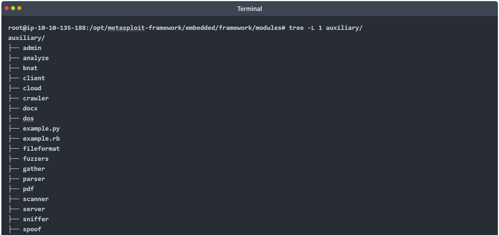  

#### Encoders

Encoders will allow you to encode the exploit and payload in the hope that a signature-based antivirus solution may miss them.

Signature-based antivirus and security solutions have a database of known threats. They detect threats by comparing suspicious files to this database and raise an alert if there is a match. Thus encoders can have a limited success rate as antivirus solutions can perform additional checks.

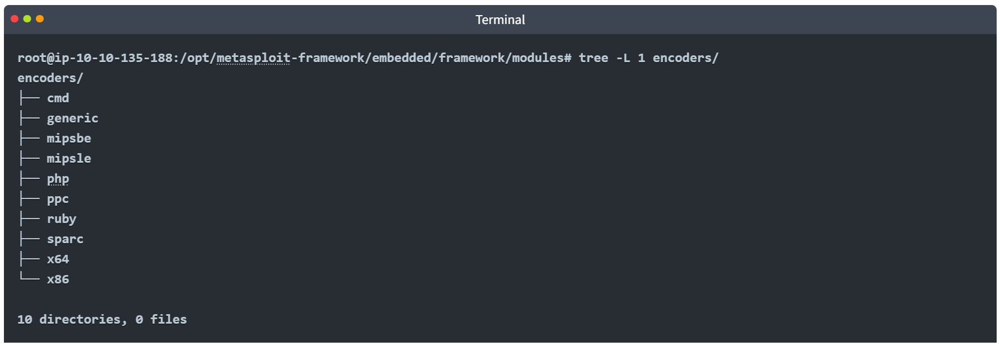  

#### Evasion

While encoders will encode the payload, they should not be considered a direct attempt to evade antivirus software. On the other hand, “evasion” modules will try that, with more or less success.

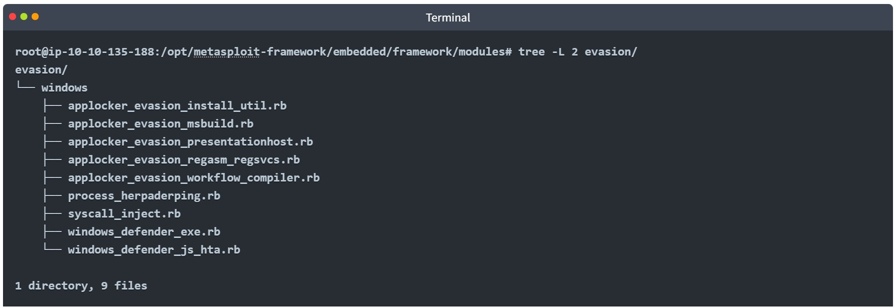  

#### xploits

Exploits, neatly organized by target system.

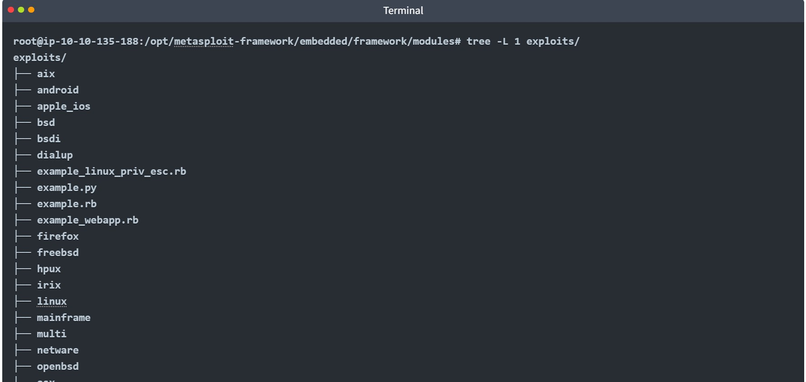  

#### NOPs

NOPs (No OPeration) do nothing, literally. They are represented in the Intel x86 CPU family with 0x90, following which the CPU will do nothing for one cycle. They are often used as a buffer to achieve consistent payload sizes.

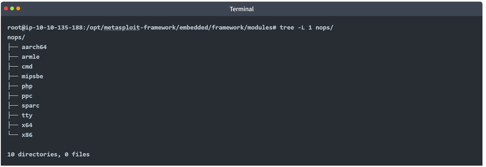  

#### Payloads

Payloads are codes that will run on the target system.

Exploits will leverage a vulnerability on the target system, but to achieve the desired result, we will need a payload. Examples could be; getting a shell, loading a malware or backdoor to the target system, running a command, or launching calc.exe as a proof of concept to add to the penetration test report. Starting the calculator on the target system remotely by launching the calc.exe application is a benign way to show that we can run commands on the target system.

Running command on the target system is already an important step but having an interactive connection that allows you to type commands that will be executed on the target system is better. Such an interactive command line is called a "shell". Metasploit offers the ability to send different payloads that can open shells on the target system.

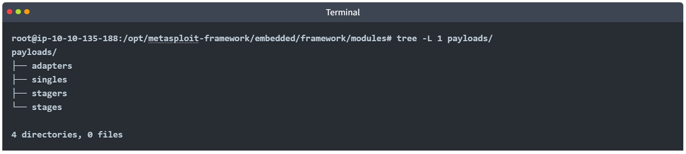  

You will see four different directories under payloads: adapters, singles, stagers and stages.

- **Adapters**: An adapter wraps single payloads to convert them into different formats. For example, a normal single payload can be wrapped inside a Powershell adapter, which will make a single powershell command that will execute the payload.
- **Singles**: Self-contained payloads (add user, launch notepad.exe, etc.) that do not need to download an additional component to run.
- **Stagers**: Responsible for setting up a connection channel between Metasploit and the target system. Useful when working with staged payloads. “Staged payloads” will first upload a stager on the target system then download the rest of the payload (stage). This provides some advantages as the initial size of the payload will be relatively small compared to the full payload sent at once.
- **Stages**: Downloaded by the stager. This will allow you to use larger sized payloads.

Metasploit has a subtle way to help you identify single (also called “inline”) payloads and staged payloads.

- generic/shell_reverse_tcp
- windows/x64/shell/reverse_tcp

Both are reverse Windows shells. The former is an inline (or single) payload, as indicated by the “_” between “shell” and “reverse”. While the latter is a staged payload, as indicated by the “/” between “shell” and “reverse”.

#### Post

Post modules will be useful on the final stage of the penetration testing process listed above, post-exploitation.

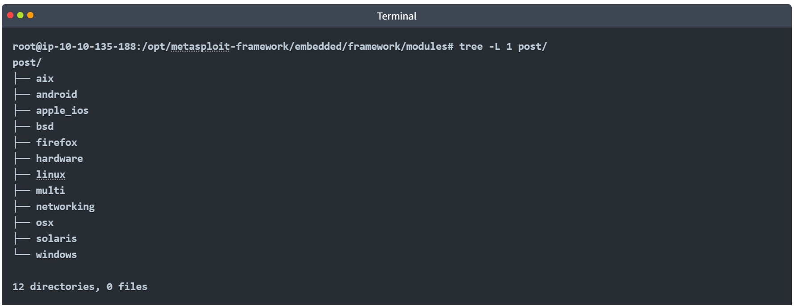  

If you wish to familiarize yourself further with these modules, you can find them under the modules folder of your Metasploit installation. For the AttackBox these are under /opt/metasploit-framework/embedded/framework/modules

### Msfconsole

 You can launch it using the **msfconsole** command on your terminal or any system the Metasploit Framework is installed on.

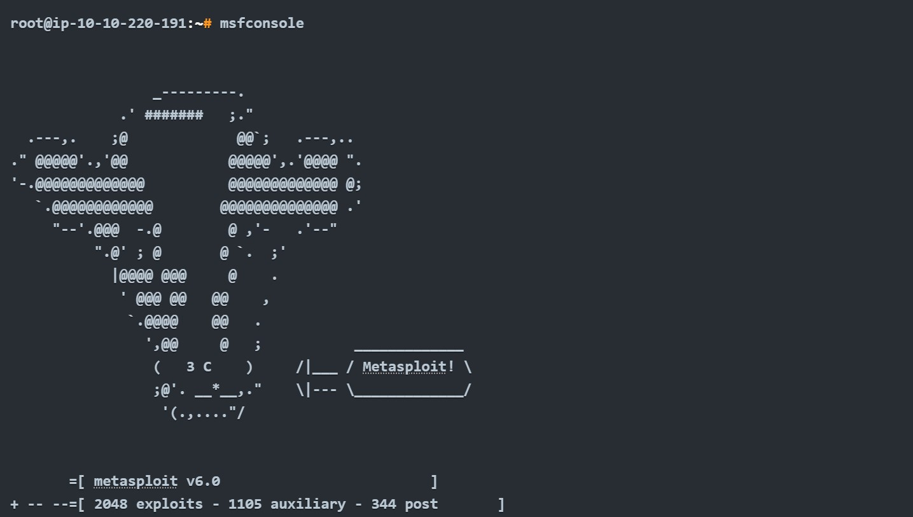  

Once launched, you will see the command line changes to msf6 (or msf5 depending on the installed version of Metasploit). The Metasploit console (msfconsole) can be used just like a regular command-line shell, as you can see below. The first command is `ls` which lists the contents of the folder from which Metasploit was launched using the `msfconsole` command.

It is followed by a `ping` sent to Google's DNS IP address (8.8.8.8). We had to add the `-c 1` option, so only a single ping was sent. Otherwise, the ping process would continue until it is stopped using `CTRL+C`.

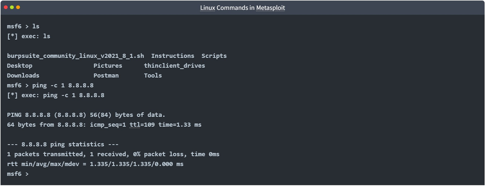  

It will support most Linux commands, including `clear` (to clear the terminal screen), but will not allow you to use some features of a regular command line (e.g. does not support output redirection), as seen below.

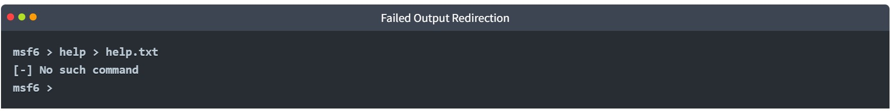  

While on the subject, the help command can be used on its own or for a specific command. Below is the help menu for the set command we will cover soon.

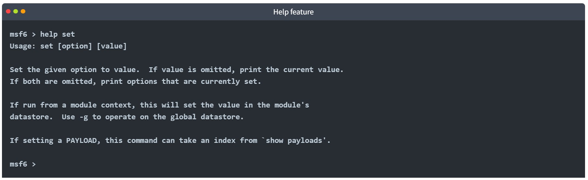  

You can use the history command to see commands you have typed earlier.

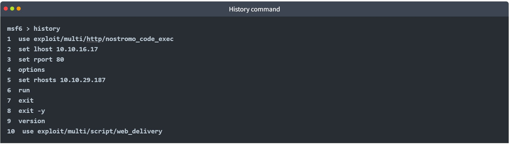  

An important feature of msfconsole is the support of tab completion. This will come in handy later when using Metasploit commands or dealing with modules. For example, if you start typing `he` and press the tab key, you will see it auto-completes to `help`.

Msfconsole is managed by context; this means that unless set as a global variable, all parameter settings will be lost if you change the module you have decided to use. In the example below, we have used the ms17_010_eternalblue exploit, and we have set parameters such as `RHOSTS`. If we were to switch to another module (e.g. a port scanner), we would need to set the RHOSTS value again as all changes we have made remained in the context of the ms17_010_eternalblue exploit. 

Let us look at the example below to have a better understanding of this feature. We will use the MS17-010 “Eternalblue” exploit for illustration purposes.

Once you type the use `exploit/windows/smb/ms17_010_eternalblue` command, you will see the command line prompt change from msf6 to “msf6 exploit(windows/smb/ms17_010_eternalblue)”. The "EternalBlue" is an exploit allegedly developed by the U.S. National Security Agency (N.S.A.) for a vulnerability affecting the SMBv1 server on numerous Windows systems. The SMB (Server Message Block) is widely used in Windows networks for file sharing and even for sending files to printers. EternalBlue was leaked by the cybercriminal group "Shadow Brokers" in April 2017. In May 2017, this vulnerability was exploited worldwide in the WannaCry ransomware attack.

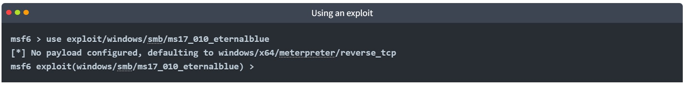  

The module to be used can also be selected with the `use` command followed by the number at the beginning of the search result line.

While the prompt has changed, you will notice we can still run the commands previously mentioned. This means we did not "enter" a folder as you would typically expect in an operating system command line.

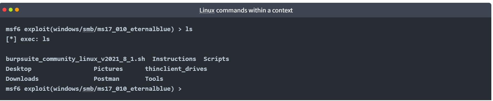  

The prompt tells us we now have a context set in which we will work. You can see this by typing the show options command.

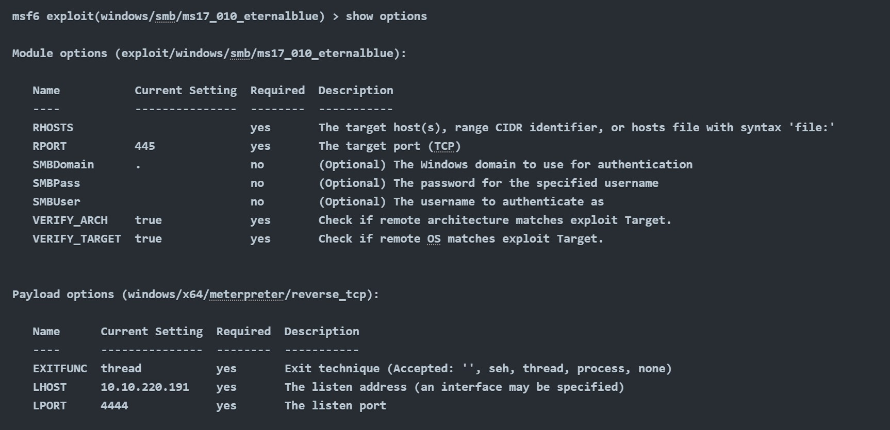  

This will print options related to the exploit we have chosen earlier. The show options command will have different outputs depending on the context it is used in. The example above shows that this exploit will require we set variables like RHOSTS and RPORT. On the other hand, a post-exploitation module may only need us to set a SESSION ID (see the screenshot below). A session is an existing connection to the target system that the post-exploitation module will use.

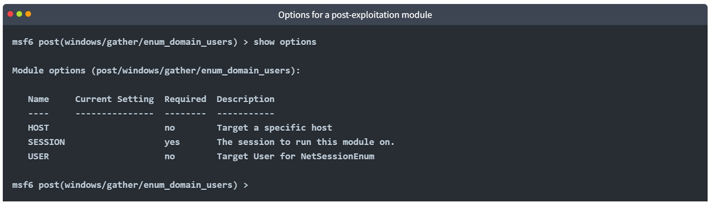  

The `show` command can be used in any context followed by a module type (auxiliary, payload, exploit, etc.) to list available modules. The example below lists payloads that can be used with the ms17-010 Eternalblue exploit.

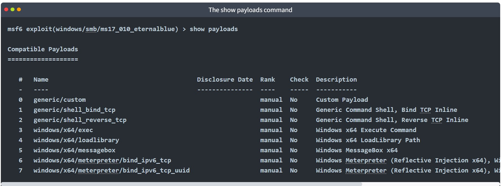  

If used from the msfconsole prompt, the `show` command will list all modules.

The `use` and `show options` commands we have seen so far are identical for all modules in Metasploit.

You can leave the context using the `back` command.

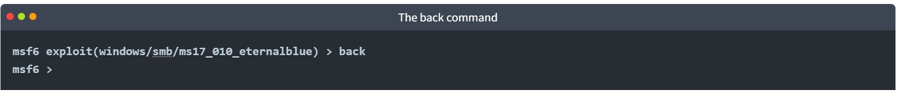  

Further information on any module can be obtained by typing the `info` command within its context.

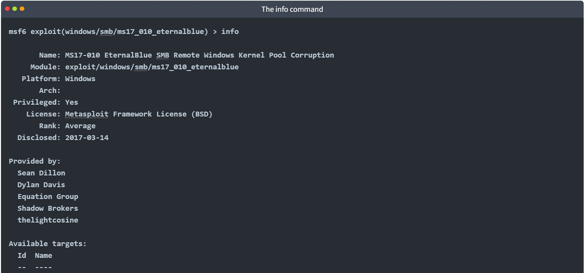  

Alternatively, you can use the `info` command followed by the module’s path from the msfconsole prompt (e.g. `info exploit/windows/smb/ms17_010_eternalblue`). Info is not a help menu; it will display detailed information on the module such as its author, relevant sources, etc.

#### Search

One of the most useful commands in msfconsole is `search`. This command will search the Metasploit Framework database for modules relevant to the given search parameter. You can conduct searches using CVE numbers, exploit names (eternalblue, heartbleed, etc.), or target system.

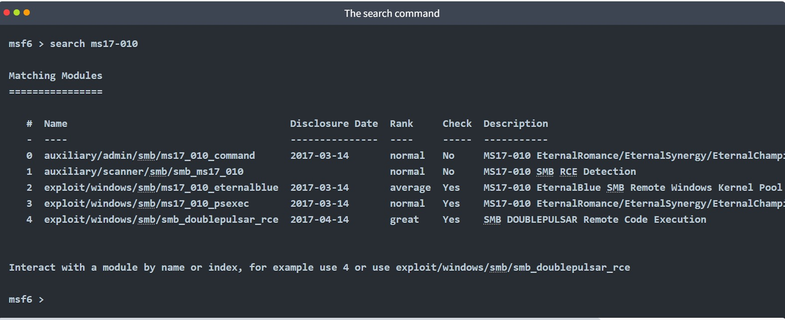  

The output of the `search` command provides an overview of each returned module. You may notice the “name” column already gives more information than just the module name. You can see the type of module (auxiliary, exploit, etc.) and the category of the module (scanner, admin, windows, Unix, etc.). You can use any module returned in a search result with the command use followed by the number at the beginning of the result line. (e.g. `use 0` instead of `use auxiliary/admin/smb/ms17_010_command`)

Another essential piece of information returned is in the “rank” column. Exploits are rated based on their reliability. The table below provides their respective descriptions.

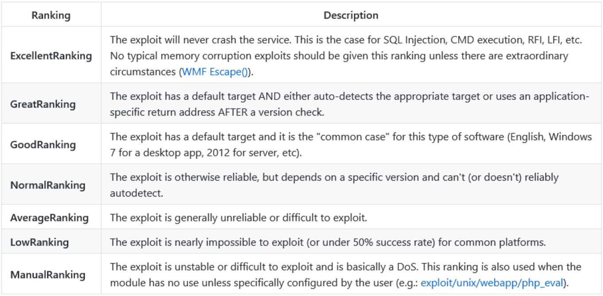  

Source: https://github.com/rapid7/metasploit-framework/wiki/Exploit-Ranking

You can direct the search function using keywords such as type and platform.

For example, if we wanted our search results to only include auxiliary modules, we could set the type to auxiliary. The screenshot below shows the output of the search type:auxiliary telnet command.

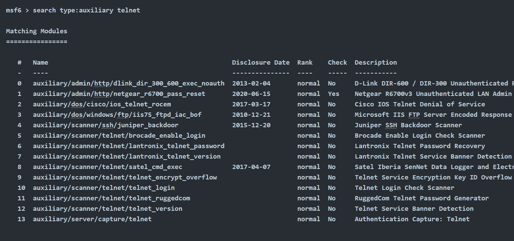  

Please remember that exploits take advantage of a vulnerability on the target system and may always show unexpected behavior. A low-ranking exploit may work perfectly, and an excellent ranked exploit may not, or worse, crash the target system.

--- 

### Working with modules

Once you have entered the context of a module using the `use` command followed by the module name, as seen earlier, you will need to set parameters. The most common parameters you will use are listed below. Remember, based on the module you use, additional or different parameters may need to be set. It is good practice to use the `show options` command to list the required parameters.

All parameters are set using the same command syntax: `set PARAMETER_NAME VALUE`

Before we proceed, remember always to check the msfconsole prompt to ensure you are in the right context. When dealing with Metasploit, you may see five different prompts:

- **The regular command prompt**: You can not use Metasploit commands here.

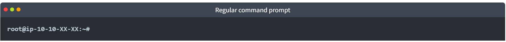  

- **The msfconsole prompt**: msf6 (or msf5 depending on your installed version) is the msfconsole prompt. As you can see, no context is set here, so context-specific commands to set parameters and run modules can not be used here.

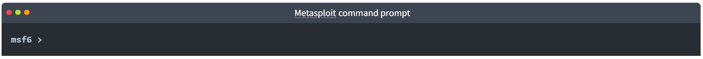  

- **A context prompt**: Once you have decided to use a module and used the set command to chose it, the msfconsole will show the context. You can use context-specific commands (e.g. set RHOSTS 10.10.x.x) here.

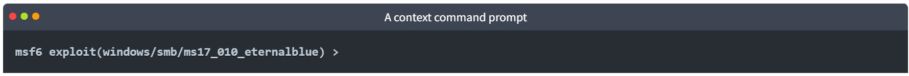  

- **The Meterpreter prompt**: Meterpreter is an important payload we will see in detail later in this module. This means a Meterpreter agent was loaded to the target system and connected back to you. You can use Meterpreter specific commands here.

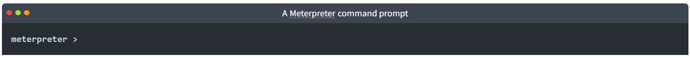  

- **A shell on the target system**: Once the exploit is completed, you may have access to a command shell on the target system. This is a regular command line, and all commands typed here run on the target system.

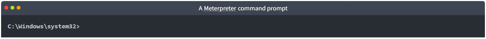  

As mentioned earlier, the **show options** command will list all available parameters.

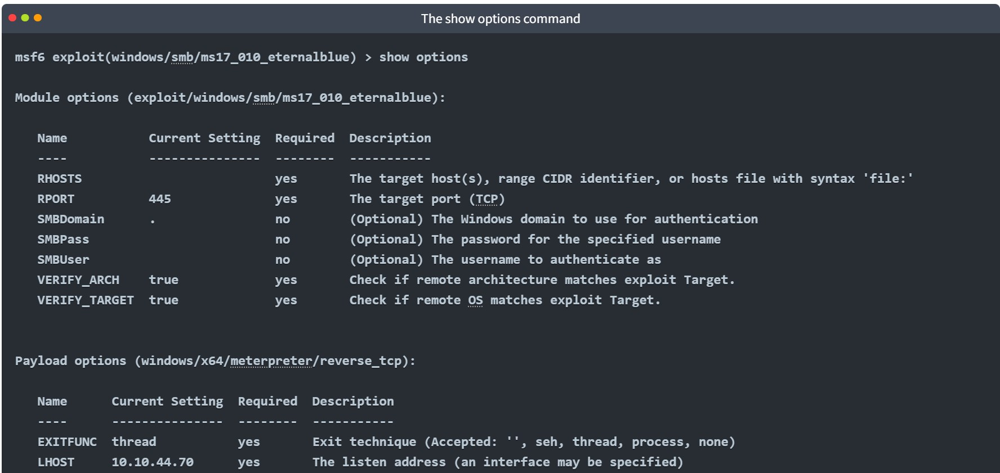  

As you can see in the screenshot above, some of these parameters require a value for the exploit to work. Some required parameter values will be pre-populated, make sure you check if these should remain the same for your target. For example, a web exploit could have an RPORT (remote port: the port on the target system Metasploit will try to connect to and run the exploit) value preset to 80, but your target web application could be using port 8080.

In this example, we will set the RHOSTS parameter to the IP address of our target system using the `set` command.

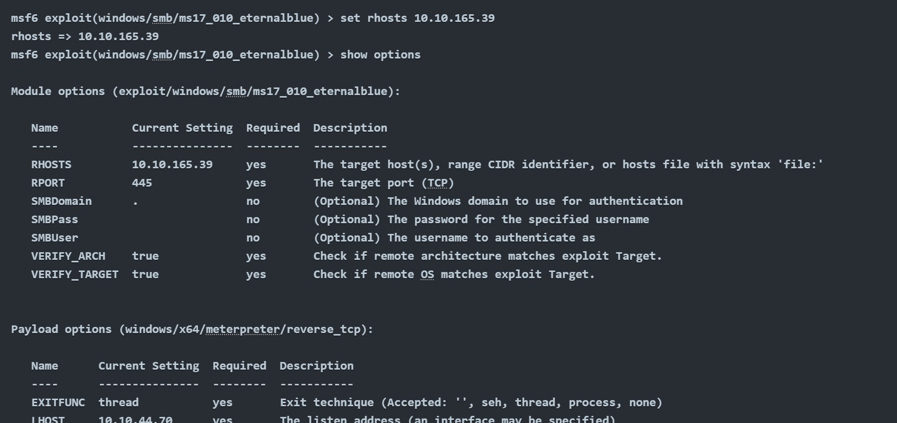  

Once you have set a parameter, you can use the `show options` command to check the value was set correctly.

Parameters you will often use are:

- **RHOSTS**: “Remote host”, the IP address of the target system. A single IP address or a network range can be set. This will support the CIDR (Classless Inter-Domain Routing) notation (/24, /16, etc.) or a network range (10.10.10.x – 10.10.10.y). You can also use a file where targets are listed, one target per line using file:/path/of/the/target_file.txt, as you can see below.

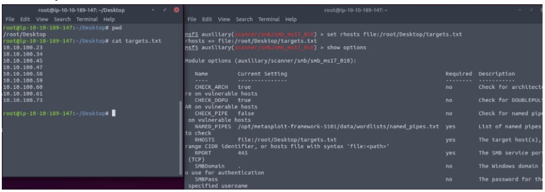  

- **RPORT**: “Remote port”, the port on the target system the vulnerable application is running on.
- **PAYLOAD**: The payload you will use with the exploit.
- **LHOST**: “Localhost”, the attacking machine (your AttackBox or Kali Linux) IP address.
- **LPORT**: “Local port”, the port you will use for the reverse shell to connect back to. This is a port on your attacking machine, and you can set it to any port not used by any other application.
- **SESSION**: Each connection established to the target system using Metasploit will have a session ID. You will use this with post-exploitation modules that will connect to the target system using an existing connection.

You can override any set parameter using the set command again with a different value. You can also clear any parameter value using the `unset` command or clear all set parameters with the `unset all` command.

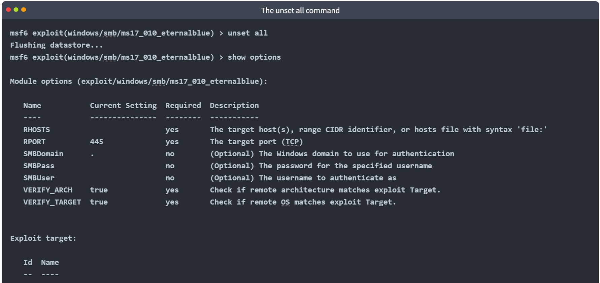  

You can use the `setg` command to set values that will be used for all modules. The `setg` command is used like the set command. The difference is that if you use the `set` command to set a value using a module and you switch to another module, you will need to set the value again. The `setg` command allows you to set the value so it can be used by default across different modules. You can clear any value set with `setg` using `unsetg`.

The example below uses the following flow;

1. We use the ms17_010_eternalblue exploitable
2. We set the RHOSTS variable using the `setg` command instead of the set command
3. We use the `back` command to leave the exploit context
4. We use an auxiliary (this module is a scanner to discover MS17-010 vulnerabilities)
5. The **show options** command shows the RHOSTS parameter is already populated with the IP address of the target system.

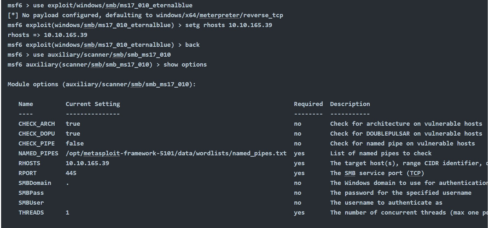  

The **setg** command sets a global value that will be used until you exit Metasploit or clear it using the **unsetg** command.

#### Using modules

Once all module parameters are set, you can launch the module using the `exploit` command. Metasploit also supports the `run` command, which is an alias created for the `exploit` command as the word exploit did not make sense when using modules that were not exploits (port scanners, vulnerability scanners, etc.).

- The `exploit` command can be used without any parameters or using the “`-z`” parameter.
- The `exploit -z` command will run the exploit and background the session as soon as it opens.

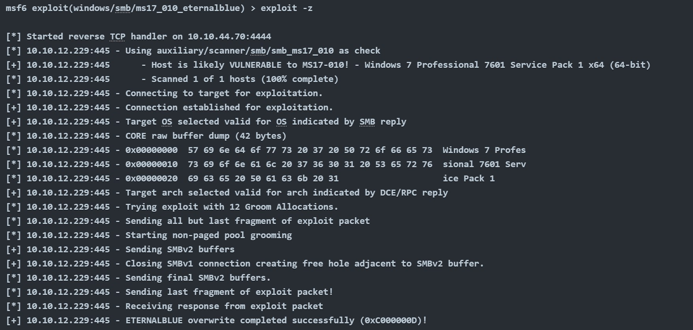  

This will return you the context prompt from which you have run the exploit.
Some modules support the `check` option. This will check if the target system is vulnerable without exploiting it.

#### Sessions

Once a vulnerability has been successfully exploited, a session will be created. This is the communication channel established between the target system and Metasploit.

You can use the `background` command to background the session prompt and go back to the msfconsole prompt.

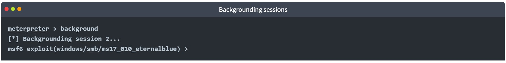  

- Alternatively, `CTRL+Z` can be used to background sessions.
- The `sessions` command can be used from the msfconsole prompt or any context to see the existing sessions.

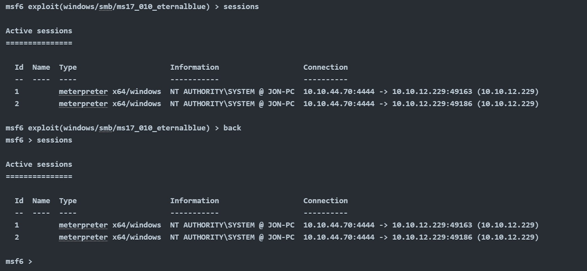  

To interact with any session, you can use the `sessions -i` command followed by the desired session number.

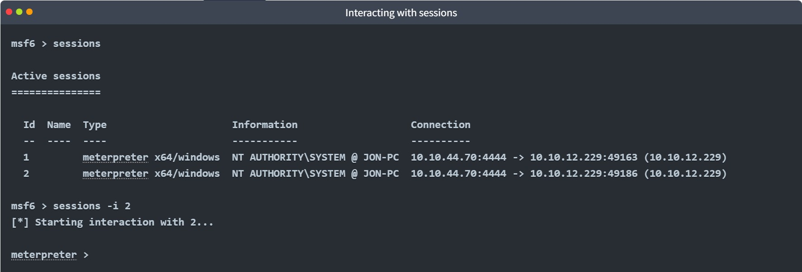  

---
> **Note:** These notes document hands-on learning from the TryHackMe *Cybersecurity 101* path. The exercises cover fundamental cybersecurity topics, including Linux basics, networking concepts, and web technologies. This document is intended for personal learning, revision, and ethical skill development. All screenshots, commands, and actions are for educational purposes only.  
> — Compiled by moh4med404 | Curious Mind | Cybersecurity Enthusiast