# Cybersecurity 101 
---
# JavaScript Essentials

JavaScript (JS) is a popular scripting language that allows web developers to add interactive features to websites containing HTML and CSS (styling). Once the HTML elements are created, you can add interactiveness like validation, onClick actions, animations, etc, through JS. Learning the language is equally important as that of HTML and CSS. The JS scripts are used primarily with HTML.

#### Variables

Variables are containers that allow you to store data values in them. Like any other language, variables in JavaScript are similar to containers used to store data.

When you store something in a bucket, you also need to label it so that it can be referenced later on easily. Similarly, in JavaScript, each variable has a name; when we store a certain value in a variable, we assign a name to it so we can reference it later.

There are **three ways to declare variables in JavaScript**:

- `var`
- `let`
- `const`

#### Scoping Differences:

- **`var`** is *function-scoped*.
- **`let`** and **`const`** are *block-scoped*, offering better control over variable visibility within specific code blocks.

### Functions

A **function** represents a block of code designed to perform a specific task. Inside a function, you group code that needs to perform a similar or repeated operation.

For example, if you are developing a web application that needs to display students' results on a web page, the ideal approach would be to create a function:

**Example:**

```javascript
function PrintResult(rollNum) {
  // code to fetch and display the result for the given roll number
}
```

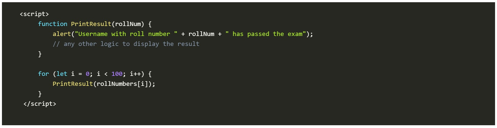 <br>
So, instead of writing the same print code for all the students, we will use a simple function to print the result.

### Loops

**Loops** allow you to run a block of code multiple times as long as a specified condition is true. They are commonly used to perform repetitive tasks, such as iterating through a list of items.

#### Common Loops in JavaScript:

- `for`
- `while`
- `do...while`

These loops are useful when you need to repeat the same action multiple times.

#### Example Use Case

If you want to print the results of 100 students, you could write the `PrintResult(rollNum)` function 100 times—but that would be inefficient. Instead, you can use a loop to automate this task:

```javascript
for (let rollNum = 1; rollNum <= 100; rollNum++) {
  PrintResult(rollNum);
}
```
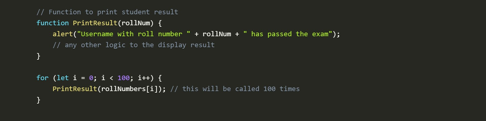 <br>

## JavaScript Overview

In this task, we’ll use JavaScript to create our first program. JS is an **interpreted language**, meaning the code is executed directly in the browser without prior compilation.

Below is a sample JS code demonstrating key concepts, such as:

- Defining a variable
- Understanding data types
- Using control flow statements
- Writing simple functions

These essential building blocks help create more dynamic and interactive web apps. Don’t worry if it looks a bit new now — we will discuss each of these concepts in detail later on.

```javascript
// Hello, World! program
console.log("Hello, World!");

// Variable and Data Type
let age = 25; // Number type

// Control Flow Statement
if (age >= 18) {
    console.log("You are an adult.");
} else {
    console.log("You are a minor.");
}

// Function
function greet(name) {
    console.log("Hello, " + name + "!");
}

// Calling the function
greet("Bob");
```
### Running JavaScript in the Browser

JavaScript is primarily executed on the **client side**, which makes it easy to inspect and interact with HTML directly within the browser. We’ll use the **Google Chrome Console** feature to run our first JS program. This allows us to write and execute JavaScript code easily without the need for any additional tools.

- **Open Google Chrome:** Click the **Google Chrome** icon.
- Once Chrome is open, press **Ctrl + Shift + I** to open the Console or right-click anywhere on the page and select Inspect.

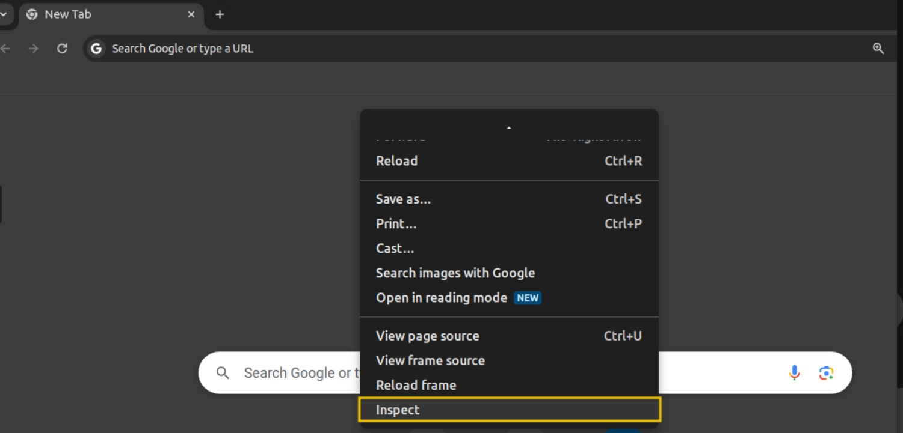 <br>

- Then, click on the `Console` tab. This console allows you to run JS code directly in the browser without installing additional software.

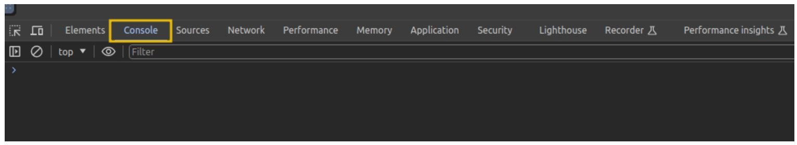 <br>

- Let's create a simple JS program that adds two numbers and displays the result. Below is the code:

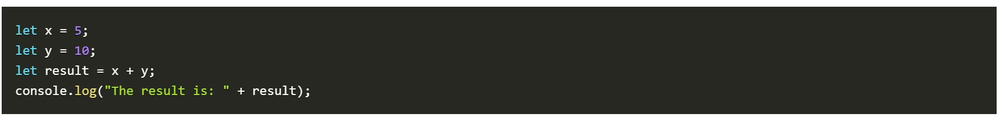 <br>

- In the code above, `x` and `y` are variables holding the numbers. `x + y` is an expression that adds the two numbers together, whereas `console.log`  is a function used to print the result to the console.
- Copy the above code and paste it into the console by pressing the key `Ctrl + V`. Once pasted, press `Enter`. You should see the result displayed as:

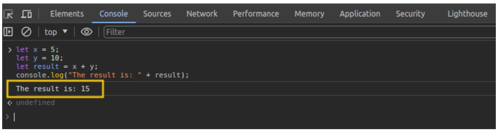 <br>

## Integrating JavaScript in HTML

This task assumes you have a basic understanding of HTML and its structure. This section will explore how JS can be integrated into HTML. Usually, JS is not used to render content; it works with HTML and CSS to create dynamic and interactive web pages. 

### Internal JavaScript

**Internal JavaScript** refers to embedding JS code directly within an HTML document. This method is helpful for beginners because it allows them to see how the script interacts with the HTML structure.

The script is written between `<script>` tags. These tags can be placed:

- Inside the `<head>` section — typically for scripts that must load **before** the page content is rendered.
- Inside the `<body>` section — useful for scripts that interact with elements **after** they are loaded.

#### Example: Internal JavaScript

```html
<!DOCTYPE html>
<html lang="en">
<head>
    <title>Internal JS</title>
</head>
<body>
    <h1>Addition of Two Numbers</h1>
    <p id="result"></p>

    <script>
        let x = 5;
        let y = 10;
        let result = x + y;
        document.getElementById("result").innerHTML = "The result is: " + result;
    </script>
</body>
</html>
```

**Output**

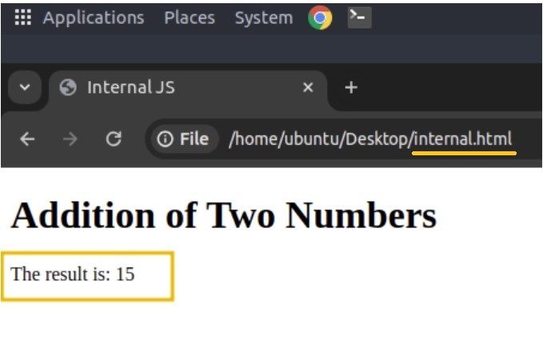 <br>

**Explanation** In this HTML document, we are using **internal JavaScript**, which means the code is placed directly inside the HTML file within the `<script>` tag.

The script performs a simple task:

- It **adds two numbers** (`x` and `y`).
- It then **displays the result** on the web page.

The JavaScript interacts with the HTML by:

- Selecting the `<p>` element with `id="result"` using  
  `document.getElementById("result")`.
- Updating its content with `.innerHTML` to show the computed result.

This internal JS is **automatically executed** when the browser loads the HTML file.

### External JavaScript

**External JavaScript** involves creating and storing JavaScript code in a **separate file** with a `.js` file extension. This method helps keep the HTML document clean, organized, and easier to maintain.

The external JS file can be:

- Stored on the **same web server** as the HTML document.
- Hosted on an **external server** (like a CDN or cloud storage).

#### Example: Using External JavaScript

We’ll use the same functionality as the previous internal JS example, but move the JavaScript code into a separate file.

#### Step 1: Create `script.js`

Save the following code in a file named `script.js`:

```javascript
let x = 5;
let y = 10;
let result = x + y;
document.getElementById("result").innerHTML = "The result is: " + result;
```

#### Step 2: Create a file named `external.html` with the following code:

```HTML
<!DOCTYPE html>
<html lang="en">
<head>
    <meta charset="UTF-8">
    <meta name="viewport" content="width=device-width, initial-scale=1.0">
    <title>External JS</title>
</head>
<body>
    <h1>Addition of Two Numbers</h1>
    <p id="result"></p>

    <!-- Link to the external JS file -->
    <script src="script.js"></script>
</body>
</html>
```

#### Step 3: Double-click the `external.html` file and open it in your browser. 

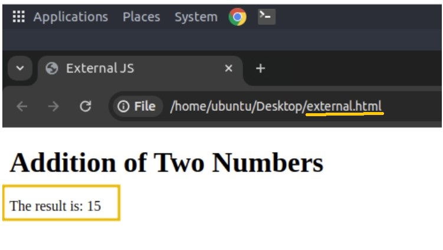 <br>

**Explanation** What we did differently here is use the `src` attribute in the `<script>` tag to load the JavaScript from an external file:`html <script src="script.js"></script>`

### Verifying Internal or External JS

When pen-testing a web application, it is important to check whether the website uses internal or external JS. This can be easily verified by viewing the page's source code. To do this, open the page `external_test.html` located in the `exercise` folder in `Chrome`, right-click anywhere on the page, and select `View Page Source`

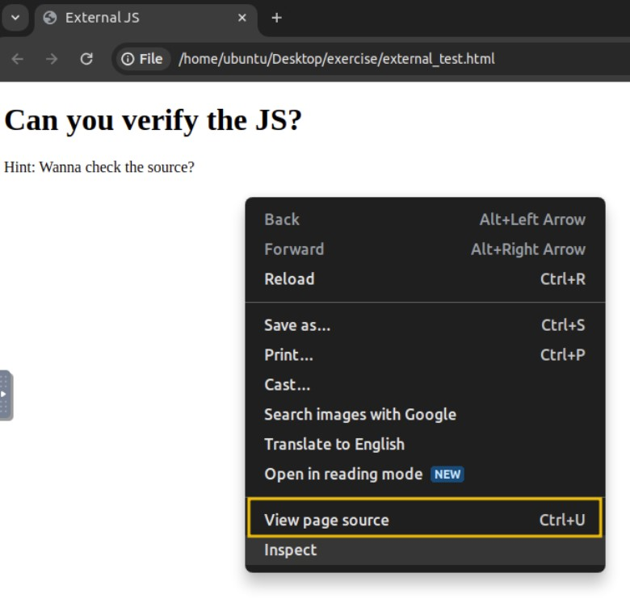 <br>

This will display the **HTML code of the rendered page**. Inside the source code:

- Any JavaScript written **directly on the page** will appear between `<script>` tags **without** the `src` attribute.
- If you see a `<script>` tag **with a `src` attribute`**, it indicates that the page is loading **external JavaScript** from a separate file.

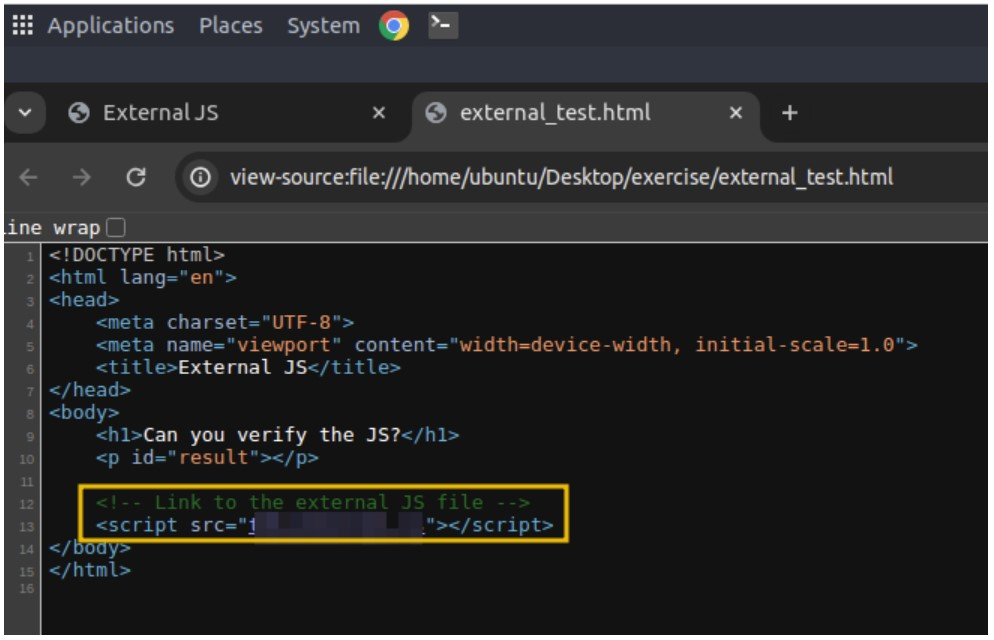 <br>

For a practical example, visit https://tryhackme.com in your browser and inspect the source code to identify how the website loads the JS internally and from external sources.

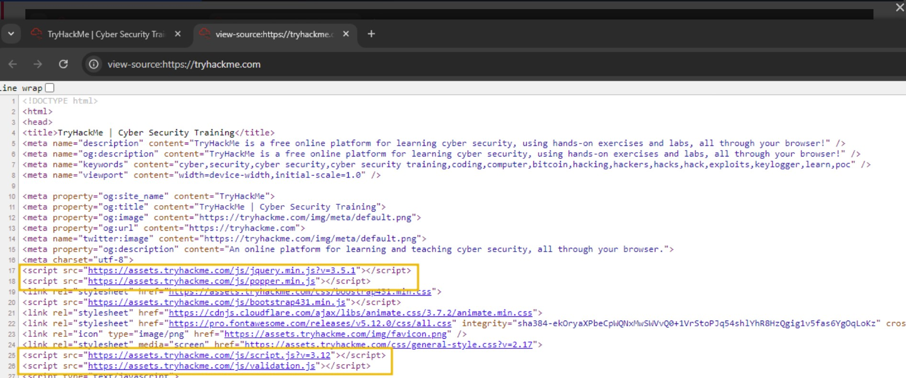 <br>

## Abusing Dialogue Functions

One of the main objectives of JavaScript is to provide dialogue boxes for interaction with users and dynamically update content on web pages. JS provides built-in functions like `alert`, `prompt`, and `confirm` to facilitate this interaction. These functions allow developers to display messages, gather input, and obtain user confirmation.

However, if not implemented securely, attackers may exploit these features to execute attacks like Cross-Site Scripting (XSS), which you will cover later in this module.

We will be using the Google Chrome console in the upcoming exercises.

### Alert

The `alert` function displays a message in a dialogue box with an "OK" button, typically used to convey information or warnings to users. 

For example, if we want to display `"Hello THM"` to the user, we would use:

```js
alert("Hello THM");
```

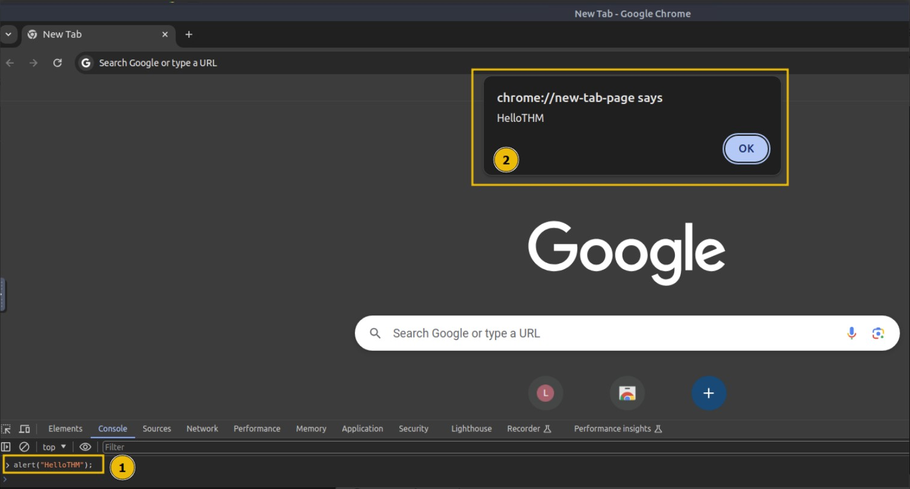 <br>

### Prompt

The `prompt` function displays a dialogue box that asks the user for input. It returns the entered value when the user clicks "OK", or `null` if the user clicks "Cancel".

For example, to ask the user for their name, we would use:

```js
prompt("What is your name?");
```
To test this, open the Chrome console and paste the following code, which asks for a username and then greets the user:

```js
name = prompt("What is your name?");
alert("Hello " + name);
```
Once you paste the code and hit Enter, a dialogue box will appear, and the value entered by the user will be returned to the console. 

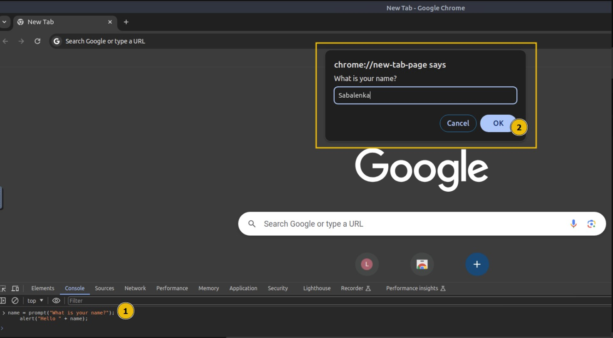 <br>

### Confirm

The confirm function displays a dialogue box with a message and two buttons: "`OK`" and "`Cancel`". It returns true if the user clicks "`OK`" and false if the user clicks "`Cancel`". For example, to ask the user for confirmation, we would use `confirm("Are you sure?");`. To try this out, open the Chrome console, type `confirm("Do you want to proceed?")`, and press `Enter`.

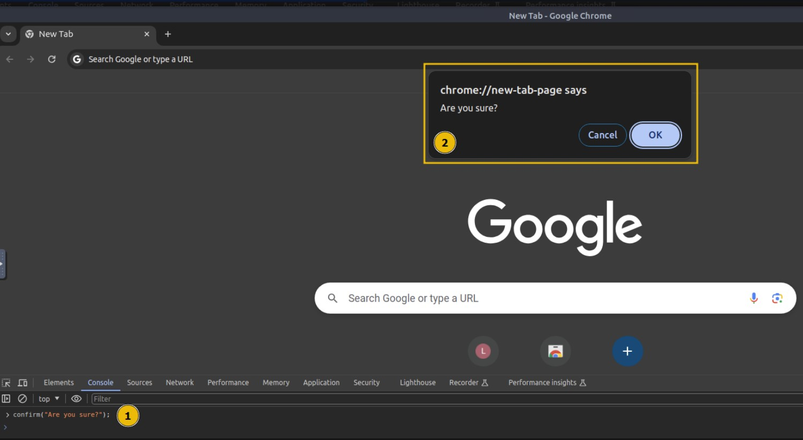 <br>

A dialogue box will appear, and depending on whether the user clicks "`OK`" or "`Cancel`", the value true or false will be returned to the console.

### How Hackers Exploit the Functionality

Imagine receiving an email from a stranger with an attached HTML file. The file looks harmless, but when you open it, it contains JS that disrupts your browsing experience. For example, the following code will show an alert box with the message "**Hacked**" three times:

```HTML 
<!DOCTYPE html>
<html lang="en">
<head>
    <title>Hacked</title>
</head>
<body>
    <script>
        for (let i = 0; i < 3; i++) {
            alert("Hacked");
        }
    </script>
</body>
</html>
```

On the Desktop of the attached VM, create a file called `invoice.html` and paste the above code. Double-click the file to open it, and the alert message will pop up three times, causing an undesired experience.

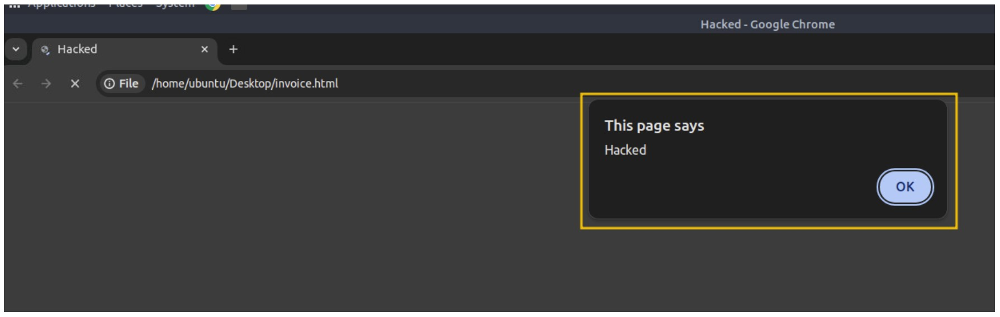 <br>

Imagine if a bad actor sent you a similar file, but instead of displaying the alert three times, the number is set to **500**. You would be forced to keep closing the alert boxes one after another. This is a simple example of how malicious JS can be used to create an inconvenience or worse. Therefore, ensuring you only execute JS files from trusted sources is crucial to avoid such an undesired experience.

## Bypassing Control Flow Statements

Control flow in JavaScript refers to the order in which statements and code blocks are executed based on certain conditions.

JavaScript provides several control flow structures such as:

- `if-else` statements
- `switch` statements (for making decisions)
- Loops like:
  - `for`
  - `while`
  - `do...while` (for repeating actions)

Proper use of control flow ensures that a program can handle various conditions effectively.

#### Conditional Statements in Action

One of the most used conditional statements is the `if-else` statement, which allows you to execute different blocks of code depending on whether a condition evaluates to `true` or `false`.

To test this practically, let's create a file named `age.html` on the **Desktop** of the attached VM and paste the following code:

```html
<!DOCTYPE html>
<html lang="en">
<head>
    <title>Age Verification</title>
</head>
<body>
    <h1>Age Verification</h1>
    <p id="message"></p>

    <script>
        let age = prompt("What is your age");
        if (age >= 18) {
            document.getElementById("message").innerHTML = "You are an adult.";
        } else {
            document.getElementById("message").innerHTML = "You are a minor.";
        }
    </script>
</body>
</html>
```
Double-click the file to open it in Google Chrome. You will see the following image:

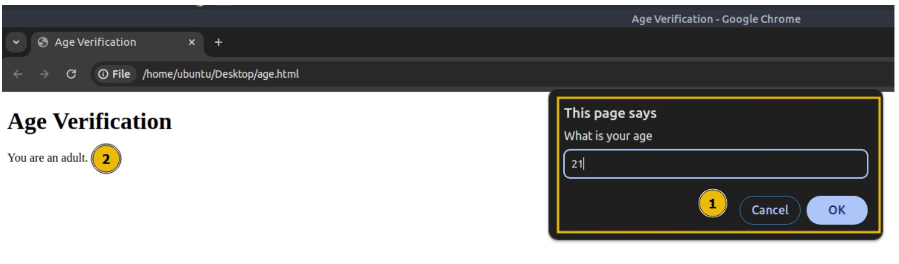 <br>

In the above code, a prompt will ask for your age. If your age is greater than or equal to 18, it will display a message saying, "`You are an adult`." Otherwise, it will show a different message. This behaviour is controlled by the if-else statement, which checks the value of the age variable and displays the appropriate message based on the condition.

#### Bypassing Login Forms

Suppose a developer has implemented authentication functionality in JS, where only users with the username "`admin`" and passwords matching a specific value are allowed to log in. To see this in action, open the `login.html` file in the exercises folder.

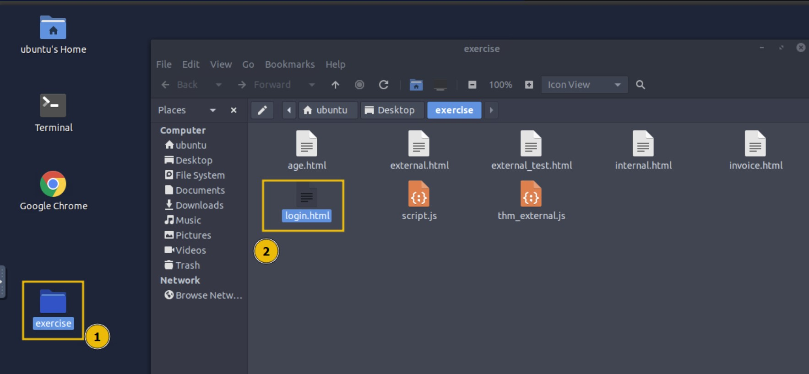 <br>

When you double-click the file and open it in your browser, it will prompt you for a username and password. If the correct credentials are entered, it will display a message confirming that you are logged in, as shown below:

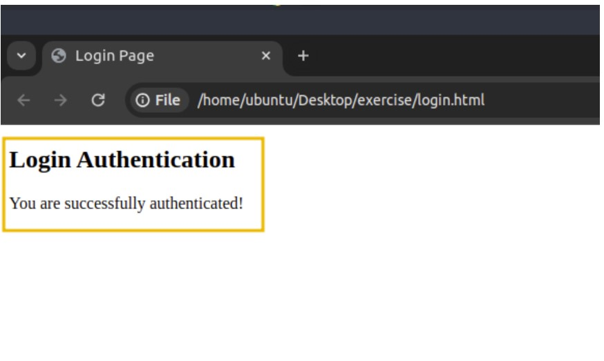 <br>

## Exploring Minified Files

We have understood how JS works and how we can read it until now, but what if the file is not human-readable and has been minified?

Minification in JS is the process of compressing JS files by removing all unnecessary characters, such as spaces, line breaks, comments, and even shortening variable names. This helps reduce the file size and improves the loading time of web pages, especially in production environments. Minified files make the code more compact and harder to read for humans, but they still function exactly the same.

Similarly, obfuscation is often used to make JS harder to understand by adding undesired code, renaming variables and functions to meaningless names, and even inserting dummy code.

### Practical  Example

Create a file on the Desktop of the attached VM with the name `hello.html` and paste the following HTML code:

```HTML 
<!DOCTYPE html>
<html lang="en">
<head>
    <title>Obfuscated JS Code</title>
</head>
<body>
    <h1>Obfuscated JS Code</h1>
    <script src="hello.js"></script>
</body>
</html>
```
Then, create another file with the name `hello.js` and add the following code:

```JavaScript 
function hi() {
  alert("Welcome to THM");
}
hi();
```
Now, double-click the `hello.html` file to open it in Google Chrome. Once the file is opened, you will see an alert greeting you with "**Welcome to THM**".

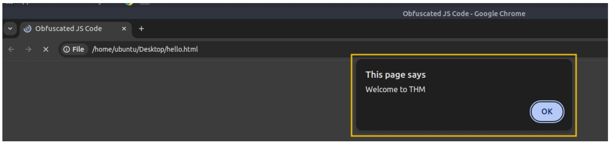 <br>

Click `OK` to close the alert dialogue box. Right-click anywhere on the page and click on `Inspect` to open the developer tools. In the developer tools, navigate to the `Sources` tab and click on the `hello.js` file to view the source code. You will see that the JS code is easily accessible and viewable, as shown below:

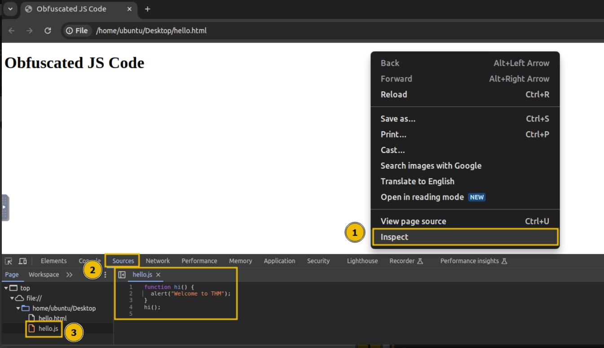 <br>

### Obfuscation in Action

Now, we will try to minify and obfuscate the JS code using an online tool. Visit the [JavaScript Obfuscator Tool](https://codebeautify.org/javascript-obfuscator) and copy the contents of `hello.js`, and paste them into the dialogue box on the website. The tool will minify and obfuscate the code, turning it into a string of gibberish characters shown below:

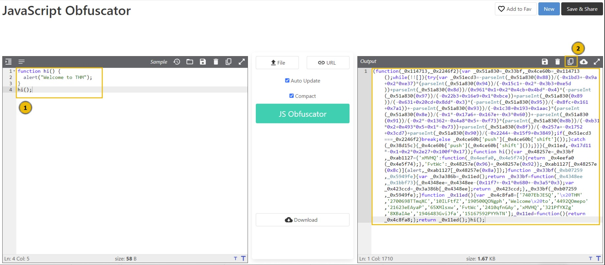 <br>

But what if we tell you that these gibberish characters are still fully functional code? The only difference is that they are not human-readable, but the browser can still execute them correctly. The website converted our JS code to this one:

```
(function(_0x114713,_0x2246f2){var _0x51a830=_0x33bf,_0x4ce60b=_0x114713();while(!![]){try
{var _0x51ecd3=-parseInt(_0x51a830(0x88))/(-0x1bd3+-0x9a+0x2*0xe37)*(parseInt(_0x51a830(0x94))/
(-0x15c1+-0x2*-0x3b3+0xe5d))+parseInt(_0x51a830(0x8d))/(0x961*0x1+0x2*0x4cb+0x4bd*-0x4)*
(-parseInt(_0x51a830(0x97))/(-0x22b3+0x16e9+0x1*0xbce))+parseInt(_0x51a830(0x89))/
(-0x631+0x20cd+0x8dd*-0x3)*(-parseInt(_0x51a830(0x95))/(-0x8fc+0x161+0x7a1))+-
parseInt(_0x51a830(0x93))/(-0x1c38+0x193+0x1aac)*(parseInt(_0x51a830(0x8e))/
(-0x1*-0x17a6+-0x167e+-0x3*0x60))+-parseInt(_0x51a830(0x91))/(-0x2*-0x1362+-0x4a8*0x5+-0xf73)*
(parseInt(_0x51a830(0x8b))/(-0xb31*0x2+0x493*0x5+0x1*-0x73))+parseInt(_0x51a830(0x8f))/
(-0x257a+-0x1752+0x3cd7)+parseInt(_0x51a830(0x90))/(-0x2244+-0x15f9+0x3849);if(_0x51ecd3
===_0x2246f2)break;else _0x4ce60b['push'](_0x4ce60b['shift']());}catch(_0x38d15c)
{_0x4ce60b['push'](_0x4ce60b['shift']());}}}(_0x11ed,-0x17d11*-0x1+0x2*0x2e27+0x100f*0x17));
function hi(){var _0x48257e=_0x33bf,_0xab1127={'xMVHQ':function(_0x4eefa0,_0x4e5f74)
{return _0x4eefa0(_0x4e5f74);},'FvtWc':_0x48257e(0x96)+_0x48257e(0x92)};_0xab1127[_0x48257e(0x8c)
](alert,_0xab1127[_0x48257e(0x8a)]);}function _0x33bf(_0xb07259,_0x5949fe){var _0x3a386b
=_0x11ed();return _0x33bf=function(_0x4348ee,_0x1bbf73){_0x4348ee=_0x4348ee-(0x11f7+-
0x1*0x680+-0x3a5*0x3);var _0x423ccd=_0x3a386b[_0x4348ee];return _0x423ccd;},_0x33bf
(_0xb07259,_0x5949fe);}function _0x11ed(){var _0x4c8fa8=['7407EbJESQ','\x20THM',
'2700698TTmqXC','10ILFtfZ','190500QONgph','Welcome\x20to',
'4492QOmepo','21623eEAyaP','65XMlsxw','FvtWc','2410qfnGAy','xMVHQ','321PfYXZg',
'8XBaIAe','1946483GviJfa','15167592PYYhTN'];_0x11ed=function(){return _0x4c8fa8;};return _0x11ed();}hi();
```
Click the `Copy to Clipboard` (highlighted as 2 in the above image) button as shown on the website. Then, remove the current content of `hello.js` on the attached VM and paste the obfuscated content into the file.

Reload the `hello.html` file in Google Chrome and inspect the `source` code again under the Sources tab. You will notice that the code is now obfuscated but still functions exactly the same as before.

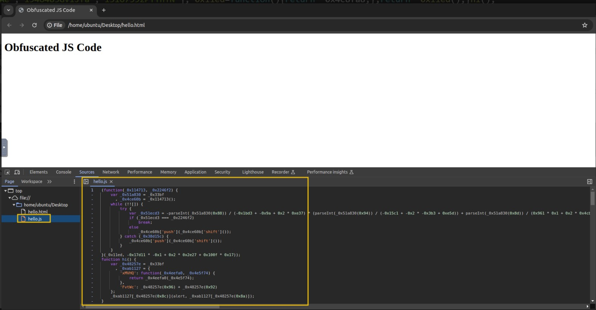 <br>

### Deobfuscating a Code

We can also deobfuscate an obfuscated code using an online tool. Visit the [Obfuscation Deobfuscator Tool](https://obf-io.deobfuscate.io/) then paste the obfuscated code into the provided dialogue box. The website will generate the equivalent, human-readable JS code for you, making it easier to understand and analyze the original script.

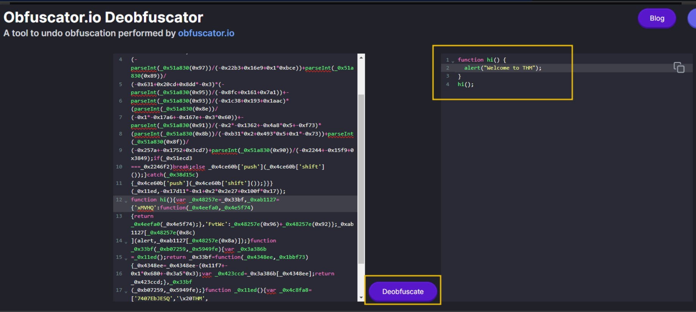 <br>

You have seen how easily we deobfuscated and retrieved our original code.

## Best Practices

This task outlines the best practices for evaluating a website or writing code for a website. If you are developing a web application, you will likely end up using JavaScript (JS). The practices below will assist you in reducing the attack surface and minimizing the chances of attack.

#### ✅ Avoid Relying on Client-Side Validation Only

One of JS's primary functions is performing client-side validation. Developers sometimes rely entirely on JS for validating forms, which is not a good practice. Since a user can disable or manipulate JS on the client side, **always perform validation on the server side as well**.

#### 🚫 Refrain from Adding Untrusted Libraries

JavaScript allows you to include external scripts using the `src` attribute in a `<script>` tag. But including a library without verifying its source is risky.

> ⚠️ Bad actors often publish malicious libraries with names similar to legitimate ones.

**Always verify the source and integrity of third-party libraries** before including them in your application.

#### 🔒 Avoid Hardcoded Secrets

Never hardcode sensitive data like API keys, access tokens, or credentials into your JavaScript code. Anyone can view your source code in the browser.

```js
// ❌ Bad Practice
const privateAPIKey = 'pk_TryHackMe-1337';
```
---
> **Note:** These notes document hands-on learning from the TryHackMe *Cybersecurity 101* path. The exercises cover fundamental cybersecurity topics, including Linux basics, networking concepts, and web technologies. This document is intended for personal learning, revision, and ethical skill development. All screenshots, commands, and actions are for educational purposes only.  
> — Compiled by moh4med404 | Curious Mind | Cybersecurity Enthusiast