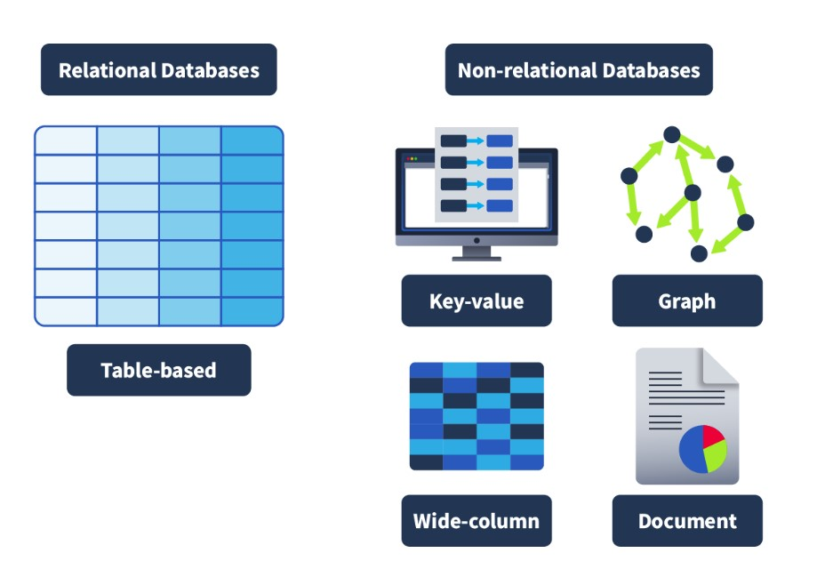
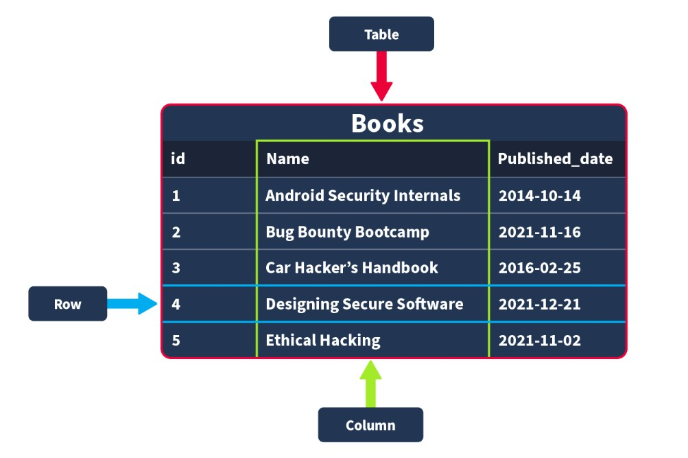
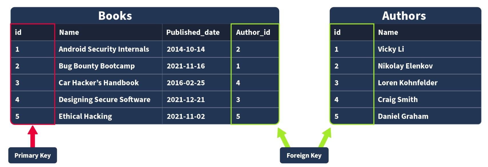
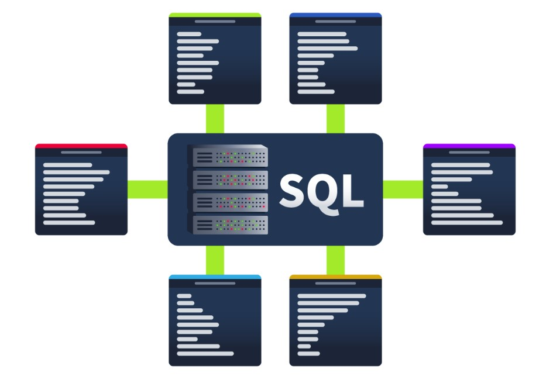
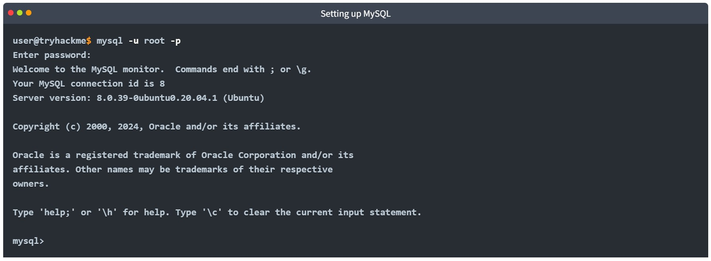
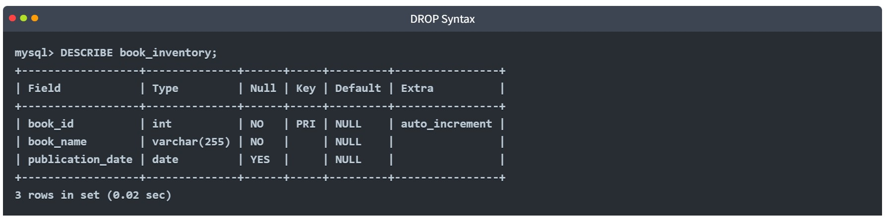

# Cybersecurity 101 
---
# SQL Fundamentals

Cyber security is a broad topic that covers a wide range of subjects, but few of those are as ubiquitous as databases. Whether you’re working on securing a web application, working in a SOC and using a SIEM, configuring user authentication/access control, or using malware analysis/threat detection tools (the list goes on), you will in some way be relying on databases. For example, on the offensive side of security, it can help us better understand SQL vulnerabilities, such as SQL injections, and create queries that help us tamper or retrieve data within a compromised service. On the other hand, on the defensive side, it can help us navigate through databases and find suspicious activity or relevant information; it can also help us better protect a service by implementing restrictions when needed.

Okay, so you’ve been told just how important they are. Now, it's time to understand what databases actually are.

As mentioned in the introduction, **databases are so ubiquitous** that you likely interact with systems using them every day—often without realizing it.

### What Is a Database?

A **database** is an organized collection of structured information or data that is easily accessible and can be manipulated or analyzed.

#### Examples of Data Stored in Databases:

- **User authentication data** (e.g., usernames and passwords)  
  Used to log into applications or websites like TryHackMe.

- **User-generated content on social media**  
  Platforms like Instagram and Facebook store posts, comments, likes, etc.

- **Streaming service usage data**  
  Services like Netflix store your watch history and use it to generate personalized recommendations.

### Why Are Databases Important?

I’m sure you get the point: **databases are used extensively** and can contain many different types of information.

It’s not just massive-scale businesses that use them. **Smaller-scale businesses** also use databases—often right from the beginning—to store data ranging from customer info to sales records.

## Different Types of Databases

It makes sense that something as widely used and long-standing as databases would have **multiple types of implementations**.

There are many different types of databases that can be built, each with its own structure, purpose, and use case. However, for this introductory section, we’ll focus on the two **primary types**:

### 📊 Relational Databases (SQL)

Also known as **SQL databases**, these are based on a structured schema and use **tables** to store data. Each table consists of rows and columns, where:

- **Rows** represent individual records.
- **Columns** represent data fields (attributes) of the record.

### Key Features:
- Use Structured Query Language (SQL) for managing and querying data.
- Enforce **relationships** between tables using keys (e.g., primary and foreign keys).
- Ideal for structured, consistent data (e.g., user information, financial records).

**Examples:** MySQL, PostgreSQL, Microsoft SQL Server, Oracle Database

### 🗂️ Non-Relational Databases (NoSQL)

Also known as **NoSQL databases**, these are more flexible and don't rely on a fixed schema. They can store unstructured or semi-structured data in various formats, such as:

- Key-value pairs
- Documents (JSON, BSON)
- Wide-column stores
- Graph databases

```
 {
    _id: ObjectId("4556712cd2b2397ce1b47661"),
    name: { first: "Thomas", last: "Anderson" },
    date_of_birth: new Date('Sep 2, 1964'),
    occupation: [ "The One"],
    steps_taken : NumberLong(4738947387743977493)
}
```

#### Key Features:
- Handle large volumes of data with high speed and scalability.
- Better suited for hierarchical or nested data structures.
- Commonly used in real-time applications, content management, and big data scenarios.

**Examples:** MongoDB, Redis, Cassandra, Couchbase

Understanding the difference between SQL and NoSQL is crucial when choosing the right tool for your application. Each has strengths and ideal use cases depending on the data and system requirements.

 <br>

In terms of what database should be chosen, it always comes down to the context in which the database is going to be used. Relational databases are often used when the data being stored is reliably going to be received in a consistent format, where accuracy is important, such as when processing e-commerce transactions. Non-relational databases, on the other hand, are better used when the data being received can vary greatly in its format but need to be collected and organised in the same place, such as social media platforms collecting user-generated content.

### Tables, Rows and Columns

Now that we’ve defined the two primary types of databases, we’ll focus on relational databases. We’ll start by explaining **tables**, **rows**, and **columns**. All data stored in a relational database will be stored in a **table**; for example, a collection of books in stock at a bookstore might be stored in a table named “Books”. 

 <br>

When creating this table, you would need to define what pieces of information are needed to define a book record. For example:

- `id`
- `Name`
- `Published_date`

These would then be your **columns**.

When these columns are being defined, you would also specify what **data type** each column should contain. If an attempt is made to insert a record into the database where the data type does not match, it will be **rejected**.

The data types that can be defined may vary depending on the database system you are using, but the core data types used by all include:

- **Strings**: A collection of words and characters.
- **Integers**: Whole numbers.
- **Floats/Decimals**: Numbers with a decimal point.
- **Times/Dates**: Used to store temporal data like timestamps or dates.

### Primary and Foreign Keys

Once a table has been defined and populated, more data may need to be stored. For instance, we want to create a table named **Authors** that stores the authors of the books sold in the store.

Here is a very clear example of a relationship:  
A book (stored in the **Books** table) is written by an author (stored in the **Authors** table).

If we want to query for a book in our store but also have the author of that book returned, our data would need to be related somehow; we do this with **keys**.

There are two types of keys:

 <br>

#### Primary Keys

A **primary key** is used to ensure that the data collected in a certain column is **unique**. That is, there needs to be a way to identify each record stored in a table — a value unique to that record and not repeated by any other record in that table.

Think about matriculation numbers in a university; these are numbers assigned to a student so they can be uniquely identified in records (since students can sometimes have the same name).

A column has to be chosen in each table as a **primary key**; in our example, `id` would make the most sense as an ID has been uniquely created for each book, whereas books can have the same publication date or (in rarer cases) book title.

**Note:** There can only be **one primary key column** in a table.

#### Foreign Keys

A **foreign key** is a column (or columns) in a table that also exists in another table within the database, and therefore provides a **link between the two tables**.

In our example, think about adding an `author_id` field to our **Books** table; this would then act as a foreign key because the `author_id` in our Books table corresponds to the `id` column in the **Authors** table.

Foreign keys are what allow the relationships between different tables in relational databases.

**Note:** There can be **more than one foreign key column** in a table.


## SQL

Now, all of this theoretically sounds great, but in practice, how do databases work? How would you go and make your first table and populate it with data? What would you use? Databases are usually controlled using a Database Management System (DBMS). Serving as an interface between the end user and the database, a DBMS is a software program that allows users to retrieve, update and manage the data being stored. Some examples of DBMSs include **MySQL**, **MongoDB**, **Oracle** Database and **Maria DB**. 

 <br>

The interaction between the end user and the database can be done using SQL (Structured Query Language). SQL is a programming language that can be used to query, define and manipulate the data stored in a relational database. 

### The Benefits of SQL and Relational Databases

SQL is almost as ubiquitous as databases themselves, and for good reason. Here are some of the benefits that come with learning and using SQL:

- **It's fast:**  
  Relational databases (aka those that SQL is used for) can return massive batches of data almost instantaneously due to how little storage space is used and high processing speeds.

- **Easy to Learn:**  
  Unlike many programming languages, SQL is written in plain English, making it much easier to pick up. The highly readable nature of the language means users can concentrate on learning the functions and syntax.

- **Reliable:**  
  As mentioned before, relational databases can guarantee a level of accuracy when it comes to data by defining a strict structure into which data sets must fall in order to be inserted.

- **Flexible:**  
  SQL provides all kinds of capabilities when it comes to querying a database; this allows users to perform vast data analysis tasks very efficiently.

## MySQL Basics: Getting Started with Your First Database

####  Step 1: Login to MySQL

```bash
mysql -u root -p #Enter your MySQL password when prompted (e.g., Moh4med404).
``` 

 <br>

#### Step 2: Create a New Database
```bash 
CREATE DATABASE my_first_db;
```

#### SHOW DATABASES
The `SHOW DATABASES` statement will return a list of present databases. Run the statement as follows:
```bash 
mysql> SHOW DATABASES;
```
In the returned list, you should see the database you have just created and some databases that are included by default (mysql, information_scheme, performance_scheme and sys), which are used for various purposes that enable mysql to function. Also present are various tables needed for this lesson.

#### USE DATABASE

Once a database is created, you may want to interact with it. Before we can interact with it, we need to tell mysql which database we would like to interact with (so it knows which database to run subsequent queries against). To set the database we have just created as the active database, we would run the `USE` statement as follows (make sure to run this on your machine):
```bash 
mysql> USE ddatabase_name;
```

#### DROP DATABASE

Once a database is no longer needed (maybe it was created for test purposes, or is no longer required), it can be removed using the `DROP` statement. To remove a database, we would use the following statement syntax (although, in our case, we want to keep our database, so no need to run this one yourself!):
```bash 
mysql> DROP database database_name;
```

#### Create a Table

Following the logic of the database statements, creating tables also uses a `CREATE` statement. Once a database is active (you have run the `USE` statement on it), a table can be created within it using the following statement syntax:

```bash 
mysql> CREATE TABLE example_table_name (
    example_column1 data_type,
    example_column2 data_type,
    example_column3 data_type
);
```
As you can see, there is a little more involved here. In the Databases 101 task, we covered how and when a table is created; it must be decided what columns will make up a record in that table, as well as what data type is expected to be contained within that column. That is what is represented by this syntax here. In the example, there are 3 example columns, but SQL supports many (over 1000). Let's try populating our `thm_bookmarket_db` with a table using the following statement:

```bash 
mysql> CREATE TABLE book_inventory (
    book_id INT AUTO_INCREMENT PRIMARY KEY,
    book_name VARCHAR(255) NOT NULL,
    publication_date DATE
);
```


This statement will create a table named `book_inventory` with three columns: `book_id`, `book_name`, and `publication_date`.

- `book_id` is an **INT (Integer)**, as it should only ever be a number. It has the `AUTO_INCREMENT` attribute, meaning:
  - The first book inserted will be assigned `book_id` 1,
  - The second book inserted will be assigned `book_id` 2, and so on.
  - `book_id` is also set as the **PRIMARY KEY**, which means it is the unique identifier for each book record in the table.
  - Every table must have a **primary key** to uniquely identify its rows.

- `book_name` has the data type **VARCHAR(255)**:
  - This allows it to store variable characters such as text, numbers, or punctuation.
  - The maximum length is limited to 255 characters.
  - It also has the `NOT NULL` constraint, meaning this field cannot be empty.
  - If someone tries to insert a record without a `book_name`, the insert will be rejected.

- `publication_date` is set with the data type **DATE**, which is used to store the publication date of the book.

#### SHOW TABLES 
Just as we can list databases using a SHOW statement, we can also list the tables in our currently active database (the database on which we last used the USE statement). Run the following command, and you should see the table you have just created:

```bash 
mysql> SHOW TABLES;
```

#### DESCRIBE 
If we want to know what columns are contained within a table (and their data type), we can describe them using the `DESCRIBE` command (which can also be abbreviated to `DESC`). Describe the table you have just created using the following command:

```bash 
mysql> DESCRIBE book_inventory;
```
This will give you a detailed view of the table like so:

 <br>

#### ALTER 
Once you have created a table, there may come a time when your need for the dataset changes, and you need to alter the table. This can be done using the `ALTER` statement. Let’s now imagine that we have decided that we actually want to have a column in our book inventory that has the page count for each book. Add this to our table using the following statement:

```bash 
mysql> ALTER TABLE book_inventory
ADD page_count INT;
```
The `ALTER` statement can be used to make changes to a table, such as renaming columns, changing the data type in a column or removing a column. 

#### DROP 
Similar to removing a database, you can also remove tables using the `DROP` statement. We don’t need to do this, but the syntax you would use for this is:

```bash 
mysql> DROP TABLE table_name;
```

## CRUD Operations

**CRUD** stands for **Create**, **Read**, **Update**, and **Delete**, which are considered the basic operations in any system that manages data.

Let's explore these different operations when working with **MySQL**.

In the next two tasks, we will be using the `books` table that is part of the database **thm_books**.  
We can access it with the following statement:

```sql
USE thm_books;
```

#### Create Operation (INSERT)

The **Create** operation will create new records in a table. In MySQL, this can be achieved by using the statement `INSERT INTO`, as shown below.

```sql
mysql> INSERT INTO books (id, name, published_date, description)
    VALUES (1, "Android Security Internals", "2014-10-14", "An In-Depth Guide to Android's Security Architecture");

Query OK, 1 row affected (0.01 sec)
```
As we can observe, the `INSERT INTO` statement specifies a table — in this case, `books` — where you can add a new record. The columns `id`, `name`, `published_date`, and `description` represent the fields in the table.

In this example, a new record was added with the following values:

- `id`: 1  
- `name`: "Android Security Internals"  
- `published_date`: "2014-10-14"  
- `description`: "Android Security Internals provides a complete understanding of the security internals of Android devices"

> **Note:** This operation already exists in the database, so there is no need to run the query again.

#### Read Operation (`SELECT`)

The **Read** operation, as the name suggests, is used to read or retrieve information from a table.  
We can fetch a specific column or all columns from a table using the `SELECT` statement, as shown in the following example:

```sql
mysql> SELECT * FROM books;
+----+----------------------------+----------------+------------------------------------------------------+
| id | name                       | published_date | description                                          |
+----+----------------------------+----------------+------------------------------------------------------+
|  1 | Android Security Internals | 2014-10-14     | An In-Depth Guide to Android's Security Architecture |
+----+----------------------------+----------------+------------------------------------------------------+

1 row in set (0.00 sec)
```

The above `SELECT` statement uses the `*` symbol to indicate that **all columns** should be retrieved, followed by the `FROM` clause and the table name — in this case, `books`.

If we want to select **specific columns** like `name` and `description`, we should list them explicitly instead of using the `*` symbol, as shown below:

### Terminal Output

```sql
mysql> SELECT name, description FROM books;
+----------------------------+------------------------------------------------------+
| name                       | description                                          |
+----------------------------+------------------------------------------------------+
| Android Security Internals | An In-Depth Guide to Android's Security Architecture |
+----------------------------+------------------------------------------------------+

1 row in set (0.00 sec)
```
#### Update Operation (`UPDATE`)

The **Update** operation modifies an existing record within a table, and the `UPDATE` statement is used to perform this action.

### Terminal Output

```sql
mysql> UPDATE books
    SET description = "An In-Depth Guide to Android's Security Architecture."
    WHERE id = 1;

Query OK, 1 row affected (0.00 sec)
Rows matched: 1  Changed: 1  Warnings: 0
```

The `UPDATE` statement specifies the table — in this case, `books`.  
We then use the `SET` clause followed by the column name and the new value we want to assign.

The `WHERE` clause determines **which row** to update when its condition is met — in this case, the row with `id = 1`.

This ensures that only the intended record is modified.

#### Delete Operation (`DELETE`)

The **Delete** operation removes records from a table.  
We can perform this operation using the `DELETE` statement.

> **Note:** There is no need to run this query.  
> Deleting this entry will affect the rest of the examples in the upcoming tasks.

```sql
mysql> DELETE FROM books WHERE id = 1;

Query OK, 1 row affected (0.00 sec)
```

Above, we can observe the `DELETE` statement followed by the `FROM` clause, which allows us to specify the table where the record will be removed — in this case, `books`.

This is followed by the `WHERE` clause, which indicates **which specific record** should be deleted — in this example, the one where `id = 1`.

#### Summary

CRUD operations are fundamental for data manipulation when interacting with databases. The key SQL statements associated with each operation are:

- **Create** (`INSERT` statement) — Adds a new record to the table.  
- **Read** (`SELECT` statement) — Retrieves records from the table.  
- **Update** (`UPDATE` statement) — Modifies existing data in the table.  
- **Delete** (`DELETE` statement) — Removes records from the table.

## Clauses

A **clause** is a part of a statement that specifies the criteria of the data being manipulated, usually following an initial statement. Clauses help us define the type of data and how it should be retrieved or sorted.

In previous tasks, we have already used some clauses, such as:

- `FROM` — used to specify the table we are accessing with our statement  
- `WHERE` — specifies which records should be used

This task will focus on other clauses:

- `DISTINCT`  
- `GROUP BY`  
- `ORDER BY`  
- `HAVING`

In this task, we will continue to use the `books` table that is part of the database **thm_books**.  
We can access it with the following statement:

```sql
USE thm_books;
```

#### DISTINCT Clause

The `DISTINCT` clause is used to avoid duplicate records when performing a query, returning only unique values.

Let's use the query `SELECT * FROM books` and observe the results below.

```sql
mysql> SELECT * FROM books;
+----+----------------------------+----------------+--------------------------------------------------------+
| id | name                       | published_date | description                                            |
+----+----------------------------+----------------+--------------------------------------------------------+
|  1 | Android Security Internals | 2014-10-14     | An In-Depth Guide to Android's Security Architecture   |
|  2 | Bug Bounty Bootcamp        | 2021-11-16     | The Guide to Finding and Reporting Web Vulnerabilities |
|  3 | Car Hacker's Handbook      | 2016-02-25     | A Guide for the Penetration Tester                     |
|  4 | Designing Secure Software  | 2021-12-21     | A Guide for Developers                                 |
|  5 | Ethical Hacking            | 2021-11-02     | A Hands-on Introduction to Breaking In                 |
|  6 | Ethical Hacking            | 2021-11-02     |                                                        |
+----+----------------------------+----------------+--------------------------------------------------------+

6 rows in set (0.00 sec)

```
The query's output displays all the content of the `books` table, and the record **Ethical Hacking** is displayed twice.

Let's perform the query again, but this time using the `DISTINCT` clause.

**Terminal Output**

```sql
mysql> SELECT DISTINCT name FROM books;
+----------------------------+
| name                       |
+----------------------------+
| Android Security Internals |
| Bug Bounty Bootcamp        |
| Car Hacker's Handbook      |
| Designing Secure Software  |
| Ethical Hacking            |
+----------------------------+

5 rows in set (0.00 sec)

```
The output shows that only five rows are returned, and just one instance of the **Ethical Hacking** record is displayed.

#### GROUP BY Clause

The `GROUP BY` clause aggregates data from multiple records and groups the query results by specified columns.  
This is especially useful when combined with aggregate functions like `COUNT()`, `SUM()`, `AVG()`, etc.

**Terminal Output**

```sql
mysql> SELECT name, COUNT(*)
    FROM books
    GROUP BY name;
+----------------------------+----------+
| name                       | COUNT(*) |
+----------------------------+----------+
| Android Security Internals |        1 |
| Bug Bounty Bootcamp        |        1 |
| Car Hacker's Handbook      |        1 |
| Designing Secure Software  |        1 |
| Ethical Hacking            |        2 |
+----------------------------+----------+

5 rows in set (0.00 sec)
```
In the example above, the records in the `books` table are grouped by the `name` column, and the `COUNT(*)` function calculates the number of occurrences for each group.

As we already know, **Ethical Hacking** appears twice, so its total count is 2, which is displayed alongside the grouped result.

#### ORDER BY Clause

The `ORDER BY` clause is used to sort the records returned by a query in ascending or descending order.  
The keywords `ASC` (ascending) and `DESC` (descending) specify the sort direction.

**Ascending Order Example**

```sql
mysql> SELECT *
    FROM books
    ORDER BY published_date ASC;
+----+----------------------------+----------------+--------------------------------------------------------+
| id | name                       | published_date | description                                            |
+----+----------------------------+----------------+--------------------------------------------------------+
|  1 | Android Security Internals | 2014-10-14     | An In-Depth Guide to Android's Security Architecture   |
|  3 | Car Hacker's Handbook      | 2016-02-25     | A Guide for the Penetration Tester                     |
|  5 | Ethical Hacking            | 2021-11-02     | A Hands-on Introduction to Breaking In                 |
|  6 | Ethical Hacking            | 2021-11-02     |                                                        |
|  2 | Bug Bounty Bootcamp        | 2021-11-16     | The Guide to Finding and Reporting Web Vulnerabilities |
|  4 | Designing Secure Software  | 2021-12-21     | A Guide for Developers                                 |
+----+----------------------------+----------------+--------------------------------------------------------+

6 rows in set (0.00 sec)
```

**Descending Order Example**

```sql
mysql> SELECT *
    FROM books
    ORDER BY published_date DESC;
+----+----------------------------+----------------+--------------------------------------------------------+
| id | name                       | published_date | description                                            |
+----+----------------------------+----------------+--------------------------------------------------------+
|  4 | Designing Secure Software  | 2021-12-21     | A Guide for Developers                                 |
|  2 | Bug Bounty Bootcamp        | 2021-11-16     | The Guide to Finding and Reporting Web Vulnerabilities |
|  5 | Ethical Hacking            | 2021-11-02     | A Hands-on Introduction to Breaking In                 |
|  6 | Ethical Hacking            | 2021-11-02     |                                                        |
|  3 | Car Hacker's Handbook      | 2016-02-25     | A Guide for the Penetration Tester                     |
|  1 | Android Security Internals | 2014-10-14     | An In-Depth Guide to Android's Security Architecture   |
+----+----------------------------+----------------+--------------------------------------------------------+

6 rows in set (0.00 sec)
```

We can observe the difference between sorting in ascending order using `ASC` and in descending order using `DESC`, both sorting by the `published_date` column.

#### HAVING Clause

The `HAVING` clause is used with other clauses to filter groups or aggregated results based on a condition.  
In the case of `GROUP BY`, it evaluates the condition to `TRUE` or `FALSE`.  
Unlike the `WHERE` clause, which filters rows **before** aggregation, `HAVING` filters the results **after** the aggregation is performed.

```sql
mysql> SELECT name, COUNT(*)
    FROM books
    GROUP BY name
    HAVING name LIKE '%Hack%';
+-----------------------+----------+
| name                  | COUNT(*) |
+-----------------------+----------+
| Car Hacker's Handbook |        1 |
| Ethical Hacking       |        2 |
+-----------------------+----------+

2 rows in set (0.00 sec)
```

In the example above, we can observe that the query returns the books with the names that contain the word **hack** and the proper count, as we learned before.

## Operators

When working with SQL and dealing with logic and comparisons, **operators** are essential tools to filter and manipulate data effectively.  
Understanding these operators will help us create more precise and powerful queries.

In the next two tasks, we will be using the `books` table that is part of the database **thm_books2**.  
We can access it with the following statement:

```sql
USE thm_books2;
```

#### Logical Operators

Logical operators test the truth of a condition and return a boolean value of `TRUE` or `FALSE`.  
Let's explore some of these operators next.

#### LIKE Operator

The `LIKE` operator is commonly used with clauses like `WHERE` to filter for specific patterns within a column.  
Let's continue using our database to query an example of its usage.

```sql
mysql> SELECT *
    FROM books
    WHERE description LIKE "%guide%";
+----+----------------------------+----------------+--------------------------------------------------------+--------------------+
| id | name                       | published_date | description                                            | category           |
+----+----------------------------+----------------+--------------------------------------------------------+--------------------+
|  1 | Android Security Internals | 2014-10-14     | An In-Depth Guide to Android's Security Architecture   | Defensive Security |
|  2 | Bug Bounty Bootcamp        | 2021-11-16     | The Guide to Finding and Reporting Web Vulnerabilities | Offensive Security |
|  3 | Car Hacker's Handbook      | 2016-02-25     | A Guide for the Penetration Tester                     | Offensive Security |
|  4 | Designing Secure Software  | 2021-12-21     | A Guide for Developers                                 | Defensive Security |
+----+----------------------------+----------------+--------------------------------------------------------+--------------------+

4 rows in set (0.00 sec)
```
The query above returns a list of records from the `books` table filtered by the `WHERE` clause,  
which selects only those rows where the `description` contains the word **guide**, using the `LIKE` operator.

#### AND Operator

The `AND` operator allows you to use multiple conditions within a query and returns `TRUE` only if **all** conditions are true.

```sql
mysql> SELECT *
    FROM books
    WHERE category = "Offensive Security" AND name = "Bug Bounty Bootcamp";
+----+---------------------+----------------+--------------------------------------------------------+--------------------+
| id | name                | published_date | description                                            | category           |
+----+---------------------+----------------+--------------------------------------------------------+--------------------+
|  2 | Bug Bounty Bootcamp | 2021-11-16     | The Guide to Finding and Reporting Web Vulnerabilities | Offensive Security |
+----+---------------------+----------------+--------------------------------------------------------+--------------------+

1 row in set (0.00 sec)
```

The query above returns the book with the name **Bug Bounty Bootcamp**, which belongs to the category **Offensive Security**.

#### OR Operator

The `OR` operator combines multiple conditions within queries and returns `TRUE` if **at least one** of these conditions is true.

```sql
mysql> SELECT *
    FROM books
    WHERE name LIKE "%Android%" OR name LIKE "%iOS%";
+----+----------------------------+----------------+------------------------------------------------------+--------------------+
| id | name                       | published_date | description                                          | category           |
+----+----------------------------+----------------+------------------------------------------------------+--------------------+
|  1 | Android Security Internals | 2014-10-14     | An In-Depth Guide to Android's Security Architecture | Defensive Security |
+----+----------------------------+----------------+------------------------------------------------------+--------------------+

1 row in set (0.00 sec)
```
The query above returns books whose names include either **Android** or **iOS**.

#### NOT Operator

The `NOT` operator reverses the value of a boolean condition, allowing us to exclude specific matches.

```sql
mysql> SELECT *
    FROM books
    WHERE NOT description LIKE "%guide%";
+----+-----------------+----------------+----------------------------------------+--------------------+
| id | name            | published_date | description                            | category           |
+----+-----------------+----------------+----------------------------------------+--------------------+
|  5 | Ethical Hacking | 2021-11-02     | A Hands-on Introduction to Breaking In | Offensive Security |
+----+-----------------+----------------+----------------------------------------+--------------------+

1 row in set (0.00 sec)
```
The query above returns results where the `description` does **not** contain the word **guide**.

#### BETWEEN Operator

The `BETWEEN` operator allows us to test if a value exists within a defined range.

```sql
mysql> SELECT *
    FROM books
    WHERE id BETWEEN 2 AND 4;
+----+---------------------------+----------------+--------------------------------------------------------+--------------------+
| id | name                      | published_date | description                                            | category           |
+----+---------------------------+----------------+--------------------------------------------------------+--------------------+
|  2 | Bug Bounty Bootcamp       | 2021-11-16     | The Guide to Finding and Reporting Web Vulnerabilities | Offensive Security |
|  3 | Car Hacker's Handbook     | 2016-02-25     | A Guide for the Penetration Tester                     | Offensive Security |
|  4 | Designing Secure Software | 2021-12-21     | A Guide for Developers                                 | Defensive Security |
+----+---------------------------+----------------+--------------------------------------------------------+--------------------+

3 rows in set (0.00 sec)
```
The query above returns books whose `id` is between **2** and **4** (inclusive).


#### Comparison Operators

Comparison operators are used to compare values and check if they meet specified criteria.

- **Equal To Operator (`=`)**

The `=` (Equal) operator compares two expressions and determines if they are equal, or it can check if a value matches another one in a specific column.

```sql
mysql> SELECT *
    FROM books
    WHERE name = "Designing Secure Software";
+----+---------------------------+----------------+------------------------+--------------------+
| id | name                      | published_date | description            | category           |
+----+---------------------------+----------------+------------------------+--------------------+
|  4 | Designing Secure Software | 2021-12-21     | A Guide for Developers | Defensive Security |
+----+---------------------------+----------------+------------------------+--------------------+

1 row in set (0.10 sec)
```
The query above returns the book with the exact name **Designing Secure Software**.

- **Not Equal To Operator (`!=`)**

The `!=` (not equal) operator compares expressions and tests if they are **not** equal; it also checks if a value differs from the one within a column.

```sql
mysql> SELECT *
    FROM books
    WHERE category != "Offensive Security";
+----+----------------------------+----------------+------------------------------------------------------+--------------------+
| id | name                       | published_date | description                                          | category           |
+----+----------------------------+----------------+------------------------------------------------------+--------------------+
|  1 | Android Security Internals | 2014-10-14     | An In-Depth Guide to Android's Security Architecture | Defensive Security |
|  4 | Designing Secure Software  | 2021-12-21     | A Guide for Developers                               | Defensive Security |
+----+----------------------------+----------------+------------------------------------------------------+--------------------+

2 rows in set (0.00 sec)
```
The query above returns books **except** those whose category is **Offensive Security**.

- **Less Than Operator (`<`)**

The `<` (less than) operator compares if the expression with a given value is less than the provided one.

```sql
mysql> SELECT *
    FROM books
    WHERE published_date < "2020-01-01";
+----+----------------------------+----------------+------------------------------------------------------+--------------------+
| id | name                       | published_date | description                                          | category           |
+----+----------------------------+----------------+------------------------------------------------------+--------------------+
|  1 | Android Security Internals | 2014-10-14     | An In-Depth Guide to Android's Security Architecture | Defensive Security |
|  3 | Car Hacker's Handbook      | 2016-02-25     | A Guide for the Penetration Tester                   | Offensive Security |
+----+----------------------------+----------------+------------------------------------------------------+--------------------+

2 rows in set (0.00 sec)
```
The query above returns books that were published **before January 1, 2020**.

- **Greater Than Operator (`>`)**

The `>` (greater than) operator compares if the expression with a given value is **greater than** the provided one.

```sql
mysql> SELECT *
    FROM books
    WHERE published_date > "2020-01-01";
+----+---------------------------+----------------+--------------------------------------------------------+--------------------+
| id | name                      | published_date | description                                            | category           |
+----+---------------------------+----------------+--------------------------------------------------------+--------------------+
|  2 | Bug Bounty Bootcamp       | 2021-11-16     | The Guide to Finding and Reporting Web Vulnerabilities | Offensive Security |
|  4 | Designing Secure Software | 2021-12-21     | A Guide for Developers                                 | Defensive Security |
|  5 | Ethical Hacking           | 2021-11-02     | A Hands-on Introduction to Breaking In                 | Offensive Security |
+----+---------------------------+----------------+--------------------------------------------------------+--------------------+

3 rows in set (0.00 sec)
```
The query above returns books that were published **after January 1, 2020**.

- **Less Than or Equal To and Greater Than or Equal To Operators**

The `<=` (Less than or equal to) operator checks if a value is **less than or equal to** the given value.  
The `>=` (Greater than or equal to) operator checks if a value is **greater than or equal to** the given value.

Let's observe examples of both.

```sql
mysql> SELECT *
    FROM books
    WHERE published_date <= "2021-11-15";
+----+----------------------------+----------------+------------------------------------------------------+--------------------+
| id | name                       | published_date | description                                          | category           |
+----+----------------------------+----------------+------------------------------------------------------+--------------------+
|  1 | Android Security Internals | 2014-10-14     | An In-Depth Guide to Android's Security Architecture | Defensive Security |
|  3 | Car
```
The query above returns books that were published **on or before November 15, 2021**.

```sql
mysql> SELECT *
    FROM books
    WHERE published_date >= "2021-11-02";
+----+---------------------------+----------------+--------------------------------------------------------+--------------------+
| id | name                      | published_date | description                                            | category           |
+----+---------------------------+----------------+--------------------------------------------------------+--------------------+
|  2 | Bug Bounty Bootcamp       | 2021-11-16     | The Guide to Finding and Reporting Web Vulnerabilities | Offensive Security |
|  4 | Designing Secure Software | 2021-12-21     | A Guide for Developers                                 | Defensive Security |
|  5 | Ethical Hacking           | 2021-11-02     | A Hands-on Introduction to Breaking In                 | Offensive Security |
+----+---------------------------+----------------+--------------------------------------------------------+--------------------+

3 rows in set (0.00 sec)
```
The query above returns books that were published **on or after November 2, 2021**.


## Functions

When working with data, **functions** can help us streamline queries and operations and manipulate data. Let's explore some of these functions next.

### String Functions

String functions perform operations on a string, returning a value associated with it.

#### `CONCAT()` Function

This function is used to add two or more strings together. It is useful to combine text from different columns.

```sql
mysql> SELECT CONCAT(name, " is a type of ", category, " book.") AS book_info FROM books;
+------------------------------------------------------------------+
| book_info                                                        |
+------------------------------------------------------------------+
| Android Security Internals is a type of Defensive Security book. |
| Bug Bounty Bootcamp is a type of Offensive Security book.        |
| Car Hacker's Handbook is a type of Offensive Security book.      |
| Designing Secure Software is a type of Defensive Security book.  |
| Ethical Hacking is a type of Offensive Security book.            |
+------------------------------------------------------------------+

5 rows in set (0.00 sec)
```
#### `GROUP_CONCAT()` Function

This function can help us concatenate data from multiple rows into one field. Let's explore an example of its usage.

```sql
mysql> SELECT category, GROUP_CONCAT(name SEPARATOR ", ") AS books
    FROM books
    GROUP BY category;
+--------------------+-------------------------------------------------------------+
| category           | books                                                       |
+--------------------+-------------------------------------------------------------+
| Defensive Security | Android Security Internals, Designing Secure Software       |
| Offensive Security | Bug Bounty Bootcamp, Car Hacker's Handbook, Ethical Hacking |
+--------------------+-------------------------------------------------------------+

2 rows in set (0.01 sec)
```
The query above groups the books by `category` and concatenates the titles of books within each category into a single string, separated by commas.

#### SUBSTRING() Function

This function will retrieve a substring from a string within a query, starting at a determined position. The length of this substring can also be specified.

```mysql
mysql> SELECT SUBSTRING(published_date, 1, 4) AS published_year FROM books;
+----------------+
| published_year |
+----------------+
| 2014           |
| 2021           |
| 2016           |
| 2021           |
| 2021           |
+----------------+

5 rows in set (0.00 sec)
```
In the query above, we can observe how it extracts the first four characters from the `published_date` column and stores them in the `published_year` column.

#### LENGTH() Function

This function returns the number of characters in a string. This includes spaces and punctuation. We can find an example below.

```mysql
mysql> SELECT LENGTH(name) AS name_length FROM books;
+-------------+
| name_length |
+-------------+
|          26 |
|          19 |
|          21 |
|          25 |
|          15 |
+-------------+

5 rows in set (0.00 sec)
```
As we can observe above, the query calculates the length of the string within the name column and stores it in a column named name_length.

### Aggregate Functions

These functions aggregate the value of multiple rows within one specified criteria in the query; It can combine multiple values into one result.

#### COUNT() Function

This function returns the number of records within an expression, as the example below shows.

Terminal
```mysql
mysql> SELECT COUNT(*) AS total_books FROM books;
+-------------+
| total_books |
+-------------+
|           5 |
+-------------+

1 row in set (0.01 sec)
```
This query above counts the total number of rows in the books table. The result is 5, as there are five books in the books table, and it's stored in the total_books column.


#### SUM() Function

This function sums all values (not NULL) of a determined column.

Note: There is no need to execute this query. This is just for example purposes.

```mysql
mysql> SELECT SUM(price) AS total_price FROM books;
+-------------+
| total_price |
+-------------+
|      249.95 |
+-------------+

1 row in set (0.00 sec)
```
The query above calculates the total sum of the price column. The result provides the aggregate price of all books in the column `total_price`.

#### MAX() Function

This function calculates the maximum value within a provided column in an expression.

```mysql
SELECT MAX(published_date) AS latest_book FROM books;
+-------------+
| latest_book |
+-------------+
| 2021-12-21  |
+-------------+

1 row in set (0.00 sec)
```
The query above retrieves the latest publication (maximum value) date from the books table. The result `2021-12-21` is stored in the column `latest_book`.

#### MIN() Function

This function calculates the minimum value within a provided column in an expression.

Terminal
```mysql
SELECT MIN(published_date) AS earliest_book FROM books;
+---------------+
| earliest_book |
+---------------+
| 2014-10-14    |
+---------------+

1 row in set (0.00 sec)
```
The query above retrieves the earliest publication (minimum value) date from the books table. The result `2014-10-14` is stored in the `earliest_book` column.

---
> **Note:** These notes document hands-on learning from the TryHackMe *Cybersecurity 101* path. The exercises cover fundamental cybersecurity topics, including Linux basics, networking concepts, and web technologies. This document is intended for personal learning, revision, and ethical skill development. All screenshots, commands, and actions are for educational purposes only.  
> — Compiled by moh4med404 | Curious Mind | Cybersecurity Enthusiast