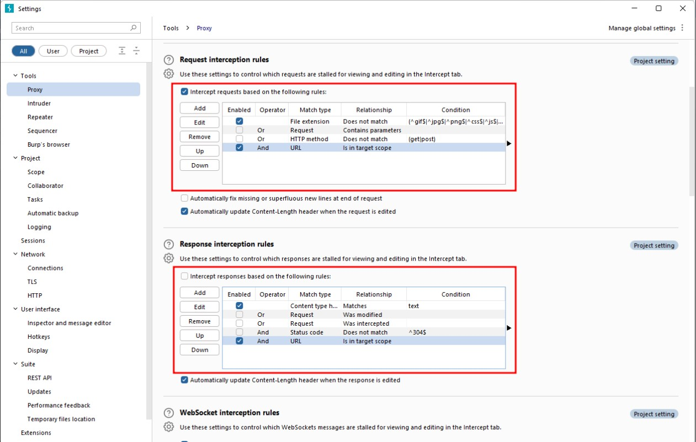

# Cybersecurity 101 
---
# Burp Suite: Basics

In essence, **Burp Suite** is a Java-based framework designed to serve as a comprehensive solution for conducting web application penetration testing. It has become the industry standard tool for hands-on security assessments of web and mobile applications, including those that rely on application programming interfaces (APIs).

Simply put, Burp Suite captures and enables manipulation of all the **HTTP/HTTPS traffic** between a browser and a web server. This fundamental capability forms the backbone of the framework. By intercepting requests, users have the flexibility to route them to various components within the Burp Suite framework, which we will explore in upcoming sections.

The ability to **intercept, view, and modify** web requests before they reach the target server — or even manipulate responses before they are received by the browser — makes Burp Suite an **invaluable tool for manual web application testing**.

 <br>

**Burp Suite** is available in different editions, each tailored to varying use cases. For our purposes, we will focus on the **Burp Suite Community Edition**, which is freely accessible for **non-commercial use** within legal boundaries. However, it's worth noting that Burp Suite also offers **Professional** and **Enterprise** editions, which include advanced features and require licensing.

#### 1. Burp Suite Community Edition
- **Free** version of Burp Suite.
- Suitable for learning, basic testing, and educational purposes.
- Lacks automation and advanced scanning capabilities.

#### 2. Burp Suite Professional
The **Professional Edition** is an **unrestricted version** of the Community Edition and includes powerful capabilities:

- ✅ **Automated vulnerability scanner**
- ✅ **Fuzzer/brute-forcer** (not rate-limited)
- ✅ Ability to **save projects** and **generate reports**
- ✅ **Built-in API** for integration with other tools
- ✅ Unrestricted support for **extensions**
- ✅ Access to **Burp Collaborator** (self-hosted or PortSwigger-hosted)

**In short:** Burp Suite Professional is a powerful tool and is widely adopted by penetration testers and security professionals for manual web application testing.

#### 3. Burp Suite Enterprise
Unlike the other editions, **Burp Suite Enterprise** is designed for **continuous automated scanning** of web applications:

- 🖥️ Runs on a **central server** rather than a local machine.
- 🔁 Performs **periodic vulnerability scans**.
- 🔍 Works similarly to infrastructure scanners like Nessus.
- ❌ Does **not** support manual testing.

**Summary:** Burp Suite Enterprise is ideal for organizations that want to integrate security into their DevOps pipelines through **automated, scheduled scanning**.

 <br>

Due to requiring a license for the **Professional** and **Enterprise** editions, we will focus on the **core feature set** provided by the **Burp Suite Community Edition**.

> **Note:** The demonstrations provided use **Burp Suite for Windows**. However, the functionality remains consistent with the version installed on the **AttackBox**, so you can follow along regardless of your operating system.

## Features of Burp Suite Community Edition

Although **Burp Suite Community** offers a more limited feature set than the **Professional** edition, it still includes powerful tools essential for web application testing. Here are some of its key features:

#### 🔁 Proxy
- The **Burp Proxy** is Burp Suite’s most iconic feature.
- It allows **interception and modification** of requests and responses between the browser and the web application.
- This is fundamental for manual testing and traffic analysis.

#### 📨 Repeater
- The **Repeater** tool lets you **capture, edit, and resend** HTTP/S requests.
- Ideal for crafting and fine-tuning payloads (e.g., during SQL Injection testing).
- Useful for **trial-and-error-based testing**.

#### 🎯 Intruder
- While **rate-limited** in the Community Edition, **Intruder** still enables request spraying to endpoints.
- Commonly used for:
  - Brute-force attacks
  - Fuzzing inputs

#### 🔐 Decoder
- **Decoder** helps with **encoding/decoding and transforming data**.
- Can decode captured data or prepare payloads by encoding them (e.g., URL, Base64, or Hex encoding).
- Speeds up testing by reducing reliance on external tools.

#### 🔍 Comparer
- As the name implies, **Comparer** compares two pieces of data at the **word or byte level**.
- Useful when analyzing differences in responses or requests.
- You can send data to Comparer **instantly** from other Burp tools.

#### 🔢 Sequencer
- **Sequencer** is used to analyze the **randomness** of tokens (like session cookies).
- Helps detect weak entropy or predictable values in generated tokens, which could lead to session prediction attacks.

### 🧩 Extending Burp Suite

Burp Suite’s **Java-based codebase** supports extension development in:
- **Java**
- **Python** (via Jython)
- **Ruby** (via JRuby)

#### 📦 Burp Extender & BApp Store
- **Burp Extender** allows easy loading of custom or third-party extensions.
- The **BApp Store** is a built-in marketplace offering numerous free extensions.
- While some extensions require a **Professional license**, many work with the Community edition.

> 🛠 **Example Extension:**  
> **Logger++** – Enhances Burp’s logging capabilities beyond the default options.

Even without a Professional license, **Burp Suite Community Edition** remains a powerful platform for learning and performing core tasks in web security testing.

## 🛠️ Installation Guide for Burp Suite

**Burp Suite** is a valuable tool for various cybersecurity and development tasks including:

- Web and mobile app security assessments  
- Penetration testing  
- Bug bounty hunting  
- Debugging and feature testing during development  

> ⚠️ **Note:**  
> If you're using the **AttackBox**, Burp Suite is already installed. You can skip this step.

##### 📥 Download Options

To get the latest version of Burp Suite, visit the [**PortSwigger Downloads Page**](https://portswigger.net/burp/releases).


#### 💻 Platform-Specific Installation

##### ✅ **Kali Linux**
- **Burp Suite comes pre-installed** with Kali Linux.
- If it's missing, you can install it via the APT repository:

```bash
sudo apt update
sudo apt install burpsuite
```

#### 🐧 Linux, 🍎 macOS, and 🪟 Windows Installation Steps

1. Visit the official [**Burp Suite downloads page**](https://portswigger.net/burp/releases).
2. Select your **operating system** from the dropdown menu.
3. Choose **Burp Suite Community Edition**.
4. Click **Download** to begin the installation.

Follow the on-screen instructions to complete the setup process for your system.

 <br>


Install **Burp Suite** using the appropriate method for your operating system:

- **🪟 Windows**: Run the downloaded `.exe` installer and follow the setup wizard.
- **🐧 Linux**: Execute the installation script from the terminal:

  ```bash
  chmod +x burpsuite_community_linux.sh
  ./burpsuite_community_linux.sh
  ```

- You may use sudo to install system-wide: 
  `sudo ./burpsuite_community_linux.sh`
- Without sudo, Burp Suite will be installed in your home directory: 
  `~/BurpSuiteCommunity/BurpSuiteCommunity`

## The Dashboard

The Burp Dashboard is divided into four quadrants, as labelled in counter-clockwise order starting from the top left:

 <br>

#### 1: Tasks  
The **Tasks** menu lets you define background tasks that Burp Suite will perform while you work.  
- In **Burp Suite Community**, the default **“Live Passive Crawl”** task is enabled, which automatically logs the pages you visit.  
- **Burp Suite Professional** includes more advanced options like on-demand scans.

#### 2: Event Log  
The **Event Log** shows information about actions performed by Burp Suite, such as starting the proxy and details about network connections made through Burp.

#### 3: Issue Activity  
- This section is **specific to Burp Suite Professional**.  
- It displays vulnerabilities found by the automated scanner, ranked by severity and filterable by certainty.

#### 4: Advisory  
- Provides detailed information about identified vulnerabilities, including references and remediation suggestions.  
- This info can be exported as a report.  
- In **Burp Suite Community**, this section typically does not show vulnerabilities.

Throughout the various tabs and windows of Burp Suite, you will notice **question mark icons** (❓).

Clicking on these icons opens a new window with helpful information specific to that section. These help icons are invaluable when you need assistance or clarification on a particular feature, so make sure to utilize them effectively.

 <br>


## Navigation

In Burp Suite, the default navigation is primarily done through the **top menu bars**, which allow you to switch between modules and access various sub-tabs within each module. The sub-tabs appear in a second menu bar directly below the main menu bar.

Here's how the navigation works:

1. **Module Selection:** The top row of the menu bar displays the available modules in Burp Suite. You can click on each module to switch between them. For example, the Burp Proxy module is selected in the image below.

 <br>

2. **Sub-Tabs:** If a selected module has multiple sub-tabs, they can be accessed through the second menu bar that appears directly below the main menu bar. These sub-tabs often contain module-specific settings and options. For example, in the image above, the Proxy Intercept sub-tab is selected within the Burp Proxy module.

3. **Detaching Tabs:** If you prefer to view multiple tabs separately, you can detach them into separate windows. To do this, go to the **Window** option in the application menu above the **Module Selection** bar. From there, choose the "Detach" option, and the selected tab will open in a separate window. The detached tabs can be reattached using the same method.

 <br>

Burp Suite also provides keyboard shortcuts for quick navigation to key tabs. By default, the following shortcuts are available: 

| Shortcut         | Tab          |
|------------------|--------------|
| Ctrl + Shift + D | Dashboard    |
| Ctrl + Shift + T | Target tab   |
| Ctrl + Shift + P | Proxy tab    |
| Ctrl + Shift + I | Intruder tab |
| Ctrl + Shift + R | Repeater tab |


## Options

There are two types of settings: Global settings (also known as User settings) and Project settings.

- **Global Settings:** These settings affect the entire Burp Suite installation and are applied every time you start the application. They provide a baseline configuration for your Burp Suite environment.
- **Project Settings:** These settings are specific to the current project and apply only during the session. However, please note that Burp Suite Community Edition does not support saving projects, so any project-specific options will be lost when you close Burp.

To access the settings, click on the Settings button in the top navigation bar. This will open a separate settings window.

 <br>

In the Settings window, you will find a menu on the left-hand side. This menu allows you to switch between different types of settings, including:

1. **Search:** Enables searching for specific settings using keywords.
2. **Type filter:** Filters the settings for **User** and **Project** options.
   - **User settings:** Shows settings that affect the entire Burp Suite installation.
   - **Project settings:** Displays settings specific to the current project.
3. **Categories:** Allows selecting settings by category.

 <br>


It's worth noting that many tools within Burp Suite provide shortcuts to specific categories of settings. For example, the **Proxy** module includes a **Proxy settings** button that opens the settings window directly to the relevant proxy section.

 <br>

## Introduction to the Burp Proxy

The Burp Proxy is a fundamental and crucial tool within Burp Suite. It enables the capture of requests and responses between the user and the target web server. This intercepted traffic can be manipulated, sent to other tools for further processing, or explicitly allowed to continue to its destination.

#### Key Points to Understand About the Burp Proxy

- **Intercepting Requests:** When requests are made through the Burp Proxy, they are intercepted and held back from reaching the target server. The requests appear in the Proxy tab, allowing for further actions such as forwarding, dropping, editing, or sending them to other Burp modules. To disable the intercept and allow requests to pass through the proxy without interruption, click the `Intercept is on` button.

 <br>

- **Taking Control:** The ability to intercept requests empowers testers to gain complete control over web traffic, making it invaluable for testing web applications.
- **Capture and Logging:** Burp Suite captures and logs requests made through the proxy by default, even when the interception is turned off. This logging functionality can be helpful for later analysis and review of prior requests.
- **WebSocket Support:** Burp Suite also captures and logs WebSocket communication, providing additional assistance when analysing web applications.
- **Logs and History:** The captured requests can be viewed in the **HTTP history** and **WebSockets history** sub-tabs, allowing for retrospective analysis and sending the requests to other Burp modules as needed.

 <br>

Proxy-specific options can be accessed by clicking the **Proxy settings** button. These options provide extensive control over the Proxy’s behaviour and functionality. Familiarise yourself with these options to optimize your Burp Proxy usage.

#### Some Notable Features in the Proxy Settings

- **Response Interception:** By default, the proxy does not intercept server responses unless explicitly requested on a per-request basis. The "Intercept responses based on the following rules" checkbox, along with the defined rules, allows for a more flexible response interception.

 <br>

- **Match and Replace:** The "Match and Replace" section in the **Proxy settings** enables the use of regular expressions (regex) to modify incoming and outgoing requests. This feature allows for dynamic changes, such as modifying the user agent or manipulating cookies.

## Connecting through the Proxy (FoxyProxy)

To use the Burp Suite Proxy, we need to configure our local web browser to redirect traffic through Burp Suite. In this task, we will focus on configuring the proxy using the FoxyProxy extension in Firefox.

Please note that the instructions provided are specific to Firefox. If you are using a different browser, you may need to find alternative methods or use the TryHackMe AttackBox.

Here are the steps to configure the Burp Suite Proxy with FoxyProxy:
1. **Install FoxyProxy:** Download and install the [FoxyProxy Basic extension](https://addons.mozilla.org/en-US/firefox/addon/foxyproxy-basic/)
2. **Access FoxyProxy Options:** Once installed, a button will appear at the top right of the Firefox browser. Click on the FoxyProxy button to access the FoxyProxy options pop-up.

 <br>

3. **Create Burp Proxy Configuration:** In the FoxyProxy options pop-up, click the **Options** button. This will open a new browser tab with the FoxyProxy configurations. Click the **Add** button to create a new proxy configuration.

 <br>

4. **Add Proxy Details:** On the "Add Proxy" page, fill in the following values:
   - Title: **Burp** (or any preferred name)
   - Proxy IP: **127.0.0.1**
   - Port: **8080**

 <br>

5. **Save Configuration:** Click Save to **save** the Burp Proxy configuration.

6. **Activate Proxy Configuration:** Click on the FoxyProxy icon at the top-right of the Firefox browser and select the **Burp** configuration. This will redirect your browser traffic through **127.0.0.1:8080**. Note that Burp Suite must be running for your browser to make requests when this configuration is activated.

 <br>

7. **Enable Proxy Intercept in Burp Suite:** Switch to Burp Suite and ensure that Intercept is turned on in the Proxy tab.

 <br>

8. **Test the Proxy:** Open Firefox and try accessing a website, such as the homepage for **http://MACHINE_IP/**. Your browser will hang, and the proxy will populate with the HTTP request. Congratulations, you have successfully intercepted your first request!

**Remember the following:**
- When the proxy configuration is active, and the intercept is switched on in Burp Suite, your browser will hang whenever you make a request.
- Be cautious not to leave the intercept switched on unintentionally, as it can prevent your browser from making any requests.
- Right-clicking on a request in Burp Suite allows you to perform various actions, such as forwarding, dropping, sending to other tools, or selecting options from the right-click menu.

### Site Map and Issue Definitions

The **Target** tab in Burp Suite provides more than just control over the scope of our testing. It consists of three sub-tabs:

- **Site map:**  
  This sub-tab allows us to map out the web applications we are targeting in a tree structure. Every page that we visit while the proxy is active will be displayed on the site map. This feature enables us to automatically generate a site map by simply browsing the web application.  
  - In **Burp Suite Professional**, we can also use the site map to perform automated crawling of the target, exploring links between pages and mapping out as much of the site as possible.  
  - Even with **Burp Suite Community**, we can still utilize the site map to accumulate data during our initial enumeration steps. It is particularly useful for mapping out APIs, as any API endpoints accessed by the web application will be captured in the site map.

- **Issue definitions:**  
  Although Burp Community does not include the full vulnerability scanning functionality available in Burp Suite Professional, we still have access to a list of all the vulnerabilities that the scanner looks for.  
  The Issue definitions section provides an extensive list of web vulnerabilities, complete with descriptions and references. This resource can be valuable for referencing vulnerabilities in reports or assisting in describing a particular vulnerability that may have been identified during manual testing.

- **Scope settings:**  
  This setting allows us to control the target scope in Burp Suite. It enables us to include or exclude specific domains/IPs to define the scope of our testing. By managing the scope, we can focus on the web applications we are specifically targeting and avoid capturing unnecessary traffic.

Overall, the **Target** tab offers features beyond scoping, allowing us to map out web applications, fine-tune our target scope, and access a comprehensive list of web vulnerabilities for reference purposes.

## The Burp Suite Browser

If the previous tasks seemed overly complex, rest assured, this topic will be a lot simpler.

In addition to modifying our regular web browser to work with the proxy, Burp Suite also includes a built-in Chromium browser that is pre-configured to use the proxy without any of the modifications we just had to do.

To start the Burp Browser, click the **Open Browser** button in the **Proxy** tab. A Chromium window will pop up, and any requests made in this browser will go through the proxy.

 <br>

**Note:** There are many settings related to the Burp Browser in the project options and user options settings. Make sure to explore and customize them as needed.

However, if you are running Burp Suite on Linux as the root user (as is the case with the AttackBox), you may encounter an error preventing the Burp Browser from starting due to the inability to create a sandbox environment.

There are two simple solutions to this:

- **Smart option:** Create a new user and run Burp Suite under a low-privilege account to allow the Burp Browser to run without issues.

- **Easy option:** Go to **Settings -> Tools -> Burp's browser** and check the **Allow Burp's browser to run without a sandbox** option. Enabling this option will allow the browser to start without a sandbox. However, please be aware that this option is disabled by default for security reasons. If you choose to enable it, exercise caution, as compromising the browser could grant an attacker access to your entire machine. In the training environment of the AttackBox, this is unlikely to be a significant issue, but use it responsibly.

## Scoping and Targeting

Finally, we come to one of the most important aspects of using the Burp Proxy: **Scoping**.

Capturing and logging all of the traffic can quickly become overwhelming and inconvenient, especially when we only want to focus on specific web applications. This is where scoping comes in.

By setting a scope for the project, we can define what gets proxied and logged in Burp Suite. We can restrict Burp Suite to target only the specific web application(s) we want to test. 

The easiest way to do this is by:

1. Switching to the **Target** tab.
2. Right-clicking on our target from the list on the left.
3. Selecting **Add To Scope**.

Burp will then prompt us to choose whether we want to stop logging anything that is **not** in scope, and in most cases, we want to select **Yes**.

 <br>

To check our scope, we can switch to the **Scope settings** sub-tab within the **Target** tab.

The Scope settings window allows us to control our target scope by including or excluding domains/IPs. This section is powerful and worth spending time getting familiar with.

However, even if we disabled logging for out-of-scope traffic, the proxy will still intercept everything. To prevent this, we need to:

1. Go to the **Proxy settings** sub-tab.
2. Select **And URL Is in target scope** from the **Intercept Client Requests** section.

 <br>
Enabling this option ensures that the proxy completely ignores any traffic that is not within the defined scope, resulting in a cleaner traffic view in Burp Suite.

## Proxying HTTPS

**Note:** The AttackBox is already configured to solve the problem posed in this task. If you use the AttackBox and don't wish to read through the information here, you can skip to the next task.

When intercepting HTTP traffic, we may encounter an issue when navigating to sites with TLS enabled. For example, when accessing a site like `https://google.com/`, we may receive an error indicating that the PortSwigger Certificate Authority (CA) is not authorised to secure the connection. This happens because the browser does not trust the certificate presented by Burp Suite.

 <br>

To overcome this issue, we can manually add the PortSwigger CA certificate to our browser's list of trusted certificate authorities. Here's how to do it:

1. **Download the CA Certificate:** With the Burp Proxy activated, navigate to http://burp/cert. This will download a file called `cacert.der`. Save this file somewhere on your machine.
2. **Access Firefox Certificate Settings:** Type `about:preferences` into your Firefox URL bar and press Enter. This will take you to the Firefox settings page. Search the page for "certificates" and click on the View Certificates button.

 <br>

3. **Import the CA Certificate:** In the Certificate Manager window, click on the Import button. Select the `cacert.der` file that you downloaded in the previous step.
4. **Set Trust for the CA Certificate:** In the subsequent window that appears, check the box that says "Trust this CA to identify websites" and click OK.

 <br>

By completing these steps, we have added the PortSwigger CA certificate to our list of trusted certificate authorities. Now, we should be able to visit any TLS-enabled site without encountering the certificate error.
---
> **Note:** These notes document hands-on learning from the TryHackMe *Cybersecurity 101* path. The exercises cover fundamental cybersecurity topics, including Linux basics, networking concepts, and web technologies. This document is intended for personal learning, revision, and ethical skill development. All screenshots, commands, and actions are for educational purposes only.  
> — Compiled by moh4med404 | Curious Mind | Cybersecurity Enthusiast