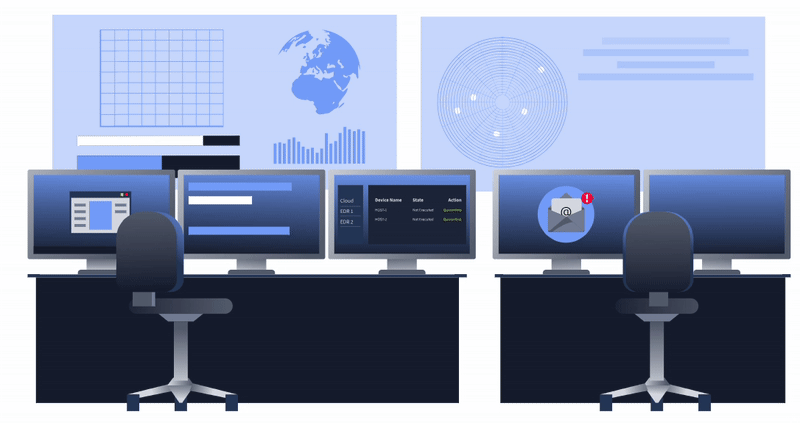
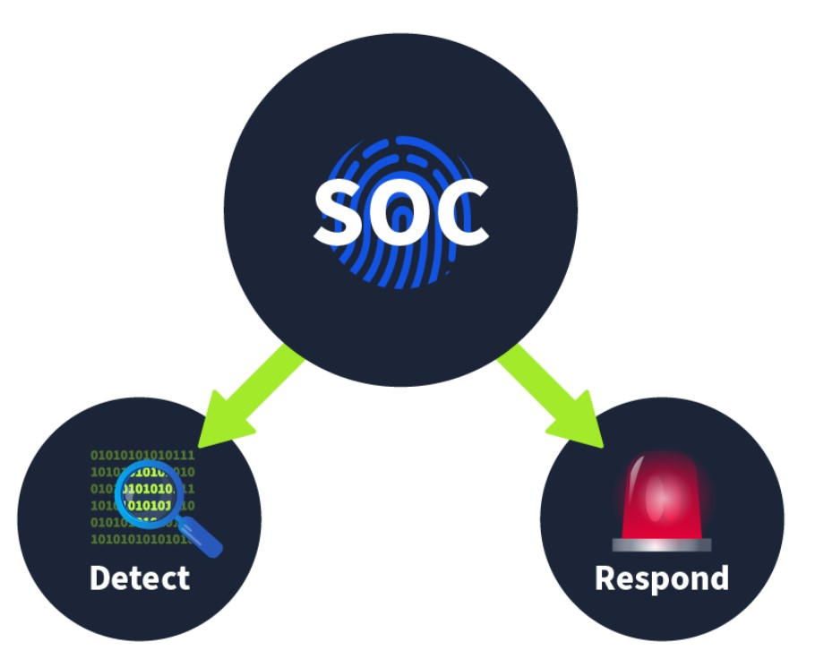
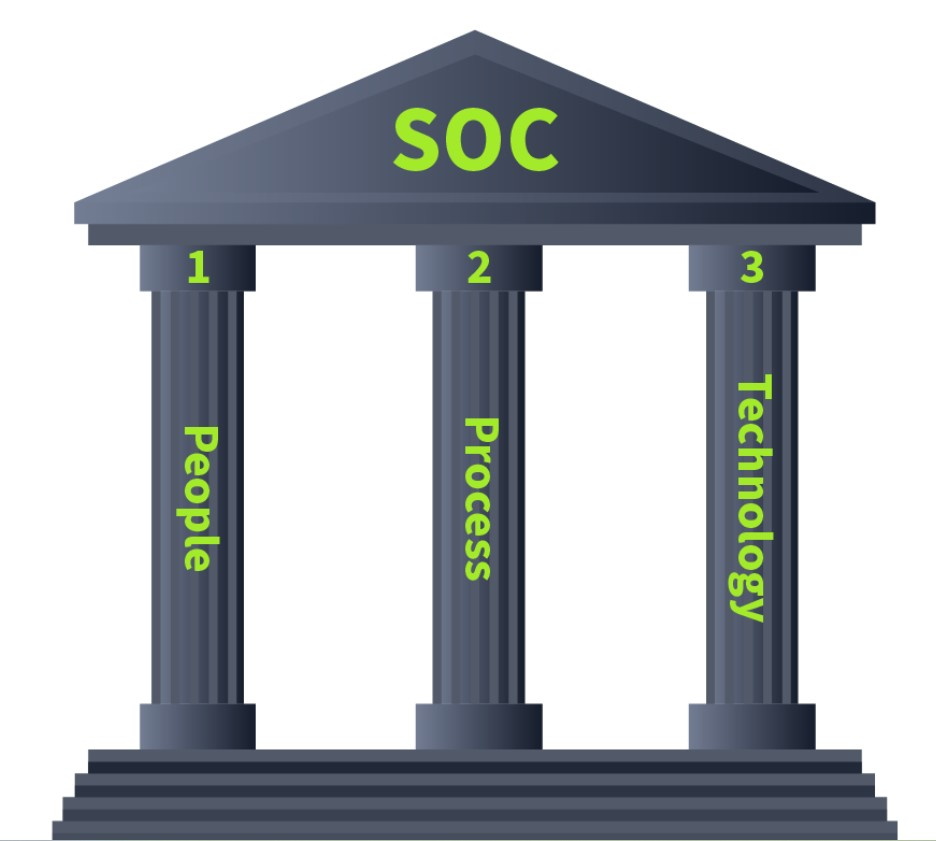
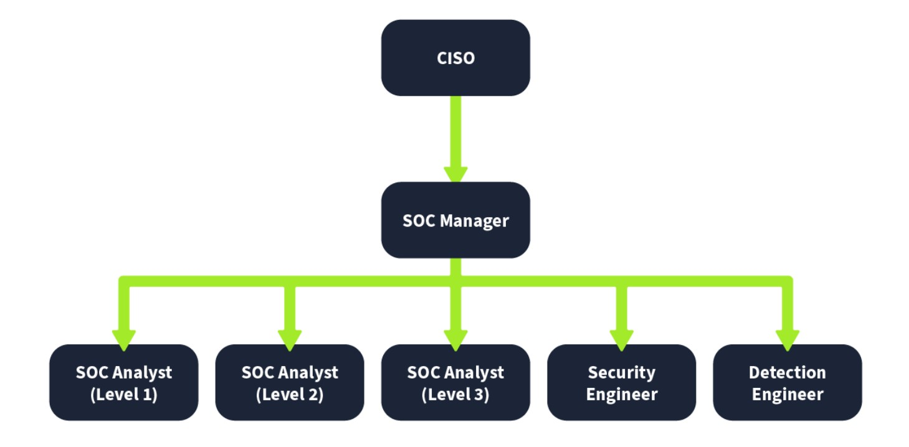
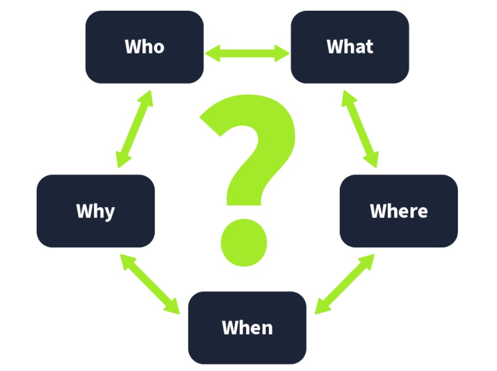

# Cybersecurity 101 
---
# SOC (Security Operations Center) - Fundamentals

Technology has made our lives more efficient, but with this efficiency comes more responsibility. Modern-day fears have come a long way from the exploitation of physical assets. The critical data, called secrets, are no longer stored in physical files. Organizations carry tons of confidential data in their network and systems. Any unauthorized disruption, loss, or modification to this data may cause them a huge damage. Threat actors discover and exploit new vulnerabilities in these networks and systems daily, becoming a major concern in cyber security. Traditional security practices may not be enough to prevent many of these threats. Dedicating a whole team to managing your organization’s security is important.

A SOC (Security Operations Center) is a dedicated facility operated by a specialized security team. This team aims to continuously monitor an organization’s network and resources and identify suspicious activity to prevent damage. This team works 24 hours a day, seven days a week.

  

## Purpose and Components

The main focus of the SOC team is to keep **Detection** and **Response** intact. The SOC team has some resources available in the form of security solutions that help them achieve this. These solutions integrate the whole company’s network and all the systems to monitor them from one centralized location. Continuous monitoring is required to detect and respond to any security incident.

  

### Detection

- **Detect Vulnerabilities**  
  - A vulnerability is a weakness that attackers can exploit to gain unauthorized access or perform actions beyond their permission level.  
  - Vulnerabilities may exist in operating systems or applications on servers, computers, and other devices.  
  - Example: A group of Windows systems may need to be patched against a known vulnerability.  
  - Although managing vulnerabilities may not be the SOC’s direct responsibility, unpatched systems pose a serious risk to overall security.

- **Detect Unauthorized Activity**  
  - Occurs when someone accesses systems without permission, often by using stolen credentials.  
  - Example: An attacker logs in using a legitimate employee’s username and password.  
  - Clues such as login location, time, or device fingerprint can help identify unauthorized access.  
  - Quick detection is critical to prevent damage.

- **Detect Policy Violations**  
  - Security policies define rules and procedures to protect the organization and ensure compliance.  
  - Violations vary by company but can include:  
    - Downloading pirated media  
    - Sending confidential data over insecure channels  
  - Detecting and addressing these violations helps maintain a secure environment.

- **Detect Intrusions**  
  - Refers to unauthorized access or compromise of systems and networks.  
  - Examples include:  
    - Exploiting a vulnerable web application  
    - A user visiting a malicious site and infecting their machine  
  - The SOC must act quickly to identify and contain such threats.

### Response

- **Support with Incident Response**  
  - Once a security incident is detected, the SOC plays a critical role in supporting the **incident response process**.  
  - The main goal is to **contain the threat**, **minimize impact**, and **restore normal operations** as quickly as possible.  
  - Key responsibilities in the response phase include:  
    - **Alerting and escalation**: Notifying relevant teams and escalating incidents based on severity.  
    - **Initial containment**: Isolating affected systems to prevent further damage.  
    - **Evidence collection**: Gathering logs, network traffic, and other artifacts for forensic analysis.  
    - **Root cause analysis**: Identifying how the attack occurred and what vulnerabilities were exploited.  
    - **Remediation support**: Assisting teams in patching vulnerabilities, removing malware, or restoring systems.  
    - **Coordination with other teams**: Collaborating with IT, legal, PR, and management for comprehensive response efforts.  
    - **Communication**: Ensuring accurate and timely updates to stakeholders throughout the incident.  
    - **Post-incident review**: Participating in debriefs to improve processes and prevent recurrence.

  - The SOC's continuous monitoring, threat intelligence, and deep visibility into systems make it a key player in **reducing response time** and **limiting the blast radius** of security incidents.

## The Three Pillars of a SOC

A mature and effective Security Operations Center (SOC) relies on three foundational pillars: **People**, **Process**, and **Technology**. These elements must work together to ensure the SOC can efficiently detect, respond to, and recover from security incidents.

  

- **People**  
  - The SOC is staffed by skilled professionals such as SOC analysts, incident responders, threat hunters, and engineers.  
  - These individuals bring the **expertise**, **intuition**, and **decision-making ability** that technology alone cannot provide.  
  - Regular training, upskilling, and collaboration are essential for maintaining a high-functioning team.

- **Process**  
  - Well-defined and documented processes ensure **consistency**, **efficiency**, and **accountability** in incident handling.  
  - This includes workflows for:  
    - Alert triage and investigation  
    - Incident response  
    - Escalation paths  
    - Reporting and documentation  
  - Clear processes reduce confusion and help the SOC act decisively during critical incidents.

- **Technology**  
  - The SOC uses advanced tools and platforms to gain **visibility**, **automate tasks**, and **respond to threats**.  
  - Common technologies include:  
    - SIEM (Security Information and Event Management)  
    - EDR (Endpoint Detection and Response)  
    - SOAR (Security Orchestration, Automation, and Response)  
    - Threat intelligence platforms  
  - These tools help detect anomalies, correlate events, and support real-time decision-making.

Together, **People**, **Process**, and **Technology** form the foundation of a **mature SOC**, capable of defending the organization against evolving cyber threats.

## People

Regardless of the evolution and automation of most security tasks, **People** in a SOC will always be critical.

- Automated tools can generate a large number of alerts, many of which turn out to be **false positives**. Without human analysis, this creates **noise** that overwhelms the system.

- **Analogy**:  
  Imagine you're part of a **fire brigade** using centralized software that integrates all fire alarms across a city.  
  Suddenly, you receive dozens of alerts at once, all from different locations. Upon responding, you discover most were triggered by **smoke from cooking**, not actual fires.  
  The effort and resources were wasted chasing **non-critical events**.

- The same applies in a SOC. Without people, automated tools may lead teams to focus on **irrelevant or low-priority alerts**.

- **Why People Matter**:  
  - Provide **contextual judgment** to differentiate between real threats and benign activity  
  - Reduce **alert fatigue** by tuning detection systems  
  - Prioritize incidents based on **risk and impact**  
  - Make critical decisions during incident response

Ultimately, it’s the **human element** that ensures security solutions are used effectively—identifying what truly matters and responding swiftly to actual threats.

The People are known as the SOC team. This team has the following roles and responsibilities.

  

#### Key Roles in a SOC

A Security Operations Center (SOC) is composed of multiple roles, each with a distinct function. These roles work together to detect, analyze, and respond to threats effectively.

- **SOC Analyst (Level 1)**  
  - First line of defense and the initial point of contact for all alerts generated by security tools.  
  - Responsibilities include:  
    - Performing basic **alert triage**  
    - Identifying whether a detection is a **false positive or potential threat**  
    - Reporting suspicious activity through the proper escalation channels

- **SOC Analyst (Level 2)**  
  - Conducts **in-depth investigations** on alerts escalated from Level 1.  
  - Responsibilities include:  
    - **Correlating logs and data** from multiple sources  
    - Validating and assessing the **impact and scope** of a potential incident  
    - Supporting containment and recommending response actions

- **SOC Analyst (Level 3)**  
  - Senior analysts with extensive experience and deep technical knowledge.  
  - Responsibilities include:  
    - **Proactive threat hunting** and detection of advanced threats  
    - Leading **incident response** activities such as containment, eradication, and recovery  
    - Providing guidance to Level 1 and 2 analysts

- **Security Engineer**  
  - Ensures the deployment, configuration, and smooth operation of the SOC's security infrastructure.  
  - Responsibilities include:  
    - **Deploying and managing** tools like SIEM, EDR, firewalls, etc.  
    - Assisting analysts by maintaining **tool availability and performance**

- **Detection Engineer**  
  - Focuses on building and tuning detection logic to identify malicious behavior.  
  - Responsibilities include:  
    - Writing and updating **detection rules** (often in collaboration with L2/L3 analysts)  
    - Reducing **false positives** and improving **alert accuracy**

- **SOC Manager**  
  - Oversees the entire SOC team and its processes.  
  - Responsibilities include:  
    - Managing **daily operations** and ensuring procedures are followed  
    - Providing regular updates to the **CISO** about threat posture and SOC effectiveness  
    - Supporting team development and ensuring alignment with the organization's security goals

Together, these roles form a **layered defense structure** capable of identifying and responding to threats quickly and efficiently.

**Note**: The roles in the SOC team can increase or decrease depending on the size and criticality of the organizations.

## Process

In a SOC environment, each team member has specific **processes** to follow, aligned with their role. These processes help ensure consistent, efficient, and structured operations. One of the most critical and foundational processes is **Alert Triage**.

#### Alert Triage

The **alert triage** process is the **first line of analysis** that helps determine whether a security alert is **legitimate**, **false**, or requires **escalation**. This process is primarily handled by **Level 1 SOC Analysts**, but it's vital across the entire SOC.

Triage is essential because it helps the team:

- Prioritize alerts based on **severity**
- Avoid **alert fatigue** by filtering out noise
- Escalate meaningful alerts to **higher-level analysts** for deeper investigation

  

Following are some questions that need to be answered during the triage of an alert. 
**Alert:** Malware detected on Host: GEORGE PC

| 5 Ws   | Answers                                                                                                  |
|--------|----------------------------------------------------------------------------------------------------------|
| **What?**  | A malicious file was detected on one of the hosts inside the organization’s network.                   |
| **When?**  | The file was detected at 13:20 on June 5, 2024.                                                        |
| **Where?** | The file was detected in the directory of the host: "GEORGE PC".                                       |
| **Who?**   | The file was detected for the user George.                                                             |
| **Why?**   | After the investigation, it was found that the file was downloaded from a pirated software-selling website. The investigation with the user revealed that they downloaded the file as they wanted to use a software for free. |

#### Reporting

The detected harmful alerts need to be escalated to higher-level analysts for a timely response and resolution. These alerts are escalated as tickets and assigned to the relevant people.

The report should:

- Discuss all the **5 Ws** thoroughly.
- Provide a detailed analysis of the incident.
- Include screenshots as evidence of the malicious activity.

#### Incident Response and Forensics

Sometimes, the reported detections point to highly malicious activities that are critical. In these scenarios, high-level teams initiate an incident response.

The incident response process is discussed in detail in the Incident Response room.

Occasionally, a detailed forensic investigation is required. This forensic activity aims to determine the root cause of the incident by analyzing artifacts from the affected system or network.

## Technology

Having the right **People** and **Processes** in place is essential, but without effective security solutions for detection and response, the SOC cannot operate efficiently. The **Technology** pillar in the SOC refers to these security solutions, which minimize the manual effort needed by the SOC team to detect and respond to threats.

An organization’s network consists of many devices and applications. Detecting and responding to threats individually on each device or application would require significant effort and resources. Security solutions **centralize** information from all devices and applications in the network and **automate detection and response** capabilities.

#### Key Security Solutions

**SIEM (Security Information and Event Management):**  
- Collects logs from various network devices (log sources).  
- Uses detection rules containing logic to identify suspicious activity.  
- Correlates data across multiple log sources to generate alerts.  
- Modern SIEMs also include user behavior analytics, threat intelligence, and machine learning to enhance detection.  
> **Note:** SIEM primarily provides **detection** capabilities within the SOC.

**EDR (Endpoint Detection and Response):**  
- Provides detailed, real-time and historical visibility into endpoint activities.  
- Operates at the endpoint level and supports automated responses.  
- Enables detailed investigation and quick responses with minimal clicks.

**Firewall:**  
- Acts as a network security barrier between internal and external networks.  
- Monitors and filters incoming and outgoing network traffic.  
- Uses detection rules to block suspicious traffic before it reaches the internal network.

#### Other Security Solutions

Additional tools play important roles in a SOC environment, including:  
- Antivirus  
- Endpoint Protection Platforms (EPP)  
- Intrusion Detection/Prevention Systems (IDS/IPS)  
- Extended Detection and Response (XDR)  
- Security Orchestration, Automation, and Response (SOAR)  

#### Choosing Technology

The decision on what technology to deploy in a SOC depends on:  
- The organization's **threat surface**  
- Available **resources**  

Careful consideration ensures the right balance of coverage and efficiency.

---
> **Note:** These notes document hands-on learning from the TryHackMe *Cybersecurity 101* path. The exercises cover fundamental cybersecurity topics, including Linux basics, networking concepts, and web technologies. This document is intended for personal learning, revision, and ethical skill development. All screenshots, commands, and actions are for educational purposes only.  
> — Compiled by moh4med404 | Curious Mind | Cybersecurity Enthusiast
