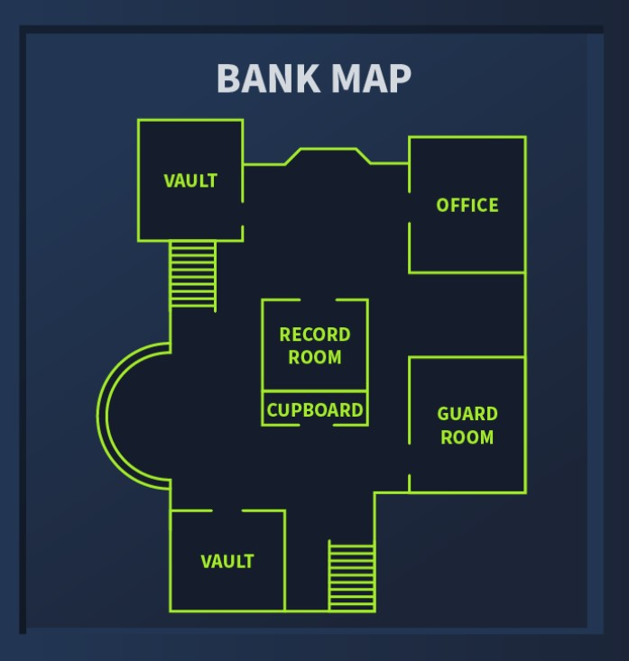
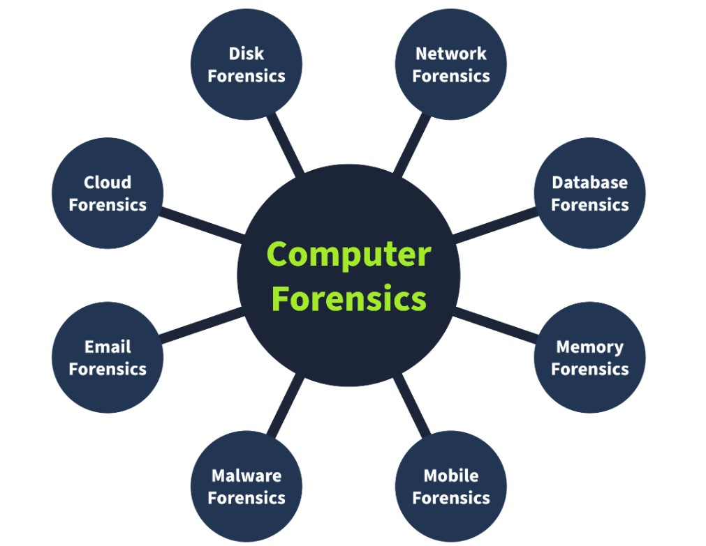
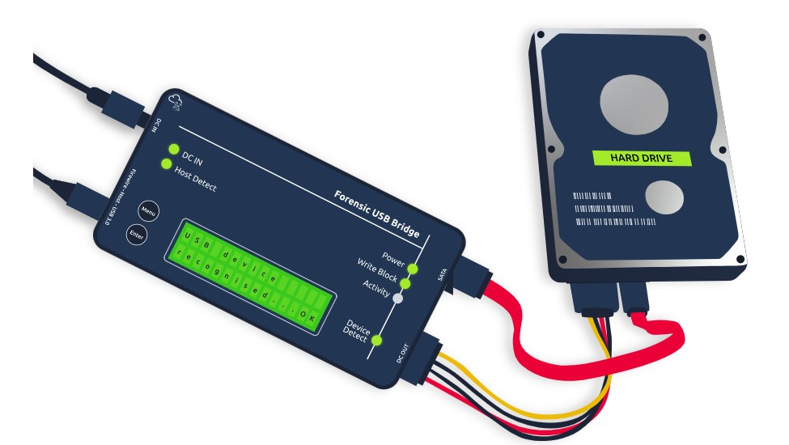

# Cybersecurity 101 
---
# Digital Forensics Fundamentals

Forensics is the application of methods and procedures to investigate and solve crimes. The branch of forensics that investigates cyber crimes is known as **digital forensics**. **Cyber crime** is any criminal activity conducted on or using a digital device. Several tools and techniques are used to investigate digital devices thoroughly after any crime to find and analyze evidence for necessary legal action.

### Digital Crimes and Forensics Example

Digital devices have solved many problems—communication across the globe is now just a text or call away. However, with the vast usage of digital devices, there has also been an increase in digital crimes, commonly known as **cyber crimes**. Various types of crimes are committed using digital devices.

#### Case Study: Bank Robbery Investigation

Consider a scenario where law enforcement agencies raid a bank robber’s residence with proper search warrants. They found several digital devices, including:

- Laptop  
- Mobile phone  
- Hard drive  
- USB drive  

The case was handed over to the **digital forensics team**, who securely collected evidence and conducted a thorough investigation in their lab, equipped with forensic tools.

#### Evidence Found on the Digital Devices:

- A **digital map** of the bank stored on the suspect’s laptop, used for planning the robbery.  
- A document on the hard drive detailing the bank’s **entrance and escape routes**.  
- Another document on the hard drive listing the bank’s **physical security controls**, which the suspect planned to bypass.  
- Media files (photos and videos) of the suspect’s **previous robberies**, stored on the laptop.  
- Illegal chat groups and call records related to the bank robbery found on the suspect’s **mobile phone**.

This case highlights the critical role of digital forensics in uncovering evidence from electronic devices during criminal investigations.

  

All this evidence helped law enforcement in the legal proceedings of the case. This scenario discusses a case from the start till the end. Some procedures are followed by the digital forensics team while collecting the evidence, storing it, analyzing it, and reporting it.

## Digital Forensics Methodology 

The digital forensics team has various cases requiring different tools and techniques. However, the National Institute of Standards and Technology (NIST) defines a general process for every case. The NIST works on defining frameworks for different areas of technology, including cyber security, where they introduce the process of digital forensics in four phases.

  

#### 1. Collection

The first phase of digital forensics is **data collection**. It involves:

- Identifying all devices from which data can be collected (e.g., personal computers, laptops, digital cameras, USBs found at the crime scene).  
- Ensuring the **original data is not tampered with** during collection.  
- Maintaining proper documentation detailing the collected items.  

*Note:* Evidence acquisition procedures will be discussed in upcoming tasks.

#### 2. Examination

The collected data can be overwhelming due to its size, so it needs to be filtered:

- Extract **data of interest** relevant to the investigation.  
- Example: From all media files on a digital camera, filter only those recorded at a specific date and time.  
- Similarly, extract data belonging to a specific user account from a system with multiple users.  

The examination phase narrows down the data set for the next phase.

#### 3. Analysis

A **critical phase** where investigators:

- Analyze the filtered data by correlating multiple pieces of evidence.  
- Draw conclusions relevant to the case.  
- Extract a **chronological sequence** of activities pertinent to the investigation.

#### 4. Reporting

The final phase involves preparing a **detailed report** including:

- The methodology used during the investigation.  
- Detailed findings based on the collected evidence.  
- Recommendations, if any.  
- An **executive summary** tailored to the understanding level of law enforcement and executive management.

*This structured approach ensures that digital evidence is handled meticulously and investigations are thorough and credible.*

### Types of Digital Forensics
As part of the collection phase, we saw that various pieces of evidence can be found at the crime scene. Analyzing these multiple categories of evidence requires various tools and techniques. There are different types of digital forensics, all with their own collection and analysis methodologies. Some of the most common types are listed below.

  

#### 1. Computer Forensics
The most common type, focusing on investigating computers—the devices most frequently involved in crimes.

#### 2. Mobile Forensics
Involves examining mobile devices to extract evidence such as call records, text messages, GPS locations, and more.

#### 3. Network Forensics
Covers investigations beyond individual devices, focusing on the entire network. Most evidence here consists of network traffic logs.

#### 4. Database Forensics
Investigates intrusions into databases where critical data is stored, especially those involving data modification or exfiltration.

#### 5. Cloud Forensics
Focuses on data stored in cloud infrastructure. This type can be challenging due to limited evidence available on cloud platforms.

#### 6. Email Forensics
Investigates emails to detect phishing, fraud, or other malicious campaigns, given email's widespread use for professional communication.

## Evidence Acquisition

Acquiring evidence is a critical job. The forensics team must collect all the evidence securely without tampering with the original data. Evidence acquisition methods for digital devices depend on the type of digital device. However, some general practices must be followed while the evidence is acquired. Let’s discuss some of the important ones.

#### Proper Authorization

The forensics team should obtain authorization from the relevant authorities before collecting any data. Evidence collected without prior approval may be deemed inadmissible in court. Forensic evidence contains private and sensitive data of an organization or individual. Proper authorization before collecting this data is essential for investigating according to the limits of the law.

  

#### Chain of Custody

Imagine that a team of investigators collects all the evidence from the crime scene, and some of the evidence goes missing after a few days, or there is any change in the evidence. No individual can be held accountable in this scenario because there is no proper process for documenting the evidence owners. This problem can be solved by maintaining a chain of custody document.

A chain of custody is a formal document containing all the details of the evidence. Some of the key details are listed below:

- Description of the evidence (name, type).  
- Name of individuals who collected the evidence.  
- Date and time of evidence collection.  
- Storage location of each piece of evidence.  
- Access times and the individual record who accessed the evidence.  

This creates a proper trail of evidence and helps preserve it. The chain of custody document can be used to prove the integrity and reliability of the evidence admitted in court. 

A sample chain of custody can be downloaded from [here](https://www.nist.gov/document/sample-chain-custody-formdocx).

#### Use of Write Blockers

Write blockers are an essential part of the digital forensics team’s toolbox. Suppose you are collecting evidence from a suspect’s hard drive and attaching the hard drive to the forensic workstation. While the collection occurs, some background tasks in the forensic workstation may alter the timestamps of the files on the hard drive. This can cause hindrances during the analysis, ultimately producing incorrect results.

Suppose the data was collected from the hard drive using a write blocker instead in the same scenario. This time, the suspect’s hard drive would remain in its original state as the write blocker can block any evidence alteration actions.

  

## Windows Forensics

The most common types of evidence collected from crime scenes are desktop computers and laptops, as most criminal activity involves a personal system. These devices have different operating systems running on them. In this task, we will discuss the evidence acquisition and analysis of the Windows operating system, which is a very common operating system that has been investigated in several cases.

As part of the data collection phase, forensic images of the Windows operating system are taken. These forensic images are bit-by-bit copies of the whole operating system. Two different categories of forensic images are taken from a Windows operating system:

- **Disk image:**  
  The disk image contains all the data present on the storage device of the system (HDD, SSD, etc.). This data is non-volatile, meaning that the disk data would survive even after a restart of the operating system. For example, all the files like media, documents, internet browsing history, and more.

- **Memory image:**  
  The memory image contains the data inside the operating system’s RAM. This memory is volatile, meaning the data will get lost after the system is powered off or restarted. For example, to capture open files, running processes, current network connections, etc., the memory image should be prioritized and taken first from the suspect’s operating system; otherwise, any restart or shutdown of the system would result in all the volatile data getting deleted.

While carrying out digital forensics on a Windows operating system, disk and memory images are very important to collect.

Let’s discuss some popular tools used for disk and memory image acquisition and analysis of the Windows operating system.

1. **FTK Imager**: FTK Imager is a widely used tool for taking disk images of Windows operating systems. It offers a user-friendly graphical interface for creating the image in various formats. This tool can also analyze the contents of a disk image. It can be used for both acquisition and analysis purposes.
2. **Autopsy**: [Autopsy](https://www.autopsy.com/) is a popular open-source digital forensics platform. An investigator can import an acquired disk image into this tool, and the tool will conduct an extensive analysis of the image. It offers various features during image analysis, including keyword search, deleted file recovery, file metadata, extension mismatch detection, and many more.
3. **DumpIt**: [DumpIt](https://www.toolwar.com/2014/01/dumpit-memory-dump-tools.html) offers the utility of taking a memory image from a Windows operating system. This tool creates memory images using a command-line interface and a few commands. The memory image can also be taken in different formats.
4. **Volatility**: [Volatility](https://volatilityfoundation.org/) is a powerful open-source tool for analyzing memory images. It offers some extremely useful plugins. Each artifact can be analyzed using a specific plugin. This tool supports various operating systems, including Windows, Linux, macOS, and Android.

**Note**: Various other tools are also used to acquire and analyze disk and memory images of the Windows operating system.

---
> **Note:** These notes document hands-on learning from the TryHackMe *Cybersecurity 101* path. The exercises cover fundamental cybersecurity topics, including Linux basics, networking concepts, and web technologies. This document is intended for personal learning, revision, and ethical skill development. All screenshots, commands, and actions are for educational purposes only.  
> — Compiled by moh4med404 | Curious Mind | Cybersecurity Enthusiast
