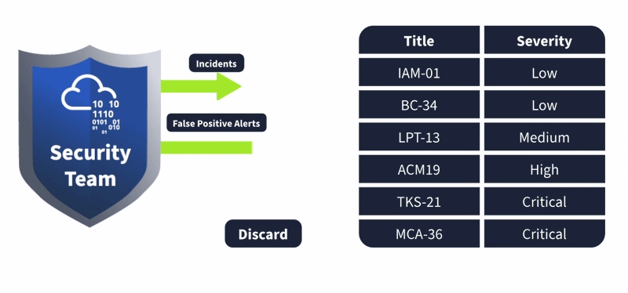
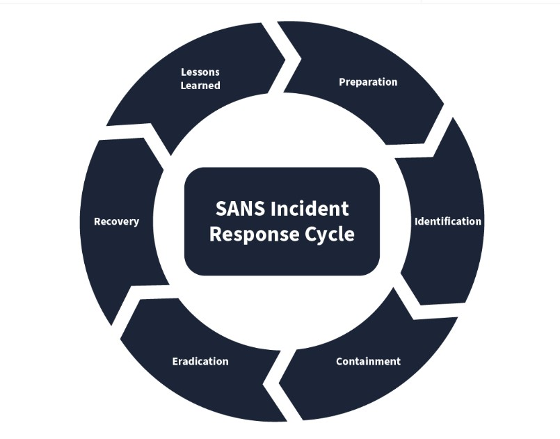
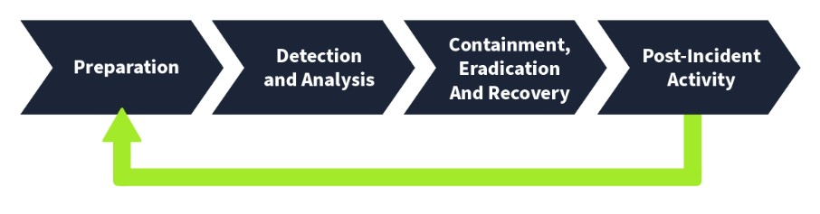
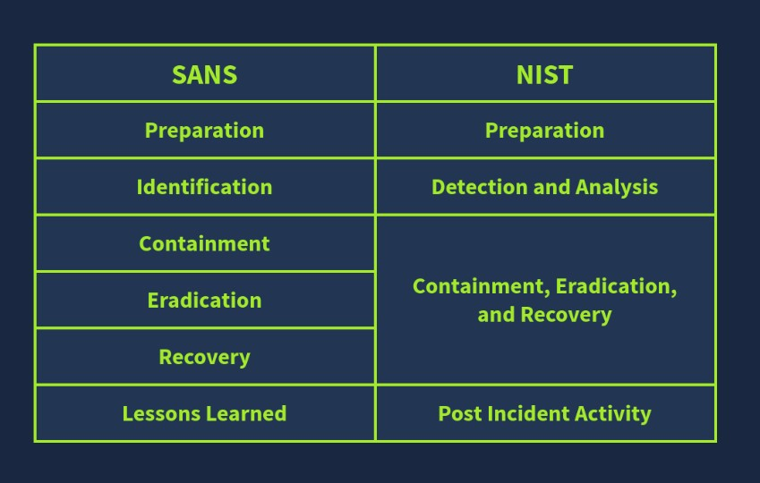

# Cybersecurity 101 
---
# Incident Response Fundamentals

Imagine living in a heavily insecure street with many expensive things in your home. You must be thinking of having a security guard and a few CCTV cameras in your home. Hiding the expensive material inside a hidden underground room is a good idea if any intruder successfully enters the house. These are the things that you plan for the safety of your home, even before any attack occurs.

Besides these proactive measures, did you ever consider how things would work if someone successfully bypassed your external security mechanisms and gained access to your home? You must also take several other measures after your home is attacked.

Let’s take the above into the digital realm. You may have heard about a cyber attack on an organization that caused them to lose thousands of dollars. Several such cases are reported daily on the internet. These are referred to as **Cyber Security Incidents**. Just as in the scenario above, where you planned for the security of your home, cyber security incidents also need some planning and resources to avoid huge losses.

**Incident Response** handles an incident from its start to end. From deploying security in several areas to prevent incidents to fighting with them and minimizing their impact, incident response is a thorough guideline.

  

### Event Logging and Detection

Several different processes run on your computing devices, e.g., laptops, mobile phones, etc. Some of these processes are interactive, meaning you perform the actions—such as playing a game or watching a video. There will also be some non-interactive processes running in the background that may not require your interaction with them. They are just necessary for your device.

Both of these types of processes generate several **events**. Anything they do, an event is logged for what they have done.

Events are generated in huge numbers regularly. This is because many processes run on a device, each performing different routine tasks, generating numerous events. These events can sometimes point to something bad going on in your device.

How do we check these vast numbers of events and see if they point to some destructive activity? There are **security solutions** in place to solve this problem. These events are ingested into the security solutions as **logs**, and the security solutions can identify harmful activities in them. This has made our job way easier!

But wait a minute—the real challenge begins **after** the security solution points these activities out.

  

### Alerts, False Positives, and Incident Severity

When a security solution identifies an event or group of events associated with possible harmful activity, it triggers an **alert**. The security team then analyzes these alerts to determine whether they are valid threats or not.

There are two common outcomes for alerts:

- **False Positives:**  
  Alerts that indicate something dangerous but turn out to be harmless.  

- **True Positives:**  
  Alerts that indicate something harmful and indeed turn out to be actual threats.

#### Examples:

- **False Positive:**  
  A security solution raises an alert about a high volume of data being transferred from one system to an external IP address. Upon investigation, the security team finds that the system was performing a scheduled backup to a cloud storage service. This is considered a false positive.

- **True Positive:**  
  A security solution raises an alert about a phishing attempt targeting a user in the organization. After analysis, the team confirms that the email was indeed a phishing attempt meant to compromise the user's system. This is classified as a true positive.

These **true positive** alerts are often escalated and categorized as **incidents**.

#### Incident Severity

Once an alert is confirmed as a true positive and becomes an incident, the next step is to assign it a **severity level**. This helps prioritize the response effort when multiple incidents occur simultaneously.

Incidents are typically categorized into the following severity levels:

- **Low**
- **Medium**
- **High**
- **Critical**

#### Prioritization:

- **Critical severity** incidents are always the top priority and should be addressed first.
- They are followed by **high severity** incidents.
- Then **medium** and **low** severity incidents are addressed based on available resources and potential impact.

Understanding the severity helps the security team focus their efforts where they matter the most, minimizing damage and ensuring a timely response.

  

## Types of Incidents

# Types of Incidents

People usually label every harmful activity associated with the digital world as a *hacking attempt*. While this may be technically correct, it is too generic from a cyber security standpoint. Security incidents can come in many forms. In previous examples, we discussed a phishing email that was identified as a **true positive** and became an **incident** after investigation. This type of incident involved a malicious attachment that could have led to further compromise.

Below are some of the major types of cyber security incidents:

1. **Malware Infections**

   **Malware** is a malicious program that can damage a system, network, or application. The majority of incidents in cyber security are associated with malware infections. These infections are typically introduced through files like documents, executables, or scripts.

   Malware comes in many forms—viruses, worms, ransomware, spyware, etc.—each designed to cause unique types of harm.

2. **Security Breaches**

   A **security breach** occurs when an unauthorized person gains access to confidential or restricted data. These incidents are considered highly critical, as organizations often depend on keeping certain data secure and accessible only to trusted personnel.

   Security breaches are not just data theft—they can lead to reputational damage, legal penalties, and operational disruption.

3. **Data Leaks**

   **Data leaks** refer to incidents where confidential information is exposed to unauthorized entities. Unlike breaches, data leaks can also result from human error or system misconfigurations, not just deliberate attacks.

   Attackers often exploit leaked data for reputational harm, blackmail, or further exploitation.

4. **Insider Attacks**

   **Insider attacks** are initiated by individuals within the organization—employees, contractors, or partners—who misuse their access for malicious purposes. For example, a disgruntled employee infecting the network using a USB drive is a classic insider attack.

   These are especially dangerous since insiders already have elevated access and knowledge of internal systems.

5. **Denial of Service (DoS) Attacks**

   **Denial of Service (DoS)** attacks aim to make systems, networks, or applications unavailable to legitimate users. This is achieved by overwhelming the target with fake requests, exhausting its resources.

   Availability is a core pillar of cyber security. DoS attacks strike at this principle, impacting business operations and user trust.

All these incidents have their unique potential to impact the victim negatively. These incidents can not be compared in terms of the severity of the impact they create. This is because a particular incident can be disastrous for one organization while it can cause minor damage to another. For example, XYZ Corp. may not be heavily impacted by a data leak as the information it stores can be useless to anybody else. However, it can undergo a massive loss in case of a Denial of Service (DoS) attack on its primary website, as its services depend on that website.

## Incident Response Process

In the above task, we saw different types of incidents. Sometimes, handling a variety of incidents in an environment can be difficult. Due to the distinct nature of incidents in organizations, there should be a structured process for incident response. Incident Response Frameworks help us in this regard. These are the generic approaches to follow in any incident for effective response. We will discuss the two widely used incident response frameworks: SANS and NIST.

SANS and NIST are popular organizations contributing to cyber security. SANS has offered various courses and certifications in cyber security, and NIST played its role in developing standards and guidelines for cyber security. Both SANS and NIST have quite similar incident response frameworks.

The SANS incident Response framework has 6 phases, which can be called 'PICERL' to remember them easily.

### Incident Response Lifecycle

The incident response process is typically divided into six structured phases. Each phase plays a critical role in managing and mitigating cyber security incidents effectively.

| **Phase**           | **Explanation**                                                                                                                                                                                | **Example**                                                                                                                                                                           |
|---------------------|------------------------------------------------------------------------------------------------------------------------------------------------------------------------------------------------|---------------------------------------------------------------------------------------------------------------------------------------------------------------------------------------|
| **1. Preparation**   | This is the first phase. The preparation phase includes building the necessary resources to handle an incident. These resources include developing incident response teams, having a proper incident response plan in place, and deploying necessary security solutions to combat the incidents. | Conducting awareness training for employees on phishing emails. Phishing emails are fraudulent emails sent by malicious attackers that can trick users into triggering an incident. |
| **2. Identification** | The identification phase refers to looking for any abnormal behavior that may indicate an incident. This involves using various security solutions and techniques to monitor abnormal events. | The security team notices a huge amount of data being sent out from one of the hosts. Upon analysis, it was found to be compromised after a malicious file was downloaded from a phishing email attachment. |
| **3. Containment**   | Once an incident has been identified, the next step should be to contain it. This means minimizing the impact of the attack. This is usually done by isolating the victim machine, disabling the compromised user accounts, etc. | The security team isolates the host from the network to minimize the impact and prevent the attacker from accessing other systems through the compromised host.                      |
| **4. Eradication**   | This phase involves removing the threat from the affected environment. The eradication phase ensures that the environment is clean and safe before proceeding to recovery. | A deep malware scan was executed on the system to remove the malicious software from the host.                                                                                        |
| **5. Recovery**      | The recovery phase involves restoring and validating system functionality. It includes recovering systems from backups or rebuilding them and verifying they are safe to use. | The compromised host was re-configured, and the exfiltrated data was restored from the backup.                                                                                        |
| **6. Lessons Learned** | This phase focuses on analyzing the incident to identify gaps and improve future response. It helps refine the incident response process and prevent recurrence. | Conducting a post-incident review meeting to analyze the incident's root cause and improve security to prevent future attacks.                                                       |

  

The Incident Response Framework of NIST is similar to the SANS framework we studied above. The number of phases in this framework is reduced to 4.

  

Following is the comparison of both:

  

#### Incident Response Plan

Organizations may derive their incident response processes by following established security frameworks. Every organization should maintain a formal document that outlines its procedures for managing security incidents. This document is known as the **Incident Response Plan (IRP)**.

The Incident Response Plan is a structured document that outlines the organization's approach to detecting, responding to, and recovering from security incidents. It is **formally approved by senior management** and defines the steps to be taken **before, during, and after** an incident.

Key Components of the Incident Response Plan

The IRP typically includes, but is not limited to, the following components:

1. **Roles and Responsibilities**  
   Clearly defined roles for all team members involved in incident response, including their responsibilities and authority levels.

2. **Incident Response Methodology**  
   A step-by-step guide outlining how incidents will be identified, contained, eradicated, recovered from, and reviewed.

3. **Communication Plan**  
   Guidelines for internal and external communication, including how and when to notify stakeholders, affected users, and **law enforcement** if necessary.

4. **Escalation Path**  
   Defined criteria and procedures for escalating incidents based on severity, impact, and scope.

A well-prepared Incident Response Plan ensures that organizations can act quickly, efficiently, and consistently in the face of cyber threats, reducing damage and aiding a swift recovery.

## Incident Response Techniques

In the **Identification** phase (as referred to in the SANS framework) or **Detection and Analysis** (as per the NIST framework), identifying abnormal behavior and detecting incidents manually is incredibly challenging due to the volume and complexity of system events.

To address this, multiple **security solutions** are used—each serving a unique role in identifying, and in some cases, responding to incidents. Below is a brief overview of some widely-used solutions:

#### Key Security Solutions

1. **SIEM (Security Information and Event Management):**  
   SIEM solutions collect logs from across the infrastructure in a **centralized location** and **correlate** them to detect potential security incidents.

2. **AV (Antivirus):**  
   Antivirus solutions are designed to detect **known malicious software** and continuously **scan** systems for infections.

3. **EDR (Endpoint Detection and Response):**  
   EDR is deployed on individual endpoints (e.g., user devices) and protects them from **advanced-level threats**. EDR solutions often include **containment** and **eradication** capabilities as well.

#### Playbooks and Runbooks

After an incident is identified, it is essential to follow a structured approach to investigate the scope of the attack, contain it, and eradicate the threat.

#### **Playbooks**

**Playbooks** are high-level guidelines tailored for specific types of incidents. They offer a **standardized process** for responding to recurring threats and can save significant time during critical events.

Example Playbook: *Phishing Email Incident*

- Notify all stakeholders of the phishing email incident  
- Analyze the email header and body to determine if it's malicious  
- Check for and analyze any attachments  
- Determine if any users opened the attachments  
- Isolate infected systems from the network  
- Block the email sender

#### **Runbooks**

**Runbooks** are more **granular and technical** than playbooks. They provide detailed, **step-by-step execution** instructions for specific actions, tailored to available resources and environments.

While playbooks define *what* to do, runbooks focus on *how* to do it.

Both playbooks and runbooks are crucial in improving the speed, accuracy, and consistency of incident response across different types of threats.

---
> **Note:** These notes document hands-on learning from the TryHackMe *Cybersecurity 101* path. The exercises cover fundamental cybersecurity topics, including Linux basics, networking concepts, and web technologies. This document is intended for personal learning, revision, and ethical skill development. All screenshots, commands, and actions are for educational purposes only.  
> — Compiled by moh4med404 | Curious Mind | Cybersecurity Enthusiast