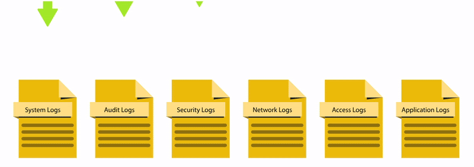
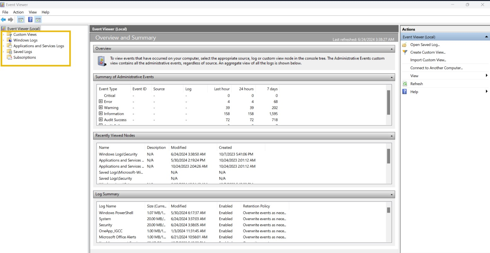
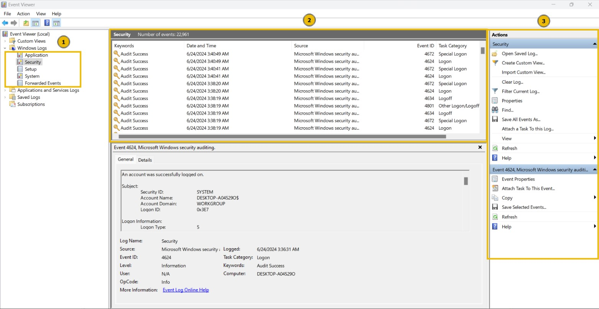
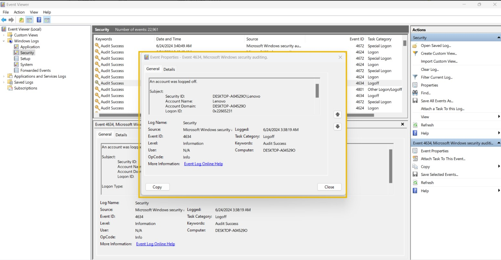
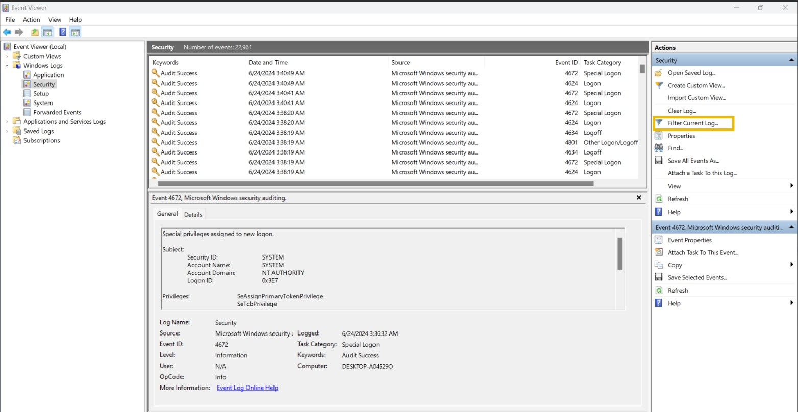
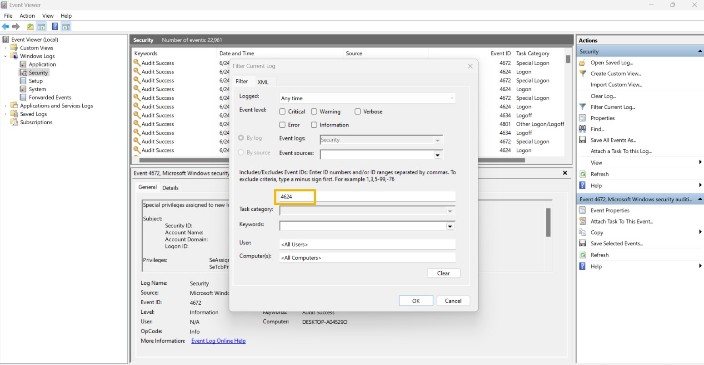
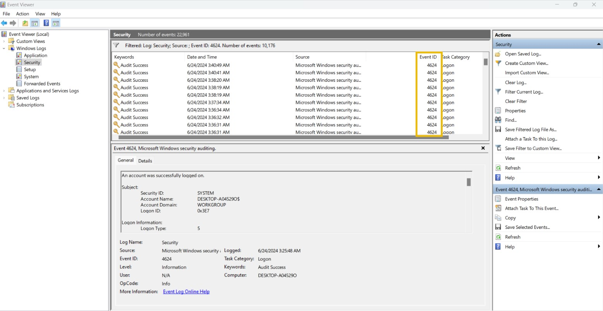

# Cybersecurity 101 
---
# Logs Fundamentals

Attackers are clever—they often take measures to avoid leaving traces on the victim's systems to evade detection. Yet, security teams frequently manage to determine **how an attack was executed**, and in some cases, even **identify the attacker**.

### Real-World Analogy

Imagine a group of policemen investigating the **disappearance of a precious locket** in a snowy jungle cabin. Here's what they found:

- A **brutally damaged wooden door**
- A **collapsed ceiling**
- **Footprints in the snow** leading to the cabin
- **CCTV footage** from a nearby residence

By piecing together these **physical clues**, they were able to **reconstruct the incident** and identify the criminal.

### Digital Clues: Enter Logs

So, what happens when the crime occurs **inside a digital device**? Where are these traces found?

In the digital world, these traces are stored in **logs**.

### What Are Logs?

**Logs** are the **digital footprints** left behind by system and user activities. These activities may be routine and legitimate—or they may be **malicious**.

Logs help security teams:

- **Trace what happened**
- **Determine how it happened**
- **Identify who was behind it**

Just like the real-world clues help solve physical crimes, logs are **critical pieces of evidence** in digital forensics and incident response.

In summary, logs play a **central role** in investigating security incidents by recording actions, changes, and patterns that may otherwise go unnoticed.

### Use Cases of Logs

Logs play a vital role in several areas of cyber security and system administration. They serve as a central source of truth, helping detect issues, investigate incidents, and ensure compliance.

Below are some key **use cases** where logs are especially important:

| **Use Case**                        | **Description**                                                                                              |
|------------------------------------|--------------------------------------------------------------------------------------------------------------|
| **1. Security Events Monitoring**  | Logs help detect anomalous behavior, especially when used in **real-time monitoring** systems.               |
| **2. Incident Investigation and Forensics** | Logs provide detailed records of activities, enabling security teams to perform **root cause analysis** of incidents. |
| **3. Troubleshooting**             | Logs record **errors and warnings** from systems or applications, helping diagnose and fix technical issues. |
| **4. Performance Monitoring**      | Logs offer insights into **system and application performance**, such as response times and load metrics.    |
| **5. Auditing and Compliance**     | Logs are critical for **audit trails** and meeting **compliance requirements**, helping demonstrate accountability. |

This section will help you gain an understanding of the **various types of logs** maintained across systems. You will also get hands-on experience **investigating logs** to trace different types of cyber attacks.

## Types of Logs

In the previous task, we saw various use cases of logs. But there is a challenge. Imagine you have to investigate an issue in a system through the logs; you open the log file of that system, and now you are lost after seeing numerous events of different categories.

Here is the solution: Logs are segregated into multiple categories according to the type of information they provide. So now you just need to look into the specific log file for which the issue relates.

For example, you need to investigate the successful logins from yesterday at a specific timeframe in Windows OS. Instead of looking into all the logs, you only need to see the system’s `Security Logs` to find the login information. We also have other types of logs that are useful in investigating different incidents. Let’s have a look at them.

 <br>

Different types of logs serve different purposes within an IT environment. Understanding each log type helps in efficiently monitoring systems, investigating incidents, and ensuring compliance.

| **Log Type**        | **Usage**                                                                                              | **Example Events**                                                                                                 |
|---------------------|--------------------------------------------------------------------------------------------------------|---------------------------------------------------------------------------------------------------------------------|
| **System Logs**      | Helpful in troubleshooting operating system issues and understanding system-level activities.          | - System startup and shutdown events<br>- Driver loading events<br>- System error events<br>- Hardware events      |
| **Security Logs**    | Used to detect and investigate security incidents. They provide visibility into security-related actions. | - Authentication events<br>- Authorization events<br>- Security policy changes<br>- User account changes<br>- Abnormal activity events |
| **Application Logs** | Track application-specific activities, both interactive and background processes.                      | - User interaction events<br>- Application changes<br>- Application updates<br>- Application error events          |
| **Audit Logs**       | Provide detailed records of system and user activities. Useful for compliance and monitoring.           | - Data access events<br>- System change events<br>- User activity events<br>- Policy enforcement events            |
| **Network Logs**     | Offer visibility into network traffic for troubleshooting and incident investigations.                  | - Incoming network traffic<br>- Outgoing network traffic<br>- Connection logs<br>- Firewall logs                   |
| **Access Logs**      | Record access to resources like applications, databases, or APIs.                                       | - Web server access logs<br>- Database access logs<br>- Application access logs<br>- API access logs               |

**Note**: There can be various other types of logs depending on the different applications and the services they provide.

Now that we understand what these logs are and how various types of logs can be helpful in different scenarios, let’s see how we analyze these logs and extract valuable information required from them. Log Analysis is a technique for extracting valuable data from logs. It involves looking for any signs of abnormal or unusual activities. Searching for a specific activity or abnormalities in the logs with the naked eye is impossible.

## Windows Event Logs Analysis

Like other operating systems, Windows OS also logs many of the activities that take place. These are stored in segregated log files, each with a specific log category. Some of the crucial types of logs stored in a Windows Operating System are:

- **Application:** There are many applications running on the operating system. Any information related to those applications is logged into this file. This information includes errors, warnings, compatibility issues, etc.
- **System:** The operating system itself has different running operations. Any information related to these operations is logged in the System log file. This information includes driver issues, hardware issues, system startup and shutdown information, services information, etc.
- **Security:** This is the most important log file in Windows OS in terms of security. It logs all security-related activities, including user authentication, changes in user accounts, security policy changes, etc.

Besides these, several other log files in the Windows operating system are designed for logging activities related to specific actions and applications.

Unlike other log files studied in the previous tasks, which had no built-in application to view them, Windows OS has a utility known as Event Viewer, which gives a nice graphical user interface to view and search for anything in these logs.

To open **Event Viewer**, click on the Start button of Windows and type `Event Viewer`. It will open the Event Viewer for you, as shown below. The highlighted area in the screenshot below shows the different available logs. 

 <br>

You can click `Windows Logs` from the highlighted section to see the different types of logs we discussed at the beginning of this task. 
The first highlighted portion shows the different log files. When we click one of these log files, we will see the different logs, as can be seen in the second highlighted portion. Lastly, in the third highlighted portion, we have different options for analyzing the logs.

 <br>

Let’s double-click on one of these logs to see its contents. 

 <br>

This is how a Windows event log looks. It has different fields. The major fields are discussed below:

- **Description:** This field has a detailed information of the activity.
- **Log Name:** The Log Name indicates the log file name.
- **Logged:** This field indicates the time of the activity.
- **Event ID:** Event IDs are unique identifiers for a specific activity.

Numerous event IDs are available in Windows event logs. We can use these event IDs to search for any specific activity. For example, event ID 4624 uniquely identifies the activity of a successful login, so you only need to search for this event ID 4624 when investigating successful logins.

Below is a list of frequently encountered **Windows Security Event IDs** and their corresponding descriptions. These are typically found in the **Security** log within Event Viewer and are crucial for monitoring account-related activities.

| **Event ID** | **Description**                                      |
|--------------|------------------------------------------------------|
| **4624**     | A user account successfully logged in                |
| **4625**     | A user account failed to login                       |
| **4634**     | A user account successfully logged off               |
| **4720**     | A user account was created                           |
| **4724**     | An attempt was made to reset an account’s password   |
| **4722**     | A user account was enabled                           |
| **4725**     | A user account was disabled                          |
| **4726**     | A user account was deleted                           |

These events are especially important when performing security audits or investigating unauthorized access or account changes.

There are many more event IDs. It is not necessary to remember all of them, but it is good to remember the crucial event IDs.

Event Viewer allows us to search for the logs related to a specific event ID with its ‘Filter Current Log’ feature. We can click on this feature to apply any filter. 

 <br>

When we click on the ‘Filter Current Log’ option, we will be prompted to enter the event IDs we want to filter. In the screenshot below, I filtered the event ID 4624. 

 <br>

Once I hit the 'OK' button, I can see all the logs with the event ID: 4624. I can now view any of these logs by double-clicking them. 

 <br>

## Web Server Access Logs Analysis

Every time we interact with a website—whether simply browsing, logging in, or uploading a file—we are generating **requests** to that web server. These requests are captured and stored in **access logs** maintained by the web server.

One of the most commonly used web servers is **Apache**, which stores its access logs in: `/var/log/apache2/access.log`

These logs are crucial for:

- Monitoring website activity  
- Identifying abnormal behavior  
- Troubleshooting issues  
- Investigating security incidents

#### Sample Log Fields Explained

Below are the key fields typically found in a **sample Apache access log** entry:

| **Field**       | **Description**                                                                                      |
|------------------|------------------------------------------------------------------------------------------------------|
| **IP Address**    | `"172.16.0.1"` – The IP address of the user making the request.                                      |
| **Timestamp**     | `"[06/Jun/2024:13:58:44]"` – The exact date and time when the request was made.                     |
| **HTTP Method**   | `"GET"` – The action the user wants the server to perform (e.g., `GET`, `POST`, `PUT`, etc.).       |
| **URL**           | `"/"` – The resource or endpoint that was requested.                                                |
| **Status Code**   | `"200"` – The server’s response to the request. Examples:  
  - `200` = OK  
  - `404` = Not Found  
  - `500` = Internal Server Error |
| **User-Agent**    | `"Mozilla/5.0 (Macintosh; Intel Mac OS X 10_12_3)...` – Details about the user's operating system, browser, and device. |

#### Why This Matters

Access logs can help detect:

- Unauthorized access attempts  
- Bot traffic  
- Suspicious upload or login activities  
- Web application attacks (e.g., SQL injection, XSS)

In the next steps, you’ll learn how to manually **analyze access logs** to extract this valuable information and recognize potential threats.


We can perform manual log analysis by using some command line utilities in the Linux operating system. The following are some commands that can be useful during manual log analysis. 

`cat` is a popular utility for displaying the contents of a text file. We can use the cat command to display the contents of a log file, as they are typically in the text format.

```bash 
root@kali$ cat access.log
172.16.0.1 - - [06/Jun/2024:13:58:44] "GET /products HTTP/1.1" 404 "-" "Mozilla/5.0 (Windows NT 10.0; Win64; x64) AppleWebKit/537.36 (KHTML, like Gecko) Chrome/58.0.3029.110 Safari/537.36"
10.0.0.1 - - [06/Jun/2024:13:57:44] "GET / HTTP/1.1" 404 "-" "Mozilla/5.0 (Macintosh; Intel Mac OS X 10_12_3) AppleWebKit/537.36 (KHTML, like Gecko) Chrome/58.0.3029.110 Safari/537.36"
192.168.1.1 - - [06/Jun/2024:13:56:44] "GET /about HTTP/1.1" 500 "-" "Mozilla/5.0 (Windows NT 10.0; Win64; x64) AppleWebKit/537.36 (KHTML, like Gecko) Chrome/58.0.3029.110 Safari/537.36"
```

Most systems rotate the logs regularly. This rotation helps them create individual log files for specific timeframes and not carry them all in a single log file. But sometimes, we may need to combine two log files. The cat command-line utility can also be helpful in this case. We can combine the results of multiple files within one single file, as shown below.

```bash 
root@kali$ cat access1.log access2.log > combined_access.log
```
`grep` is a very useful command line utility that allows you to search for strings and patterns inside a log file. For example, you may need to search if a specific IP address is present in your log file. You can do this by using the following command: The following command will search the access.log file for the string ‘192.168.1.1’ and display all the lines with this string.

```bash 
root@kali$ grep "192.168.1.1" access.log
192.168.1.1 - - [06/Jun/2024:13:56:44] "GET /about HTTP/1.1" 500 "-" "Mozilla/5.0 (Windows NT 10.0; Win64; x64) AppleWebKit/537.36 (KHTML, like Gecko) Chrome/58.0.3029.110 Safari/537.36"
192.168.1.1 - - [06/Jun/2024:13:53:44] "GET /products HTTP/1.1" 404 "-" "Mozilla/5.0 (Windows NT 10.0; Win64; x64) AppleWebKit/537.36 (KHTML, like Gecko) Chrome/58.0.3029.110 Safari/537.36"
192.168.1.1 - - [06/Jun/2024:13:46:44] "GET /about HTTP/1.1" 200 "-" "Mozilla/5.0 (Windows NT 10.0; Win64; x64) AppleWebKit/537.36 (KHTML, like Gecko) Chrome/58.0.3029.110 Safari/537.36"
```
The `less` command is helpful for handling multiple log files. You may need to analyze specific chunks one by one. For this, you can use the less command-line utility, which helps you view one page at a time.

```bash 
root@kali$ less access.log
172.16.0.1 - - [06/Jun/2024:13:52:44] "GET /products HTTP/1.1" 404 "-" "Mozilla/5.0 (Windows NT 6.1; Win64; x64) AppleWebKit/537.36 (KHTML, like Gecko) Chrome/58.0.3029.110 Safari/537.36"
10.0.0.1 - - [06/Jun/2024:13:48:44] "GET /about HTTP/1.1" 404 "-" "Mozilla/5.0 (Windows NT 6.1; Win64; x64) AppleWebKit/537.36 (KHTML, like Gecko) Chrome/58.0.3029.110 Safari/537.36"
192.168.1.1 - - [06/Jun/2024:13:46:44] "GET /about HTTP/1.1" 200 "-" "Mozilla/5.0 (Windows NT 10.0; Win64; x64) AppleWebKit/537.36 (KHTML, like Gecko) Chrome/58.0.3029.110 Safari/537.36"
```
Use `spacebar` to move to the next page and `b` to the previous page.

After running this command, the logs would be displayed in pages, one after one, making it easy for manual analysis. If you wish to search for something in the logs, you can type `/` followed by the pattern you are searching for and hit enter. 

Use `n` to navigate to the next occurrence of your search and `N` to navigate to the previous occurrence of your search.

---
> **Note:** These notes document hands-on learning from the TryHackMe *Cybersecurity 101* path. The exercises cover fundamental cybersecurity topics, including Linux basics, networking concepts, and web technologies. This document is intended for personal learning, revision, and ethical skill development. All screenshots, commands, and actions are for educational purposes only.  
> — Compiled by moh4med404 | Curious Mind | Cybersecurity Enthusiast