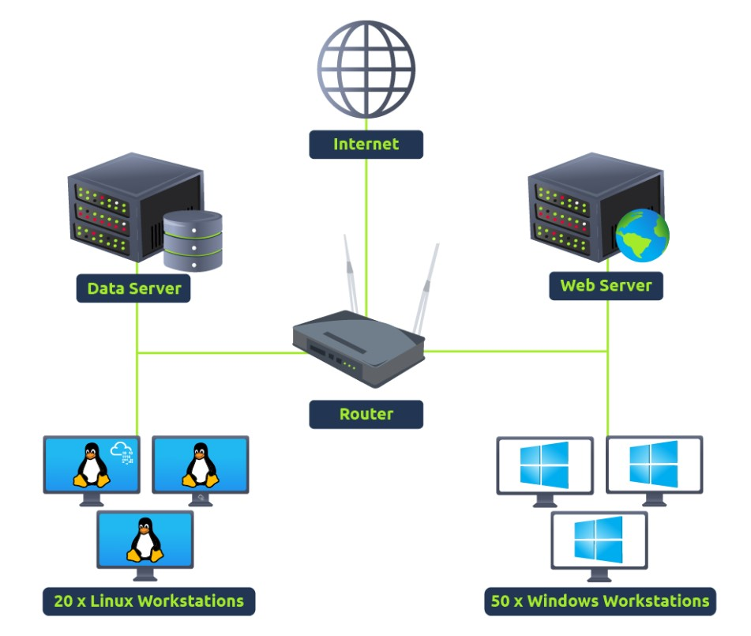

# Cybersecurity 101 
---
# SIEM (Security Information and Event Management system.) - Introduction 

**SIEM (Security Information and Event Management)** is a comprehensive cybersecurity solution that provides real-time analysis of security alerts generated by applications and network hardware. By collecting, aggregating, and analyzing log data from various sources across an organization’s IT infrastructure, SIEM systems enable security teams to detect, investigate, and respond to potential threats more efficiently. These systems combine the functionalities of Security Information Management (SIM) and Security Event Management (SEM), delivering both historical data analysis and real-time monitoring capabilities. SIEM is essential for maintaining regulatory compliance, identifying suspicious behavior, and improving overall security posture.

Before explaining the importance of SIEM, let's first understand why it is critical to have better visibility of all the activities within a network. The image below shows an example of a simple network that comprises multiple Linux/Windows based Endpoints, one data server, and one website. Each component communicates with the other or accesses the internet through a router.

 <br>

As we know, each network component can have one or more log sources generating different logs. One example could be setting up Sysmon along with Windows Event logs to have better visibility of Windows Endpoint. We can divide our network log sources into two logical parts:

### 1) Host-Centric Log Sources

These are log sources that capture events that occurred within or related to the host. Some log sources that generate host-centric logs include:

- Windows Event Logs  
- Sysmon  
- Osquery  

**Examples of host-centric logs:**

- A user accessing a file  
- A user attempting to authenticate  
- A process execution activity  
- A process adding/editing/deleting a registry key or value  
- PowerShell execution  

### 2) Network-Centric Log Sources

Network-related logs are generated when hosts communicate with each other or access the internet to visit a website. Some common network-based protocols include:

- SSH  
- VPN  
- HTTP/S  
- FTP  

**Examples of network-centric events:**

- SSH connection  
- A file being accessed via FTP  
- Web traffic  
- A user accessing company resources through VPN  
- Network file sharing activity  

## Importance of SIEM

Now that we have covered various types of logs, it's time to understand the importance of **SIEM (Security Information and Event Management)**. 

As all these devices generate hundreds of events per second, examining logs on each device individually during an incident can be a tedious and time-consuming task. This is where a SIEM solution becomes essential.

A SIEM not only collects logs from various sources in real-time, but also provides powerful features such as correlation between events, advanced search capabilities, incident investigation, and prompt response mechanisms.

#### Key Features of SIEM:

- **Real-time log ingestion**  
- **Alerting against abnormal activities**  
- **24/7 monitoring and visibility**  
- **Protection against the latest threats through early detection**  
- **Data insights and visualization**  
- **Ability to investigate past incidents**

## Log Sources and Log Ingestion

Every device in the network generates some kind of log whenever an activity is performed on it, like a user visiting a website, connecting to SSH, logging into his workstation, etc. Some common devices that are found in a network environment are discussed below:

### Windows Machine

Windows records every event, which can be viewed through the **Event Viewer** utility. It assigns a unique **Event ID** to each type of log activity, making it easier for analysts to examine and track specific events.

To view events in a Windows environment:

1. Type **Event Viewer** in the search bar.
2. Open the tool to access various logs categorized under different sections.

These logs include system, security, application, and other event types.

Logs from all Windows endpoints can be **forwarded to a SIEM solution** for centralized monitoring and improved visibility across the network.

 <br>

### Linux Workstation

Linux OS stores various types of logs such as events, errors, warnings, and more. These logs are critical for system monitoring and are ingested into a **SIEM** for continuous visibility and analysis.

Below are some common log file locations in Linux:

- **/var/log/httpd**  
  Contains HTTP request/response and error logs (commonly used with Apache web servers).

- **/var/log/cron**  
  Stores events related to scheduled **cron jobs**.

- **/var/log/auth.log** and **/var/log/secure**  
  Contains logs related to **authentication**, such as login attempts and sudo usage.

- **/var/log/kern**  
  Stores logs generated by the **kernel**, including hardware and system-level messages.

Here is a sample of a cron log:
``` 
May 28 13:04:20 ebr crond[2843]: /usr/sbin/crond 4.4 dillon's cron daemon, started with loglevel notice
May 28 13:04:20 ebr crond[2843]: no timestamp found (user root job sys-hourly)
May 28 13:04:20 ebr crond[2843]: no timestamp found (user root job sys-daily)
May 28 13:04:20 ebr crond[2843]: no timestamp found (user root job sys-weekly)
May 28 13:04:20 ebr crond[2843]: no timestamp found (user root job sys-monthly)
Jun 13 07:46:22 ebr crond[3592]: unable to exec /usr/sbin/sendmail: cron output for user root job sys-daily to /dev/null
```

### Web Server

Monitoring all incoming and outgoing **requests/responses** on a web server is crucial for detecting potential web-based attack attempts, such as SQL injection, XSS, or unauthorized access.

In **Linux**, when using the **Apache web server**, the common locations where logs are stored include:

- **/var/log/apache**  
- **/var/log/httpd**

These directories typically contain:

- **access.log** – Records all incoming requests to the server.
- **error.log** – Logs any errors encountered by the server during request processing.

Forwarding these logs to a **SIEM** enables real-time monitoring, correlation, and detection of suspicious activity targeting the web application.

Here is an example of Apache Logs:
```
192.168.21.200 - - [21/March/2022:10:17:10 -0300] "GET /cgi-bin/try/ HTTP/1.0" 200 3395
127.0.0.1 - - [21/March/2022:10:22:04 -0300] "GET / HTTP/1.0" 200 2216
```

### Log Ingestion - Shows Log Ingestion in SIEM

All these logs provide a wealth of information and can help in identifying security issues. Each **SIEM solution** has its own method of ingesting logs. Below are some common approaches:

 <br>

#### 1) Agent / Forwarder

SIEM solutions often provide a lightweight tool known as an **agent** (or **forwarder** in the case of Splunk). This agent is installed on the endpoint and configured to:

- Capture critical logs (system, application, security, etc.)
- Forward them to the SIEM server in near real-time

#### 2) Syslog

**Syslog** is a widely-used protocol for log forwarding. It is commonly used to collect logs from:

- Web servers  
- Databases  
- Network devices  

These logs are sent in real-time to a **centralized SIEM destination**.

#### 3) Manual Upload

Some SIEM platforms (e.g., **Splunk**, **ELK**) allow users to **upload offline data** (such as `.log` or `.csv` files) for analysis. Once uploaded, the SIEM:

- **Ingests** the data  
- **Normalizes** it into a searchable format  
- Makes it available for investigation and visualization

#### 4) Port Forwarding

SIEM solutions can also be configured to **listen on specific ports**. Endpoints or devices can then be set to **forward logs to that port**, allowing:

- Direct ingestion of logs  
- Continuous real-time monitoring

An example of how Splunk provides various methods for log Ingestion is shown below:

 <br>

## Why SIEM

**SIEM (Security Information and Event Management)** is used to correlate collected data from multiple sources to **detect threats**. When a threat is identified or a predefined **threshold** is crossed, an **alert** is generated. This alert allows security analysts to investigate and take appropriate actions.

SIEM plays a critical role in the **cybersecurity domain**, helping organizations:

- Detect and respond to threats in a timely manner  
- Gain visibility into what's happening within the **network infrastructure**  
- Improve overall **incident response** and **threat detection** capabilities

### SIEM Capabilities

SIEM is a **core component of a Security Operations Center (SOC)** ecosystem. It begins by ingesting logs and evaluating them against rules and thresholds to detect abnormal or suspicious activity.

#### Common Capabilities of SIEM:

- 🔄 **Correlation between events** from different log sources  
- 👁️ **Visibility into both Host-centric and Network-centric activities**  
- 🕵️ **Enables analysts to investigate the latest threats** and respond promptly  
- 🎯 **Threat hunting** for identifying attacks that may not be caught by existing detection rules

SIEM helps bridge the gap between raw log data and actionable threat intelligence, making it a foundational tool in any modern cybersecurity strategy.

 <br>

### SOC Analyst Responsibilities

**SOC (Security Operations Center) Analysts** leverage **SIEM solutions** to gain visibility into network activity and detect potential security incidents. Their role is crucial in maintaining an organization's cybersecurity posture.

#### Key Responsibilities:

- 🔍 **Monitoring and Investigating**  
  Continuously monitor alerts and logs to detect suspicious or malicious activity. Investigate incidents to determine their impact and scope.

- 🚫 **Identifying False Positives**  
  Analyze alerts to distinguish between legitimate threats and benign activity that triggers false alarms.

- 🎛️ **Tuning Detection Rules**  
  Fine-tune SIEM rules and use cases to reduce noise and eliminate repetitive false positives.

- 📄 **Reporting and Compliance**  
  Generate reports for stakeholders and support compliance efforts by documenting security incidents and system behavior.

- 🕳️ **Identifying and Closing Visibility Gaps**  
  Detect blind spots in network monitoring and take steps to ensure complete visibility across all endpoints and systems.

## Analysing Logs and Alerts

A **SIEM tool** ingests security-related logs from various sources using methods such as **agents**, **port forwarding**, **syslog**, and **manual uploads**. Once the logs are ingested and **normalized**, SIEM begins analyzing them to detect unwanted behavior or suspicious patterns.

This is achieved through **predefined rules** set by analysts. When log data matches the conditions defined in a rule:

- The **rule is triggered**
- An **alert or incident** is generated
- Analysts **investigate** the event to determine if it represents a real threat

### Dashboard

**Dashboards** are one of the most important components of any SIEM platform. They provide a **visual summary** of security data and insights, making it easier for analysts to monitor and respond to threats.

After logs are ingested and analyzed, the findings are presented via dashboards that offer **actionable insights**. Most SIEM solutions include:

- **Default dashboards** (pre-built visualizations)
- **Custom dashboard creation** for tailored views

#### Common Elements Found in SIEM Dashboards:

- ⚠️ **Alert Highlights** – Overview of recent or critical alerts  
- 🖥️ **System Notifications** – Updates on system status and activity  
- 🚨 **Health Alerts** – Warnings about system performance or data collection issues  
- 🔑 **List of Failed Login Attempts** – Helps detect brute force or unauthorized access attempts  
- 📊 **Events Ingested Count** – Total volume of logs being processed  
- 🎯 **Rules Triggered** – Summary of how many and which rules have fired  
- 🌐 **Top Domains Visited** – Insight into user web activity and potential risks

Dashboards are essential for real-time situational awareness and strategic decision-making in a SOC.

An example of a Default dashboard in Qradar SIEM is shown below:

 <br>

### Correlation Rules

**Correlation rules** are essential for the **timely detection of threats**, enabling SOC analysts to take swift and informed actions. These rules are logical conditions that evaluate patterns across log data to identify suspicious or policy-violating behaviors.

When the defined conditions are met, the SIEM triggers an alert for further investigation.

Examples of Correlation Rules:

- 🔐 **Multiple Failed Login Attempts**  
  *Condition:* If a user experiences **5 failed login attempts within 10 seconds**  
  *Action:* Raise an alert for **"Multiple Failed Login Attempts"**

- ✅ **Successful Login After Failed Attempts**  
  *Condition:* If a login is successful **immediately after multiple failed attempts**  
  *Action:* Raise an alert for **"Successful Login After Multiple Failed Attempts"**

- 💾 **USB Device Connection**  
  *Condition:* If a user **plugs in a USB device** (especially when USB usage is restricted by company policy)  
  *Action:* Raise an alert for **"Unauthorized USB Usage"**

- 📤 **High Outbound Traffic Volume**  
  *Condition:* If outbound traffic exceeds **25 MB in a short time frame**  
  *Action:* Raise an alert for **"Potential Data Exfiltration Attempt"**  
  *(Note: Thresholds may vary depending on company policy)*

Correlation rules help **connect the dots** between seemingly isolated events and are a core capability of any robust SIEM platform.

### How a Correlation Rule is Created

To understand how a correlation rule works, let's consider two example use cases based on Windows Event Logs.


#### Use-Case 1: Detecting Log Clearing Attempts

Adversaries often try to **remove logs during the post-exploitation phase** to cover their tracks. In Windows, a unique **Event ID 104** is generated whenever a user attempts to clear event logs.

Rule Example:

- **Condition:**  
  If the **Log source** is `WinEventLog` **AND** `EventID` is `104`  
- **Action:**  
  Trigger an alert for **Event Log Cleared**

#### Use-Case 2: Detecting Execution of Suspicious Commands

After exploitation or privilege escalation, attackers might run commands like `whoami` to gather information about the compromised system.

Helpful fields for this rule:

- **Log Source:** The log source capturing process execution events (e.g., `WinEventLog`)
- **Event ID:** The ID associated with process execution is `4688`
- **NewProcessName:** The process/command name to look for, e.g., `whoami`

Rule Example:

- **Condition:**  
  If **Log Source** is `WinEventLog` **AND** `EventCode` is `4688` **AND** `NewProcessName` contains `whoami`  
- **Action:**  
  Trigger an alert for **WHOAMI Command Execution Detected**

#### Why Normalized Logs Matter

Correlation rules rely heavily on **field-value pairs** to trigger alerts based on specific conditions. This is why having **normalized logs**—where fields are consistently named and formatted—is crucial for reliable detection and rule creation.

## Alert Investigation

When monitoring a SIEM, analysts spend most of their time on **dashboards**, which provide a summarized view of key network details and alert statuses.

#### Investigation Process

Once an **alert is triggered**, analysts:

1. Examine the **events/flows** related to the alert.  
2. Review the **rule conditions** that caused the alert to trigger.  
3. Determine if the alert is a **True Positive** or a **False Positive**.

#### Actions Based on Investigation

- **False Alarm**  
  - Tune or adjust the detection rule to reduce similar false positives in the future.

- **True Positive**  
  - Conduct further in-depth investigation to understand the scope and impact.  
  - Contact the asset owner or relevant personnel to inquire about the suspicious activity.  
  - If confirmed malicious, isolate the infected host to contain the threat.  
  - Block the suspicious IP address to prevent further malicious activity.

Effective alert investigation helps improve detection accuracy and response efficiency in a SOC environment.

---
> **Note:** These notes document hands-on learning from the TryHackMe *Cybersecurity 101* path. The exercises cover fundamental cybersecurity topics, including Linux basics, networking concepts, and web technologies. This document is intended for personal learning, revision, and ethical skill development. All screenshots, commands, and actions are for educational purposes only.  
> — Compiled by moh4med404 | Curious Mind | Cybersecurity Enthusiast