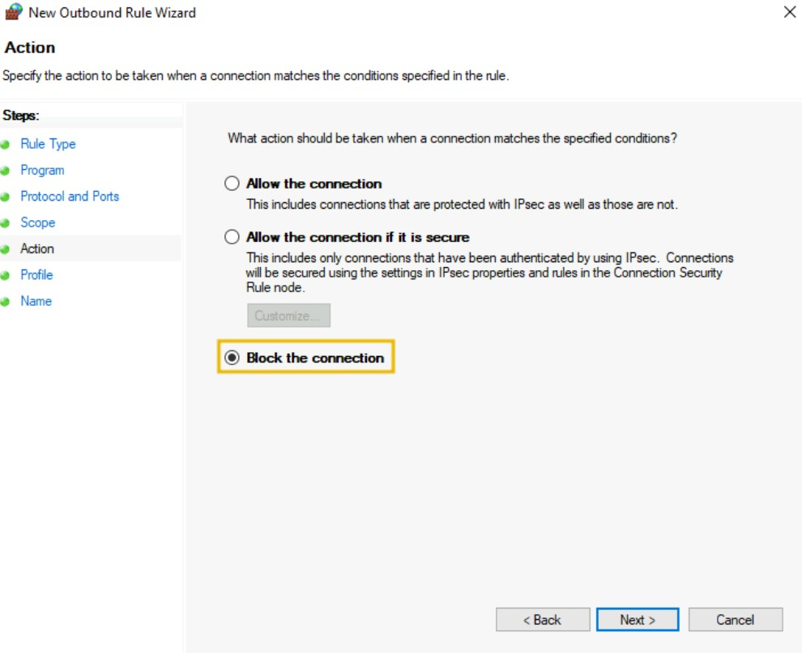

# Cybersecurity 101 
---
# Firewall Fundamentals

We often see security guards stationed outside places like shopping malls, banks, restaurants, and houses. These guards stand at the entrances to monitor who comes in and goes out, ensuring that no unauthorized person sneaks in unnoticed. Essentially, the guard acts as a protective barrier between the area and visitors.

### Firewalls: The Digital Security Guards

In our digital world, a massive amount of incoming and outgoing traffic flows between our devices and the Internet. What if someone sneaks in unnoticed through this traffic? Just like a security guard for physical premises, we need a **security guard for our digital devices** to inspect all data coming in and going out.

This digital guard is called a **firewall**.

- A firewall is designed to **inspect network or device traffic**, both inbound and outbound.
- Its goal is the same as a physical security guard: **to prevent unauthorized access** to your system or network.
- You instruct the firewall using **rules** that define what traffic should be allowed or denied.
- All traffic must pass through the firewall first, where it is **filtered according to these rules**.

### Advanced Firewall Features

Modern firewalls do much more than simple rule-based filtering. They offer additional functionalities such as:

- Stateful inspection  
- Intrusion prevention  
- Application-level filtering  
- VPN support  
- And many more

 <br>


## Types of Firewalls

Firewall deployment became common in networks after organizations discovered their ability to filter harmful traffic from their systems and networks. Several different types of firewalls were introduced afterward, each serving a unique purpose. It's also important to note that different types of firewalls work on different OSI model layers. Firewalls are categorized into many types. 

Let’s examine a few of the most common types of firewalls and their roles in the OSI model.

 <br>

### A. Stateless Firewall

A **stateless firewall** operates at **Layer 3 (Network)** and **Layer 4 (Transport)** of the OSI model. It filters data based solely on **predefined rules** without considering the state of previous connections.

- **Packet Filtering Only:** Each packet is matched against firewall rules **independently**, without any context of prior packets.
- **No Connection Tracking:** The firewall **does not maintain information** about the state of any existing connections.
- **High Performance:** Since it treats every packet in isolation, it can process packets **quickly and efficiently**.
- **Limited Policy Complexity:** It cannot enforce policies based on the relationship or sequence of packets.

**Example Limitation:**

If the firewall denies some packets from a particular source based on its rules, ideally it should continue to **block all future packets** from that source (assuming those packets are part of the same suspicious activity).

However, because the firewall **forgets previous decisions**, it treats every packet as new and applies the rules again, which might allow unwanted traffic to slip through after the initial denied packets.

Stateless firewalls are simple and fast but lack the sophistication to handle complex traffic scenarios that depend on connection context.

### B. Stateful Firewall

A **stateful firewall** operates at **Layer 3 (Network)** and **Layer 4 (Transport)** of the OSI model, just like a stateless firewall—but with a significant enhancement: it **tracks the state of active connections**.

- **Maintains a State Table:** Keeps track of ongoing connections by storing details like source/destination IPs, ports, and protocol status.
- **Context-Aware:** Makes decisions based on the **history and context** of the connection, not just individual packets.
- **Improved Security:** Adds another layer of intelligence by allowing or denying packets based on whether they are part of an **established, permitted connection**.

#### How It Works:

- If the firewall **accepts** some packets from a source, it **remembers** that connection in its **state table**.
  - Future packets in the same connection are **automatically allowed** without re-evaluation against every rule.
- If it **denies** packets from a source based on policy, it can **remember that decision** and block all subsequent packets from the same source accordingly.

#### Benefits Over Stateless Firewalls:

- ✅ Better handling of legitimate traffic  
- ✅ More efficient processing of established connections  
- ✅ Enhanced protection against spoofing and replay attacks

Stateful firewalls strike a balance between **performance and intelligence**, making them ideal for most enterprise environments where connection context is critical to effective threat detection and prevention.

### C. Proxy Firewall

A **Proxy Firewall**, also known as an **Application-Level Gateway**, addresses a key limitation of traditional (stateless and stateful) firewalls — the inability to inspect the **actual contents** of packets.

- **Operates at Layer 7 (Application Layer)** of the OSI model
- **Acts as an intermediary** between internal users and the Internet
- **Inspects full packet content**, not just headers or connection metadata

#### How It Works:

- User requests from the internal network are first sent to the **proxy firewall**
- The firewall **inspects the content** of these requests for compliance with security policies
- It **forwards approved requests** to the destination server on behalf of the user
- The **response from the Internet** is also inspected before being relayed back to the internal user
- The proxy uses **its own IP address**, masking the internal IPs to enhance **anonymity and privacy**

#### Benefits:

- 🛡️ **Deep packet inspection** for malware, harmful content, or policy violations  
- 🧱 **Internal IP address masking**, protecting internal infrastructure  
- ⚙️ **Content filtering capabilities**, such as blocking specific websites or file types  
- 🎯 Ideal for enforcing **strict application-level controls**

Proxy firewalls provide **greater visibility and control** over the content being exchanged across the network, making them a powerful option for organizations needing **deep inspection and anonymity**.

### D. Next-Generation Firewall (NGFW)

A **Next-Generation Firewall (NGFW)** is the most advanced type of firewall, offering security features that go far beyond traditional packet filtering. It operates across **Layer 3 to Layer 7** of the OSI model, providing a **multi-layered defense strategy** for modern network environments.

- 🔍 **Deep Packet Inspection (DPI):**  
  Inspects the full content of packets—not just headers—to detect and block malicious payloads.

- 🛡️ **Intrusion Prevention System (IPS):**  
  Integrated IPS actively **blocks threats in real time**, preventing known exploits and attack signatures from breaching the network.

- 🔬 **Heuristic and Behavioral Analysis:**  
  Analyzes the behavior and patterns of traffic to **detect and block zero-day and evolving threats** based on anomaly detection.

- 🔐 **SSL/TLS Decryption:**  
  Can **decrypt encrypted traffic (HTTPS)** to inspect it for hidden threats, a feature critical in modern encrypted web communications.

- 🌐 **Threat Intelligence Integration:**  
  Leverages external **threat intelligence feeds** to make smart, up-to-date decisions about whether to allow or block specific connections.

- 🧠 **Application Awareness and Control:**  
  Identifies and controls applications **regardless of port, protocol, or evasive tactics**, allowing fine-grained policy enforcement.

#### Why Use NGFW?

NGFWs provide a comprehensive, intelligent defense mechanism ideal for:

- Enterprise networks
- Cloud environments
- Data centers
- Organizations requiring **deep visibility**, **automated protection**, and **adaptive threat detection**

NGFWs combine the strengths of traditional firewalls, proxy firewalls, and intrusion detection/prevention systems—making them a cornerstone of modern cybersecurity architecture.

The table below lists each firewall’s characteristics, which will help you choose the most suitable firewall for different use cases.

| **Firewall Type**         | **Key Characteristics**                                                                                       | **OSI Layer(s)** | **Tracks State** | **Inspects Content** | **Common Use Cases**                                                  |
|---------------------------|----------------------------------------------------------------------------------------------------------------|------------------|------------------|----------------------|------------------------------------------------------------------------|
| **Stateless Firewalls**   | - Basic packet filtering<br>- No memory of previous connections<br>- Fast and lightweight                      | L3–L4            | ❌               | ❌                   | - High-speed environments<br>- Edge routers or small networks         |
| **Stateful Firewalls**    | - Tracks traffic state<br>- Supports complex rule logic<br>- Monitors ongoing connections                      | L3–L4            | ✅               | ❌                   | - Internal enterprise networks<br>- Moderate to large infrastructures |
| **Proxy Firewalls**       | - Inspects full packet content<br>- Provides content filtering and application control<br>- SSL/TLS decryption | L7               | ✅               | ✅                   | - Secure web gateways<br>- Environments needing content inspection    |
| **Next-Gen Firewalls**    | - Deep packet inspection<br>- Integrated IPS<br>- Anomaly detection<br>- SSL/TLS decryption                    | L3–L7            | ✅               | ✅                   | - Enterprise perimeter defenses<br>- Zero-trust architectures         |

## Firewall Rules and Actions

A **firewall** gives you control over your network’s traffic by filtering it based on built-in and custom-defined rules. These rules help tailor security to your specific needs. For example, one organization might block all SSH traffic, while another allows it from specific IP addresses only.

### Basic Components of a Firewall Rule

Each rule consists of several fields:

| **Component**        | **Description**                                                                 |
|----------------------|---------------------------------------------------------------------------------|
| **Source Address**   | The IP address of the machine originating the traffic.                          |
| **Destination Address** | The IP address of the machine receiving the traffic.                         |
| **Port**             | The communication port number (e.g., 22 for SSH, 80 for HTTP).                 |
| **Protocol**         | The communication protocol (e.g., TCP, UDP, ICMP).                              |
| **Action**           | Defines what happens when the rule condition is met (e.g., Allow, Deny, Forward). |
| **Direction**        | Specifies whether the rule applies to **Inbound** or **Outbound** traffic.     |

### Types of Firewall Rule Actions

#### ✅ **Allow**

This action permits traffic that matches the rule definition.

**Example: Allow all outbound HTTP traffic (port 80):**

| Action | Source         | Destination | Protocol | Port | Direction |
|--------|----------------|-------------|----------|------|-----------|
| Allow  | 192.168.1.0/24 | Any         | TCP      | 80   | Outbound  |

#### ❌ **Deny**

This action blocks traffic that matches the rule definition. Deny rules are essential for blocking malicious or unauthorized access.

**Example: Deny all inbound SSH traffic (port 22):**

| Action | Source | Destination     | Protocol | Port | Direction |
|--------|--------|------------------|----------|------|-----------|
| Deny   | Any    | 192.168.1.0/24   | TCP      | 22   | Inbound   |

#### 🔁 **Forward**

This action redirects traffic to another destination, useful for firewalls acting as routers or gateways.

**Example: Forward inbound HTTP traffic to internal web server (192.168.1.8):**

| Action  | Source | Destination   | Protocol | Port | Direction |
|---------|--------|----------------|----------|------|-----------|
| Forward | Any    | 192.168.1.8    | TCP      | 80   | Inbound   |

These rules enable **fine-grained control** over network traffic, helping organizations enhance security and ensure traffic flows as intended.

### Directionality of Rules

Firewalls have different categories of rules, each categorized based on the traffic directionality on which the rules are created. Let’s examine each of these directionalities.

 <br>

Firewall rules are often categorized based on the **direction** of traffic they are meant to control. The three main types are **Inbound**, **Outbound**, and **Forward** rules.

#### 🔽 Inbound Rules

**Inbound rules** apply to traffic **coming into your network** or system from an external source.

**Example**:
Allow incoming HTTP traffic to a web server.

| Action | Source | Destination  | Protocol | Port | Direction |
|--------|--------|--------------|----------|------|-----------|
| Allow  | Any    | 192.168.1.10 | TCP      | 80   | Inbound   |

#### 🔼 Outbound Rules

**Outbound rules** apply to traffic **leaving your network** or system to external destinations.

**Example**:
Block all outgoing SMTP traffic (port 25) except from the mail server.

| Action | Source         | Destination | Protocol | Port | Direction |
|--------|----------------|-------------|----------|------|-----------|
| Deny   | 192.168.1.0/24 | Any         | TCP      | 25   | Outbound  |
| Allow  | 192.168.1.50   | Any         | TCP      | 25   | Outbound  |


#### 🔁 Forward Rules

**Forward rules** are used to **redirect traffic** from one destination to another, commonly used in firewalls that also act as routers or gateways.

**Example**:
Forward incoming HTTP traffic to an internal web server.

| Action  | Source | Destination   | Protocol | Port | Direction |
|---------|--------|----------------|----------|------|-----------|
| Forward | Any    | 192.168.1.8    | TCP      | 80   | Inbound   |

Using the correct rule direction ensures that **only intended traffic flows through your network**, reducing the attack surface and enforcing proper access controls.

## Windows Defender Firewall

Windows Defender is a built-in firewall introduced by Microsoft in the Windows OS. This firewall contains all the basic functionality for creating, allowing, or denying specific programs or creating customized rules. This task is designed to cover some of the essential components of the Windows Defender Firewall, which you can utilize to restrict your system’s incoming and outgoing network traffic. To open this firewall, you have to open the Windows search and type "Windows Defender Firewall."

The Windows Defender Firewall’s home page shows the "Network Profiles" and the available options. This is the main dashboard with all the options for the firewall.

 <br>

### Network Profiles

There are two available network profiles. Windows firewall determines your current network based on Network Location Awareness (NLA) and applies that profile firewall settings for you. We can have different firewall settings for each of them.

1. **Private networks:** This includes the firewall configurations to apply when connected to our home network.
2. **Guest or public networks:** This includes the firewall configurations to apply when connected to a public or untrusted network like coffee shops, restaurants, or similar. For example, when connecting to public networks, you can configure firewall settings to block all incoming network connections and allow only some outgoing connections that are essential for you. These settings will apply to the public network profile and will not be implemented when you are in your private home network.

To allow/disallow any application in any of your network profiles, click on the option (highlighted as 1 in the screenshot). This will take you to the page listing all the apps and features installed in your system. You can checkmark the ones you want to allow in any of your network profiles or uncheck those if not needed. Windows Defender Firewall is turned on by default. However, if you want to turn it on/off, you can click on the option (highlighted as 2 in the screenshot). This will take you to the settings for both of your network profiles. Rather than completely turning it off, which Microsoft doesn’t recommend, you can also block all incoming connections. You can also click on "Restore Defaults" (highlighted as 3 in the screenshot) from the main dashboard anytime to restore all the firewall's default settings.

 <br>

### Custom Rules

Windows Defender Firewall also allows you to create custom rules for your network to allow/disallow specific traffic as needed. Let’s create a custom rule to block all outgoing traffic on HTTP (port 80) or HTTPS (port 443). After creating this rule, we will be unable to browse any website on the Internet as the websites are working on port 80 or 443, which we will be blocking. 

To create a custom rule, choose "Advanced Settings" from the available options in the main dashboard. This will open a new tab where you can create your own rules.

**Note**: The rule created below is already available inside the attached VM. If you want to test it, you can create it on your Windows host machine or any other machine.

 <br>

You can see the available options to create inbound and outbound rules.

 <br>

Let’s create an outbound rule to block all our outgoing HTTP and HTTPS traffic. For this, click on the **Outbound Rules** option on the left side, then click on **New Rule** on the right side. It will open the rule wizard.In the first step, select the **Custom** option and press **Next**.

 <br>

In the second step, select **All programs** from the next option and press **Next**. It will ask you to select the protocol type in the third step. Select the **Protocol type** as "TCP", keep the **Local port** as it is, and change the **Remote port** to "Specific ports" from the dropdown. Write the port numbers in the field below (in our case, 80,443). Now, click on **Next**.

**Note**: Separate the port numbers by commas, and please don’t leave spaces between them.

 <br>

In the **Scope** tab, keep the local and remote IP addresses as they are and press the **Next** button. In the **Action** tab, enable the **Block the connection** option and press **Next**.

 <br>

In the **Profile** tab, we keep all the network profiles check-marked. Lastly, the final phase is to give your rule a name and an optional description and press the **Finish** button.

We can see our rule is there in the available outbound rules.

 <br>

Now, let’s test our rule by browsing to `http://10.10.10.10/`. We get an error message saying we cannot reach this page, meaning the rule works.

 <br>

## Linux iptables Firewall

Linux also offers the functionality of a built-in firewall. We have multiple firewall options available here. Let’s briefly review most of them and explore one of them in detail.

### A. Netfilter

**Netfilter** is the core framework within the Linux operating system that provides essential firewall functionalities such as:

- Packet filtering
- Network Address Translation (NAT)
- Connection tracking

This framework acts as the foundation for various Linux firewall utilities that help control network traffic effectively.

Common Firewall Utilities Based on Netfilter

- **iptables**  
  The most widely used firewall utility in many Linux distributions. It leverages the Netfilter framework to offer extensive network traffic control capabilities.

- **nftables**  
  The modern successor to `iptables`. It provides enhanced packet filtering and NAT capabilities and is built on the Netfilter framework.

- **firewalld**  
  Also based on Netfilter, `firewalld` uses predefined rule sets and network zone configurations to simplify firewall management. It operates differently compared to `iptables` and `nftables`.

### B. UFW (Uncomplicated Firewall)

`ufw` (Uncomplicated Firewall) is designed to simplify firewall rule management on Linux systems. As the name suggests, it removes the complexity of writing verbose and complicated rules directly in `iptables` (or its successor `nftables`) by providing an easier, user-friendly command-line interface.

Basically, any rule you want to create in `iptables` can be defined using simple commands in `ufw`. Under the hood, `ufw` translates these commands into the appropriate `iptables` configurations.

#### Why use ufw?

- Beginner-friendly and straightforward syntax
- Simplifies firewall management
- Useful for quick setup and rule modification
- Works well on Ubuntu and other Debian-based systems

### Basic ufw Commands

```bash 
user@ubuntu:~$ sudo ufw status
Status: inactive
```
If it appears inactive, you can enable it using the following command:

```bash 
user@ubuntu:~$ sudo ufw enable
Firewall is active and enabled on system startup
```
To turn off the firewall, type “disable” instead of “enable” in the above command.

Below is a rule created to allow all the outgoing connections from a Linux machine. The `default` in the command means that we are defining this policy as a default policy allowing all the outgoing traffic unless we define an outgoing traffic restriction on any specific application in a separate rule. You can also make a rule to allow/deny traffic coming into your machine by replacing `outgoing` with `incoming` in the following command:

```bash 
user@ubuntu:~$ sudo ufw default allow outgoing
Default outgoing policy changed to 'allow'
(be sure to update your rules accordingly)
```

You can deny incoming traffic at any port in your system. Let's say that we want to block incoming SSH traffic. We can achieve this with the command `ufw deny 22/tcp`. As you can see, we first specified the action, `deny` in this case; furthermore, we specified the port and the transport protocol, which is TCP port 22, or simply `22/tcp`.

```bash 
user@ubuntu:~$ sudo ufw deny 22/tcp
Rule added
Rule added (v6)
```
To list down all the active rules in a numbered order, you can use the following command:

```bash 
user@ubuntu:~$ sudo ufw status numbered
     To                         Action      From
     --                         ------      ----
[ 1] 22/tcp                     DENY IN     Anywhere                  
[ 2] 22/tcp (v6)                DENY IN     Anywhere (v6) 
```

To delete any rule, execute the following command with the rule number to delete:

```bash 
user@ubuntu:~$ sudo ufw delete 2
Deleting:
 deny 22/tcp
Proceed with operation (y|n)? y
Rule deleted (v6)
```
These different utilities can be used to manage Netfilter. Choosing the right utility for the Linux OS depends on multiple factors, such as familiarity with the OS and your requirements. You can test your knowledge of Linux firewalls by creating some rules defined in this task and testing them to ensure they are working as expected.

---
> **Note:** These notes document hands-on learning from the TryHackMe *Cybersecurity 101* path. The exercises cover fundamental cybersecurity topics, including Linux basics, networking concepts, and web technologies. This document is intended for personal learning, revision, and ethical skill development. All screenshots, commands, and actions are for educational purposes only.  
> — Compiled by moh4med404 | Curious Mind | Cybersecurity Enthusiast