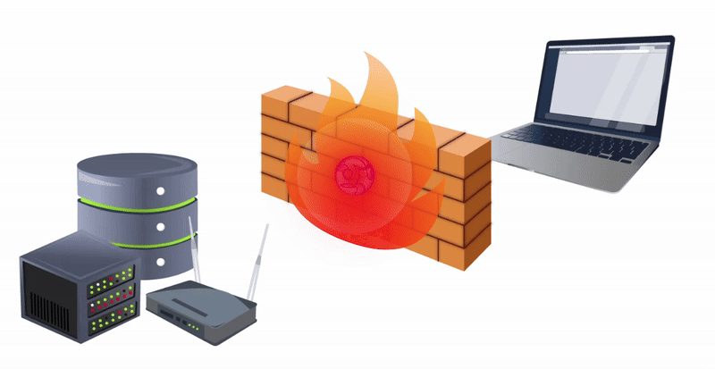
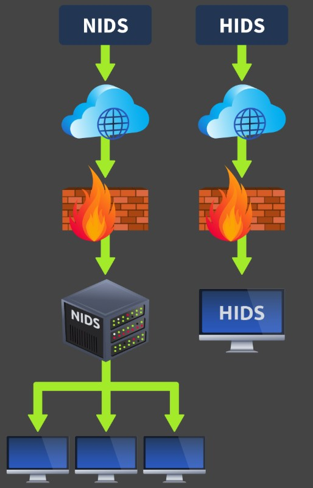
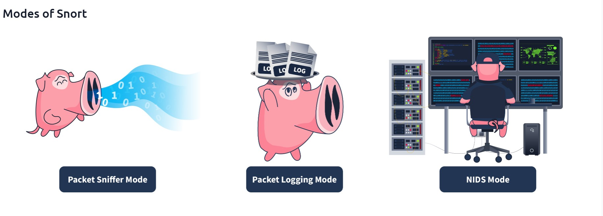
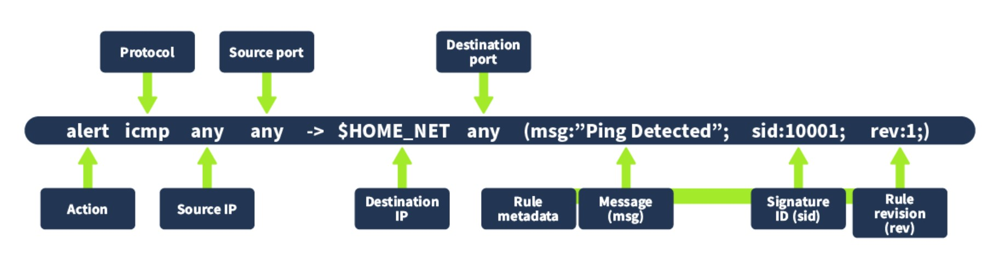
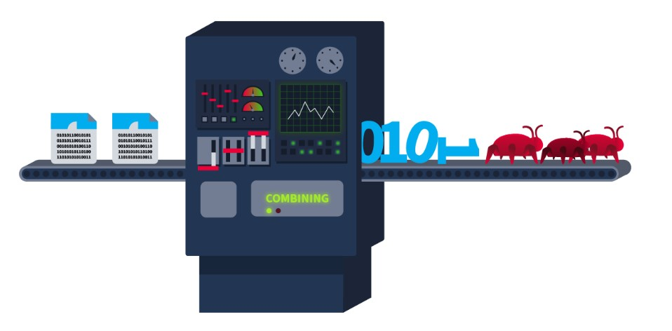

# Cybersecurity 101 
---
# IDS Fundamentals

In the previous lesson Firewalls, we studied the role of a firewall, a security solution usually deployed on the boundary of a network to protect its incoming and outgoing traffic. The firewall checks the traffic when a connection is going to take place and denies it if it violates the firewall rules. However, there should be some security to detect the activities of the connection that passed through the firewall and have already taken place. So, if an attacker successfully bypasses a firewall via a legitimate-looking connection and then performs any malicious activities inside the network, there should be something to detect it timely. For this purpose, we have a security solution inside the network. This solution is known as an Intrusion Detection System (IDS).

Think of an example of a building’s security. A firewall acts as the gatekeeper, checking the people coming in and going out. There is always a chance that some bad actor will successfully sneak inside and start performing malicious activities. He was missed at the gate, but what if we catch him even after he gets in? This can be done by the surveillance cameras present throughout the building. The IDS plays the role of surveillance cameras. It sits in a corner, monitors the network traffic based on its signature and anomaly-based detections, and detects any abnormal traffic going out or inside the network. Upon every detection, an alert is generated for the security administrators. IDS does not act on those detections; it only notifies the security administrators about the malicious activity.


 <br>


## Types of IDS

IDS can be categorized differently depending on certain factors. An IDS’s main categorization depends on its deployment and detection modes.

### Deployment Modes of IDS

Intrusion Detection Systems (IDS) can be deployed in the following ways:

#### 1. Host Intrusion Detection System (HIDS)

- Installed individually on each host (machine or server).
- Responsible for detecting potential security threats specific to that host.
- Provides detailed visibility into the host’s activities.
- Challenges:
  - Resource-intensive.
  - Difficult to manage at scale in large networks since it requires installation and management on each host.

#### 2. Network Intrusion Detection System (NIDS)

- Monitors network traffic across the entire network.
- Detects potentially malicious activities regardless of individual hosts.
- Offers a centralized view of suspicious activities across all hosts in the network.
- Useful for detecting network-wide attacks and anomalies.

 <br>

### Detection Modes of IDS

#### 1. Signature-Based IDS
- Detects attacks by matching them against known attack patterns called **signatures**.
- Signatures are stored in the IDS database.
- Efficient at detecting known threats with existing signatures.
- Cannot detect **zero-day attacks** (new, unknown threats without existing signatures).
- Example tool: Snort (a popular signature-based IDS).

#### 2. Anomaly-Based IDS
- Learns the **normal behavior** (baseline) of the network or system.
- Detects deviations from this baseline as potential threats.
- Can detect zero-day attacks since it doesn’t rely on known signatures.
- Prone to **false positives** (flagging normal but unusual activity as malicious).
- False positives can be reduced by fine-tuning or manually defining the normal behavior.

#### 3. Hybrid IDS
- Combines **signature-based** and **anomaly-based** detection methods.
- Uses signature detection for known threats.
- Uses anomaly detection for new or unknown threats.
- Leverages the strengths of both detection techniques.

Signature-based IDS can detect threats quickly, while other IDS can have a high processing overhead. However, it is also essential to consider the IDS based on several different factors. Signature-based IDS can be a good option for covering a small threat surface. Anomaly-based IDS and hybrid IDS can help detect modern zero-day attacks, which are increasing daily and can cause massive damage to organizations.

## IDS Example: Snort

Snort is one of the most widely used open-source IDS solutions developed in 1998. It uses signature-based and anomaly-based detections to identify known threats. These are defined in the rule files of the Snort tool.

Several built-in rule files come pre-installed in this tool’s package. These built-in rule files contain a variety of known attack patterns. Snort’s built-in rules can detect a lot of malicious traffic for you. However, you can configure Snort to detect specific types of network traffic that are not covered by the default rule files.

You can create custom rules based on your requirements to detect specific traffic. You can also disable any built-in detection rules if they don’t point to harmful traffic for your system or network and define some custom rules instead.

 <br>

| Mode                         | Description                                                                                                                                                                                                                                                                                                                                                                                                                                                                                              | Use Case                                                                                                                        |
|------------------------------|----------------------------------------------------------------------------------------------------------------------------------------------------------------------------------------------------------------------------------------------------------------------------------------------------------------------------------------------------------------------------------------------------------------------------------------------------------------------------------------------------------|---------------------------------------------------------------------------------------------------------------------------------|
| **Packet sniffer mode**       | This mode reads and displays network packets without performing any analysis on them. The packet sniffer mode of Snort does not directly relate to IDS capabilities, but it can be helpful in network monitoring and troubleshooting. In some cases, system administrators might need to read the traffic flow without performing any detection to diagnose specific issues. This mode allows you to display the network traffic on the console or even output it in a file.                         | The network team observes some network performance issues. To diagnose the issue, they need detailed insights into the network traffic. For this purpose, they can utilize Snort’s packet sniffer mode.  |
| **Packet logging mode**       | Snort performs detection on the network traffic in real-time and displays the detections as alerts on the console for the security administrators to take action. However, in some cases, the network traffic needs to be logged for later analysis. The packet logging mode of Snort allows you to log the network traffic as a PCAP (standard packet capture format) file. This includes all the network traffic and any detections from it. Forensic investigators can use these Snort log files to perform root cause analysis of previous attacks. | The security team needs to initiate a forensic investigation of a network attack. They would need the traffic logs to perform the root cause analysis. The network traffic logged through Snort’s packet logging mode can help them.  |
| **Network Intrusion Detection System mode** | Snort’s NIDS mode is the primary mode that monitors network traffic in real-time and applies its rule files to identify any match to the known attack patterns stored as signatures. If there is a match, it generates an alert. This mode provides the main functionality of an IDS solution.                                                                                                                                                                     | The security team must proactively monitor their network or systems to detect potential threats. They can leverage Snort’s NIDS mode to achieve this.  |


The most relevant use of Snort as an IDS comes from its NIDS mode. However, Snort can be used in any of the above modes depending upon the requirement.


### Snort Usage

Snort has some built-in rule files, a configuration file, and other files. These are stored in the `/etc/snort` directory. The key file for Snort is its configuration file `snort.conf`, where you can specify which rule files to enable and which network range to monitor and enable other settings. The rule files are stored in the `rules` folder. Let's use the `ls` command to list down all the files and folders present in Snort's main directory:

```bash 
ubuntu@tryhackme:~$ ls /etc/snort
classification.config  reference.config  snort.debian.conf
community-sid-msg.map  rules             threshold.conf
gen-msg.map            snort.conf        unicode.map
```

**Rule Format**

Now, let’s discuss how rules are created in Snort. There is a specific way of writing the rules. Following is a sample rule that would detect ICMP packets (usually used when you ping a host) coming from any IP address and port and reaching the home network (the network range is defined in Snort’s configuration file) to any port. Once such traffic is detected, it generates “Ping Detected” alerts.

 <br>

Details of the Components Involved in this Rule

- **Action:**  
  Specifies which action to take when the rule triggers.  
  *Example:* `"alert"` — raise an alert when the traffic matches this rule.

- **Protocol:**  
  Refers to the protocol that matches this rule.  
  *Example:* `"ICMP"` — used when we ping a host.

- **Source IP:**  
  Determines the IP from which the traffic is originating.  
  *Example:* `"any"` — detect traffic from any source IP.

- **Source port:**  
  Determines the port from which the traffic is originating.  
  *Example:* `"any"` — detect traffic from any source port.

- **Destination IP:**  
  Specifies the destination IP to which the matching traffic is sent, triggering the alert.  
  *Example:* `"$HOME_NET"` — a variable defined as the whole network’s range in Snort’s configuration file.

- **Destination port:**  
  Specifies the port the traffic would reach.  
  *Example:* `"any"` — detect traffic coming to any port.

- **Rule metadata:**  
  Defined at the end of the rule within parentheses, consisting of several components:  
  - **Message (msg):**  
    Describes the message displayed when the rule triggers. It indicates the type of activity detected.  
    *Example:* `"Ping Detected"`  
  - **Signature ID (sid):**  
    A unique identifier for the rule, differentiating it from others.  
    *Example:* `10001`  
  - **Rule revision (rev):**  
    Indicates the revision number of the rule. Incremented each time the rule is modified to track changes.  

### Rule Creation

Let’s paste the sample rule explained above into the custom "local.rules" file in the Snort rules directory.

Firstly, open the "local.rules" file in a text editor:

```bash 
ubuntu@tryhackme:~$ sudo nano /etc/snort/rules/local.rules
```
Now, add the following rule after the already present rules to the file: `alert icmp any any -> 127.0.0.1 any (msg:"Loopback Ping Detected"; sid:10003; rev:1;)`

**Note**: We will need the other already present rules in the next task, so do not delete them.

Once you successfully edit the file, press "ctrl+x" and it will ask you to press "y" if you want to save the changes. Press "y" to save the changes.

### Rule Testing

Let’s first start the snort tool to detect any intrusions defined in the rule file. For this, we have to execute the following command with sudo privileges in our console:

```bash 
ubuntu@tryhackme:~$ sudo snort -q -l /var/log/snort -i lo -A console -c /etc/snort/snort.conf
```

**Note**: In case your loopback interface is not called "lo", replace it with the correct interface name. 

As this rule is designed to alert us on any ICMP packets to our loopback address, let’s try to ping our loopback address to see if our rule works:

```bash 
ubuntu@tryhackme:~$ ping 127.0.0.1
```
The screenshot below shows the Snort-generated "Loopback Ping Detected" alert when we ping our host's loopback IP. This means that our rule is working fine.

```bash 
ubuntu@tryhackme:~$ sudo snort -q -l /var/log/snort -i lo -A console -c /etc/snort/snort.conf
07/24-10:46:52.401504  [**] [1:1000001:1] Loopback Ping Detected [**] [Priority: 0] {ICMP} 127.0.0.1 -> 127.0.0.1
07/24-10:46:53.406552  [**] [1:1000001:1] Loopback Ping Detected [**] [Priority: 0] {ICMP} 127.0.0.1 -> 127.0.0.1
07/24-10:46:54.410544  [**] [1:1000001:1] Loopback Ping Detected [**] [Priority: 0] {ICMP} 127.0.0.1 -> 127.0.0.1
```

### Running Snort on PCAP Files

We saw how Snort can be used for intrusion detection on real-time traffic. However, you may sometimes encounter a scenario where you have historical network traffic logged in a file, and you have to perform a forensic investigation to determine any signs of intrusion through that traffic. This traffic is usually logged in the standard packet capture format "PCAP". Snort is also equipped to perform detections on these PCAP files containing historical network traffic.

 <br>

The following command with sudo privilege can be used to perform this action:

```bash 
ubuntu@tryhackme:~$ sudo snort -q -l /var/log/snort -r Task.pcap -A console -c /etc/snort/snort.conf
```
**Note**: Replace the "Task.pcap" with the path to your PCAP file for analysis.

---
> **Note:** These notes document hands-on learning from the TryHackMe *Cybersecurity 101* path. The exercises cover fundamental cybersecurity topics, including Linux basics, networking concepts, and web technologies. This document is intended for personal learning, revision, and ethical skill development. All screenshots, commands, and actions are for educational purposes only.  
> — Compiled by moh4med404 | Curious Mind | Cybersecurity Enthusiast