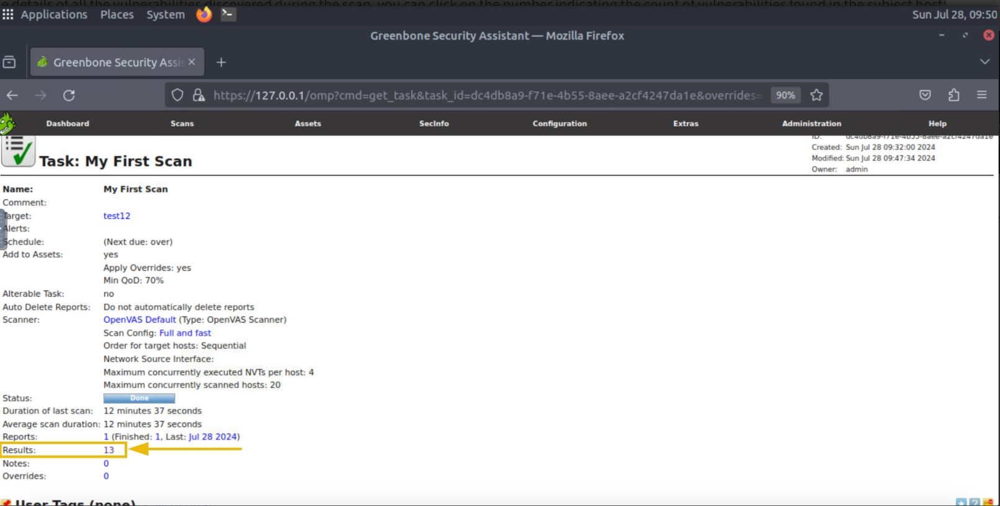

# Cybersecurity 101 
---
# Vulnerability Scanner Overview

Imagine you are living in a small, lovely house. One day, you notice that your roof has many small holes. If not treated, these small holes can cause significant problems. During rain, water can come through these leaks and damage your furniture. Dust particles and insects can enter the house through these tiny holes.

These small holes are a weakness in your home that can lead to significant problems in the future if not addressed timely. These weaknesses are known as **Vulnerabilities**.

You start repairing the roof to fix this problem and keep your home safe. This process of fixing the vulnerabilities is known as **Patching**.

Digital devices also have vulnerabilities inside their software or hardware. These are the weaknesses in the software programs or hardware that an attacker can leverage to compromise the digital device.

These vulnerabilities may sound normal to you, like the small holes in the roof of a house that can be repaired anytime. However, the vulnerabilities in digital devices can lead to massive damage if not noticed on time. Hackers are always searching for these weaknesses as they make their way into your systems or networks by exploiting them.

The interesting thing about digital device vulnerabilities is that you cannot notice them as easily as the holes in the roof — not until you dedicate yourself to hunting them down.

After hunting these vulnerabilities down, the process of patching starts, where fixes are applied to protect against exploitation and keep the system safe.

## Vulnerability Scanning

Vulnerability scanning is the inspection of digital systems to find weaknesses. Organizations carry critical information in their digital infrastructure. They must regularly scan their systems and networks for vulnerabilities, as attackers can leverage these vulnerabilities to compromise their digital infrastructure, resulting in considerable loss.

Vulnerability scanning is also an important compliance requirement of many regulatory bodies. Some security standards advise performing vulnerability scanning quarterly, while others recommend doing it once a year.

We saw how important it is to conduct vulnerability scans in your digital landscape regularly; however, manually looking for these weaknesses can be very hectic and may miss some major ones. The bigger the network is, the slower the process of manual vulnerability scanning would be.

This is no longer an issue as some efficient vulnerability scanners that perform automated vulnerability scanning are available in the market. This automated scanning has made life much easier. You only need to install the tool and provide it with an IP address for a host or a network range for a network; it will start checking for vulnerabilities and give you an easy-to-read report detailing the vulnerabilities found.

After identifying vulnerabilities, organizations fix them by making changes to a software program or system. These changes are referred to as **Patches**.

Vulnerability scans can be categorized into many types; however, the major categorization of these scans is explained below:

### Authenticated vs. Unauthenticated Scans

Authenticated scans require the subject host's credentials and are more detailed than unauthenticated scans. These types of scans are helpful for discovering the threat surface within the host. However, unauthenticated scans are conducted without providing any credentials of the subject host. These scans help identify the threat surface from outside the host.

| Authenticated Scans                                                                 | Unauthenticated Scans                                                      |
|------------------------------------------------------------------------------------|---------------------------------------------------------------------------|
| The credentials of the subject host must be provided to the vulnerability scanner. | The vulnerability scanner does not require the host’s credentials; it only needs the IP address. |
| Identifies vulnerabilities exploitable by attackers with access to the host.       | Identifies vulnerabilities exploitable by external attackers with no access to the host. |
| Provides deeper visibility by scanning configuration and installed applications.    | Less resource-intensive and straightforward to set up.                    |
| *Example:* Scanning an internal database by providing its credentials.              | *Example:* Scanning a public-facing website for vulnerabilities any user can exploit. |

### Internal vs. External Scans

Internal scans are conducted from inside the network, while external scans are conducted from outside the network. Let's see a few of their differences below.

| Internal Scans                                    | External Scans                                  |
|--------------------------------------------------|------------------------------------------------|
| Conducted from inside the network.                | Conducted from outside the network.             |
| Focuses on vulnerabilities exploitable inside the network. | Focuses on vulnerabilities exploitable from outside the network. |
| Identifies vulnerabilities exposed to attackers once they are inside the network. | Identifies vulnerabilities exposed to attackers from outside the network. |

The choice between vulnerability scan types depends on several factors. Authenticated scans are often used for internal vulnerability scanning, while unauthenticated scans are mostly used for external vulnerability scanning.

## Tools for Vulnerability Scanning

There are many tools available for performing automated vulnerability scanning, each offering unique features. Let’s discuss some of the widely used vulnerability scanners.

### Nessus

[Nessus](https://www.tenable.com/products/nessus) was developed as an open-source project in 1998. It was later acquired by Tenable in 2005 and became proprietary software.

Nessus has extensive vulnerability scanning options and is widely used by large enterprises. It is available in both free and paid versions:

- The **free version** offers a limited number of scan features.  
- The **commercial version** offers advanced scanning features, unlimited scans, and professional support.

Nessus needs to be deployed and managed on-premises.

 <br>

### Qualys

[Qualys](https://www.qualys.com/) was developed in 1999 as a subscription-based vulnerability management solution. Along with continuous vulnerability scanning, it provides compliance checks and asset management.

It automatically alerts on vulnerabilities found during continuous monitoring.

The best thing about Qualys is that it is a **cloud-based platform**, which means there is no extra cost or effort to keep it up and running on physical hardware or to manage it.

 <br>

### Nexpose

[Nexpose](https://www.rapid7.com/products/nexpose/) was developed by Rapid7 in 2005 as a subscription-based vulnerability management solution. It continuously discovers new assets in the network and performs vulnerability scans on them.

Nexpose gives vulnerability risk scores depending on the asset value and the vulnerability’s impact. It also provides compliance checks against various standards.

Nexpose offers both **on-premises** and **hybrid** (cloud and on-premises) deployment modes.

 <br>

### OpenVAS (Open Vulnerability Assessment System)

[OpenVAS](https://www.openvas.org/) is an open-source vulnerability assessment solution developed by Greenbone Security. It offers basic features with known vulnerabilities scanned through its database.

While it is less extensive than commercial tools, it provides a good introduction to a complete vulnerability scanner. OpenVAS is particularly beneficial for small organizations and individual systems.

The next section will explore this tool in more detail by performing vulnerability scanning.

 <br>

Almost all vulnerability scanners offer **reporting capabilities**. They generate a detailed report after every vulnerability scan. These reports contain:

- A list of the vulnerabilities discovered  
- Their risk scores  
- Detailed descriptions  

Some vulnerability scanners offer **advanced reporting capabilities** that provide remediation methods for all the discovered vulnerabilities and allow you to export these vulnerability assessment reports in different formats.

Each of the tools mentioned above has its strengths. When choosing a suitable vulnerability scanner for your digital assets, you must consider the scope, resources, depth of analysis, and other factors.

## CVE & CVSS

Imagine yourself as the person sitting at the help desk of an IT complaint office managing many clients. You deal with hundreds of complaints daily regarding IT outages or several other problems requiring support from your company. Let’s see how **CVE** and **CVSS** help you track all these inquiries and complaints.

### A. CVE

**CVE** stands for **Common Vulnerabilities and Exposures**.  

Consider CVE as a unique number assigned to each of your inquiries and complaints. If there is any update to an issue, you can easily follow up using the unique CVE number. 

- This CVE number is a unique identifier given to vulnerabilities.  
- Developed by the **MITRE Corporation**.  
- Whenever a new vulnerability is discovered in any software application, it is assigned a unique CVE number and published online in a CVE database.  
- The publication aims to make people aware of these vulnerabilities so they can apply protective measures to remediate them.  
- You can find the details of any previously discovered vulnerability in the CVE database.

#### Structure of a CVE Number

- **CVE prefix:** Every CVE number starts with the prefix `"CVE"`.  
- **Year:** The second part indicates the year the vulnerability was discovered (e.g., 2024).  
- **Arbitrary digits:** The last part contains four or more arbitrary digits (e.g., 9374).  

*Example:* `CVE-2024-9374`

### B. CVSS

**CVSS** stands for **Common Vulnerability Scoring System**.  

Returning to the help desk example: you need to prioritize complaints based on severity. Imagine each complaint is scored from 0 to 10, where a higher score indicates a more severe complaint. This helps in prioritizing critical issues.

- In the computing world, just as each vulnerability has a CVE number, it also has a **CVSS score** that tells you its severity.  
- The CVSS score ranges from 0 (lowest severity) to 10 (highest severity).  
- This scoring helps organizations prioritize which vulnerabilities need immediate attention.

The CVSS score is calculated by considering multiple factors, including its impact, ease of exploitability, and more. The severity levels according to the CVSS scores are shown in the table below:

| CVSS Score Range | Severity Level |
|------------------|----------------|
| 0.0 – 3.9        | Low            |
| 4.0 – 6.9        | Medium         |
| 7.0 – 8.9        | High           |
| 9.0 – 10.0       | Critical       |


## OpenVAS

As discussed, OpenVAS is a complete open-source vulnerability scanner. In this task, we will see how to conduct a vulnerability scan using the OpenVAS scanner.

### Installation

We will be installing OpenVAS on an Ubuntu machine. The installation of OpenVAS can be very hectic as it has many dependencies. To simplify this, we will use **Docker** to install OpenVAS.

**Docker** is a platform that helps you create and distribute packages of different applications. These packages are known as **containers**. A container of an application has all the dependencies already installed inside it, so you do not need to spend extra time installing the application’s dependencies.

Linux Terminal Command:

```bash
sudo apt install docker.io
```
After installing Docker on our machine, we can proceed to install OpenVAS within a Docker container. For simplicity, we will use the Docker image provided by **Immauss**, as it fits everything within a single Docker image. This is enough for our lab work.

We will run the following command to install and start the OpenVAS container with all dependencies installed:

Linux Terminal Command:

```bash
sudo docker run -d -p 443:443 --name openvas immauss/openvas
```
This command will:

- Run the container in detached mode (`-d`)
- Map port 443 of the container to port 443 on the host (`-p 443:443`)
- Name the container `openvas`
- Use the `immauss/openvas` image from Docker Hub

### Accessing OpenVAS

Once you have completed the installation process mentioned above, you can access the OpenVAS web interface by opening any of your browsers and entering the following URL: `https://127.0.0.1`


This will take you to the **OpenVAS login page**. After entering the correct login credentials, you will be directed to the OpenVAS **dashboard**.

The dashboard provides a comprehensive overview of all your vulnerability scans, including:

- Scan history and status  
- Number of vulnerabilities found  
- Severity distribution (e.g., Critical, High, Medium, Low)  
- Task and asset management options  
- Remediation suggestions for identified vulnerabilities

 <br>

#### Performing a Vulnerability Scan

Now, we are going to perform a vulnerability scan on a machine. The first step is to **create a task** inside the OpenVAS dashboard. We will fill out the details for this task and execute it to run the vulnerability scan.

Step-by-Step Instructions

1. **Log in** to the OpenVAS web interface.

2. On the left-hand side menu, click **“Scans”** → **“Tasks”**.

3. You will be taken to the **Tasks** page, where all currently running or scheduled scan tasks are displayed.  
   > Since no scans have been performed yet, this page will be empty.

4. To create a new scan task:
   - Click the **star icon** (⭐) at the top right corner of the task page.
   - Then select **“New Task”** from the dropdown menu.

 <br>

Enter the name of the task, and click the “Scan Targets” option as highlighted in the screenshot:

 <br>

Enter the name of the target machine and its IP address, and click “Create”:

 <br>

You will have multiple scan options available. Each scan option has its scope of scanning; you can study the details of each scan type and choose accordingly, and then click on the “Create” button:

 <br>

The task is created and will be displayed to you on the Tasks dashboard. To initiate the scan, click the play button in the “Actions” option of the task:

 <br>

It will take a few minutes to complete the scan. After the scan is completed, you will see its status marked as “Done”. The visualizations inside the Tasks dashboard will display some numbers indicating the severity of vulnerabilities found. To check the details of the scan, you have to click on the task name:

 <br>

To see the details of all the vulnerabilities discovered during the scan, you can click on the number indicating the count of vulnerabilities found in the subject host:

 <br>

Now, we have a list of all the vulnerabilities found in this machine and their severity. We can also click on any of them to see more details:

 <br>

Like other vulnerability scanners, OpenVAS allows us to export these results as reports. You can fetch the reports in any format from the Tasks dashboard.

---
> **Note:** These notes document hands-on learning from the TryHackMe *Cybersecurity 101* path. The exercises cover fundamental cybersecurity topics, including Linux basics, networking concepts, and web technologies. This document is intended for personal learning, revision, and ethical skill development. All screenshots, commands, and actions are for educational purposes only.  
> — Compiled by moh4med404 | Curious Mind | Cybersecurity Enthusiast