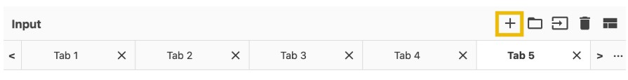

# Cybersecurity 101 
---
# Defensive Security Tooling: CyberChef - The Basics

**CyberChef** is a simple, intuitive web-based application designed to assist with various "cyber" operation tasks — all within your web browser.  

Think of it as a **Swiss Army knife for data** — a toolbox of different tools, each designed to perform a specific task.

These tasks range from:

- Simple operations like **Base64 encoding/decoding**, **XOR operations**
- To more complex operations like **AES encryption**, **RSA decryption**, and data format conversions

CyberChef operates on the concept of **recipes** — a series of operations that are executed in order, step-by-step, to transform the input data into the desired output.

Whether you're a security analyst, developer, or just curious about data manipulation, CyberChef can be a powerful tool to simplify your workflow.

 <br>

## Accessing the Tool

There are different ways to access and run CyberChef. Let's check the two most convenient methods!

- **Online Access:** All you need is a web browser and an internet connection. Then, you can click this [link](https://gchq.github.io/CyberChef/) to open CyberChef directly within your web browser.
- **Offline or Local Copy:** You can run this offline or locally on your machine by downloading the latest release file from this [link](https://github.com/gchq/CyberChef/releases). This will work on both Windows and Linux platforms. As best practice, you should download the most stable version.

## Navigating the Interface

CyberChef consists of four areas. Each consists of different components or features.

These are the following areas:

1. Operations
2. Recipe
3. Input
4. Output

 <br>

Let's discuss each of these areas below.

### The Operations Area

This is a practical and comprehensive repository of all the diverse operations that CyberChef is equipped to perform. These operations are meticulously categorized, offering users convenient access to various capabilities. Users can utilize the search feature to locate specific operations quickly, enhancing their efficiency and productivity.

Below are some operations you might use throughout your cyber security journey.

| **Operations**     | **Description**                                                                 | **Examples** |
|--------------------|----------------------------------------------------------------------------------|--------------|
| **From Morse Code**| Translates Morse Code into (upper case) alphanumeric characters.                | `- .... .-. . .- - ...` becomes `THREATS` when used with default parameters |
| **URL Encode**     | Encodes problematic characters into percent-encoding, a format supported by URIs/URLs. | `https://tryhackme.com/r/room/cyberchefbasics` becomes `https%3A%2F%2Ftryhackme%2Ecom%2Fr%2Froom%2Fcyberchefbasics` when used with the parameter “Encode all special chars” |
| **To Base64**      | This operation encodes raw data into an ASCII Base64 string.                     | `This is fun!` becomes `VGhpcyBpcyBmdW4h` |
| **To Hex**         | Converts the input string to hexadecimal bytes separated by the specified delimiter. | `This Hex conversion is awesome!` becomes `54 68 69 73 20 48 65 78 20 63 6f 6e 76 65 72 73 69 6f 6e 20 69 73 20 61 77 65 73 6f 6d 65 21` |
| **To Decimal**     | Converts the input data to an ordinal integer array.                             | `This Decimal conversion is awesome!` becomes `84 104 105 115 32 68 101 99 105 109 97 108 32 99 111 110 118 101 114 115 105 111 110 32 105 115 32 97 119 101 115 111 109 101 33` |
| **ROT13**          | A simple Caesar substitution cipher which rotates alphabet characters by the specified amount (default 13). | `Digital Forensics and Incident Response` becomes `Qvtvgny Sberafvpf naq Vapvqrag Erfcbafr` |

Alternatively, you can directly check how the operations work by hovering on the specific operation. This should give you a sample or a description and a link to Wikipedia.

 <br>

### The Recipe Area

This is considered the heart of the tool. In this area, you can seamlessly select, arrange, and fine-tune operations to suit your needs. This is where you take control, defining each operation's arguments and options precisely and purposefully.

The recipe area is a designated space to:
- Select and arrange specific operations
- Define their respective arguments and options
- Customize behavior further through drag-and-drop functionality

You can drag the operations you want to use into this area and specify their parameters.

#### Features

- **Save Recipe**: Allows the user to save selected operations for later use.
- **Load Recipe**: Enables the user to load previously saved recipes.
- **Clear Recipe**: Clears the currently selected operations from the recipe area.

These can be found in the highlighted icons below:

 <br>

**The BAKE! Button:** At the bottom of the interface is the **BAKE!** button — this is what initiates the processing of your input data using the configured recipe.

When you're ready to execute your sequence of operations, simply click **BAKE!** to apply the recipe to the input.

**Auto Bake:** You can also enable the **Auto Bake** checkbox. This feature automatically applies the recipe as you make changes, eliminating the need to manually click **BAKE!** each time. It's especially useful for real-time feedback while building or adjusting your recipe.

### Input Area

The input area provides a user-friendly space where you can easily input text or files by pasting, typing, or dragging them to perform operations.

 <br>

Additionally, it has the following features:

- `Add a new input tab`: This is where an additional tab is created for the user to use different values from the previous tab.

 <br>

- `Open folder as input`: This feature allows users to upload a whole folder as input value.

 <br>

- `Open file as input`: This feature allows the user to upload a file as its input value.

 <br>

- `Clear input and output`: This feature allows the user to clear any input values inserted and the corresponding output value.
- `Reset pane layout`: This feature brings the tool's interface to its default window sizes.

### Output Area

The output area is a visual space that showcases the data processing results. It neatly presents the outcomes of any manipulations or transformations you have applied to the input data, allowing for a clear and intuitive display of the processed information.

 <br>

### Additional Features

- **Save Output to File**:  
  Allows users to save the resulting output into a `.dat` file for future use or analysis.

- **Copy Raw Output to Clipboard**:  
  Enables users to copy the raw output directly to their clipboard, making it easy to paste the results into other applications or documents.

- **Replace Input with Output**:  
  Lets users quickly overwrite the existing input data with the processed output, streamlining iterative operations.

- **Maximise Output Pane**:  
  Restores the tool's interface to its default window sizes, helping users focus on the output area when needed.

## Before Anything Else

Hold your horses!

Before even going to the actual thing, let's have a quick overview of the thought process when using CyberChef! This process consists of four different steps:

 <br>

### Step-by-Step Workflow in CyberChef

Understanding how to effectively use CyberChef involves following a structured process. Below are the key steps to guide you through using the tool efficiently.

#### 1. Set a Clear Objective

Begin by defining a specific, achievable goal. Ask yourself:

> **"What do I want to accomplish?"**

Having a clear objective helps guide your investigation and use of CyberChef.

**Example Objective**:  
> *During a security investigation, I found a gibberish string; I want to know what hidden message it contains — if it has one.*

#### 2. Input Your Data

In this step, paste or upload the data you're working with into the **input area** of CyberChef. This is typically raw data, such as:

- A suspicious string
- Encoded text
- Encrypted content
- Binary or hexadecimal data

**Example**:  
> Paste the gibberish string found during the investigation into the input box.

#### 3. Select the Appropriate Operations

This is the most analytical part of the process. If you're unsure what you're dealing with, you might need to:

- Do a quick analysis of the string's structure.
- Conduct external research or make educated guesses based on context.
- Try different operations iteratively.

**Example Strategy**:  
You suspect the string is encoded or encrypted. Start with operations from the **Encryption/Encoding** category, such as:

- `ROT13`
- `Base64`
- `Base85`
- `ROT47`

CyberChef allows you to chain multiple operations, so feel free to test combinations.

> *Tip: Use Auto Bake to see results in real time as you tweak the operations.*

#### 4. Review the Output

Examine the output pane to determine if your objective has been met.

Ask yourself:

> **"Have I achieved the desired result?"**

If the decoded output makes sense and meets your goal, you’re done!

**If not**, revisit the recipe:
- Try different operations or combinations.
- Adjust parameters within operations.
- Re-express your objective based on new insights.

**Example Check**:  
> Did decoding the gibberish string reveal a human-readable message? If yes, success! If no, iterate and refine.

This approach ensures a methodical, goal-driven use of CyberChef, especially when working with unknown or obfuscated data.

To provide visual clarity to our example, see the figure below:

 <br>

### Extractors

The specific operations listed below fall under the **Extractors** category in CyberChef. These operations are used to pull specific types of information from input data, such as IP addresses, URLs, or email addresses.

| **Operation**             | **Description**                                                                 |
|---------------------------|----------------------------------------------------------------------------------|
| **Extract IP addresses**  | Extracts all IPv4 and IPv6 addresses from the input.                            |
| **Extract URLs**          | Extracts Uniform Resource Locators (URLs) from the input. The protocol (e.g., HTTP, FTP) is required to avoid false positives. |
| **Extract email addresses** | Extracts all email addresses found in the input text.                        |

- The `Extract IP addresses` will extract any valid IPv4/6 address from any given input.
- The `Extract email addresses` extracts any strings and characters with this format, anything@domain[.]com. Examples of domains include **hotmail.com**, **google.com**, **tryhackme.com**, and **yahoo.com**
- `Extract URLs` extracts Uniform Resource Locator, commonly known as URL. , a URL is the address used to access resources on the internet

### Date and Time

The specific operations in the table below fall under the **Date / Time** category in CyberChef.

| **Operation**         | **Description**                                                                 |
|------------------------|----------------------------------------------------------------------------------|
| **From UNIX Timestamp** | Converts a UNIX timestamp to a human-readable datetime string.                 |
| **To UNIX Timestamp**   | Parses a datetime string in UTC and returns the corresponding UNIX timestamp.  |

#### What is a UNIX Timestamp?

A **UNIX timestamp** is a 32-bit value representing the number of seconds since **January 1, 1970 UTC** (also known as the UNIX epoch).

Example

To convert a date string such as: **"Fri Sep 6 20:30:22 +04 2024"**

```sql 
Use the operation **To UNIX Timestamp**.  
The resulting UNIX timestamp would be:
```
1725654622

```sql 
To convert it back into a more human-readable format, use the **From UNIX Timestamp** operation.
```

### Data Format

The specific operations listed below fall under the **Data Format** category in CyberChef. These are typically used to convert between different encoding schemes, allowing data to be interpreted correctly by different systems or during analysis.

| **Operation**     | **Description**                                                                                              | **Example** |
|-------------------|--------------------------------------------------------------------------------------------------------------|-------------|
| **From Base64**   | Decodes data from an ASCII Base64 string back into its raw format.                                           | `V2VsY29tZSB0byB0cnloYWNrbWUh` becomes `Welcome to tryhackme!` |
| **URL Decode**    | Converts URI/URL percent-encoded characters back to their raw values.                                        | `https%3A%2F%2Fgchq%2Egithub%2Eio%2FCyberChef%2F` becomes `https://gchq.github.io/CyberChef/` |
| **From Base85**   | Decodes ASCII Base85 strings, which are more efficient than Base64, into their raw format.                  | `BOu!rD]j7BEbo7` becomes `hello world` |
| **From Base58**   | Decodes ASCII Base58 strings. Base58 avoids visually confusing characters like `l`, `I`, `0`, and `O`.       | `AXLU7qR` becomes `Thm58` |
| **To Base62**     | Encodes data using Base62, a compact and human-friendly format.                                              | `Thm62` becomes `6NiRkOY` |

#### What is Base Encoding?

Operations such as **Base64**, **Base85**, **Base58**, and **Base62** are known as **base encodings**. These techniques take binary data (strings of `0`s and `1`s) and convert it into readable text using a specific set of ASCII characters.

Base encodings are especially useful when you need to:

- Encode binary data for transmission over text-based protocols
- Store binary files in text formats (e.g., JSON, XML)
- Improve human readability and reduce errors when manually copying data

Although we have a dedicated room for **Hashing Basics notes**, let's have a quick overview and discuss the most commonly used operation, Base64.

Our example would be to encode the letters **"THM"**. We have a short ASCII Table here that we can use for reference. If you want to view the complete ASCII Table, please refer to this page [here](https://en.wikipedia.org/wiki/ASCII).

| Decimal | Binary    | Symbol |   | Decimal | Binary    | Symbol |
|---------|-----------|--------|---|---------|-----------|--------|
| 65      | 01000001  | A      |   | 78      | 01001110  | N      |
| 66      | 01000010  | B      |   | 79      | 01001111  | O      |
| 67      | 01000011  | C      |   | 80      | 01010000  | P      |
| 68      | 01000100  | D      |   | 81      | 01010001  | Q      |
| 69      | 01000101  | E      |   | 82      | 01010010  | R      |
| 70      | 01000110  | F      |   | 83      | 01010011  | S      |
| 71      | 01000111  | G      |   | 84      | 01010100  | T      |
| 72      | 01001000  | H      |   | 85      | 01010101  | U      |
| 73      | 01001001  | I      |   | 86      | 01010110  | V      |
| 74      | 01001010  | J      |   | 87      | 01010111  | W      |
| 75      | 01001011  | K      |   | 88      | 01011000  | X      |
| 76      | 01001100  | L      |   | 89      | 01011001  | Y      |
| 77      | 01001101  | M      |   | 90      | 01011010  | Z      |


### Step 1: Convert To Binary and Merge (Manually)

Based on our table above:

- **T** = `01010100`
- **H** = `01001000`
- **M** = `01001101`

Next, concatenate these binaries into a single 24-bit string:`010101000100100001001101`

### Step 2: Divide and Convert to Decimal(Manually)

Separate `010101000100100001001101` into 6 characters each. You should have `010101` `000100` `100001` `001101`. These are 6-bit characters; we should have four instances of this now. We need to convert each instance to Decimal. Let's convert, then!

| **Binary** | **Decimal (Base10)** |
|------------|----------------------|
| 010101     | 21                   |
| 000100     | 4                    |
| 100001     | 33                   |
| 001101     | 13                   |


### Step 3: Convert to Base64 (Manually)

Now that we have the Numbers from the previous step, which are `21`, `4`, `33`, and `13`, let's look for the equivalent characters from our table below. This table represents a base64 index table.

| Index | Character | Index | Character | Index | Character |
|-------|-----------|-------|-----------|-------|-----------|
| 0     | A         | 26    | a         | 52    | 0         |
| 1     | B         | 27    | b         | 53    | 1         |
| 2     | C         | 28    | c         | 54    | 2         |
| 3     | D         | 29    | d         | 55    | 3         |
| 4     | E         | 30    | e         | 56    | 4         |
| 5     | F         | 31    | f         | 57    | 5         |
| 6     | G         | 32    | g         | 58    | 6         |
| 7     | H         | 33    | h         | 59    | 7         |
| 8     | I         | 34    | i         | 60    | 8         |
| 9     | J         | 35    | j         | 61    | 9         |
| 10    | K         | 36    | k         | 62    | +         |
| 11    | L         | 37    | l         | 63    | /         |
| 12    | M         | 38    | m         |       |           |
| 13    | N         | 39    | n         |       |           |
| 14    | O         | 40    | o         |       |           |
| 15    | P         | 41    | p         |       |           |
| 16    | Q         | 42    | q         |       |           |
| 17    | R         | 43    | r         |       |           |
| 18    | S         | 44    | s         |       |           |
| 19    | T         | 45    | t         |       |           |
| 20    | U         | 46    | u         |       |           |
| 21    | V         | 47    | v         |       |           |
| 22    | W         | 48    | w         |       |           |
| 23    | X         | 49    | x         |       |           |
| 24    | Y         | 50    | y         |       |           |
| 25    | Z         | 51    | z         |       |           |

Upon checking from the table, we should have found its corresponding character by now. 

| Index | Character |
|-------|-----------|
| 21    | V         |
| 4     | E         |
| 33    | h         |
| 13    | N         |

Combine these characters, and you should have the equivalent of "THM" in base64 format. The answer would be `VEhN`.

Woah! Isn't that amazing? You just converted a set of characters into base64 manually.

Now, let’s discuss the `URL Decode`. This works by converting the percent-encoded characters back to their raw values. For a reference of these values, you can check the page [here](https://en.wikipedia.org/wiki/Percent-encoding), Note that the default character set in HTML5 is **UTF-8**. Check the table below for a quick overview of what we can typically see in a URL.

| Character | From UTF-8 |
|-----------|-------------|
| :         | %3A         |
| /         | %2F         |
| .         | %2E         |
| =         | %3D         |
| #         | %23         |


---
> **Note:** These notes document hands-on learning from the TryHackMe *Cybersecurity 101* path. The exercises cover fundamental cybersecurity topics, including Linux basics, networking concepts, and web technologies. This document is intended for personal learning, revision, and ethical skill development. All screenshots, commands, and actions are for educational purposes only.  
> — Compiled by moh4med404 | Curious Mind | Cybersecurity Enthusiast