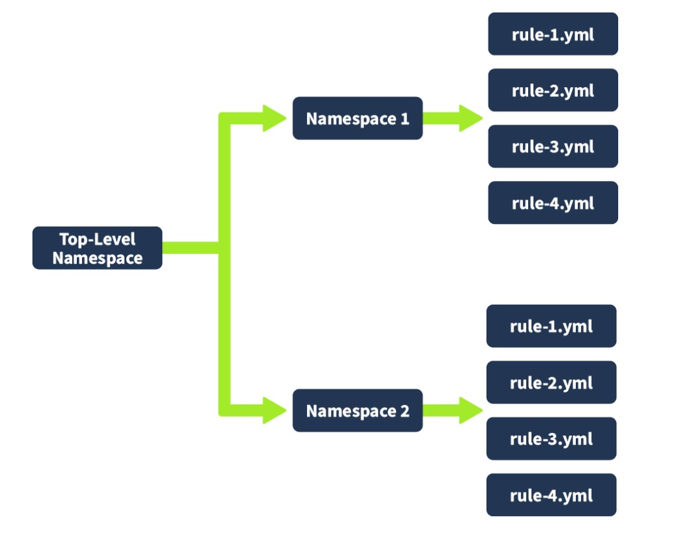
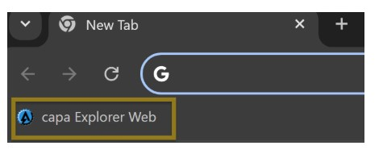
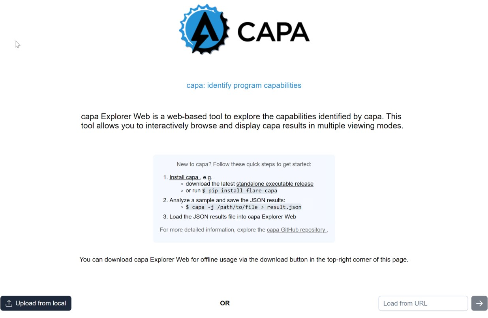
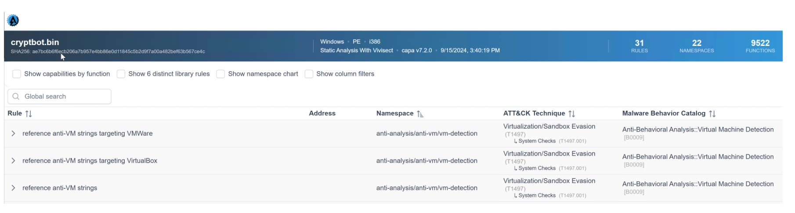
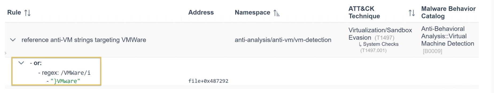
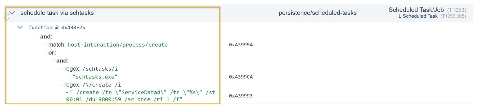
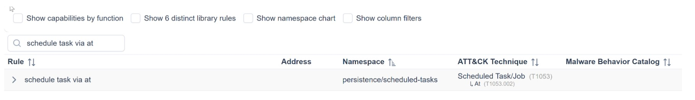

# Cybersecurity 101 
---
# Defensive Security Tooling: CAPA - The Basics


One of the challenges when analyzing potentially malicious software is the risk of compromising your machine or environment when running it — unless you use a **sandbox** or a completely **isolated environment** for testing.

Generally speaking, there are two types of analysis:

- **Dynamic Analysis**: Involves executing the program to observe its behavior.
- **Static Analysis**: Involves examining the program without executing it.

This room will focus on conducting **static analysis** using a tool called **CAPA**.

 <br>

**CAPA** (Common Analysis Platform for Artifacts) is a tool developed by the FireEye Mandiant team. It is designed to identify capabilities present in executable files such as:

- Portable Executables (PE)
- ELF binaries
- .NET modules
- Shellcode
- Sandbox reports

CAPA analyzes these files by applying a set of rules that describe common behaviors, enabling it to determine what the program is capable of doing, such as:

- Network communication
- File manipulation
- Process injection
- And many more

The beauty of CAPA lies in its encapsulation of years of reverse engineering knowledge into an automated tool. This makes it accessible even to those who may not be experts in reverse engineering, allowing analysts and security professionals to quickly understand potentially malicious software functionality without manual reverse engineering.

CAPA is particularly useful in malware analysis and threat hunting, where understanding a binary's capabilities is crucial for:

- Incident response
- Defensive measures

## Tool Overview: How CAPA Works

Example: Using `cryptbot.bin`

In this example, we will use `cryptbot.bin`; please note that the results of this file will be discussed throughout the succeeding tasks.

After running the command, wait for the result, which may take several minutes. 

We don't intend for this to finish immediately but rather to let you get a feel for running the tool. 

We suggest that you continue with the task while CAPA is running or stop the processing if needed. 

There are alternative ways to proceed with the analysis of the results. See the command below.

```bash 
PS C:\Users\Administrator\Desktop\capa> capa.exe .\cryptbot.bin
loading : 100%|████████████████████| 485/485 [00:00<00:00, 1108.84     rules/s]
/ analyzing program...
```
In addition to the `-h` command, which provides more information about the available parameters, we will focus on two commonly used parameters:

- `-v`  
- `-vv`  

These options give more detailed results, with `-vv` providing the most verbose output. However, using these parameters will increase the processing time.

We will discuss the results of these options in the upcoming tasks.

| Option         | Description                        | Sample Syntax               |
|----------------|----------------------------------|----------------------------|
| `-h` or `--help`       | Show this help message and exit.  | `capa -h`                  |
| `-v` or `--verbose`    | Enable verbose result document.    | `capa.exe .\cryptbot.bin -v`  |
| `-vv` or `--vverbose`  | Enable a very verbose result document. | `capa.exe .\cryptbot.bin -vv` |

This should be the output of the command. *Please take note that results may vary. If you ran CAPA on some files, it might or might not give the same information as below*.


```bash 
PS C:\Users\Administrator\Desktop\capa> capa .\cryptbot.bin
┌─────────────┬────────────────────────────────────────────────────────────────────────────────────┐
│ md5         │ 3b9d26d2e7433749f2c32edb13a2b0a2                                                   │
│ sha1        │ 969437df8f4ad08542ce8fc9831fc49a7765b7c5                                           │
│ sha256      │ ae7bc6b6f6ecb206a7b957e4bb86e0d11845c5b2d9f7a00a482bef63b567ce4c                   │
│ analysis    │ static                                                                             │
│ os          │ windows                                                                            │
│ format      │ pe                                                                                 │
│ arch        │ i386                                                                               │
│ path        │ /home/strategos/Room-CAPA/cryptbot.bin                                             │
└─────────────┴────────────────────────────────────────────────────────────────────────────────────┘
┌──────────────────────┬───────────────────────────────────────────────────────────────────────────┐
│ ATT&CK Tactic        │ ATT&CK Technique                                                          │
├──────────────────────┼───────────────────────────────────────────────────────────────────────────┤
│ DEFENSE EVASION      │ Obfuscated Files or Information [T1027]                                   │
│                      │ Obfuscated Files or Information::Indicator Removal from Tools [T1027.005] │
│                      │ Virtualization/Sandbox Evasion::System Checks [T1497.001]                 │
│ DISCOVERY            │ File and Directory Discovery [T1083]                                      │
│ EXECUTION            │ Command and Scripting Interpreter::PowerShell [T1059.001]                 │
│                      │ Shared Modules [T1129]                                                    │
│ IMPACT               │ Resource Hijacking [T1496]                                                │
│ PERSISTENCE          │ Scheduled Task/Job::At [T1053.002]                                        │
│                      │ Scheduled Task/Job::Scheduled Task [T1053.005]                            │
└──────────────────────┴───────────────────────────────────────────────────────────────────────────┘
┌─────────────────────────────┬────────────────────────────────────────────────────────────────────┐
│ MAEC Category               │ MAEC Value                                                         │
├─────────────────────────────┼────────────────────────────────────────────────────────────────────┤
│ malware-category            │ launcher                                                           │
└─────────────────────────────┴────────────────────────────────────────────────────────────────────┘
┌──────────────────────────┬──────────────────────────────────────────────────────────────────────────┐
│ MBC Objective            │ MBC Behavior                                                             │
├──────────────────────────┼──────────────────────────────────────────────────────────────────────────┤
│ ANTI-BEHAVIORAL ANALYSIS │ Virtual Machine Detection [B0009]                                        │
│ ANTI-STATIC ANALYSIS     │ Executable Code Obfuscation::Argument Obfuscation [B0032.020]            │
│                          │ Executable Code Obfuscation::Stack Strings [B0032.017]                   │
│ COMMUNICATION            │ HTTP Communication [C0002]                                               │
│                          │ HTTP Communication::Read Header [C0002.014]                              │
│ DATA                     │ Check String [C0019]                                                     │
│                          │ Encode Data::Base64 [C0026.001]                                          │
│                          │ Encode Data::XOR [C0026.002]                                             │
│ DEFENSE EVASION          │ Obfuscated Files or Information::Encoding-Standard Algorithm [E1027.m02] │
│ DISCOVERY                │ File and Directory Discovery [E1083]                                     │
│ EXECUTION                │ Command and Scripting Interpreter [E1059]                                │
│ FILE SYSTEM              │ Create Directory [C0046]                                                 │
│                          │ Delete File [C0047]                                                      │
│                          │ Read File [C0051]                                                        │
│                          │ Writes File [C0052]                                                      │
│ MEMORY                   │ Allocate Memory [C0007]                                                  │
│ PROCESS                  │ Create Process [C0017]                                                   │
└──────────────────────────┴──────────────────────────────────────────────────────────────────────────┘
┌──────────────────────────────────────────────────────┬──────────────────────────────────────────────┐
│ Capability                                           │ Namespace                                    │
├──────────────────────────────────────────────────────┼──────────────────────────────────────────────┤
│ reference anti-VM strings                            │ anti-analysis/anti-vm/vm-detection           │
│ reference anti-VM strings targeting VMWare           │ anti-analysis/anti-vm/vm-detection           │
│ reference anti-VM strings targeting VirtualBox       │ anti-analysis/anti-vm/vm-detection           │
│ contain obfuscated stackstrings (2 matches)          │ anti-analysis/obfuscation/string/stackstring │
│ reference HTTP User-Agent string                     │ communication/http                           │
│ check HTTP status code                               │ communication/http/client                    │
│ reference Base64 string                              │ data-manipulation/encoding/base64            │
│ encode data using XOR                                │ data-manipulation/encoding/xor               │
│ contain a thread local storage (.tls) section        │ executable/pe/section/tls                    │
│ get common file path                                 │ host-interaction/file-system                 │
│ create directory                                     │ host-interaction/file-system/create          │
│ delete file                                          │ host-interaction/file-system/delete          │
│ read file on Windows (4 matches)                     │ host-interaction/file-system/read            │
│ write file on Windows (5 matches)                    │ host-interaction/file-system/write           │
│ get thread local storage value                       │ host-interaction/process                     │
│ create process on Windows                            │ host-interaction/process/create              │
│ allocate or change RWX memory                        │ host-interaction/process/inject              │
│ reference cryptocurrency strings                     │ impact/cryptocurrency                        │
│ link function at runtime on Windows (5 matches)      │ linking/runtime-linking                      │
│ parse PE header (4 matches)                          │ load-code/pe                                 │
│ resolve function by parsing PE exports (186 matches) │ load-code/pe                                 │
│ run PowerShell expression                            │ load-code/powershell/                        │
│ schedule task via at                                 │ persistence/scheduled-tasks                  │
│ schedule task via schtasks                           │ persistence/scheduled-tasks                  │
└──────────────────────────────────────────────────────┴──────────────────────────────────────────────┘
```

 Open another PowerShell terminal and use the command `Get-Content cryptbot.txt`

```bash 
PS C:\Users\Administrator\Desktop\capa> Get-Content .\cryptbot.txt
```
Loading the content to PowerShell will give the same output from the terminal above.

## Dissecting CAPA Results Part 1: General Information, MITRE and MAEC

As mentioned in the previous task, the results of running CAPA against `cryptbot.bin` will be discussed in the succeeding task. We will dissect the results per block and topic.

The first block contains basic information about the file, including the following:

- **Cryptographic algorithms**, such as MD5, SHA1, and SHA256.
- **Analysis field**, which tells us how CAPA performed its analysis on the file.
- **OS field**, revealing the operating system (OS) context for which the identified capabilities apply.
- **Arch field**, which helps determine whether the binary is related to the x86 architecture.
- **Path**, showing where the analyzed file was located.

```bash 
┌─────────────┬────────────────────────────────────────────────────────────────────────────────────┐
│ md5         │ 3b9d26d2e7433749f2c32edb13a2b0a2                                                   │
│ sha1        │ 969437df8f4ad08542ce8fc9831fc49a7765b7c5                                           │
│ sha256      │ ae7bc6b6f6ecb206a7b957e4bb86e0d11845c5b2d9f7a00a482bef63b567ce4c                   │
│ analysis    │ static                                                                             │
│ os          │ windows                                                                            │
│ format      │ pe                                                                                 │
│ arch        │ i386                                                                               │
│ path        │ /home/strategos/Room-CAPA/cryptbot.bin                                             │
└─────────────┴────────────────────────────────────────────────────────────────────────────────────┘
```

### MITRE ATT&CK

The **MITRE ATT&CK** (Adversarial Tactics, Techniques, and Common Knowledge) framework is a comprehensive global knowledge repository that meticulously documents the tactics and techniques employed by threat actors at every stage of a cyber-attack.

It functions as a strategic playbook, providing detailed insights into attackers' methods, including:

- Gaining initial access  
- Maintaining presence  
- Escalating privileges  
- Evading defenses  
- Moving laterally within a network  
- And much more  

**CAPA** uses this format for its output. Note that some results may or may not contain the Technique and Sub-technique Identifier.

| Format                                                    | Sample                                                                 | Explanation                         |
|-----------------------------------------------------------|------------------------------------------------------------------------|-----------------------------------|
| ATT&CK Tactic::ATT&CK Technique::Technique Identifier     | Defense Evasion::Obfuscated Files or Information::T1027                | **DEFENSE EVASION** = ATT&CK Tactic  
**Obfuscated Files or Information** = ATT&CK Technique  
**T1027** = Technique Identifier |
| ATT&CK Tactic::ATT&CK Technique::ATT&CK Sub-Technique::Technique Identifier[.]Sub-technique Identifier | Defense Evasion::Obfuscated Files or Information::Indicator Removal from Tools::T1027.005 | **DEFENSE EVASION** = ATT&CK Tactic  
**Obfuscated Files or Information** = ATT&CK Technique  
**Indicator Removal from Tools** = ATT&CK Sub-Technique  
**T1027** = Technique Identifier  
**005** = Sub-Technique Identifier  |

```bash 
┌──────────────────────┬───────────────────────────────────────────────────────────────────────────┐
│ ATT&CK Tactic        │ ATT&CK Technique                                                          │
├──────────────────────┼───────────────────────────────────────────────────────────────────────────┤
│ DEFENSE EVASION      │ Obfuscated Files or Information [T1027]                                   │
│                      │ Obfuscated Files or Information::Indicator Removal from Tools [T1027.005] │
│                      │ Virtualization/Sandbox Evasion::System Checks [T1497.001]                 │
│ DISCOVERY            │ File and Directory Discovery [T1083]                                      │
│ EXECUTION            │ Command and Scripting Interpreter::PowerShell [T1059.001]                 │
│                      │ Shared Modules [T1129]                                                    │
│ IMPACT               │ Resource Hijacking [T1496]                                                │
│ PERSISTENCE          │ Scheduled Task/Job::At [T1053.002]                                        │
│                      │ Scheduled Task/Job::Scheduled Task [T1053.005]                            │
└──────────────────────┴───────────────────────────────────────────────────────────────────────────┘
```

In CAPA's final output, they referenced the MITRE Framework. This helps analysts or defenders map the file's behaviour to the adversary's playbook, which can help narrow down the scope of the investigation during an incident. 

### MAEC

**Malware Attribute Enumeration and Characterization (MAEC)** is a specialized language designed to encode and communicate complex details concerning malware. 

It contains an extensive range of attributes, including behaviors, artifacts, and interconnections among various instances of malware. 

This language functions as a standardized system for tracking and analyzing the complicated complexities of malware.

```bash
┌─────────────────────────────┬────────────────────────────────────────────────────────────────────┐
│ MAEC Category               │ MAEC Value                                                         │
├─────────────────────────────┼────────────────────────────────────────────────────────────────────┤
│ malware-category            │ launcher                                                           │
└─────────────────────────────┴────────────────────────────────────────────────────────────────────┘
```

Let’s check the table below to see the most commonly used MAEC values by CAPA: **Downloader** and **Launcher**.

| MAEC Value | Description                                                                                   |
|------------|-----------------------------------------------------------------------------------------------|
| Launcher   | Exhibits behaviours that trigger specific actions similar to malware behaviour.               |
| Downloader | Exhibits behaviours wherein it downloads and executes other files, usually seen in complex malware. |

When CAPA tags a file with a **“launcher”** MAEC value, it indicates that the file demonstrates behaviour similar to but not limited to:

- Dropping additional payloads  
- Activating persistence mechanisms  
- Connecting to command-and-control (C2) servers  
- Executing specific functions  

This is interesting! Some of these behaviours are also present in the Malware Behavior Catalogue (MBC)  and Capability block, which we will discuss in the next task!

Additionally, when CAPA tags a file with a **“Downloader”** MAEC value, it indicates that the file demonstrates behaviour similar but not limited to:

- Fetching additional payloads or resources from the internet  
- Pulling in updates  
- Executing secondary stages  
- Retrieving configuration files  

## Dissecting CAPA Results Part 2: Malware Behavior Catalogue

### Malware Behavior Catalogue (MBC)

MBC is designed to support various aspects of malware analysis, such as labeling, similarity analysis, and standardized reporting. Essentially, it serves as a catalogue of malware objectives and behaviours.

MBC can also link to **ATT&CK** methods and log all behaviours and code features discovered during malware analysis. It's important to note that the names of MBC behaviours may or may not match the corresponding ATT&CK techniques. 

The information on behaviour pages complements the content on ATT&CK pages. In other words, when recording malware behaviours, MBC users will reference ATT&CK, but MBC does **not** duplicate ATT&CK information.

The content of MBC below can be represented in two formats.

| Format                              | Sample                                                                 | Explanation                                                                 |
|-------------------------------------|------------------------------------------------------------------------|-----------------------------------------------------------------------------|
| `OBJECTIVE::Behavior::Method[Identifier]` | `ANTI-STATIC ANALYSIS::Executable Code Obfuscation::Argument Obfuscation [B0032.020]` | - **OBJECTIVE**: Anti-static Analysis<br>- **BEHAVIOR**: Executable Code Obfuscation<br>- **METHOD**: Argument Obfuscation<br>- **IDENTIFIER**: B0032.020 |
| `OBJECTIVE::Behavior::[Identifier]`       | `COMMUNICATION::HTTP Communication:: [C0002]`                           | - **OBJECTIVE**: Communication<br>- **BEHAVIOR**: HTTP Communication<br>- **IDENTIFIER**: C0002 |

The difference between the two formats is that the first format contains additional details called METHOD, which can also be coined as a sub-technique.

We must also discuss the Objective, Behavior, and Methods to better understand this part.

### Objective

The **Objectives** are based on [ATT&CK](https://attack.mitre.org/) tactics in the context of malware behaviour, though not all ATT&CK tactics are included. 

In addition, MBC introduces unique objectives such as **Anti-Behavioral Analysis** and **Anti-Static Analysis**. These objectives are specifically tailored for malware analysis, with the primary use case being the characterization of malware.

See the table below for an explanation of each objective.

| **Objective**            | **Explanation** |
|--------------------------|-----------------|
| **Anti-Behavioral Analysis** | Malware attempts to avoid detection by hindering behavioural analysis using tools like sandboxes or debuggers. |
| **Anti-Static Analysis**     | Malware attempts to obstruct or add complexity to static analysis, making it more challenging for security professionals to identify and understand its malicious behaviours and intentions. |
| **Collection**               | Malware focuses on identifying and gathering information from the targeted machine or network. |
| **Command and Control**      | Malware typically establishes communication with compromised systems through various methods such as command and control servers, peer-to-peer networks, or other means. This communication allows the malware to control the compromised systems, enabling the attackers to execute commands, exfiltrate data, or carry out other malicious activities. |
| **Credential Access**        | The primary aim of malware is to steal account credentials, such as usernames and passwords. |
| **Defense Evasion**          | The malware aims to bypass and circumvent the various detection and security mechanisms present within the system to avoid being detected or mitigated. |

### Micro-Objective

**Micro-objectives** are associated with **micro-behaviors**, which refer to an action or actions exhibited by potentially malicious software that aren't necessarily malicious by themselves and may serve various objectives.

For example, binaries used in messaging applications might exhibit such behaviors. However, it's important to note that these behaviors are often **abused** in malicious contexts. This is why tools like **CAPA** might flag them during analysis.

| **Micro-Objective** | **Description** |
|---------------------|-----------------|
| **PROCESS**         | Exhibiting behaviours related to processes, such as (but not limited to) creating processes, setting thread context, terminating processes, and checking mutexes. |
| **MEMORY**          | Exhibiting behaviours such as (but not limited to) allocating memory, changing memory protection, and freeing memory. |
| **COMMUNICATION**   | Exhibiting behaviours involving network traffic, such as (but not limited to) DNS, FTP, HTTP, ICMP, and SMTP. |
| **DATA**            | Exhibiting behaviours such as (but not limited to) checking strings, compressing, decoding, and encoding data. |

The final output of CAPA, Objective, and Micro-Objective are shown only under the **Objective column**.

### MBC Behaviors

The **MBC Behaviors** column contains both **behaviors** and **micro-behaviors**, which may or may not include their associated methods and identifiers.

For a complete list of all MBC content, please refer to the [MBC Summary](#) _(insert link here)_.

Below is a compiled version of Behaviors/Micro-behaviors along with their Identifiers.

| **Objective**                                | **Behavior**                       | **Identifier** | **Explanation** |
|----------------------------------------------|------------------------------------|----------------|------------------|
| ANTI-BEHAVIORAL ANALYSIS                     | Virtual Machine Detection          | B0009          | The malware checks to see if it is running in a virtual environment. During its system reconnaissance, the malware examines various user and system artifacts. |
| ANTI-STATIC ANALYSIS                         | Executable Code Obfuscation        | B0032          | Executable code has been intentionally obscured to prevent static code analysis. This is a specific behavior related to the executable code of a malware sample, including its data and text sections. |
| EXECUTION                                     | Command and Scripting Interpreter  | E1059          | Malware can exploit command and script interpreters to run malicious commands, scripts, or binaries. It targets built-in interpreters like `cmd.exe` or PowerShell on Windows or Bash on Unix-like systems. Attackers may also use other scripting languages like Python, Perl, or JavaScript. |
| DISCOVERY                                     | File and Directory Discovery       | E1083          | Malware has the capability to search for specific files in particular locations by enumerating files and directories. |
| ANTI-STATIC ANALYSIS, DEFENSE EVASION        | Obfuscated Files or Information    | E1027          | Malware can obfuscate files or information by encoding, encrypting, or otherwise making them hard to analyze. It can also encode or encrypt malware samples itself. |

### Micro-Behavior

The term **"low-level behaviors"** in malware analysis refers to actions exhibited by malware that aren't necessarily malicious on their own and may serve various objectives. These behaviors are often documented as **micro-behaviors** in the **Malware Behavior Characteristics (MBC)** framework.

Examples of such low-level behaviors include:

- Creating TCP sockets  
- Evaluating specific conditions within strings

It's important to note that just because a behavior is categorized as low-level does **not** mean it is harmless — it may still be part of a larger malicious scheme.

| **Micro-Objective** | **Micro-Behavior**    | **Identifier** | **Explanation** |
|---------------------|------------------------|----------------|------------------|
| MEMORY              | Allocate Memory        | C0007          | Malware frequently utilizes memory allocation as part of its strategy to unpack itself and execute its malicious activities. |
| PROCESS             | Create Process         | C0017          | Malware creates a process via WMI or shellcode. It can also create a suspended process. |
| COMMUNICATION       | HTTP Communication     | C0002          | Malware is capable of initiating HTTP communications. |
| DATA                | Check String           | C0019          | Malware can inspect a string to identify specific characteristics, such as ASCII content, credit card numbers, and string length. |

Additional Micro-Objectives and Micro-Behaviors

| **Micro-Objective** | **Micro-Behavior** | **Identifier** | **Explanation** |
|---------------------|--------------------|----------------|------------------|
| DATA                | Encode Data        | C0026          | Malware has the capability to encode data using base64 and XOR. |
| FILE SYSTEM         | Create Directory   | C0046          | Malware can create a directory. |
| FILE SYSTEM         | Delete File        | C0047          | Malware has the capability to delete a file. |
| FILE SYSTEM         | Read File          | C0051          | Malware can read a file. |
| FILE SYSTEM         | Write File         | C0052          | Malware has the capability to write to a file. |

Note that in the final output of CAPA, Behavior and Micro-Behavior are shown only under the **Behavior column**.


### Methods

Lastly, let’s check the **METHODS**. Below are some methods included in the results from the previous sample. Methods are tied to behaviors; therefore, to fully see all methods, please refer to each specific behavior/micro behavior of interest.

| **Behavior**                    | **Methods or Sub-technique**   | **Identifier** | **Explanation**                                                                 |
|--------------------------------|--------------------------------|----------------|----------------------------------------------------------------------------------|
| Executable Code Obfuscation    | Argument Obfuscation           | B0032.020      | Simple number or string arguments to API calls are calculated at runtime, making analysis more difficult. |
| Executable Code Obfuscation    | Stack Strings                  | B0032.017      | Build and decrypt strings on the stack at each use, then discard to avoid obvious references. |
| HTTP Communication             | Read Header                    | C0002.014      | HTTP read header.                                                               |
| Encode Data                    | Base64                         | C0026.001      | Malware may encode data using Base64.                                           |
| Encode Data                    | XOR                            | C0026.002      | Malware may use XOR to encode data.                                             |
| Obfuscated Files or Information| Encoding - Standard Algorithm  | E1027.m02      | Encoding malware samples, files, or other information uses a standard algorithm (e.g., base64). |

Now that we have a good overview and understanding of the MBC's contents, we should be able to explain the result of the previous sample. Therefore, let's do a quick recap using one of the results. Shall we?

```bash 
┌─────────────────────────────┬──────────────────────────────────┐
│ MBC Objective               │ MBC Behavior                     │
├─────────────────────────────┼──────────────────────────────────┤
| DATA                        │ Encode Data::Base64 [C0026.001]  │
└─────────────────────────────┴──────────────────────────────────┘
```

Here's the explanation for the above result. See the table below.

| **Label**         | **Value**      | **Explanation**                                                                                      |
|-------------------|----------------|------------------------------------------------------------------------------------------------------|
| MBC Objective     | DATA           | Exhibiting behaviors such as, but not limited to, checking strings, compressing, decoding, and encoding data. |
| MBC Behavior      | Encode Data    | Malware has the capability to encode data using Base64 and XOR.                                     |
| Method            | Base64         | Malware may encode data using Base64.                                                               |
| Identifier        | C0026.001      | Identifier relays information about a behavior. This also serves as a tag.                          |

Knowing this information, you may simply say this file can use the base64 encoding scheme!

## Dissecting CAPA Results Part 3: Namespaces

We will divide the discussion into two main topics: **Capability** and **Namespace**. In this task, we will focus on the discussion of **Namespace**.

Below, you will find the `capa.exe` output. Note that this can also be viewed in **Task 2**. Click on the **View Terminal** below.

```bash 
┌──────────────────────────────────────────────────────┬──────────────────────────────────────────────────────┐
│ Capability                                           │ Namespace                                            │
├──────────────────────────────────────────────────────┼──────────────────────────────────────────────────────┤
│ reference anti-VM strings                            │ anti-analysis/anti-vm/vm-detection                   │
│ reference anti-VM strings targeting VMWare           │ anti-analysis/anti-vm/vm-detection                   │
│ reference anti-VM strings targeting VirtualBox       │ anti-analysis/anti-vm/vm-detection                   │
│ contain obfuscated stackstrings (2 matches)          │ anti-analysis/obfuscation/string/stackstring         │
│ reference HTTP User-Agent string                     │ communication/http                                   │
│ check HTTP status code                               │ communication/http/client                            │
│ reference Base64 string                              │ data-manipulation/encoding/base64                    │
│ encode data using XOR                                │ data-manipulation/encoding/xor                       │
│ contain a thread local storage (.tls) section        │ executable/pe/section/tls                            │
│ get common file path                                 │ host-interaction/file-system                         │
│ create directory                                     │ host-interaction/file-system/create                  │
│ delete file                                          │ host-interaction/file-system/delete                  │
│ read file on Windows (4 matches)                     │ host-interaction/file-system/read                    │
│ write file on Windows (5 matches)                    │ host-interaction/file-system/write                   │
│ get thread local storage value                       │ host-interaction/process                             │
│ create process on Windows                            │ host-interaction/process/create                      │
│ allocate or change RWX memory                        │ host-interaction/process/inject                      │
│ reference cryptocurrency strings                     │ impact/cryptocurrency                                │
│ link function at runtime on Windows (5 matches)      │ linking/runtime-linking                              │
│ parse PE header (4 matches)                          │ load-code/pe                                         │
│ resolve function by parsing PE exports (186 matches) │ load-code/pe                                         │
│ run PowerShell expression                            │ load-code/powershell/                                │
│ schedule task via at                                 │ persistence/scheduled-tasks                          │
│ schedule task via schtasks                           │ persistence/scheduled-tasks                          │
└──────────────────────────────────────────────────────┴──────────────────────────────────────────────────────┘
```
The content of this block is represented in the below format.

| **Format**                                   | **Sample**                                          | **Explanation**                                                                 |
|---------------------------------------------|-----------------------------------------------------|----------------------------------------------------------------------------------|
| Capability(Rule Name)::TLN/Namespace         | reference anti-VM strings::Anti-Analysis/anti-vm/vm-detection | `reference anti-VM strings` = Capability (Rule Name)  |
|                                             |                                                     | `Anti-Analysis` = TLN (Top-Level Namespace)                                      |
|                                             |                                                     | `anti-vm/vm-detection` = Namespace                                               |

#### Namespaces

CAPA uses namespaces to group items with the same purpose. 

| **Top-Level Namespace (TLN)** | **Explanation** |
|-------------------------------|-----------------|
| **anti-analysis**             | Contains a set of rules specifically designed to detect behaviours exhibited by malware to evade analysis. These behaviours include obfuscation, packing, and anti-debugging techniques. |
| **collection**                | Contains a set of data-related rules that malware may enumerate and collect for exfiltration or other purposes. Think of it as the “data-gathering” aspect of malware behaviour. |
| **communication**            | Contains a set of rules that pertain to different communication behaviours demonstrated by malware. This encompasses how malware interacts with networks, including data transmission and reception, command and control communications, and other network-related behaviours. |
| **compiler**                  | Contains a set of rules and configurations for recognizing specific build environments or compilers employed in generating executables. These namespaces essentially serve as the unique “signature” that identifies the compilation process of a program. |
| **data-manipulation**         | Contains a set of rules that govern the behaviours involved in altering data within executable files. This aspect can be considered the “data transformation” component of malware behaviour, encompassing actions such as String Encryption and Data Encoding. |

| **Top-Level Namespace (TLN)** | **Explanation** |
|-------------------------------|-----------------|
| **anti-analysis**             | Contains rules designed to detect behaviors exhibited by malware to evade analysis, such as obfuscation, packing, and anti-debugging. |
| **collection**                | Focuses on data-related behaviors where malware enumerates and gathers data for exfiltration or other uses—essentially the “data-gathering” aspect of malware. |
| **communication**             | Encompasses how malware interacts with networks, including data transmission, command and control, and other network-related activities. |
| **compiler**                  | Identifies specific compilers or build environments used to generate executables—serving as a “signature” of the compilation process. |
| **data-manipulation**         | Involves altering data within executable files. Examples include string encryption and data encoding—representing “data transformation” behaviors. |
| **executable**                | Pertains to attributes in executable files, such as PE sections or debug information related to the executable itself. |
| **host-interaction**          | Captures behaviors related to how malware interacts with the host environment, including reading, writing, creating, or deleting files and directories. |
| **impact**                    | Focuses on the potential consequences of malware behavior—such as remote access, data exfiltration, destruction, or modification. |
| **internal**                  | Internal rules used by CAPA for tool functionality—not intended for direct analysis or reporting. |
| **lib**                       | Contains modular rule components (building blocks) that support other rule definitions. |
| **linking**                   | Detects behaviors related to linking or dynamically loading libraries. Helps identify dependencies on external libraries like OpenSSL or Zlib. |
| **load-code**                 | Detects behaviors where code is dynamically loaded or executed at runtime—similar to runtime code injection. |
| **malware-family**            | Identifies behaviors or traits associated with known malware families, aiding in classification and detection. |
| **nursery**                   | A staging area for under-development or experimental rules not yet production-ready. |
| **persistence**               | Focuses on methods used by malware to maintain long-term access to a system after initial compromise. |
| **runtime**                   | Seeks to identify the programming language or platform used during program execution. |
| **targeting**                 | Contains rules related to malware targeting specific systems or environments, such as ATMs. |

Let’s see how this works by checking the table below.

| **Top-Level Namespace (TLN)** | **Namespaces**           | **Rule YAML File**                                                                                 | **Explanation** |
|-------------------------------|---------------------------|-----------------------------------------------------------------------------------------------------|-----------------|
| **Anti-Analysis**             | anti-vm/vm-detection      | - reference-anti-vm-strings-targeting-virtualbox.yml<br>- reference-anti-vm-strings-targeting-virtualpc.yml | The `anti-vm/vm-detection` namespace contains rules to detect virtual machine (VM) environments. These rules identify specific strings or patterns used by malware to detect VMs, such as VMware-specific registry keys or VMware tools. |
|                               | obfuscation               | - obfuscated-with-dotfuscator.yml<br>- obfuscated-with-smartassembly.yml                           | Malware often uses obfuscation to hinder analysis, including techniques like string encryption, code obfuscation, packing, and anti-debugging. The `obfuscation` namespace includes rules to detect these methods that aim to obscure code intent. |

For this, we only used **Anti-Analysis** as the **Top-Level Namespace (TLN)**. Under this TLN, we have grouped **namespaces**, such as:

- `anti-vm/vm-detection`
- `obfuscation`

Each namespace contains a collection of **rules** grouped together.

#### For example, under `anti-vm/vm-detection`, we have rules and their config files, such as:

- `reference-anti-vm-strings-targeting-virtualbox.yml`
- `reference-anti-vm-strings-targeting-virtualpc.yml`

Similarly, under the `obfuscation` namespace, there are grouped rules like:

- `obfuscated-with-dotfuscator.yml`
- `obfuscated-with-smartassembly.yml`

**Note:** All of these namespaces and their rules are still part of the **Anti-Analysis** TLN!

Please also refer to the illustration below.

 <br>

In addition to what was mentioned in the above table, there are still a few more namespaces under **Anti-Analysis** with corresponding rules. If you want to dig deeper, please check the [capa Anti-Analysis rules repository](https://github.com/MBCProject/capa-rules-1/tree/master/anti-analysis).


If you are interested in exploring other **Top-Level Namespaces (TLNs)** such as **collection**, **compiler**, **persistence**, **linking**, and **impact**, please visit the [capa rules repository overview](https://github.com/MBCProject/capa-rules-1?tab=readme-ov-file#namespace-organization) for more information.


## Dissecting CAPA Results Part 4: Capability

In this section, we will continue the discussion from the previous task.

### Capability

Below is a table with the Capability and its related TLN, namespace, and the rules associated with the yaml file. Please have a good look.

| **Capability**                         | **Top-Level Namespace (TLN)** | **Namespaces**          | **Rule YAML File**                                 | **Notes**                                     |
|--------------------------------------|-------------------------------|-------------------------|--------------------------------------------------|----------------------------------------------|
| reference anti-VM strings             | Anti-Analysis                  | anti-vm/vm-detection    | reference-anti-vm-strings.yml                     | To check all rules under this namespace, [click here](https://github.com/MBCProject/capa-rules-1/tree/master/anti-analysis/anti-vm/vm-detection) |
| reference anti-VM strings targeting VMWare | Anti-Analysis           | anti-vm/vm-detection    | reference-anti-vm-strings-targeting-vmware.yml   | To check all rules under this namespace, [click here](https://github.com/MBCProject/capa-rules-1/tree/master/anti-analysis/anti-forensic) |
| reference anti-VM strings targeting VirtualBox | Anti-Analysis          | anti-vm/vm-detection    | reference-anti-vm-strings-targeting-virtualbox.yml | You may check the TLN (Top-Level Namespace). |
| reference HTTP User-Agent string      | Communication                 | http/client             | reference-http-user-agent-string.yml              | To check all rules under this namespace, [click here](https://github.com/MBCProject/capa-rules-1/tree/master/communication/http/client) |
| check HTTP status code                 | Communication                 | http                    | check-http-status-code.yml                         | To check all rules under this namespace, [click here](https://github.com/MBCProject/capa-rules-1/tree/master/communication/http) |


| **Capability**                              | **Top-Level Namespace (TLN)** | **Namespaces**             | **Rule YAML File**                                  | **Notes**                                                                                       |
|---------------------------------------------|-------------------------------|----------------------------|----------------------------------------------------|------------------------------------------------------------------------------------------------|
| reference Base64 string                      | Data Manipulation              | encoding/base64            | reference-base64-string.yml                         | To check all rules under this namespace, [click here](https://github.com/MBCProject/capa-rules-1/tree/master/data-manipulation/encoding/base64) |
| encode data using XOR                        | Data Manipulation              | encoding/XOR               | encode-data-using-xor.yml                           | To check all rules under this namespace, [click here](https://github.com/MBCProject/capa-rules-1/tree/master/data-manipulation/encoding/XOR)      |
| contain a thread local storage (.tls) section | Executable                    | pe/section/tls             | contain-a-thread-local-storage-tls-section.yml    | You may check the TLN (Top-Level Namespace) for more rules.                                   |
| get common file path                         | Host-Interaction              | file-system                | get-common-file-path.yml                            | You may check the TLN (Top-Level Namespace) for more rules.                                   |
| create directory                            | Host-Interaction              | file-system/create         | create-directory.yml                                | You may check the TLN (Top-Level Namespace) for more rules.                                   |
| delete file                                | Host-Interaction              | file-system/delete         | delete-file.yml                                    | To check all rules under this namespace, [click here](https://github.com/MBCProject/capa-rules-1/tree/master/host-interaction/file-system/delete) |
| read file on Windows                       | Host-Interaction              | file-system/read           | read-file-on-windows.yml                            | To check all rules under this namespace, [click here](https://github.com/MBCProject/capa-rules-1/tree/master/host-interaction/file-system/read)    |
| write file on Windows                      | Host-Interaction              | file-system/write          | write-file-on-windows.yml                           | To check all rules under this namespace, [click here](https://github.com/MBCProject/capa-rules-1/tree/master/host-interaction/file-system/write)   |
| get thread local storage value             | Host-Interaction              | process                    | get-thread-local-storage-value.yml                  | This rule is found under TLN Nursery, a staging ground for unpolished rules.                   |
| allocate or change RWX memory              | Host-Interaction              | process/inject             | allocate-or-change-rwx-memory.yml                   | To check all rules under this namespace, [click here](https://github.com/MBCProject/capa-rules-1/tree/master/host-interaction/process/inject)       |
| create process on Windows                   | Host-Interaction              | process create             | create-process-on-windows.yml                       | To check all rules under this namespace, [click here](https://github.com/MBCProject/capa-rules-1/tree/master/host-interaction/process/create)       |
| reference cryptocurrency strings            | Impact                        | impact/cryptocurrency      | reference-cryptocurrency-strings.yml                | This rule is found under TLN Nursery, a staging ground for unpolished rules.                   |
| link function at runtime on Windows         | Linking                      | runtime-linking            | link-function-at-runtime-on-windows.yml             | To check all rules under this namespace, [click here](https://github.com/MBCProject/capa-rules-1/tree/master/linking/runtime-linking)               |
| parse PE header                            | load-code                    | load-code/pe               | parse-pe-header.yml, resolve-function-by-parsing-pe-exports.yml | To check all rules under this namespace, [click here](https://github.com/MBCProject/capa-rules-1/tree/master/load-code/load-code/pe)                |
| resolve function by parsing PE exports     | load-code                    | load-code/pe               | resolve-function-by-parsing-pe-exports.yml          | To check all rules under this namespace, [click here](https://github.com/MBCProject/capa-rules-1/tree/master/load-code/load-code/pe)                |
| run PowerShell expression                   | load-code                    | load-code/PowerShell       | run-powershell-expression.yml                       | To check all rules under this namespace, [click here](https://github.com/MBCProject/capa-rules-1/tree/master/linking/runtime-linking)        |
| schedule task via at                        | persistence                  | scheduled-tasks            | schedule-task-via-at.yml                            | You may check the TLN (Top-Level Namespace) for more rules.                                   |
| schedule task via schtasks                  | persistence                  | scheduled-tasks            | schedule-task-via-schtasks.yml                      | You may check the TLN (Top-Level Namespace) for more rules.                                   |

- Links 
  - [Anti-Analysis](https://github.com/MBCProject/capa-rules-1/tree/master/anti-analysis)
  - [Communication](https://github.com/MBCProject/capa-rules-1/tree/master/communication)
  - [Data Manipulation](https://github.com/MBCProject/capa-rules-1/tree/master/data-manipulation)
  - [Executable](https://github.com/MBCProject/capa-rules-1/tree/master/executable)
  - [Host-Interaction](https://github.com/MBCProject/capa-rules-1/tree/master/host-interaction)
  - [Impact](https://github.com/MBCProject/capa-rules-1/tree/master/impact)
  - [Linking](https://github.com/MBCProject/capa-rules-1/tree/master/linking)
  - [load-code](https://github.com/MBCProject/capa-rules-1/tree/master/load-code)
  - [persistence](https://github.com/MBCProject/capa-rules-1/tree/master/persistence)
  - [TLN Nursery](https://github.com/mandiant/capa-rules/tree/master/nursery)

#### Explanation of Capability and Namespace

Let’s take a closer look at the first capability from the table, **“reference anti-VM strings”**:

- The related rule in YML format is `reference-anti-vm-strings.yml`.
- This rule is under the namespace `anti-vm/vm-detection`.
- That namespace falls under the **Top-Level Namespace (TLN)** **Anti-Analysis**.

This means CAPA identified that the potentially malicious software searches for VMware-specific registry keys, the presence of VMware tools, or other VM-related elements by applying the `reference-anti-vm-strings.yml` rule. Malware often performs this behavior to avoid detection, which is why CAPA flagged it.

Let’s consider another example: **“schedule task via schtasks”**.

- The related rule is `schedule-task-via-schtasks.yml`.
- This belongs to the namespace `scheduled-tasks`.
- The TLN here is **persistence**.

This indicates CAPA detected behaviors related to scheduled tasks within the Windows OS. Specifically, it recognized patterns where the executable registers itself as a scheduled task to maintain persistence, as defined in `schedule-task-via-schtasks.yml`.

#### Did you notice something?

The **Capability** names often match the YML rule filenames, with spaces replaced by dashes (`-`). This is because the Capability is effectively the rule name.

#### Exceptions to note:

For example, the capability **reference cryptocurrency strings** is associated with the **Impact** TLN. However, the corresponding rule is actually located in the **Nursery** TLN, which serves as a staging ground for rules that are still being polished.

Now that we have a good overview and understanding of **Capability** and **Namespace** contents, we can confidently interpret the sample results from previous tasks.

Ready for a quick recap using one of the results? Let’s go!

```bash 
┌───────────────────────────────────────────┬───────────────────────────────────────────┐
│ Capability                                │ Namespace                                 │
├───────────────────────────────────────────┼───────────────────────────────────────────┤
│ reference Base64 string                   │ data-manipulation/encoding/base64         │
└───────────────────────────────────────────┴───────────────────────────────────────────┘
```
Here's the explanation for the above result. See the table below.

| **Label**                 | **Value**                     | **Explanation**                                                                                                           |
|---------------------------|-------------------------------|---------------------------------------------------------------------------------------------------------------------------|
| **Capability**            | reference base64 string        | Malware has the capability to encode data using a base64 scheme.                                                         |
| **Top-Level Namespace**   | data-manipulation              | Contains a set of rules that govern behaviors involved in altering data within executable files. This includes string encryption and data encoding. |
| **Namespace**             | encoding/base64                | This namespace consists of rules for encoding and decoding data using Base64 and XOR.                                     |
| **Rule YAML File Matched?** | reference-base64-string.yml  | The capability's name is also the rule's name, with spaces replaced by dashes (-).                                         |

Knowing this information, you may say this file can use the base64 encoding scheme!

## More Information, more fun!

Aren't you curious about what precisely within the rule was matched? Well, I am!

In this task, we will seek to determine the reason for triggering the rules and the conditions involved. We will use the parameter `-vv` or **very verbose** to achieve this.

| **Option**    | **Description**                  | **Sample Syntax**                |
|---------------|---------------------------------|---------------------------------|
| `-v` or `--verbose`   | Enable verbose result document      | `capa.exe -v .\cryptbot.bin`    |
| `-vv` or `--vverbose` | Enable very verbose result document | `capa.exe -vv .\cryptbot.bin`   |

Let's run it!

```bash 
PS C:\Users\Administrator\Desktop\capa> capa -vv .\cryptbot.bin
loading : 100%|████████████████████| 485/485 [00:00<00:00, 1108.84     rules/s]
/ analyzing program...
```
This will give us more detailed results; however, this will take a lot of time. We already processed this and named the file `cryptbot_vv.txt` in `C:\Users\Administrator\Desktop\capa`.

Remember, you don't need to wait for the tool to finish running; we did this so that you can get a feel for running the tool and experiment with its parameters.

Open another PowerShell terminal and look inside the file using the command `Get-Content cryptbot_vv.txt`.

```bash 
PS C:\Users\Administrator\Desktop\capa> Get-Content .\cryptbot_vv.txt
```

So, have you opened the file? Do you have more than three thousand lines similar to this one?

Accessing this vast amount of information using a terminal or a text editor will be challenging.

To analyze this result with ease, we need to do two things. First, we will use the parameters `-j` and `-vv`, and direct the result to a `.json` file. The command would be: `capa.exe -j -vv .\cryptbot.bin > cryptbot_vv.json`

```bash 
PS C:\Users\Administrator\Desktop\capa> capa.bin -j -vv .\cryptbot.bin > cryptbot_vv.json
loading : 100%|████████████████████| 485/485 [00:00<00:00, 1108.84     rules/s]
/ analyzing program...
```
Again, this will take a lot of time, similar to the previous commands we ran. We have processed this and created a file named `cryptbot_vv.json` located in `C:\Users\Administrator\Desktop\capa`. Additionally, we've attached the file to this task.

Remember, you don't need to wait for the tool to finish running; we did this so that you can get a feel for running the tool and experiment with its parameters.

We can start with our next step.

### CAPA Web Explore

The second thing we need to do is upload the file to **CAPA Explorer Web**. We can either use their online version available [here](https://mandiant.github.io/capa/explorer/#/), or the offline version already in the virtual machine.

There is a Google Chrome browser on the desktop named `capa_web_explorer_offline.html`. Alternatively, you can access this using a regular Chrome browser bookmark.

**Note:** The local page may take up to a minute to load in Chrome on the target machine.

 <br>

Now, we should have access to the homepage! 

 <br>

Look for the button **Upload from local** located at the bottom left of the page and select the file `cryptbot_vv.json` in `C:\Users\Administrator\Desktop\capa`. 

Once uploaded, you should see a similar output.

 <br>

Now, it's time to explore this excellent addition to the tool. We'll review some capabilities and check what precisely within the rule was matched. This will give us a better idea of how the rule works.

Let's go through our first example below. We know that the capability was to reference anti-VM strings targeting VMWare, and the corresponding rule config file or YAML file is `anti-VM-Strings-targeting-VMWare.yml`. Notice the box from the image.

 <br>

Then, let us show you an overview of the rule's content. Focus on the features as CAPA uses the succeeding strings below to check if strings are within the analyzed file.

Did you see it? That's right! Under the features, the `"string: /VMWare/i"` is being referenced by CAPA Web Explorer. Simply put, CAPA is saying that under this namespace, we could identify strings with a value of **VMWare** by using the conditions within the rule and with regex.

Let's have another sample. We know that the capability was to reference the scheduled task via schtasks, and the corresponding rule was `schedule-task-via-schtasks.yml`. Notice the box from the image.

 <br>

The same applies to our first example; we will show you the rule's content overview. Focus on the features, as CAPA uses the succeeding strings below to check if there are strings within the file being analyzed.

```bash 
rule:
  meta:
    name: schedule task via schtasks
    namespace: persistence/scheduled-tasks
    authors:
      - 0x534a@mailbox.org
    scopes:
      static: function
      dynamic: thread
    att&ck:
      - Persistence::Scheduled Task/Job::Scheduled Task [T1053.005]
    examples:
      - 79cde1aa711e321b4939805d27e160be:0x401440
  features:
    - and:
      - match: host-interaction/process/create
      - or:
        - and:
          - string: /schtasks/i
          - string: /\/create /i
```

Under the feature, the `"string: /schtasks/i and /\/create /i"` is referenced by CAPA Web Explorer. 

Simply put, CAPA is saying that under this namespace, and by using the conditions within the rule along with regex, we can identify strings containing the values **schtasks** and **/create**.

### Global Search Box

Another cool feature of this tool is its filter options and the Global Search box, which are very helpful.

 <br>

We could quickly examine this overwhelming information using CAPA Web Explorer compared to any text editor. 

Feel free to explore more! 

---
> **Note:** These notes document hands-on learning from the TryHackMe *Cybersecurity 101* path. The exercises cover fundamental cybersecurity topics, including Linux basics, networking concepts, and web technologies. This document is intended for personal learning, revision, and ethical skill development. All screenshots, commands, and actions are for educational purposes only.  
> — Compiled by moh4med404 | Curious Mind | Cybersecurity Enthusiast