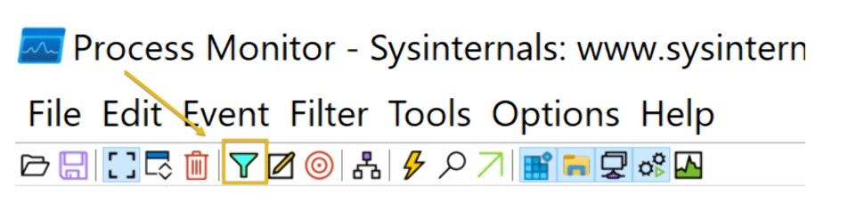

# Cybersecurity 101 
---
# Defensive Security Tooling: FlareVM -  Arsenal of Tools

**FlareVM**, or *"Forensics, Logic Analysis, and Reverse Engineering,"* stands out as a comprehensive and carefully curated collection of specialized tools uniquely designed to meet the specific needs of reverse engineers, malware analysts, incident responders, forensic investigators, and penetration testers. 

This toolkit, expertly crafted by the **FLARE Team at FireEye**, is a powerful aid in unraveling digital mysteries, gaining insight into malware behavior, and delving into the complex details within executables.

## Arsenal of Tools

In this task, we'll introduce you to tools inside **FlareVM**. It comes packed with specialized tools for **forensics**, **incident response**, and **malware investigation**.

Below are the tools grouped by category:

### 🔍 Reverse Engineering & Debugging

Reverse engineering is like solving a puzzle backward: you take a finished product apart to understand how it works. Debugging involves identifying errors, understanding their causes, and fixing them.

- **Ghidra** – NSA-developed open-source reverse engineering suite.
- **x64dbg** – Open-source debugger for x64 and x32 binaries.
- **OllyDbg** – Debugger for reverse engineering at the assembly level.
- **Radare2** – A sophisticated open-source reverse engineering platform.
- **Binary Ninja** – Tool for disassembling and decompiling binaries.
- **PEiD** – Packer, cryptor, and compiler detection tool.

### 🛠️ Disassemblers & Decompilers

These tools are essential in malware analysis, helping analysts understand a program's behavior, logic, and control flow.

- **CFF Explorer** – PE editor to analyze and edit Portable Executable files.
- **Hopper Disassembler** – Debugger, disassembler, and decompiler.
- **RetDec** – Open-source decompiler for machine code.

### 🧪 Static & Dynamic Analysis

- **Static Analysis**: Examining code without executing it.
- **Dynamic Analysis**: Observing software behavior during execution.

- **Process Hacker** – Advanced memory editor and process monitor.
- **PEview** – Viewer for PE file structure analysis.
- **Dependency Walker** – Displays DLL dependencies of executables.
- **DIE (Detect It Easy)** – Detects packers, compilers, and cryptors.

### 🧾 Forensics & Incident Response

- **Volatility** – Framework for memory forensics and RAM dump analysis.
- **Rekall** – Memory forensic framework for incident response.
- **FTK Imager** – Tool for disk image acquisition and analysis.

### 🌐 Network Analysis

Used for understanding traffic, uncovering vulnerabilities, and visualizing network behavior.

- **Wireshark** – Powerful network protocol analyzer.
- **Nmap** – Network mapping and vulnerability scanning tool.
- **Netcat** – Reads/writes data across network connections.

### 📁 File Analysis

Used to inspect and edit files for hidden or suspicious content.

- **FileInsight** – Binary file viewer and editor.
- **Hex Fiend** – Lightweight hex editor.
- **HxD** – Binary file viewer/editor with hex editing.

### ⚙️ Scripting & Automation

Tools to automate and simplify tasks using scripting languages.

- **Python** – Focused on automation via various Python modules.
- **PowerShell Empire** – Framework for post-exploitation automation using PowerShell.

### 🧰 Sysinternals Suite

Developed by Microsoft, this suite provides powerful system utilities for Windows troubleshooting.

- **Autoruns** – Displays startup executables.
- **Process Explorer** – Gives detailed insights into active processes.
- **Process Monitor** – Real-time logging of system activities.

> **Have you checked all the categories?**  
There are a lot, right? Don’t worry—we won’t dive into all these tools right away (that could take months!). For now, just understand the concept: **FlareVM is like a digital toolbox**, filled with resources for different tasks, helping you choose the right tool when you need it.

## Commonly Used Tools for Investigation: Overview

Let's examine the tools we'll focus on in this room. These are foundational tools commonly used during **initial investigations** in malware analysis and forensics.

Below is a list of the selected tools along with their investigative value:

| **Tool**           | **Investigative Value** |
|--------------------|--------------------------|
| **Procmon**        | Tracks real-time system activity. Useful for malware research, troubleshooting, and forensic investigations. |
| **Process Explorer** | Visualizes the parent-child process relationship, loaded DLLs, and executable paths. |
| **HxD**            | Allows you to examine or alter malicious files using hex editing. |
| **Wireshark**      | Captures and analyzes network traffic to detect suspicious or unusual activity. |
| **CFF Explorer**   | Generates file hashes for integrity checks, authenticates system files, and validates file legitimacy. |
| **PEStudio**       | Performs static analysis by examining executable properties without executing the file. |
| **FLOSS**          | Extracts and de-obfuscates strings from malware using advanced static analysis techniques. |

> 💡 **Tip:**  
You can follow along by opening these tools and sample files in **FlareVM** while we explore their purpose and functionality.

### 🛠️ Process Monitor (Procmon)

**Process Monitor** is a powerful Windows tool designed to help record and diagnose issues with system applications. It provides real-time monitoring and logging of various system-level activities.

#### 🔍 Key Features

- **Real-time system activity tracking**
- **File system monitoring**
- **Registry activity logging**
- **Process and thread-level tracking**

#### 🧪 Investigative Use

Process Monitor is especially useful in:

- **Malware research** – Identifying suspicious behavior of malware.
- **Troubleshooting** – Diagnosing application or system errors.
- **Forensic investigations** – Tracing malicious actions or system modifications.

> 📌 **Tip:** Use filters to focus on specific processes or events. This helps narrow down the data and makes analysis more efficient.

Here's how to utilize it effectively for investigation.

 <br>

According to the log entry, the **Local Security Authority Subsystem Service (LSASS)**-related process `lsass.exe` has successfully read a file. 

#### 🧠 What is LSASS?

`lsass.exe` is a **critical Windows system process** responsible for handling authentication, enforcing security policies, and interacting with secure system components like `lsasrv.dll` (Local Security Authority Server Service).

#### ⚠️ Why Monitor LSASS?

While `lsass.exe` is a legitimate system process, it is a **common target for credential dumping attacks**. Tools like **Mimikatz** often try to access the memory of `lsass.exe` to extract usernames and passwords.

#### 🛡️ What to Watch For

When reviewing logs or real-time activity in **Process Monitor**, pay attention to:

- Unusual **read/write access** to `lsass.exe`
- Processes attempting to **open LSASS memory**
- Access by **non-system processes** or unknown executables
- **Injection behavior** targeting LSASS

✅ **Note:**  The log sample shown here **does not** indicate any malware activity. It reflects a standard and expected behavior of LSASS interacting with system files.

### 🧩 Process Explorer (Procexp)

**Process Explorer** is an advanced system monitoring utility that provides **detailed insights into running processes** on your system. It is part of the **Sysinternals Suite** and serves as a powerful alternative to the standard Windows Task Manager.

#### 🔍 Key Features

- Displays all **running processes** in a hierarchical tree view
- Shows **process ownership** by user account
- Reveals loaded **DLLs and handles** per process
- Identifies which process is **locking a file or folder**
- Highlights **suspicious or unsigned executables**

#### 🧪 Investigative Use

Process Explorer is invaluable for:

- Tracing **parent-child process relationships**
- Identifying **malicious or hidden processes**
- Checking the **path, command-line arguments**, and **digital signatures** of executables
- Observing **resource usage** (CPU, memory, etc.) in real-time


> 💡 **Example Use Case:**  
Curious about which program is accessing a specific file or folder? Use Process Explorer's **Find Handle or DLL** feature to pinpoint the process instantly.

> 🛑 **Security Tip:**  
Processes running from **unexpected locations** (e.g., `Temp`, `AppData`, or network shares) can be a red flag and worth further investigation.

 <br>

As you can see from the image above, the CFF Explorer app is open. Using **Process Explorer(procexp)**, located on the desktop, we identified the process and its parent process. This is usually pretty useful when we want to monitor what other processes are being spawned, such as from a Word document, an LNK file, or even an ISO file, as threat actors typically abuse these.

### 🧮 HxD

**HxD** is a fast and flexible **hex editor** used to view and manipulate raw binary data in files, memory, and drives—regardless of their size. It’s a valuable tool in fields like **forensics**, **data recovery**, **reverse engineering**, and **debugging**.

#### 🔍 Key Features

- View and edit **file, memory, and disk contents** in hex
- **Search and replace** hexadecimal patterns or text
- **Compare** binary files to detect differences
- Open **large files** without performance issues
- Supports **data inspection and manipulation** at byte-level accuracy

#### 🧪 Investigative Use

HxD is especially useful for:

- **Analyzing suspicious files** for hidden content or tampering
- **Inspecting memory dumps** for indicators of compromise
- **Editing malware samples** for controlled experimentation
- Performing **exact changes** in binary files during forensic analysis

> 🧠 **Tip:**  
Use HxD to inspect file headers and metadata—changes here often signal tampering or malicious activity.

> 🛑 **Caution:**  
Always work on **copies** of original files when using HxD to prevent accidental corruption of evidence.

 <br>

This HxD hex editor snapshot shows the binary file **possible_medusa.txt**. The hex data on the left indicates the file's contents in hexadecimal, and the ASCII interpretation appears on the right. Interestingly, the file starts with **4D 5A (Little Endian)**, indicating it is executable.
The **Data Inspector** on the right allows you to examine individual bytes by displaying their values in many data types (e.g., integer, float), facilitating a more straightforward data evaluation.

By permitting in-depth examination of a file's unprocessed hexadecimal data, HxD facilitates inquiry by identifying file kinds, structures, and possible corruption. Its Data Inspector feature helps by offering insights into particular byte values.
### 🧾 CFF Explorer

**CFF Explorer** is a powerful tool designed for inspecting and editing **Portable Executable (PE)** files, such as `.exe` and `.dll`. It provides deep insights into the structure and metadata of executables, making it especially useful in **malware analysis** and **file integrity verification**.

#### 🔍 Key Features

- Displays detailed **PE header information**
- Allows **editing** of PE file structures
- Generates **file hashes** (MD5, SHA-1, SHA-256) for integrity checks
- Identifies **anomalies or tampering** in system files
- Can analyze and modify file imports/exports, sections, and resources

#### 🧪 Investigative Use

CFF Explorer helps investigators:

- **Verify file integrity** by comparing hash values
- **Validate file origins** and spot altered or malicious system files
- **Inspect suspicious executables** for packed or injected code
- Explore internal **imports/exports** to understand program behavior

> ⚠️ **Why It Matters:**  
Malware often disguises itself as legitimate system files. Using CFF Explorer to examine these files can help reveal **hidden payloads** or **unauthorized modifications**.

> 💡 **Tip:**  
Check the file’s **digital signature** and **timestamp** in CFF Explorer—missing or mismatched details are common red flags.

 <br>

The **cryptominer.bin** file's details are displayed in the sample. On September 23, 2024, a 64-bit Portable Executable file was generated. The file's information can be verified by its hashes (SHA-1 and MD5). During investigations, this tool aids in confirming file information lookup and locating possible problems.

### 🌐 Wireshark

**Wireshark** is one of the most widely used tools for **network traffic analysis**. It allows investigators to capture, filter, and inspect data packets in real-time or from saved capture files, making it essential in both offensive and defensive cybersecurity roles.

#### 🔍 Key Features

- Captures **live network traffic** or reads from `.pcap` files
- Decodes hundreds of **network protocols**
- Offers powerful **filtering options** for pinpointing specific data
- Visualizes **TCP streams**, DNS requests, HTTP headers, TLS handshakes, and more
- Identifies **suspicious or unauthorized communication**

#### 🧪 Investigative Use

Wireshark can help you:

- **Track suspicious connections** to unknown or foreign IPs
- **Analyze protocols** (e.g., HTTP, DNS, TLS, SMB) for unusual behavior
- Detect signs of **data exfiltration** or **command-and-control (C2)** traffic
- Investigate encrypted traffic (e.g., **TLSv1.2**) for potential abuse

> 🔐 **Note on TLSv1.2:**  
Encrypted traffic using **TLSv1.2** indicates a secure connection. However, attackers often use this encryption to **hide malicious activity**, such as exfiltrating data or connecting to remote servers without detection.

> 🧠 **Tip:**  
Use filters like `ip.addr == x.x.x.x`, `http.request`, or `tls.handshake.version == 0x0303` (for TLS 1.2) to isolate relevant packets quickly.

> 🛡️ **Security Reminder:**  
Encrypted doesn't always mean safe—look at **patterns**, **destinations**, and **metadata** to assess the true intent of the traffic.

 <br>

This Shows captured packets with details about the protocol, source, destination, and other information. Most packets show that TLSv1.2 and TCP are being used for encrypted transmission. The raw packet data is shown in ASCII and hexadecimal forms, with a significant chunk encrypted using TLSv1.2.

You can check our Wireshark module in this link (https://tryhackme.com/module/wireshark) if you would like to dig deeper into this tool. 

### 🧪 PEStudio

**PEStudio** is a static analysis tool used to examine the **properties of executable files (.exe, .dll, etc.)** without running them. This makes it extremely valuable for **malware analysis**, where safely inspecting potentially dangerous files is a priority.

#### 🔍 Key Features

- Performs **static analysis** without executing the file
- Displays detailed **PE structure** and metadata
- Detects **suspicious indicators** based on heuristics
- Lists **imported libraries**, **API calls**, and **strings**
- Flags **obfuscation techniques** and **uncommon behaviors**
- Shows **virus scan results** via integration with services like VirusTotal

#### 🧪 Investigative Use

PEStudio helps analysts:

- **Identify suspicious executables** before execution
- Analyze **function imports and exports** for red flags (e.g., `CreateRemoteThread`, `VirtualAlloc`)
- Inspect embedded **strings** for hardcoded URLs, commands, or indicators of compromise (IOCs)
- Evaluate **section properties**, such as unusually large `.text` or `.rsrc` sections

> 🔐 **Why Use Static Analysis?**  
Static analysis keeps you **safe from execution-based threats** while still offering deep insights into a file’s potential behavior.

> 📸 **Next Step:**  
Let’s take a look at the image below to see how PEStudio visually represents this data and helps pinpoint suspicious elements without running the file.

 <br>

This example demonstrates the analysis of an executable file, **PsExec.exe**, using **PEStudio 9.22**. *(Note: PsExec is not included in the FlareVM—this is for illustration purposes only.)*


📄 File Overview

- **Name:** `PsExec.exe`
- **Type:** 32-bit console application
- **Version:** 2.34
- **Compiler:** Visual C++ 8.0
- **Purpose:** Legitimate tool used by system administrators to execute programs on remote systems


🧬 Key Findings in PEStudio

| Feature         | Observation |
|----------------|-------------|
| **Entropy**     | `6.596` — Moderately high; could suggest packing or encryption (common in malware) |
| **Indicators**  | Low to medium — Suggests no immediate red flags, but caution is warranted |
| **Functionality** | Enables **remote code execution**, which is often used during **lateral movement** in attacks |
| **Legitimacy**  | **Dual-use** — While legitimate, it's often misused by threat actors for **post-exploitation activities** |

⚠️ Security Considerations

While **PsExec** is a trusted tool in enterprise environments, its presence in a **compromised or high-security context**—especially when **remote code execution is not expected**—should raise suspicion.

- **Red Flag Usage Scenarios:**
  - Found on non-administrative systems
  - Initiated by unknown or low-privileged accounts
  - Used alongside other hacking tools or during lateral movement

> 🔎 **Conclusion:**  
PEStudio’s static analysis reveals that while PsExec.exe might appear benign, its **moderately high entropy** and **powerful capabilities** make it a tool worth scrutinizing. When found in unexpected places, it may indicate **post-exploitation behavior** and should be investigated further.

### 🧵 FLOSS (FLARE Obfuscated String Solver)

**FLOSS** is a powerful open-source tool that uses **advanced static analysis techniques** to automatically extract and **de-obfuscate strings** from malware binaries. Formerly known as **FireEye Labs Obfuscated String Solver**, it is developed and maintained by the FLARE team.

#### 🔍 Key Features

- Recovers **plain-text and obfuscated strings** from compiled executables
- Helps reveal:
  - **Hardcoded URLs**
  - **Commands**
  - **Registry keys**
  - **Encryption keys**
- Supports **automated analysis** through command-line usage
- More powerful than traditional tools like `strings.exe` due to its **de-obfuscation logic**

#### 🧪 Investigative Use

FLOSS is ideal for:

- Enhancing **static malware analysis** without executing the file
- Discovering **indicators of compromise (IOCs)** embedded in malware
- Working with **packed or obfuscated binaries**
- Speeding up **reverse engineering workflows**

#### 🧰 Integration

- Comes with **Python scripts** in the tool’s directory
- Output can be **loaded into other RE tools** like:
  - **IDA Pro**
  - **Binary Ninja**
- This enables seamless integration into more advanced **reverse engineering pipelines**

> 💡 **Tip:**  
Run `floss sample.exe > output.txt` to quickly extract and save all meaningful strings for analysis. Review the results for any **commands, IP addresses, or suspicious behaviors** embedded in the binary.

> ⚠️ **Note:**  
While FLOSS is highly effective, combining it with tools like **PEStudio**, **HxD**, and **Process Monitor** creates a more complete picture during an investigation.

```bash 
PS C:\Users\Administrator\Desktop\Sample > floss .\cobaltstrike.exe
INFO: floss: extracting static strings
finding decoding function features: 100%|█████████████████████████████████████████████| 74/74 [00:00<00:00, 2370.15 functions/s, skipped 0 library functions]
INFO: floss.stackstrings: extracting stackstrings from 50 functions
extracting stackstrings: 100%|██████████████████████████████████████████████████████████████████████████████████████| 50/50 [00:00<00:00, 128.00 functions/s]
INFO: floss.tightstrings: extracting tightstrings from 4 functions...
extracting tightstrings from function 0x402e80: 100%|██████████████████████████████████████████████████████████████████| 4/4 [00:00<00:00, 31.99 functions/s]
INFO: floss.string_decoder: decoding strings
emulating function 0x402e80 (call 1/1): 100%|████████████████████████████████████████████████████████████████████████| 21/21 [00:09<00:00,  2.21 functions/s]
INFO: floss: finished execution after 265.61 seconds
INFO: floss: rendering results 
```
In the example above, **FLOSS extracted 189 static strings** from the binary. These strings may include:

- Hardcoded **file paths**
- **URLs** (possibly pointing to command-and-control servers)
- **IP addresses**
- **API calls**
- **Error messages**
- **Registry keys**
- **Encryption keys**
- Configuration or payload-related data

#### ❗ Notable Observation

> **No decoded (de-obfuscated) strings were identified.**

This suggests that:

- The binary may use **dynamic string generation** (e.g., at runtime)  
- Strings may be **heavily obfuscated** or encrypted in a way **FLOSS could not resolve**

#### 🔐 Why This Matters

Malware authors frequently **obfuscate strings** to:

- **Hide malicious intent**
- Evade basic static analysis tools like `strings.exe`
- Prevent easy detection of indicators such as domain names, commands, or embedded credentials

In this case, the **absence of decoded strings** doesn’t mean the file is clean—it may point to **advanced evasion techniques** being used.

> 💡 **Next Steps:**  
To further investigate, consider:
- **Dynamic analysis** using sandboxing or debuggers
- **Manual reverse engineering** with IDA Pro, Ghidra, or Binary Ninja
- Monitoring **runtime memory** for string reconstruction

## Analyzing Malicious Files!

In this task, we'll get our hands dirty. Let's dive right in!

Using the tools from our Flare virtual machine, we will analyze different executables, run them, and see what it does on a specific machine!

A suspicious **windows.exe** file was downloaded by a user on 09/24/2024 at 3:43 AM. This download was flagged as a potential threat. The monitoring team has sent you an email requesting to perform an analysis of it. They have sent you the file, which is now in the **C:\Users\Administrator\Desktop\Sample** folder.

 <br>

Our initial approach for this investigation is to perform static analysis to get initial information from the binary. 

#### Analysis using PEStudio
Let's start with PEStudio. Open the file with this tool. What information can we use here?

 <br>

🧬 Hash-Based File Identification

For the analyzed file, the following cryptographic hashes were computed:

- **MD5:** `9FDD4767DE5AEC8E577C1916ECC3E1D6`
- **SHA-1:** `A1BC55A7931BFCD24651357829C460FD3DC4828F`

🔎 Recommended Action

Use these hashes to check the file against public malware databases like:

🔗 [VirusTotal](https://www.virustotal.com/gui/home/upload)

Running these hashes through platforms like VirusTotal can help determine:

- If the file is **already known and flagged** by antivirus engines
- Whether it's part of a **recognized malware family**
- If it’s **new or unknown**, indicating a potential **zero-day** or **fresh malware campaign**

🎭 Deceptive File Behavior

Although the file claims to be associated with the **Windows Registry Editor (REGEDIT)**—a legitimate and trusted Windows utility—this may be a **social engineering tactic**. Deceptive files often:

- **Mimic legitimate names or descriptions**
- Masquerade as trusted applications to **evade detection**
- Attempt to fool both users and automated analysis tools

> ⚠️ **Red Flag:**  
A file falsely identifying itself as a system component (like `REGEDIT`) should be **treated with suspicion**, especially if it’s unknown to reputation databases and includes indicators like elevated entropy or packed content.

> 🧠 **Tip:**  
Combine hash analysis with **static and dynamic analysis tools** (e.g., PEStudio, Process Monitor, Wireshark) to build a complete profile of the file’s behavior and intent.

Legitimate REGEDIT tools are usually found in the **C:\Windows\System32** directory rather than the user's download location.

 <br>

The absence of a **rich header** indicates that the file is potentially packed or obfuscated to avoid detection by static analysis tools. This is typical behaviour of sophisticated malware that tries to evade detection by altering critical sections of its **PE file**.

The function tabs list **API calls** that the file has imported. This is also known as the **IAT (Import Address Table)**. By clicking on the **blacklist tab**, PeStudio will sort the API by moving all the blacklisted functions to the top. This is useful because it enables us to understand how malware may behave once it compromises a host. The image below shows what API has been imported.

 <br>

Here are the important functions that we noted:

- **set_UseShellExecute:** This function allows the process to use the operating system's shell to execute other processes. This is often seen in malware that spawns additional processes to carry out malicious actions.

- **CryptoStream, RijndaelManaged, CipherMode, CreateDecryptor:** These APIs indicate that the executable uses cryptographic functions, specifically Rijndael (AES encryption). Malware may use cryptography to encrypt communication and files or even implement ransomware functionality.


### Analysis using FLOSS

Open PowerShell and go to the directory where our file is, which is **C:\Users\Administrator\Desktop\Sample**. Note that it might take a while before the PowerShell prompt appears. Run the command `FLOSS.exe .\windows.exe > windows.txt`. This will run the tool **floss.exe** and output it to a file named windows.txt in the same directory.

```PowerShell
PS C:\Users\Administrator\Desktop\Sample > FLOSS.exe .\windows.exe > windows.txt
WARNING: floss: .NET language-specific string extraction is not supported yet
WARNING: floss: FLOSS does NOT attempt to deobfuscate any strings from .NET binaries
INFO: floss: disabled string deobfuscation
INFO: floss: extracting static strings
INFO: floss: finished execution after 0.34 seconds
INFO: floss: rendering results
```
Open the file and go to the **bottom part of the result**.

 <br>

Aren't these familiar? These are the functions that we saw earlier using the PEStudio tool!

### Analyze with Process Explorer and Process Monitor

In this example, we will analyze the network connectivity of the file **cobaltstrike.exe** located in `C:\Users\Administrator\Desktop\Sample`.

We will try to figure out if the file is making any network connectivity to any possible C2 server. Let's get started! Run the file **cobaltstrike.exe** and open **Process Explorer** on the desktop or from the taskbar. You can also search for it in the Windows search bar. If you manually click the binary, **Explorer.exe** would be the parent process, and **cobaltstrike.exe** would be the child process. Let's see if that is indeed the case.

 <br>

It is, as you can see from the screenshot above! Remember, this information is crucial, but let's focus on our goal to determine whether this process is making any network connectivity and to what destination. The process ID is **4756**. Note that the Process ID might be different on your machine. 

Right-click on the process, select **Properties** and go to the **TCP/IP** tab. We should be able to determine the destination it connects to and the state it sends.

 <br>

There we have it! On another note, when we are doing analysis, it needs to be verified and precise. Therefore, we won't be relying on a single tool. We will use another tool to determine if the information is correct. Stop the process and rerun it. This time, we will use **Procmon** or **Process Monitor**. This is also located on the desktop or in the taskbar.

When we open Procmon, looking for the binary is challenging as it will list all active processes. What we are going to do is filter it. The image below points to the filter icon. Or you can press **CTRL + L**.

 <br>

Now, using this filter involves several steps. This includes:

1. Select the **Process Name**  
2. Select **contains**  
3. Type any value containing any word related to the process. In this case, **cobalt**  
4. Click **Include**  
5. Then click **Add** and click on **Apply**  

You should be able to see the conditions added.

 <br>

This should give us a more detailed result.

 <br>

This confirms that the binary was indeed making a connection to an unknown IP address which is 47.120.46.210.

---
> **Note:** These notes document hands-on learning from the TryHackMe *Cybersecurity 101* path. The exercises cover fundamental cybersecurity topics, including Linux basics, networking concepts, and web technologies. This document is intended for personal learning, revision, and ethical skill development. All screenshots, commands, and actions are for educational purposes only.  
> — Compiled by moh4med404 | Curious Mind | Cybersecurity Enthusiast