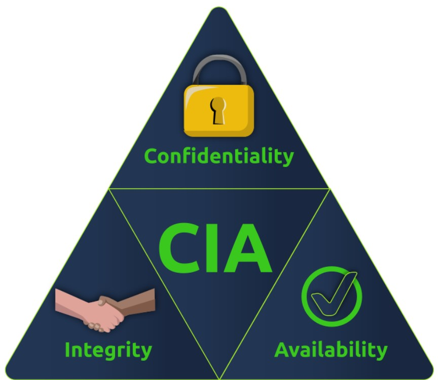
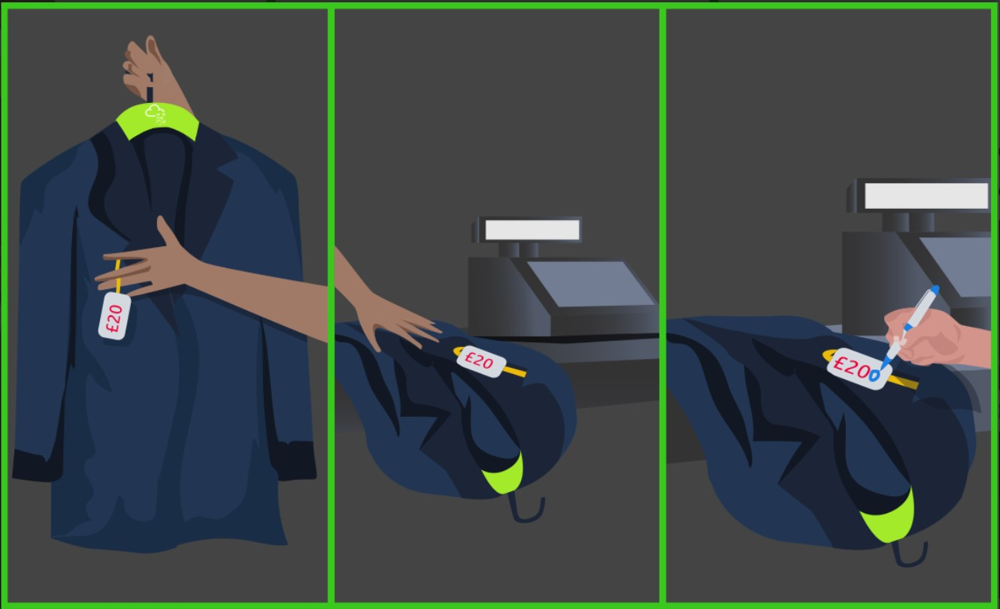
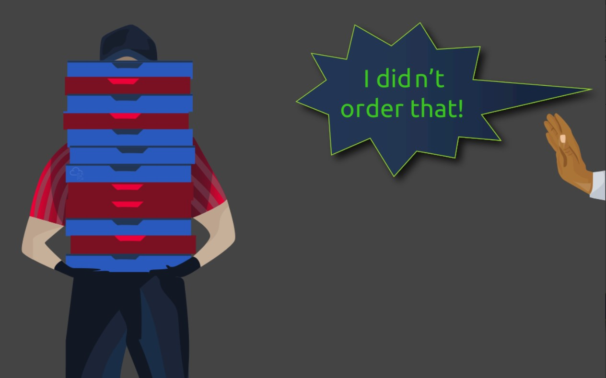
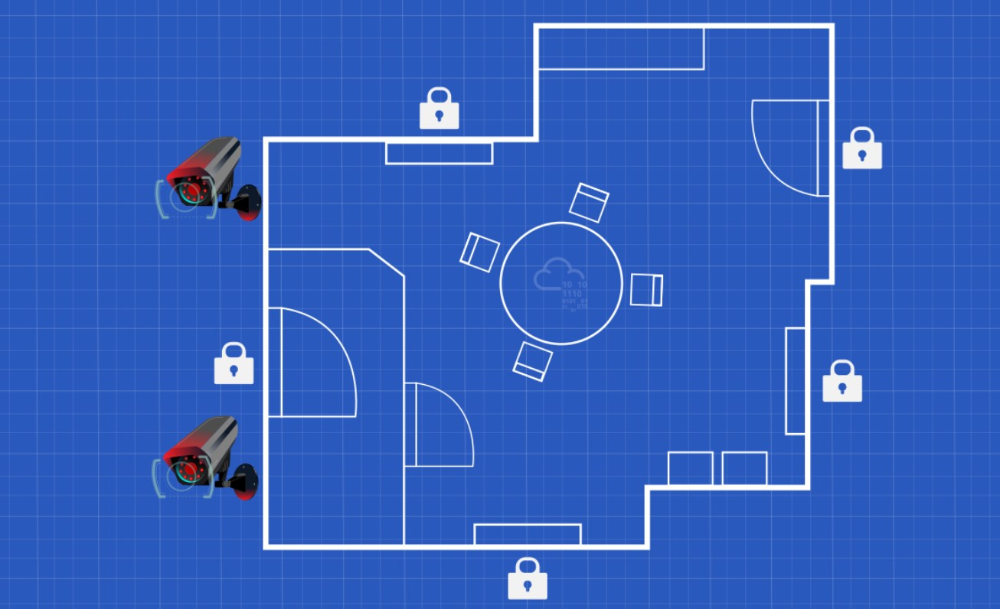

# Cybersecurity 101 
---
# Security Principles

Security has become a buzzword; every company wants to claim its product or service is secure. But is it?

Before we start discussing the different security principles, it is vital to know the adversary against whom we are protecting our assets. Are you trying to stop a toddler from accessing your laptop? Or are you trying to protect a laptop that contains technical designs worth millions of dollars? Using the exact protection mechanisms against toddlers and industrial espionage actors would be ludicrous. Consequently, knowing our adversary is a must so we can learn about their attacks and start implementing appropriate security controls.

## CIA

Before we can describe something as secure, we need to consider better what makes up security. When you want to judge the security of a system, you need to think in terms of the security triad: confidentiality, integrity, and availability (CIA).

  

- **Confidentiality** ensures that only the intended persons or recipients can access the data.  
- **Integrity** aims to ensure that the data cannot be altered; moreover, we can detect any alteration if it occurs.  
- **Availability** aims to ensure that the system or service is available when needed.

  

Let’s consider the CIA security triad in the case of placing an order for online shopping:

- **Confidentiality:**  During online shopping, you expect your credit card number to be disclosed only to the entity that processes the payment. If you doubt that your credit card information will be disclosed to an untrusted party, you will most likely refrain from continuing with the transaction. Moreover, if a data breach results in the disclosure of personally identifiable information, including credit cards, the company will incur huge losses on multiple levels.

- **Integrity:**  After filling out your order, if an intruder can alter the shipping address you have submitted, the package will be sent to someone else. Without data integrity, you might be very reluctant to place your order with this seller.

- **Availability:**  To place your online order, you will either browse the store’s website or use its official app. If the service is unavailable, you won’t be able to browse the products or place an order. If you continue to face such technical issues, you might eventually give up and start looking for a different online store.

Let’s consider the CIA as it relates to patient records and related systems:

- **Confidentiality:**  According to various laws in modern countries, healthcare providers must ensure and maintain the confidentiality of medical records. Consequently, healthcare providers can be held legally accountable if they illegally disclose their patients’ medical records.

- **Integrity:**  If a patient record is accidentally or maliciously altered, it can lead to the wrong treatment being administered, which, in turn, can lead to a life-threatening situation. Hence, the system would be useless and potentially harmful without ensuring the integrity of medical records.

- **Availability:**  When a patient visits a clinic to follow up on their medical condition, the system must be available. An unavailable system would mean that the medical practitioner cannot access the patient’s records and consequently won’t know if any current symptoms are related to the patient’s medical history. This situation can make the medical diagnosis more challenging and error-prone.

The emphasis does not need to be the same on all three security functions. One example would be a university announcement; although it is usually not confidential, the document’s integrity is critical.

## Beyond CIA

  

Going one more step beyond the CIA security triad, we can think of:

- **Authenticity:**  *Authentic* means not fraudulent or counterfeit. Authenticity is about ensuring that the document, file, or data is from the claimed source.

- **Nonrepudiation:**  *Repudiate* means refusing to recognize the validity of something. Nonrepudiation ensures that the original source cannot deny that they are the source of a particular document, file, or data. This characteristic is indispensable for various domains, such as shopping, patient diagnosis, and banking.

These two requirements are closely related. The need to tell authentic files or orders from fake ones is indispensable. Moreover, ensuring that the other party cannot deny being the source is vital for many systems to be usable.

In **online shopping**, depending on your business, you might tolerate attempting to deliver a t-shirt with cash-on-delivery and learn later that the recipient never placed such an order. However, no company can tolerate shipping 1,000 cars only to discover that the order is fake.

- In the example of a shopping order:
  - You want to confirm that the said customer indeed placed this order — that’s **authenticity**.
  - You want to ensure they cannot deny placing this order — that’s **nonrepudiation**.

As a company, if you receive a shipment order of 1,000 cars, you need to ensure the authenticity of this order. Moreover, the source should not be able to deny placing such an order. Without authenticity and nonrepudiation, the business cannot be conducted.

- **Parkerian Hexad**  
  In 1998, Donn Parker proposed the *Parkerian Hexad*, a set of six security elements. They are:

  - Availability  
  - Utility  
  - Integrity  
  - Authenticity  
  - Confidentiality  
  - Possession

Let's discuss the remaining two:

- **Utility:**  Utility focuses on the usefulness of the information. For instance, a user might have lost the decryption key to access a laptop with encrypted storage. Although the user still has the laptop with its disk(s) intact, they cannot access them. In other words, although the information is still available, it is in a form that is not useful—i.e., it has no utility.

- **Possession:**  This security element requires that we protect the information from unauthorized taking, copying, or controlling. For example, an adversary might steal a backup drive, resulting in a loss of possession of the information as long as they have the drive. Alternatively, the adversary might succeed in encrypting our data using ransomware; this too leads to a loss of possession.

## DAD

- **Security Attacks and the DAD Triad**  
  The security of a system is attacked through one of several means. It can be via the disclosure of secret data, alteration of data, or destruction of data.

  - **Disclosure** is the opposite of **Confidentiality**.  
    In other words, disclosure of confidential data constitutes an attack on confidentiality.

  - **Alteration** is the opposite of **Integrity**.  
    For example, the integrity of a cheque is indispensable, and altering it would undermine its trustworthiness.

  - **Destruction/Denial** is the opposite of **Availability**.  
    Making a system or data unavailable is effectively a destruction or denial-of-service attack.

  The opposite of the CIA Triad is the **DAD Triad**:
  - Disclosure
  - Alteration
  - Destruction/Denial

Let’s reconsider the example of **patient records and related systems** in the context of the DAD triad:

- **Disclosure**  
  As in most modern countries, healthcare providers must maintain the confidentiality of medical records. If an attacker succeeds in stealing some of these records and dumps them online, this would be a **data disclosure** attack. The healthcare provider would face legal, financial, and reputational damage.

- **Alteration**  
  Consider the consequences if an attacker modifies patient medical records. Such an **alteration** could lead to incorrect treatment being administered, which can be **life-threatening**.

- **Destruction/Denial**  
  Imagine a fully paperless medical facility. If an attacker renders the database systems unavailable, the facility can’t function properly. While fallback to paper may be possible, **patient records won’t be accessible**, and care delivery could be delayed or stalled. This is a **denial-of-service** scenario.

Protecting against **disclosure**, **alteration**, and **destruction/denial** is of utmost importance. This protection is essentially the implementation of **confidentiality**, **integrity**, and **availability**.

However, it's crucial to understand that **overemphasizing one element** can impact the others:

- Protecting confidentiality and integrity **to an extreme** may restrict availability.
- Increasing availability **without limits** might lead to reduced confidentiality and integrity.

**Effective security implementation requires a careful balance between all three.**

## Fundamental Concepts of Security Models

We have learned that the security triad is represented by Confidentiality, Integrity, and Availability (CIA). One might ask, how can we create a system that ensures one or more security functions? The answer lies in using security models. In this task, we will introduce three foundational security models:

- Bell-LaPadula Model  
- The Biba Integrity Model  
- The Clark-Wilson Model  

### Bell-LaPadula Model

The Bell-LaPadula Model aims to achieve **confidentiality** by specifying three rules:

- **Simple Security Property**:  
  Also known as “no read up”; it states that a subject at a lower security level **cannot read** an object at a higher security level. This rule prevents access to sensitive information above the authorized level.

- **Star Security Property**:  
  Also called “no write down”; it states that a subject at a higher security level **cannot write** to an object at a lower security level. This prevents the disclosure of sensitive information to subjects of lower security level.

- **Discretionary-Security Property**:  
  Uses an access matrix to allow read and write operations. An example access matrix:

  | Subjects   | Object A    | Object B    |
  |------------|-------------|-------------|
  | Subject 1  | Write       | No access   |
  | Subject 2  | Read/Write  | Read        |

The first two properties can be summarized as **“write up, read down.”** You can share confidential information with people of higher security clearance (write up), and you can receive confidential information from people with lower security clearance (read down).

**Limitations:**  
The Bell-LaPadula model was not designed to handle file-sharing scenarios.

### Biba Model

The Biba Model aims to achieve **integrity** by specifying two main rules:

- **Simple Integrity Property**:  
  Also called “no read down”; a higher integrity subject should **not read** from a lower integrity object.

- **Star Integrity Property**:  
  Also known as “no write up”; a lower integrity subject should **not write** to a higher integrity object.

These two properties can be summarized as **“read up, write down.”** This is the opposite of the Bell-LaPadula model, reflecting its focus on integrity rather than confidentiality.

**Limitations:**  
The Biba Model does not effectively handle internal threats (insider threats).

### Clark-Wilson Model

The Clark-Wilson Model also aims to achieve **integrity** by using the following concepts:

- **Constrained Data Item (CDI)**:  
  Data whose integrity needs to be preserved.

- **Unconstrained Data Item (UDI)**:  
  Data types beyond CDI, such as user and system input.

- **Transformation Procedures (TPs)**:  
  Programmed operations (e.g., read and write) that maintain CDI integrity.

- **Integrity Verification Procedures (IVPs)**:  
  Procedures that check and ensure the validity of CDIs.

We covered only three security models. The reader can explore many additional security models, including:

- Brewer and Nash model  
- Goguen-Meseguer model  
- Sutherland model  
- Graham-Denning model  
- Harrison-Ruzzo-Ullman model  

## Defence-in-Depth

  

Defence-in-Depth refers to creating a security system of multiple levels; hence it is also called Multi-Level Security.

Consider the following analogy: you have a locked drawer where you keep your important documents and pricey stuff. The drawer is locked; however, do you want this drawer lock to be the only thing standing between a thief and your expensive items?

 If we think of multi-level security, we would prefer that:
 - The drawer be locked,
 - The relevant room be locked,
 - The main door of the apartment be locked,
 - The building gate be locked,
 - And you might even want to throw in a few security cameras along the way.

Although these multiple levels of security cannot stop every thief, they would block most of them and slow down the others.

## ISO/IEC 19249
 
The International Organization for Standardization (ISO) and the International Electrotechnical Commission (IEC) have created the **ISO/IEC 19249** standard.

In this task, we will briefly cover **ISO/IEC 19249:2017 Information technology - Security techniques - Catalogue of architectural and design principles for secure products, systems and applications**.  
The purpose is to understand what international organizations recommend regarding security principles.

- **ISO/IEC 19249 Architectural Principles**

  1. **Domain Separation**  
     Every set of related components is grouped as a single entity; components can be applications, data, or other resources. Each entity has its own domain and common security attributes.  
     Example: The x86 processor privilege levels — OS kernel runs in ring 0 (most privileged), user-mode apps run in ring 3 (least privileged).  
     *Domain separation is included in the Goguen-Meseguer Model.*

  2. **Layering**  
     Systems structured into many abstract levels or layers can impose security policies at different levels and validate operations.  
     Example: OSI model in networking with 7 layers; each provides specific services to the layer above. Also, high-level programming languages abstract disk read/write calls.  
     *Layering relates closely to Defence-in-Depth.*

  3. **Encapsulation**  
     In Object-Oriented Programming (OOP), low-level implementations are hidden and data manipulation is controlled via specific methods.  
     Example: A clock object provides an `increment()` method rather than direct access to the seconds variable. Larger systems use APIs for controlled access (e.g., database APIs).

  4. **Redundancy**  
     Ensures availability and integrity through duplication.  
     Examples:  
     - Hardware servers with dual power supplies continue operating if one fails.  
     - RAID 5 with three drives can tolerate one drive failure and detect improper data changes via parity.

  5. **Virtualization**  
     Sharing a single hardware set among multiple OS instances.  
     Benefits include sandboxing, improved security boundaries, secure detonation, and detection of malicious programs.  
     Virtualization is common with cloud services.

- **ISO/IEC 19249 Design Principles**

  1. **Least Privilege**  
     Also called “need-to-know” basis, granting users the minimum permissions needed to perform their tasks.  
     Example: A user who only needs to view a document should be given read-only access.

  2. **Attack Surface Minimisation**  
     Aim to minimize vulnerabilities and risks by disabling unnecessary services and reducing exposure.  
     Example: Hardening a Linux system by disabling unused services.

  3. **Centralized Parameter Validation**  
     Input validation is critical to prevent attacks like denial of service or remote code execution. Validation should be centralized in a single library or subsystem for consistency and effectiveness.

  4. **Centralized General Security Services**  
     Centralize security services such as authentication to simplify management and enforcement.  
     Care must be taken to avoid single points of failure by implementing redundancy and failover.

  5. **Preparing for Error and Exception Handling**  
     Systems should be designed to fail safely and handle exceptions gracefully.  
     Examples:  
     - If a firewall crashes, it should block all traffic rather than allow it.  
     - Avoid leaking sensitive information in error messages (e.g., memory dumps exposing confidential data).  
     - Handle cases like customers ordering out-of-stock items or database overloads gracefully.

## Zero Trust versus Trust but Verify

Trust is a complex topic; in reality, we cannot function without it. For example:  
- If you suspect your laptop vendor installed spyware, you might rebuild the system.  
- If you mistrust the hardware vendor, you might stop using their products entirely.  

On a business level, trust is even more sophisticated, but guiding security principles help. Two important principles related to trust are: **Trust but Verify**  & **Zero Trust**

- **Trust but Verify**  
  This principle teaches that even when we trust an entity (user or system), we should always verify their behavior.  
  - Verification usually requires proper logging mechanisms.  
  - Reviewing logs manually is often infeasible, so automated tools like proxies, intrusion detection systems (IDS), and intrusion prevention systems (IPS) are used.

- **Zero Trust**  
  This principle treats trust itself as a vulnerability, especially considering insider threats.  
  - Its motto is “never trust, always verify.”  
  - Every entity is considered adversarial until proven otherwise.  
  - Devices are not trusted based on location or ownership (e.g., internal networks or enterprise devices).  
  - Authentication and authorization are required before accessing any resource.  
  - If a breach occurs, zero trust architecture helps contain the damage better.

  **Microsegmentation** is a common Zero Trust implementation:  
  - Network segments can be as small as a single host.  
  - Communication between segments requires authentication, access control checks, and other security measures.

- **Considerations**  
  Applying Zero Trust extensively can impact business operations negatively if not balanced carefully.  
  However, where feasible, Zero Trust principles should be implemented to enhance security.

## Threat versus Risk

There are three terms that we need to take note of to avoid any confusion.

- **Vulnerability:**  
  Vulnerable means susceptible to attack or damage. In information security, a vulnerability is a weakness.

- **Threat:**  
  A threat is a potential danger associated with this weakness or vulnerability.

- **Risk:**  
  Risk is concerned with the likelihood of a threat actor exploiting a vulnerability and the consequent impact on the business.

Away from information systems, consider a showroom with doors and windows made of standard glass:  
- The glass is a **vulnerability** due to its nature.  
- There is a **threat** that the glass doors or windows could be broken.  
- The showroom owners must contemplate the **risk**, i.e., the likelihood of breakage and its impact on the business.

Consider an information systems example:  
You work at a hospital using a specific database system to store medical records.  
- You learn the database system is **vulnerable**, and a proof-of-concept exploit has been released, indicating a **real threat**.  
- With this knowledge, you must assess the **risk** and decide on the next steps.

---
> **Note:** These notes document hands-on learning from the TryHackMe *Cybersecurity 101* path. The exercises cover fundamental cybersecurity topics, including Linux basics, networking concepts, and web technologies. This document is intended for personal learning, revision, and ethical skill development. All screenshots, commands, and actions are for educational purposes only.  
> — Compiled by moh4med404 | Curious Mind | Cybersecurity Enthusiast