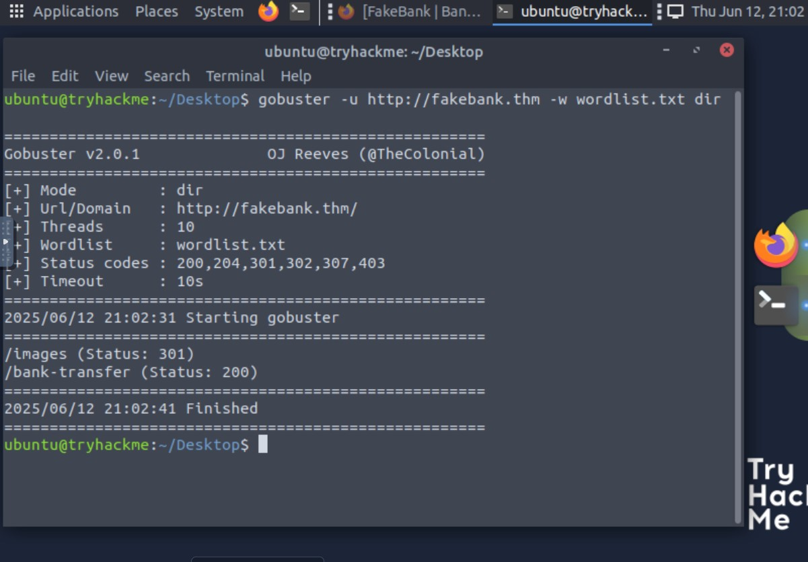
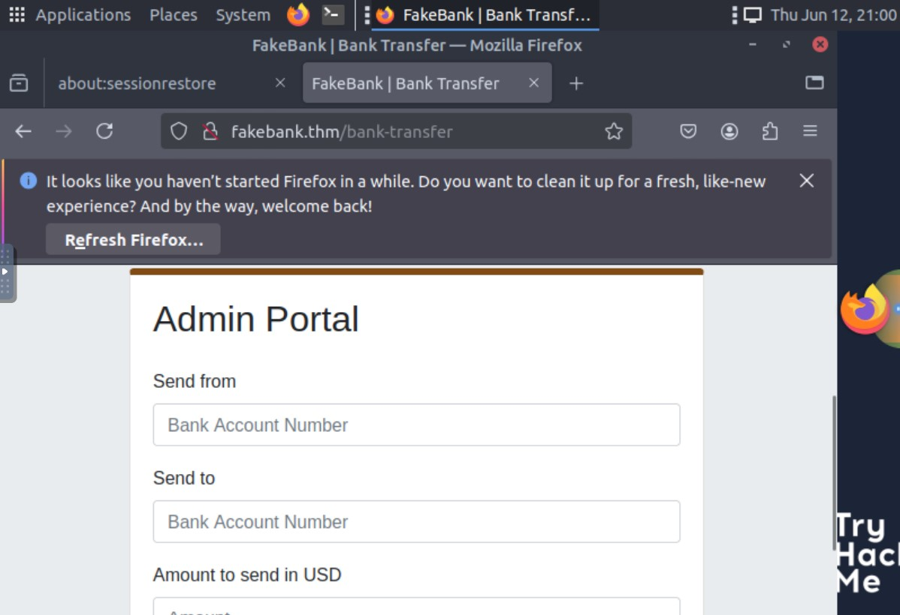
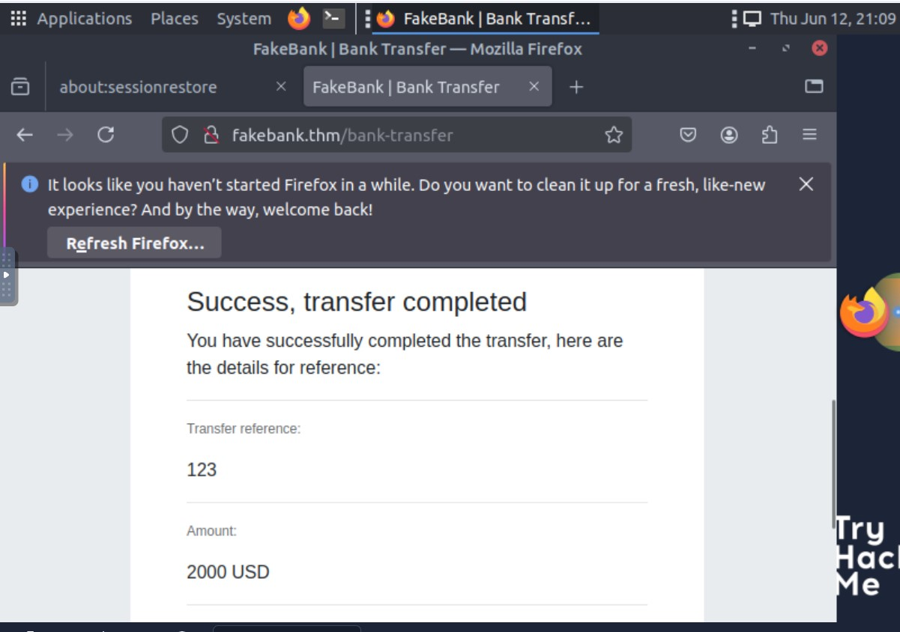
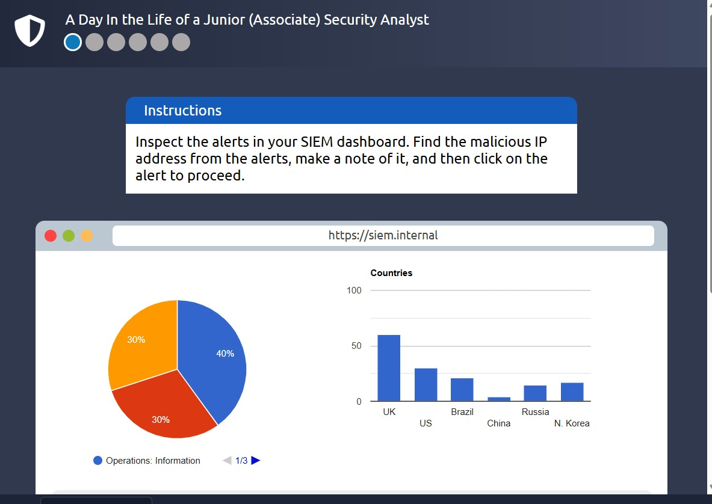
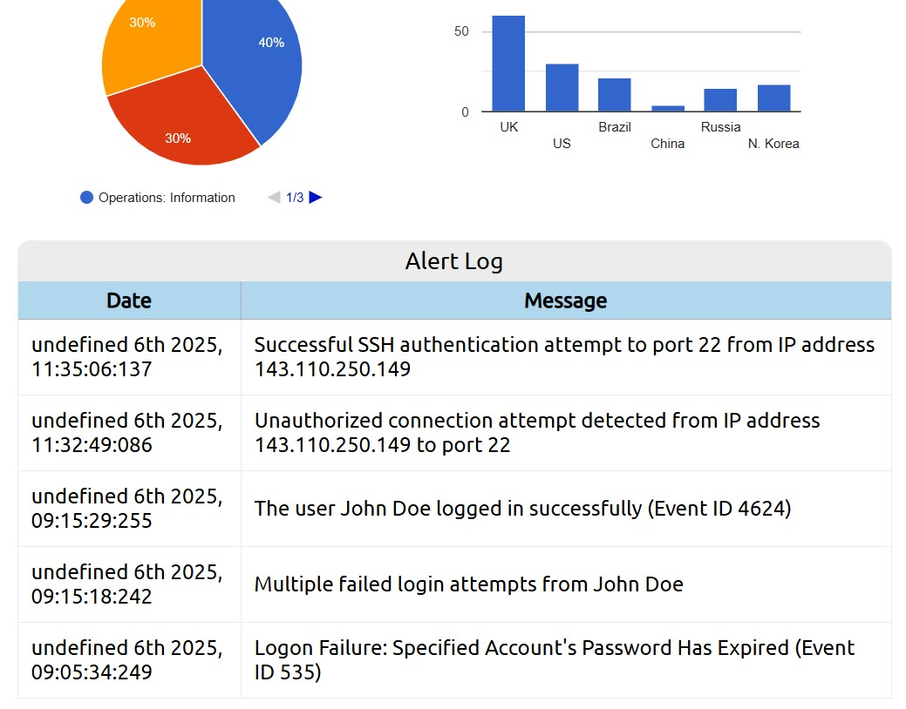
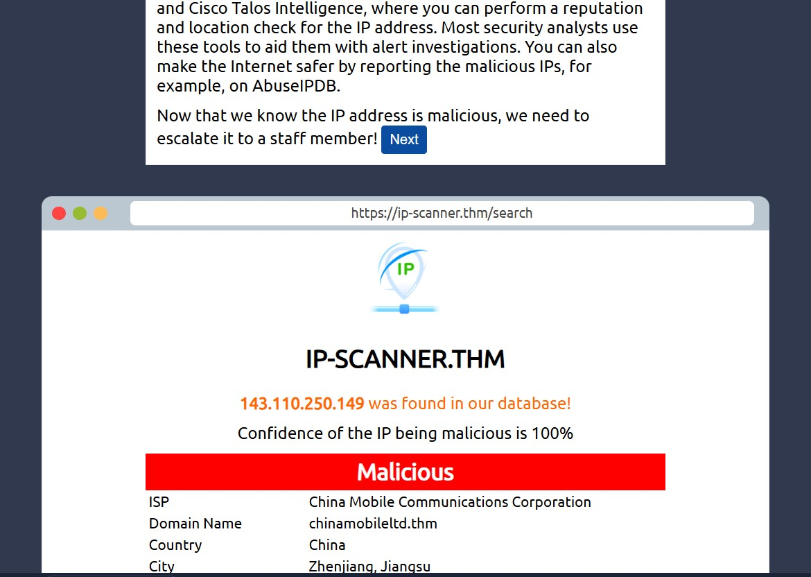
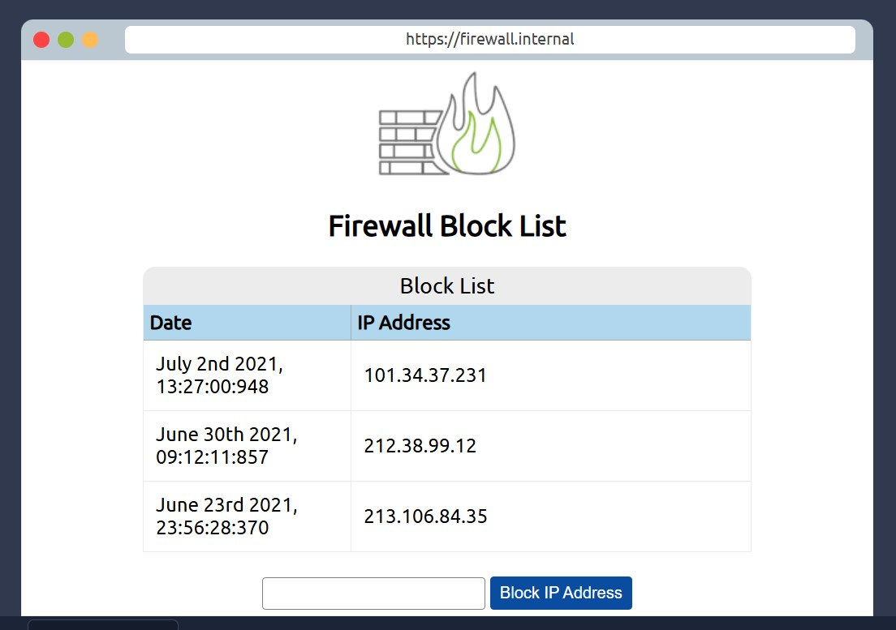

# Pre-Security Notes

### Offensive Security Intro

Offensive Security refers to proactive security practices where individuals or teams simulate attacks on systems, networks, or applications to identify vulnerabilities before malicious actors can exploit them. It focuses on offensive techniques, essentially "hacking back" in a controlled, ethical manner to help organizations strengthen their defenses. Example: 



**Explanation**:  

```bash
gobuster -u http://fakebank.thm -w wordlist.txt dir
```

is used for **directory brute-forcing** on the website `http://fakebank.thm` using a wordlist (`wordlist.txt`). Here's how it works:

1. **`-u` (URL)**: Specifies the target website to scan (`http://fakebank.thm`).
2. **`-w` (Wordlist)**: Defines the wordlist (`wordlist.txt`) that contains potential directory names (like `admin`, `login`, etc.).
3. **`dir`**: Instructs Gobuster to scan for **directories** on the target website.

Gobuster will try each word from the wordlist as a directory path (e.g., `http://fakebank.thm/admin`) and check the server's response. If it finds a valid directory, it will report it along with the HTTP response code (e.g., `200 OK`).

This helps to discover hidden directories on a web server that might not be visible through regular browsing, which could be useful for penetration testing or bug bounty hunting. now we found hidden page /bank-transfer. 





**Explanation**:  
##### After discovering the hidden /bank-transfer page, we gained access and successfully transferred $2000 from account 2276 to our account (8881)

### Defensive Security 

Defensive Security (also known as Blue Teaming) focuses on protecting systems, networks, and data from potential threats by implementing security measures to prevent attacks. Unlike Offensive Security, which involves actively trying to exploit vulnerabilities, defensive security works on identifying, mitigating, and responding to threats to secure an organization's infrastructure. Example: Let's say, as part of your daily work, you open your SIEM dashboard to review the logs and notice unauthorized access logs 




In this step, I performed a scan to investigate the suspicious IP address identified in the SIEM logs. This scan helps us gather more information about the potential threat, such as its origin, behavior, and any associated malicious activity.



After confirming the malicious nature of the IP address, I proceeded to block it at the firewall level. This step prevents further communication from the compromised IP, mitigating the risk of an ongoing attack or data breach



> *Note: This document tracks the initial state of the TryHackMe machine and will guide us through implementing basic security measures. The screenshots, actions, and next steps will help improve the security posture of the system.*
